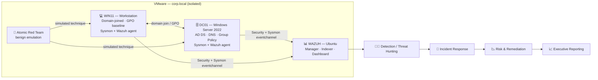
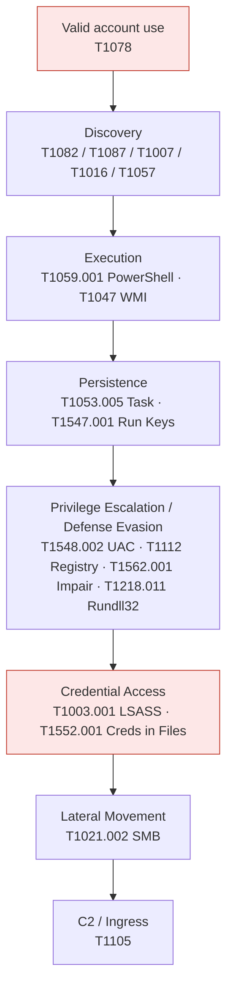

# 🏛️ Enterprise Security Engineering — End-to-End Case Study

An end-to-end account of building and operating a small enterprise security program — from Active Directory design and hardening, through detection engineering and adversary emulation, to incident response, risk management, governance, and executive reporting. This document ties the individual artifacts in this repository into a single narrative a hiring manager or security leader can follow start to finish.

> **TL;DR** — Designed, deployed, hardened, monitored, and defended a Windows AD enterprise (Server 2022 + Windows 11 + Wazuh + Sysmon). Engineered **18 validated ATT&CK detection case studies across 9 tactics** (25 in scope), most with preserved negative controls, packaged as a **version-controlled Wazuh rule pack with CI tests**. Wrapped the technical work in governance, a risk register with remediation SLAs, and a monthly KPI scorecard reported to leadership.

---

## 1. Executive Summary

Most enterprise intrusions abuse identity and endpoints rather than exotic exploits, and defenders are judged on how fast they can **see, understand, and stop** that activity. This project builds the full defensive stack for a modeled mid-size enterprise and then proves it works: every detection is validated with a benign simulation, evidence is preserved, and results roll up into risk and executive views.

**What was built**

- A domain environment (`corp.local`) on VMware: a Windows Server 2022 domain controller (AD DS + DNS), a Windows 11 workstation, and an Ubuntu-based Wazuh SIEM, with Sysmon telemetry on every endpoint.
- A detection engineering program: **18 completed ATT&CK case studies** spanning **9 tactics**, each with a reproducible test, preserved telemetry, and — for **16 of 18** — a documented negative control.
- A version-controlled **Wazuh rule pack** (manifest, changelog, tests) with a GitHub Actions workflow that runs rule-pack tests on every change.
- The management layer: a security charter, RACI, baselines and exception process, an enterprise risk register with remediation SLAs, a monthly KPI scorecard, and executive dashboards.

**Headline outcomes** (as tracked in this repo's July 2026 scorecard)

| Program area | Result | Target | Status |
|---|---|---|---|
| Detection Engineering (ATT&CK techniques covered) | 18 | 25 | Needs Improvement |
| Incident Response (mean time to triage) | 28 min | 30 min | On Track |
| Compliance (baseline controls passing) | 81% | 95% | Needs Improvement |
| Vulnerability Mgmt (critical findings within SLA) | 72% | 90% | At Risk |
| Risk (open risks older than 30 days) | 3 | 0 | At Risk |

The program has enough visibility to name its own gaps and assign owners — which is itself the point. Honest gap tracking (including two detections with a documented negative-control gap) is treated as a feature, not hidden.

---

## 2. Situation & Objectives

**Situation.** A growing organization runs on Active Directory but has limited detection coverage, ad-hoc hardening, and no repeatable way to prove its controls work. Leadership needs both defensive capability *and* evidence and metrics they can act on.

**Task.** Stand up an enterprise-grade security engineering capability that can:

1. Deploy and harden core identity and endpoint infrastructure.
2. Generate high-value telemetry and turn it into tested detections mapped to MITRE ATT&CK.
3. Safely emulate adversary behavior and validate that detections fire (and stay quiet on benign activity).
4. Investigate and respond to incidents with documented playbooks.
5. Manage risk with owners and SLAs, and report posture to leadership.

**Guardrails.** Everything runs in an isolated lab; all offensive activity uses benign, authorized simulations (Atomic Red Team and controlled scripts) against self-owned machines.

---

## 3. Program Architecture

The design principle is a clean pipeline: **instrument first**, then attack, then detect, investigate, and roll findings up into risk and leadership views. Full diagrams live in [`diagrams/`](./diagrams/) and [`architecture/`](./architecture/).

---

## 4. Build & Hardening

Infrastructure was deployed and evidenced step by step (see [`deployment/`](./deployment/) and [`architecture/`](./architecture/) with preserved screenshots in [`screenshots/`](./screenshots/)):

- **Domain controller** — Server 2022 promoted to AD DS with DNS; OUs, users, and security groups created (`architecture/organizational-units.csv`, `domain-users.csv`, `security-groups.csv`).
- **Workstation** — Windows 11 domain-joined and placed under a security baseline GPO.
- **SIEM** — Wazuh manager, indexer, and dashboard deployed on Ubuntu with agents active on both Windows hosts.
- **Telemetry** — Sysmon deployed and validated on DC01 and the workstation, forwarding to Wazuh alongside the Windows Security and PowerShell channels.

**Hardening** (see [`hardening/`](./hardening/)) applied a domain security baseline, Group Policy configuration, and a password policy, establishing the control baseline the compliance KPI later measures.

---

## 5. Detection Engineering

Detections are treated as engineered products: each has an objective, a data source, a rule or hunt, a reproducible test, preserved evidence, and — wherever possible — a negative control. The methodology is documented in [`documentation/Detection-Engineering-Methodology.md`](./documentation/Detection-Engineering-Methodology.md); coverage is tracked in [`detections/MITRE-Matrix.md`](./detections/MITRE-Matrix.md).

**Coverage snapshot**

| Dimension | Count |
|---|---:|
| Techniques in scope | 25 |
| Completed (validated) case studies | 18 |
| Completed studies with a preserved negative control | 16 |
| Completed studies with a documented negative-control gap | 2 |
| ATT&CK tactics represented | 9 |

**Validated techniques** (each with its own case-study folder under [`detections/`](./detections/)):

| Tactic | Technique | Detection focus | Primary telemetry |
|---|---|---|---|
| Credential Access | T1003.001 | LSASS-style memory dumping | Sysmon 1 / 10 |
| Discovery | T1007 | Service Discovery | Sysmon 1 |
| Discovery | T1016 | Network Config Discovery | Sysmon 1 |
| Lateral Movement | T1021.002 | SMB / Admin Shares | Security 5140/5145; Sysmon 1 |
| Execution | T1047 | WMI | Sysmon 1 |
| Exec/Persist/PrivEsc | T1053.005 | Scheduled Task | Sysmon 1; Task Scheduler |
| Discovery | T1057 | Process Discovery | Sysmon 1 |
| Execution | T1059.001 | PowerShell | Sysmon 1; Security 4688 |
| IA/Persist/PrivEsc/DefEvasion | T1078 | Valid Accounts | Security 4624/4648 |
| Discovery | T1082 | System Info Discovery | Sysmon 1 |
| Discovery | T1087.001 | Local Account Discovery | Sysmon 1 |
| Command & Control | T1105 | Ingress Tool Transfer | Sysmon 1/3/11 |
| Defense Evasion | T1112 | Modify Registry | Sysmon 12/13 |
| PrivEsc / Defense Evasion | T1548.002 | Bypass UAC | Sysmon 1/13; Security 4688 |
| Defense Evasion | T1218.011 | Rundll32 Proxy Execution | Sysmon 1 |
| Persistence/PrivEsc | T1547.001 | Registry Run Keys | Sysmon 13 |
| Credential Access | T1552.001 | Credentials in Files | Sysmon 1 |
| Defense Evasion | T1562.001 | Impair Defenses | Sysmon 1; Defender 5007 |

**Detections as code.** Rules are packaged as a versioned Wazuh rule pack in [`wazuh/rule-pack/`](./wazuh/rule-pack/) (manifest, `VERSION`, `CHANGELOG.md`, and tests), and a GitHub Actions workflow — [`.github/workflows/wazuh-rule-pack-tests.yml`](./.github/workflows/wazuh-rule-pack-tests.yml) — runs rule-pack tests on every change. This turns detection content into a maintainable, testable artifact rather than a pile of loose XML.

---

## 6. Adversary Emulation & Validation

Every detection is proven with a **benign simulation** rather than asserted. Emulation uses Atomic Red Team and controlled PowerShell (see [`powershell/atomic-red-team-runbook.md`](./powershell/atomic-red-team-runbook.md) and the per-technique `*-Lab-Runbook.md` files), and each case-study README preserves the positive result and, where available, a negative control.

A realistic chained scenario the coverage supports:

**Validation criteria** (from the coverage matrix): a technique is *Validated* only when a reproducible benign simulation generated telemetry **and** a preserved Wazuh detection or hunt result exists. A *preserved negative control* means a similar benign action was shown **not** to trigger the detection-specific condition. Where a negative artifact was not preserved, the study is marked *gap documented* rather than quietly passed — keeping evidence honest.

A representative example is the **UAC bypass (T1548.002)** study: a Medium-integrity session created a per-user `ms-settings` handler override, launched the auto-elevated `fodhelper.exe` broker, and spawned a full-token interpreter — firing Wazuh rules `100226`–`100228`, with a negative control (broker launched without the registry override) confirming the two high-signal rules stayed quiet.

---

## 7. Detection → Investigation → Incident Response

Alerts feed a documented response process (see [`documentation/Incident-Response-Workflow.md`](./documentation/Incident-Response-Workflow.md), [`documentation/Threat-Hunting-Guide.md`](./documentation/Threat-Hunting-Guide.md), and [`incident-response/`](./incident-response/)):

1. **Triage** — confirm the alert, pivot on account/host/source, assign severity. The program's mean time to triage is **28 minutes** against a 30-minute target.
2. **Investigate** — reconstruct the activity from correlated Security + Sysmon telemetry; hunt for related indicators using the saved queries in [`wazuh/threat-hunting-queries.md`](./wazuh/threat-hunting-queries.md).
3. **Contain & respond** — follow the relevant playbook (e.g. [`incident-response/failed-logon-playbook.md`](./incident-response/failed-logon-playbook.md)) to disable accounts, isolate hosts, and remove persistence.
4. **Report** — produce an incident executive summary and feed lessons learned back into detections and the risk register.

---

## 8. Risk Management & Remediation

Findings become tracked risk, not forgotten alerts (see [`risk-management/`](./risk-management/) and [`governance/risk-register.md`](./governance/risk-register.md)):

- An **enterprise risk register** (`enterprise-risk-register.csv`) captures risks with owners and ratings.
- A **remediation backlog** (`remediation-backlog.csv`) and **SLA policy** (`remediation-sla-policy.md`) drive time-bound fixes.
- A **risk acceptance template** governs exceptions when remediation is deferred.

Current pressure points the register surfaces: a critical vulnerability backlog, open AWS control failures, a pipeline security finding, an AI-memory exposure risk, and detection-coverage gaps — with **3 risks open longer than 30 days** flagged for owner follow-up.

---

## 9. Governance

The program is run, not just built (see [`governance/`](./governance/)):

- **Charter & roles** — `security-engineering-charter.md`, `roles-and-responsibilities.md`, and a `raci-matrix.md` define ownership.
- **Standards** — `security-baseline.md`, `logging-standard.md`, and `identity-governance.md` set the control bar.
- **Cadence & exceptions** — `operating-cadence.md` sets the review rhythm; `exception-process.md` handles deviations.

This is what separates a lab from a program: documented ownership, standards, and a repeatable operating cadence.

---

## 10. Metrics & Executive Reporting

Technical work rolls up into leadership-ready views (see [`metrics/`](./metrics/) and [`executive-reporting/`](./executive-reporting/)). The July 2026 monthly scorecard (`metrics/monthly-security-scorecard.csv`):

| Program area | KPI | Value | Target | Status |
|---|---|---|---|---|
| Detection Engineering | ATT&CK techniques covered | 18 | 25 | Needs Improvement |
| Vulnerability Management | Critical findings within SLA | 72% | 90% | At Risk |
| Cloud Security | Failed high-severity controls | 4 | 0 | At Risk |
| DevSecOps | Repos with security gates | 6 | 10 | Needs Improvement |
| Compliance | Baseline controls passing | 81% | 95% | Needs Improvement |
| Incident Response | Mean time to triage | 28 min | 30 min | On Track |
| Risk Management | Open risks > 30 days | 3 | 0 | At Risk |

The KPI catalog (`metrics/security-kpi-catalog.md`) defines each measure, and detection-lifecycle metrics (`metrics/detection-lifecycle-metrics.md`) track how detections move from idea to validated coverage. The executive dashboard ([`executive-reporting/executive-dashboard.md`](./executive-reporting/executive-dashboard.md)) translates all of this into a status-and-top-risks view for leadership.

---

## 11. Outcomes

- **Capability:** a working, instrumented AD enterprise with endpoint telemetry flowing into a SIEM.
- **Proven detections:** 18 validated ATT&CK techniques across 9 tactics, most with negative controls, packaged as tested detections-as-code.
- **Operational maturity:** documented IR playbooks, a threat-hunting library, and a triage time already inside target.
- **Managed risk:** an owned risk register with SLAs and an exception process.
- **Leadership visibility:** a monthly KPI scorecard and executive dashboard that make gaps explicit and assignable.

The program's own metrics show where it is not yet done — SLA performance, control automation coverage, and closing detection gaps — which is exactly the kind of honest, measurable posture a security leader wants to see.

---

## 12. Roadmap / Next Milestone

From the coverage matrix's recommendation and the improvement backlog ([`roadmap/`](./roadmap/)):

1. Close the highest-value detection gaps — **T1070 (Indicator Removal)** and **T1486 (Data Encrypted for Impact)**.
2. Build **one correlated attack-chain study** spanning initial access → execution → credential access → lateral movement → defense evasion → impact — higher portfolio value than completing every remaining discovery technique.
3. Drive KPI targets: raise critical-finding SLA attainment toward 90%, expand security gates to more repositories, and lift baseline compliance toward 95%.
4. Extend identity monitoring into the cloud (hybrid Entra ID) to mirror the on-prem detection story.

The 30/60/90 and annual plans live in [`roadmap/30-60-90-day-plan.md`](./roadmap/30-60-90-day-plan.md) and [`roadmap/annual-security-roadmap.md`](./roadmap/annual-security-roadmap.md).

---

## 13. Skills Demonstrated

- Enterprise infrastructure: Active Directory, DNS, Group Policy, endpoint/SIEM deployment
- Telemetry & detection engineering: Sysmon, Wazuh, ATT&CK mapping, detections-as-code with CI
- Adversary emulation: Atomic Red Team, benign simulation, positive tests + negative controls
- Incident response & threat hunting: playbooks, triage, investigation, containment
- Security governance: charter, RACI, baselines, exception process, operating cadence
- Risk management: register, remediation SLAs, risk acceptance
- Security leadership: KPI design, scorecards, executive reporting

---

## 14. Artifact Index

| Domain | Location |
|---|---|
| Architecture & diagrams | [`architecture/`](./architecture/) · [`diagrams/`](./diagrams/) |
| Deployment & hardening | [`deployment/`](./deployment/) · [`hardening/`](./hardening/) |
| Detections (18 case studies) | [`detections/`](./detections/) · [`detections/MITRE-Matrix.md`](./detections/MITRE-Matrix.md) |
| Rule pack (detections-as-code) | [`wazuh/rule-pack/`](./wazuh/rule-pack/) |
| Emulation | [`powershell/atomic-red-team-runbook.md`](./powershell/atomic-red-team-runbook.md) |
| Documentation | [`documentation/`](./documentation/) |
| Incident response | [`incident-response/`](./incident-response/) |
| Risk management | [`risk-management/`](./risk-management/) |
| Governance | [`governance/`](./governance/) |
| Metrics & exec reporting | [`metrics/`](./metrics/) · [`executive-reporting/`](./executive-reporting/) |
| Roadmap | [`roadmap/`](./roadmap/) |
| Detection-engineering deep dive | [`reports/Enterprise-Detection-Engineering-Capstone.md`](./reports/Enterprise-Detection-Engineering-Capstone.md) |

---

## 15. Scope & Ethics

This program runs entirely in an isolated lab that models an enterprise. All adversary techniques were executed as **benign, authorized simulations against self-owned virtual machines**. The intent is defensive — detection, investigation, hardening, and risk reduction — not developing attacks against third parties.

---

*Author: Josh · Security Engineering portfolio capstone · corp.local enterprise lab*
