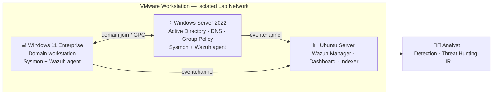

# 🏛️ Enterprise Security Engineering Management Lab

An end-to-end enterprise security engineering lab: design, deploy, harden, monitor, and detect across a Windows Active Directory environment — extended with governance, risk, metrics, and executive reporting.

> **TL;DR** — A full enterprise AD environment (Server 2022, Windows 11, Ubuntu, Wazuh, Sysmon) covering identity, endpoint security, monitoring, detection engineering, governance, and incident response — the capstone that ties the portfolio together.

> 🛰️ **Companion program:** this lab is operationalized as a full senior-level program in **[Enterprise Detection Engineering & Security Operations Transformation](../enterprise-detection-engineering-program/README.md)** — a two-package (Engineering + Leadership) build that wraps these detections in an operating model, cost/risk tradeoffs, and executive reporting under real constraints. *(Sibling folder; if hosted as a separate GitHub repo, link to that repo instead.)*

---

## 📌 Overview

This project demonstrates the design, deployment, hardening, monitoring, and detection of a Windows Active Directory enterprise environment using VMware Workstation, Windows Server 2022, Windows 11 Enterprise, Ubuntu Server, Wazuh SIEM, and Sysmon.

---

## 🏗️ Architecture

---

## 🖥️ Lab Components

- VMware Workstation
- Windows Server 2022
- Active Directory
- DNS
- Group Policy
- Windows 11 Enterprise
- Ubuntu Server
- Wazuh Manager
- Wazuh Dashboard
- Wazuh Agents
- Sysmon

---

## 🎯 Objectives

- Identity Management
- Endpoint Security
- Security Monitoring
- Detection Engineering
- Security Governance
- Incident Response
- MITRE ATT&CK Mapping

---

## 📁 Repository Structure

- architecture/
- deployment/
- hardening/
- detections/
- attack-scenarios/
- incident-response/
- governance/

<!-- portfolio-merge:start -->
## 🧩 Security Engineering Management Portfolio Additions

This repository has been merged with the Security Engineering Management portfolio artifacts to connect the Active Directory attack-defense lab with detection engineering, governance, risk management, metrics, executive reporting, and roadmap documentation.

> 📖 **Start here: [Enterprise End-to-End Case Study](Enterprise-End-to-End-Case-Study.md)** — the single narrative that ties architecture, 18 validated ATT&CK detections, adversary emulation, incident response, risk, governance, and executive metrics into one story. ([PDF version](Enterprise-End-to-End-Case-Study.pdf))

Start with these added artifacts:

- [MITRE ATT&CK Detection Matrix](detections/MITRE-Matrix.md)
- [Detection Engineering Methodology](documentation/Detection-Engineering-Methodology.md)
- [Threat Hunting Guide](documentation/Threat-Hunting-Guide.md)
- [Enterprise Detection Engineering Capstone](reports/Enterprise-Detection-Engineering-Capstone.md)
- [Wazuh Threat Hunting Queries](wazuh/threat-hunting-queries.md)
- [Versioned Wazuh Rule Pack](wazuh/rule-pack/README.md)
- [Sysmon Event Reference](sysmon/event-reference.md)
- [Security KPI Catalog](metrics/security-kpi-catalog.md)
- [Detection Lifecycle Metrics and Decision Register](metrics/detection-lifecycle-metrics.md)
- [Lab Security Architecture Diagram](diagrams/lab-security-architecture.md)
- [Detection Engineering Data-Flow Diagram](diagrams/detection-data-flow.md)
- [Enterprise Risk Register](risk-management/enterprise-risk-register.csv)
<!-- portfolio-merge:end -->

---

*Author: Josh · Security Engineering portfolio capstone*
