# Detection Engineering Lab Architecture

## Purpose

This architecture supports repeatable Windows detection engineering: generate controlled behavior, preserve endpoint telemetry, evaluate Wazuh rules, investigate alerts, and publish evidence-backed case studies mapped to MITRE ATT&CK.

## Logical Architecture

```mermaid
flowchart LR
    Analyst["Security Analyst"] -->|"Runs benign validation"| WIN11["WIN11.corp.local"]
    DC01["DC01 / corp.local"] -->|"Identity, DNS, policy"| WIN11
    WIN11 --> Logs["Sysmon + Windows Event Logs"]
    Logs --> Agent["Wazuh Agent 002"]
    Agent -->|"Private VMware network"| Manager["Wazuh Manager"]
    Manager --> Archive["archives.json"]
    Manager --> Alerts["alerts.json / indexed alerts"]
    Alerts --> Dashboard["Wazuh Dashboard"]
    Archive --> Hunt["Threat Hunting and Rule Development"]
    Dashboard --> Hunt
    Hunt --> Cases["ATT&CK Case Studies"]
    Cases --> Metrics["Coverage Metrics and Reporting"]
```

## Components

| Component | Role | Key data |
|---|---|---|
| `DC01` | Active Directory and DNS | identities, groups, authentication context, policy |
| `WIN11` | Validation endpoint | process, PowerShell, security, registry, network, and file telemetry |
| Sysmon | High-fidelity endpoint sensor | process lineage, hashes, file and registry activity |
| Wazuh agent | Endpoint collector | EventChannel forwarding and agent identity |
| Wazuh manager | Decode, rule evaluation, storage, and API | archives, alerts, rules, ATT&CK enrichment |
| Wazuh dashboard | Analyst interface | queries, event expansion, evidence capture |
| Git repository | Evidence and engineering record | runbooks, rules, screenshots, JSON, reports |

## Trust Boundaries

| Boundary | Primary risk | Control |
|---|---|---|
| Analyst to endpoint | Unsafe or ambiguous simulation | Approved benign commands, unique markers, elevated shell only when required |
| Endpoint to manager | Telemetry loss or spoofing | Enrolled agent, private network, service-health checks, archive verification |
| Archive to alert index | Collection mistaken for detection | Validate both `archives.json` and `alerts.json` independently |
| Manager administration | Unauthorized rule or configuration change | SSH/VNC restricted to the lab subnet, sudo, backups, syntax validation |
| Evidence to public repository | Exposure of private lab details | Review IPs, users, domains, GUIDs, and screenshots before publication |

## Detection Data Flow

1. The analyst records a start time and executes a bounded simulation on `WIN11`.
2. Sysmon or a Windows EventChannel records the behavior.
3. The Wazuh agent sends the event to the manager.
4. The manager decodes the event and writes raw telemetry to the archive when archive logging is enabled.
5. The rule engine evaluates the event; qualifying events are written to the alert index.
6. The analyst confirms fields, process lineage, user context, timestamps, and ATT&CK mapping.
7. Positive and negative controls are retained with the final rule and investigation notes.

## Validation Requirements

- Time is synchronized across the endpoint, domain controller, and manager.
- Sysmon and Wazuh services are running before each test.
- Every simulation has a unique marker or task name.
- Existing events are never treated as proof of a newly loaded rule.
- Rule changes are backed up and tested before manager restart.
- Collection, detection, and ATT&CK enrichment are reported as separate outcomes.
- Negative controls verify that the rule rejects at least one nearby benign behavior.

## Availability and Recovery

This is a single-manager lab, not a high-availability design. Recovery depends on VM snapshots, repository-backed configuration, exported evidence, and documented rebuild steps. Production use would require manager/indexer redundancy, protected backups, certificate lifecycle management, monitoring, and formal change control.

## Related Artifacts

- [Detailed Lab Security Architecture Diagram](../diagrams/lab-security-architecture.md)
- [Detection Engineering Data-Flow Diagram](../diagrams/detection-data-flow.md)

- [Lab Architecture](lab-architecture.md)
- [Security Data Flow](security-data-flow.md)
- [Detection Engineering Methodology](../documentation/Detection-Engineering-Methodology.md)
- [Threat Hunting Guide](../documentation/Threat-Hunting-Guide.md)
- [MITRE Detection Matrix](../detections/MITRE-Matrix.md)
