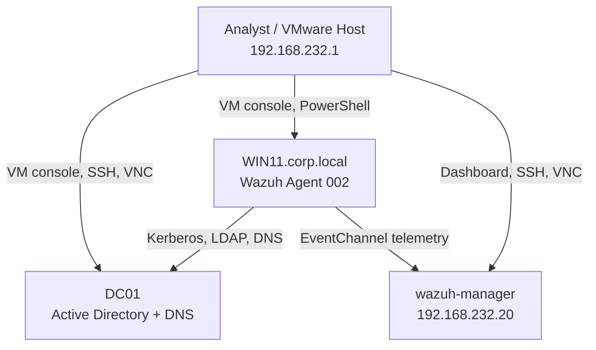

# Active Directory Security Lab Architecture

## Scope

The lab is an isolated VMware environment used to practice identity administration, Windows telemetry collection, detection engineering, threat hunting, incident response, and security reporting. It is not connected to production systems.

## Asset Inventory

| Asset | Function | Security relevance |
|---|---|---|
| `DC01` | Domain controller and DNS for `corp.local` | identity, authentication, groups, policy, directory audit events |
| `WIN11` | Domain-joined workstation | attack simulation, Sysmon, Windows Security, and PowerShell telemetry |
| `wazuh-manager` | Wazuh manager and dashboard | collection, decoding, rules, archives, alerts, ATT&CK enrichment |
| Analyst workstation | VMware host and administration point | PowerShell, VNC/SSH, evidence handling, Git workflow |

## Network

The VMs use a private VMware network in `192.168.232.0/24`. Observed lab addresses include:

| System | Address | Notes |
|---|---|---|
| Wazuh manager | `192.168.232.20` | VNC/SSH restricted to the private subnet |
| WIN11 | `192.168.232.134` | Wazuh agent `002` |
| VMware host adapter | `192.168.232.1` | administration path |
| DC01 | See `dc01-ipconfig.txt` | authoritative value retained as evidence |

## Identity Structure

The domain, organizational units, users, and security groups are preserved in:

- [`08-organizational-units.csv`](08-organizational-units.csv)
- [`domain-users.csv`](domain-users.csv)
- [`security-groups.csv`](security-groups.csv)
- [`06-domain-verification.txt`](06-domain-verification.txt)

Privileged access should use separate administrative identities, least privilege, and documented group membership. Test accounts must not be reused outside the lab.

## Security Controls

- Domain membership and centralized identity through `corp.local`.
- Sysmon Process Create and supporting endpoint telemetry.
- Windows Security and PowerShell Operational logs where enabled.
- Wazuh agent enrollment and EventChannel forwarding.
- ATT&CK-mapped custom rules with positive and negative validation.
- Private-subnet restrictions for administrative services.
- Repository-backed documentation, rules, and evidence.

## Known Limitations

- Single domain controller and single Wazuh manager create single points of failure.
- The private subnet is a lab boundary, not a substitute for production segmentation.
- Some case studies validate local behavior only and do not prove remote attack coverage.
- Evidence may contain private IP addresses and lab account names that require review before publication.
- Pre-existing Wazuh duplicate rule IDs and invalid group references remain remediation items.

## Change and Evidence Rules

1. Snapshot or back up a configuration before material changes.
2. Record commands, timestamps, and expected results.
3. Validate endpoint telemetry before changing SIEM rules.
4. Preserve raw events separately from alert screenshots.
5. Document failed tests and why they failed.
6. Clean up test artifacts without deleting security telemetry.
