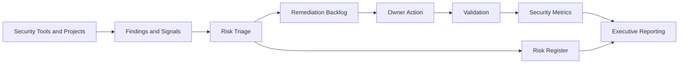

# Security Data Flow

## Flow

## Data Sources

- Vulnerability findings
- Cloud control failures
- Pipeline security scan results
- Detection coverage gaps
- Alert triage outcomes
- Compliance baseline failures
- Threat modeling risks
- Penetration test findings
- AI data exposure risks

## Management Controls

- Risk severity assignment
- Business impact review
- Owner assignment
- SLA due date
- Remediation validation
- Exception approval
- Monthly reporting
