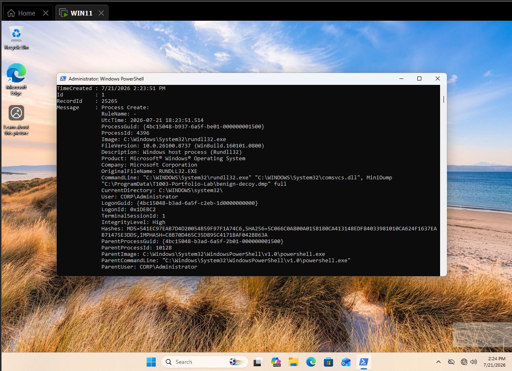
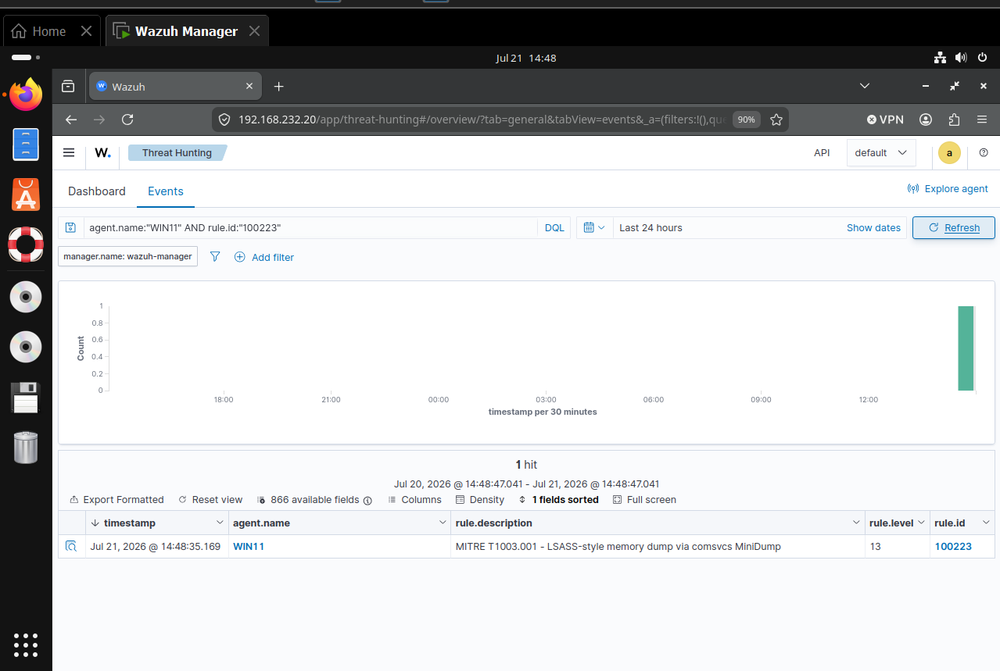
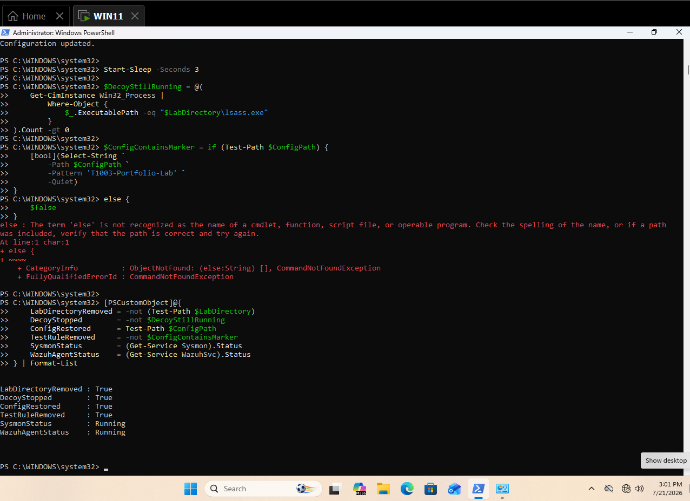
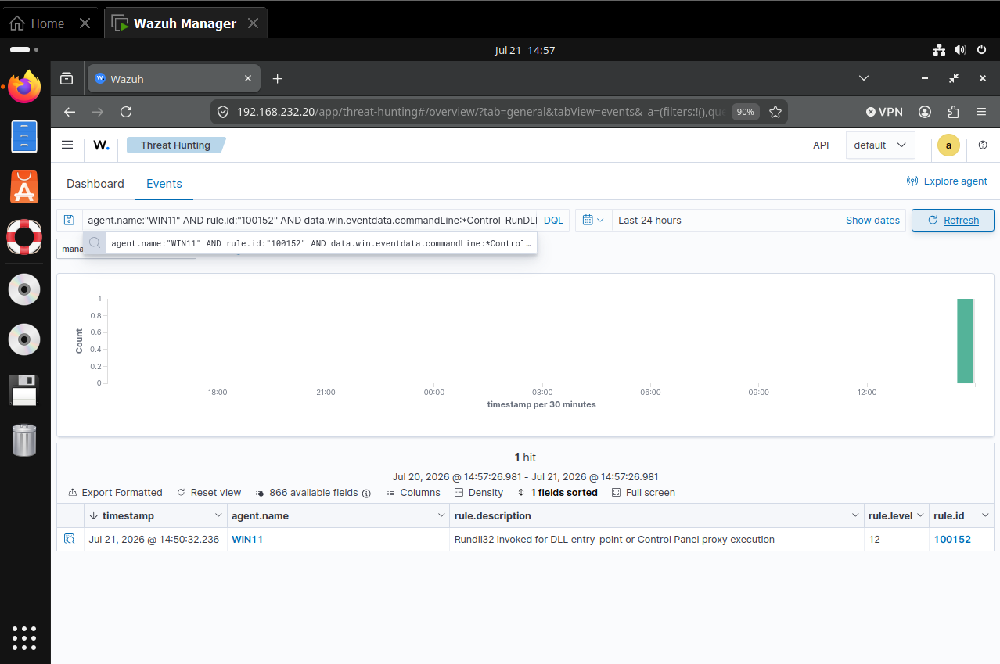
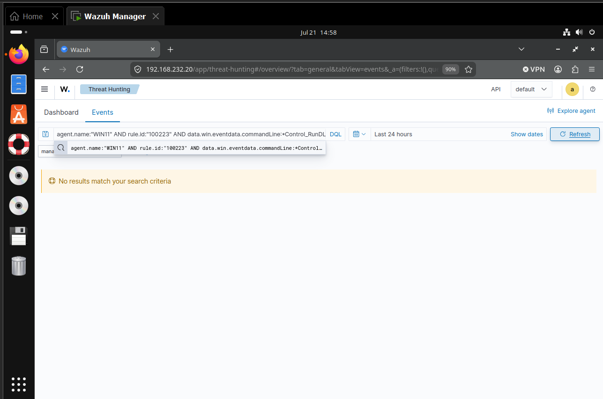

# Detecting LSASS-Style Memory Dumping with Sysmon and Wazuh

This case study validates a safe behavioral analytic for MITRE ATT&CK `T1003.001 — LSASS Memory` without reading or dumping the real LSASS process.

## Result

A renamed Notepad process acted as an isolated LSASS decoy. `rundll32.exe` invoked `comsvcs.dll, MiniDump` against only that decoy, Sysmon recorded Event ID `1` (record `25265`), and Wazuh generated level `13` rule `100223`, mapped to T1003.001. A comparable `rundll32.exe shell32.dll,Control_RunDLL` control was ingested under rule `100152` but did not trigger `100223`. The decoy, dump, and temporary Sysmon filter were removed.

| Validation point | Observed result |
|---|---|
| Endpoint | `WIN11.corp.local` |
| Agent | `WIN11`, agent `002`, `192.168.232.134` |
| User | `CORP\\Administrator` |
| Positive telemetry | Sysmon Event `1`, record `25265` |
| Positive command | `rundll32.exe comsvcs.dll, MiniDump` |
| Detection | Rule `100223`, level `13` |
| ATT&CK | `T1003.001 — LSASS Memory` |
| Positive alert time | July 21, 2026 at `14:48:35` EDT |
| Negative control | `rundll32.exe shell32.dll,Control_RunDLL` |
| Control classification | Rule `100152`, T1218.011 |
| Cleanup | Passed |



*Figure 1. Sysmon Event `1`, record `25265`, preserves the Rundll32, Comsvcs MiniDump, isolated dump path, user, and PowerShell parent.*



*Figure 2. Wazuh rule `100223`, level `13`, classifies fresh positive activity as T1003.001.*

## Objective and hypothesis

The objective was to detect a native Windows memory-dump pattern while protecting real credentials. The hypothesis was that process-creation telemetry would retain the signed binary, DLL, export, target PID, and dump path; Wazuh could distinguish `comsvcs.dll, MiniDump` from ordinary Rundll32 use; and cleanup could return the endpoint to its baseline.

The alert proves dump-like command intent, not successful credential theft or access to real LSASS memory.

## Lab environment

| Component | Value |
|---|---|
| Workstation | Windows 11, `WIN11.corp.local` |
| Wazuh manager | `wazuh-manager`, `192.168.232.20` |
| Telemetry | Sysmon Operational Event IDs `1`, `10`, and `16` |
| Test directory | `C:\\ProgramData\\T1003-Portfolio-Lab` |
| Decoy | Renamed copy of `notepad.exe` |

## Safe simulation

The test copied Notepad to `C:\\ProgramData\\T1003-Portfolio-Lab\\lsass.exe`, started it, verified its PID differed from the real LSASS PID, and dumped only the decoy to `benign-decoy.dmp`. No LSASS protection, Defender control, credential isolation, or production security setting was weakened.

## Endpoint telemetry

Sysmon Event `1`, record `25265`, recorded `C:\\Windows\\System32\\rundll32.exe`, original filename `RUNDLL32.EXE`, the `comsvcs.dll, MiniDump` command line, PowerShell parent, high integrity, and `CORP\\Administrator` user.

| Field | Observed value |
|---|---|
| Image | `C:\\Windows\\System32\\rundll32.exe` |
| Original filename | `RUNDLL32.EXE` |
| Command behavior | `comsvcs.dll, MiniDump` |
| Dump destination | `C:\\ProgramData\\T1003-Portfolio-Lab\\benign-decoy.dmp` |
| Parent image | `C:\\Windows\\System32\\WindowsPowerShell\\v1.0\\powershell.exe` |
| User | `CORP\\Administrator` |
| Integrity | High |
| Event record | `25265` |



*Figure 3. Cleanup confirms removal of the test directory and filter while Sysmon and Wazuh Agent remain running.*

## Wazuh hunt and collection validation

The original event reached manager archives and initially matched T1218 rule `100210`. That proved collection but exposed an ATT&CK-classification gap. After deploying rule `100223` and generating fresh activity, this query returned one alert:

```text
agent.name:"WIN11" AND rule.id:"100223"
```

## Troubleshooting and detection engineering

| Observation | Decision | Outcome |
|---|---|---|
| Real LSASS handle request was blocked | Preserved protection; did not bypass it | Safe boundary maintained |
| P/Invoke against a decoy produced no Event `10` | Investigated provider and filters | Telemetry limitation documented |
| Duplicate ProcessAccess blocks existed | Restored backup and tested one correct block | Configuration hygiene improved |
| Event `10` remained absent after reboot | Stopped weakening the test path | Switched to Event `1` behavioral analytic |
| Initial alert mapped only to T1218 | Added narrow DLL/export rule | T1003.001 classification validated |
| Archived events did not change after deployment | Generated fresh test activity | Rule `100223` fired |

The manager rule `100214` was also corrected from invalid group `sysmon_event10` to `sysmon_event_10`. The validated primary analytic remains Event `1` rule `100223`.

### Validated rule path

```text
Sysmon Event ID 1
└── sysmon_event1 group
    ├── 100210 — signed-binary proxy execution context (initial event)
    └── 100223 — comsvcs MiniDump behavior (T1003.001)
```

### Final rule

```xml
<rule id="100223" level="13">
  <if_group>sysmon_event1</if_group>
  <field name="win.eventdata.originalFileName"
         type="pcre2">(?i)^RUNDLL32\.EXE$</field>
  <field name="win.eventdata.commandLine"
         type="pcre2">(?i)comsvcs\.dll.*MiniDump</field>
  <description>MITRE T1003.001 - LSASS-style memory dump via comsvcs MiniDump</description>
  <mitre>
    <id>T1003.001</id>
  </mitre>
  <group>credential_access,os_credential_dumping,lsass_memory,</group>
</rule>
```

The versioned rule pack contains the same field logic as portable rule `110108`. The case-study ID records the live manager validation; the `1101xx` ID avoids collisions for repeatable deployment.

## Positive validation

The positive path passed end to end: safety assertions passed, the decoy dump was created, Sysmon preserved the command, Wazuh ingested it, and rule `100223` produced a level `13` T1003.001 alert.

## Negative control

The control reused Rundll32, the same user, parent, host, and telemetry source but invoked `shell32.dll,Control_RunDLL`. Wazuh observed it as rule `100152` (T1218.011) and withheld rule `100223` because neither `comsvcs.dll` nor `MiniDump` was present.



*Figure 4. The comparable Rundll32 control remains observable and is classified under T1218.011.*



*Figure 5. The Control Panel invocation does not satisfy rule `100223`.*

## False positives and triage

Potential legitimate sources include approved diagnostics, application crash collection, incident-response tooling, and administrator-created process dumps. Triage the full command, target PID and image, dump destination, user, integrity, parent process, remote origin, ticket/change window, subsequent archive creation, and outbound transfer. Escalate unexpected execution against LSASS, execution from unusual parents, or dump staging in user-writable or network locations.

## Analyst response workflow

When rule `100223` or packaged rule `110108` fires, the analyst should:

1. Confirm the endpoint, user, timestamp, Rundll32 image identity, parent process, and complete command line.
2. Resolve the target PID at event time and determine whether it was the real LSASS process or another process.
3. Identify the dump path, file owner, size, hashes, and any subsequent rename, compression, copy, or deletion.
4. Check for remote-session, service, scheduled-task, WMI, PowerShell, or management-tool activity that explains the execution.
5. Review adjacent Sysmon Event `10`, EDR, Defender, and Security telemetry for process-access or credential-protection evidence.
6. Validate whether an approved diagnostic, incident-response collection, or change ticket explains the behavior.
7. If real LSASS targeting is unauthorized, isolate the host, preserve volatile evidence, secure the dump, and begin credential-exposure assessment.
8. Hunt for reuse of exposed credentials, explicit-credential events, lateral movement, privilege escalation, and persistence.

## Engineering considerations

- Expected blind spots: alternate dump APIs, renamed DLLs, direct syscalls, kernel access, sensor tampering, and activity without command-line telemetry.
- Tuning decision: require both the trusted binary identity and `comsvcs.dll.*MiniDump`; do not suppress all Rundll32 activity.
- False-positive metric: `0/1` behaviorally comparable controls triggered rule `100223`; this is validation evidence, not a production rate.
- Detection yield: `1/1` safe positive tests triggered after deployment.
- Response action: isolate when unauthorized real-LSASS targeting is confirmed, preserve volatile evidence, collect the dump securely, rotate exposed credentials, and hunt for lateral movement.
- Event `10` remains valuable enrichment when reliable, but the production rule must not depend solely on it in this lab.

## Cleanup

The decoy process was stopped; the dump and lab directory were removed; the pre-test Sysmon configuration was restored; the temporary T1003 filter was absent; and both Sysmon and Wazuh Agent remained running.

## Timeline

| Time (EDT) | Event |
|---|---|
| 12:23–14:00 | Readiness, protected-LSASS attempt, decoy Event 10 troubleshooting |
| 14:23:51 | Safe decoy MiniDump generated Sysmon record `25265` |
| 14:23:54 | Manager ingested event under T1218 rule `100210` |
| 14:32 | Rules validated; Wazuh Manager restarted |
| 14:48:35 | Fresh test fired T1003.001 rule `100223` |
| 14:50:30 | Rundll32 control ingested as rule `100152` |
| After validation | Decoy, dump, directory, and temporary filter removed |

## Findings

### 1. Endpoint protection preserved the safety boundary

The initial real-LSASS handle request was blocked. The case study did not disable LSA protection or weaken Defender controls to force a result.

### 2. Event 10 was an observed telemetry blind spot

The decoy handle opened successfully, but Event `10` remained absent after filter correction, provider activation, and reboot. This limitation is preserved as evidence rather than hidden.

### 3. Event 1 supported a precise behavioral analytic

The signed binary identity plus `comsvcs.dll.*MiniDump` retained enough intent for a narrow T1003.001 rule without depending on the unavailable ProcessAccess event.

### 4. The negative control demonstrated tested discrimination

The same Rundll32 binary, user, host, parent class, and telemetry source remained visible under rule `100152`; only the MiniDump behavior was absent, and rule `100223` did not fire.

### 5. T1218 and T1003 context is complementary

The original event matched signed-binary proxy execution before the dedicated rule was added. Analysts should retain both the execution mechanism and credential-access objective during triage.

## Evidence inventory

| Artifact | Purpose |
|---|---|
| `001`–`015` screenshots | Baseline, protected access, configuration analysis, and Event 10 troubleshooting record |
| [016-t1003-benign-decoy-minidump-process-create.png](evidence/016-t1003-benign-decoy-minidump-process-create.png) | Positive Sysmon Event `1` |
| [017-t1003-wazuh-rule-100223-positive-alert.png](evidence/017-t1003-wazuh-rule-100223-positive-alert.png) | Positive Wazuh T1003.001 alert |
| [018-t1003-negative-control-rundll32-telemetry.png](evidence/018-t1003-negative-control-rundll32-telemetry.png) | Control ingestion under T1218.011 |
| [019-t1003-negative-control-no-credential-dumping-alert.png](evidence/019-t1003-negative-control-no-credential-dumping-alert.png) | Control excluded from T1003 rule |
| [020-t1003-cleanup-and-configuration-restoration.png](evidence/020-t1003-cleanup-and-configuration-restoration.png) | Cleanup and service health |

## Reproduction

See [T1003.001-LSASS-Memory-Lab-Runbook.md](T1003.001-LSASS-Memory-Lab-Runbook.md) and [detection-rules.xml](detection-rules.xml).
