# Detecting Windows Service Discovery with Sysmon and Wazuh

This case study validates the ability of Sysmon and Wazuh to identify native Windows service enumeration and map the resulting alerts to MITRE ATT&CK `T1007 – System Service Discovery`.

## Result

Atomic Red Team generated three service-discovery events on WIN11: `tasklist.exe /svc`, `sc query`, and `sc query state= all`. The final rules produced one level 7 alert under rule `100170` and two level 7 alerts under rule `100171`, all mapped to T1007. Negative controls invoked the same utilities without discovery-specific arguments and did not trigger either custom rule.

| Validation point | Observed result |
|---|---|
| Simulation | Atomic Red Team T1007 test 1 |
| Endpoint telemetry | Sysmon Event ID `1` confirmed |
| Wazuh collection | Process events present in manager archives |
| Initial classification | T1057 or generic command-shell alerts |
| `tasklist.exe /svc` detection | Rule `100170`, level `7` |
| `sc.exe query` detection | Rule `100171`, level `7` |
| ATT&CK mapping | `T1007` |
| Tactic | Discovery |
| Negative controls | No custom-rule alerts |
| Cleanup | No persistent artifacts or processes |

## Objective and hypothesis

The objective was to determine whether native Windows service-enumeration activity could be distinguished from ordinary execution of the same binaries. The hypothesis was that Sysmon would record process creation, Wazuh would collect it, and argument-aware child rules could add the missing T1007 classification without alerting on every `tasklist.exe` or `sc.exe` execution.

The final detection focused on:

- `tasklist.exe` with `/svc`;
- `sc.exe` with the `query` operation;
- the existing Wazuh rule branches that processed each event;
- T1007 enrichment under the Discovery tactic.

## Lab environment

| Component | Observed value |
|---|---|
| Endpoint | `WIN11.corp.local` |
| Wazuh agent | `WIN11`, agent `002` |
| User | `CORP\Administrator` |
| Wazuh manager | `wazuh-manager` |
| Wazuh version | `4.14.6` |
| Primary channel | `Microsoft-Windows-Sysmon/Operational` |
| Primary event | Sysmon Event ID `1` – Process Create |
| Simulation framework | Atomic Red Team |

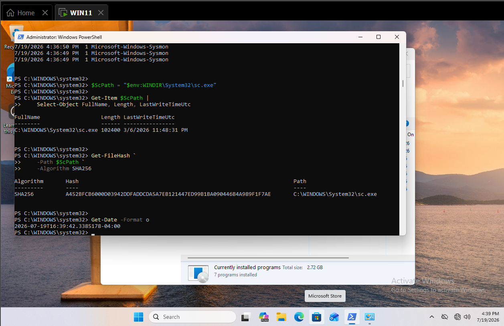

*Figure 1. Endpoint readiness showing the Wazuh and Sysmon services, active telemetry, and the native service-control binary.*

The planned prerequisite screenshot `02-t1007-test-details-and-prerequisites.png` was not present in the supplied evidence. The test proceeded successfully, but this preparatory artifact remains an explicit documentation gap.

## Safe simulation

Atomic Red Team T1007 test 1 used built-in Windows utilities to enumerate registered services. The test did not create, start, stop, modify, or delete a service.


*Figure 2. Authorized T1007 execution showing native service-enumeration output and the bounded test window.*

## Endpoint telemetry

Sysmon Event ID `1` retained the executable image, complete command line, parent process, user, process identifiers, integrity context, hashes, and timestamp for the service-discovery commands.

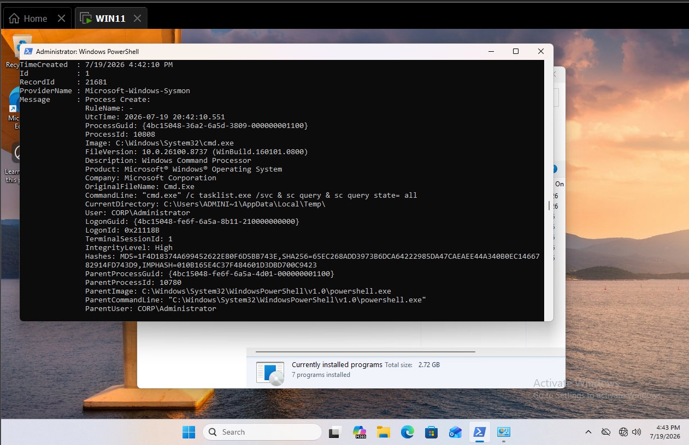

*Figure 3. Local Sysmon process-creation evidence for the native service-discovery utilities.*

## Wazuh hunt and collection validation

The initial hunt used progressively narrower searches:

```text
agent.name:"WIN11" AND data.win.system.eventID:"1"
```

```text
agent.name:"WIN11" AND data.win.system.eventID:"1" AND (data.win.eventdata.image:*sc.exe OR data.win.eventdata.image:*tasklist.exe OR data.win.eventdata.image:*net.exe)
```

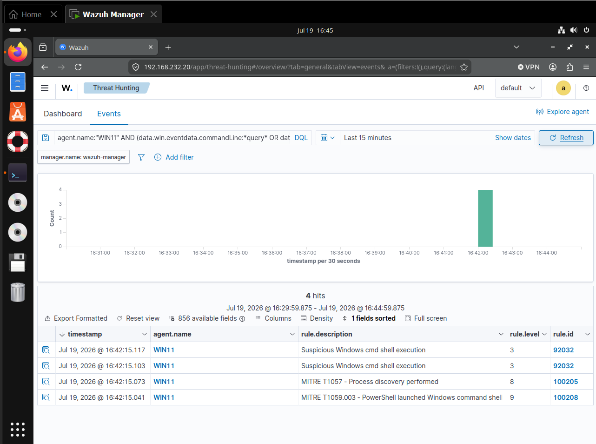

*Figure 4. Initial process hunt for the native utilities associated with T1007.*


*Figure 5. Wazuh event fields retaining the image, command line, process context, and user.*

Direct manager inspection confirmed the events were present in `archives.json` and established which rules initially processed them.

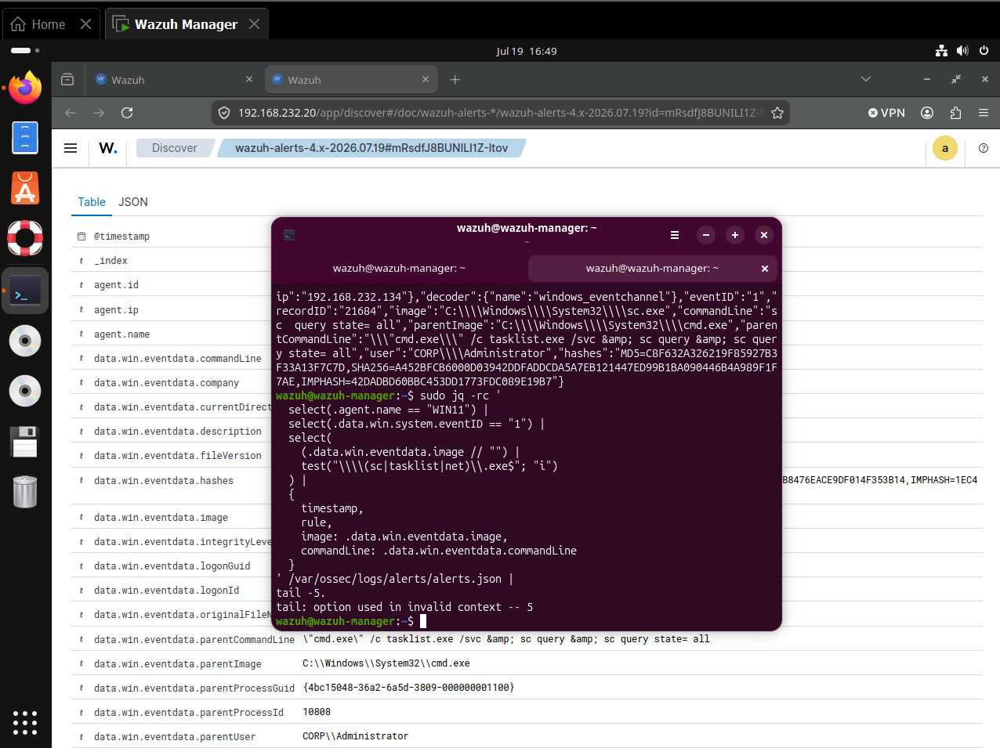

*Figure 6. Archive and alert comparison used to distinguish collection from ATT&CK classification.*

## Troubleshooting and detection engineering

The initial activity was visible, but its classification did not accurately represent all observed behavior:

- `tasklist.exe /svc` matched custom rule `100205`, which mapped the event only to T1057 Process Discovery;
- `sc query` and `sc query state= all` matched built-in rule `92032`, which described generic command-shell execution and included unrelated discovery metadata;
- none of the three events had a dedicated T1007 classification.

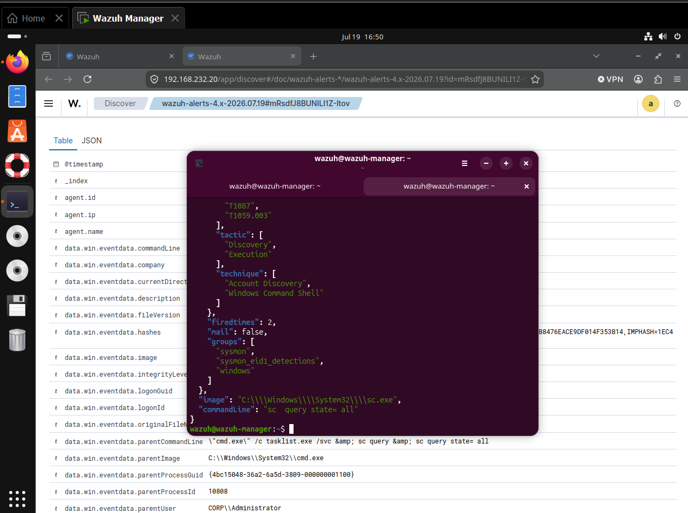

*Figure 7. Manager-side analysis showing the commands and the initial rule paths that handled them.*

| Step | Observation | Engineering action | Result |
|---|---|---|---|
| 1 | Sysmon Event ID `1` existed locally | Hunted the same execution window in Wazuh | Collection confirmed |
| 2 | `tasklist.exe /svc` matched rule `100205` | Inspected the command and current ATT&CK mapping | T1057 coverage retained but T1007 gap identified |
| 3 | `sc.exe query` matched rule `92032` | Inspected the active built-in rule path | Generic command-shell classification identified |
| 4 | Proposed IDs were checked across all rule files | Selected unused IDs `100170` and `100171` | Duplicate-ID conflict avoided |
| 5 | Each utility followed a different winning rule | Added one child per active parent | Both service-discovery paths received T1007 mapping |
| 6 | New rules required post-restart evidence | Repeated Atomic test 1 | Three T1007 alerts generated |
| 7 | Binary-only matching could create noise | Tested the utilities without `/svc` or `query` | Both controls remained outside the custom rules |

Pre-existing duplicate custom rule warnings were observed elsewhere in the ruleset. They were not treated as the cause of this T1007 gap.

### Validated rule hierarchy

```text
tasklist.exe /svc
└── 100205 — existing Process Discovery rule
    └── 100170 — tasklist service enumeration (T1007)

sc.exe query
└── 92032 — existing command-shell rule
    └── 100171 — sc.exe service enumeration (T1007)
```

### Final rule

```xml
<rule id="100170" level="7">
  <if_sid>100205</if_sid>
  <field name="win.eventdata.image"
         type="pcre2">(?i)\\tasklist\.exe$</field>
  <field name="win.eventdata.commandLine"
         type="pcre2">(?i)\s/svc(?:\s|$)</field>
  <description>Windows services enumerated with tasklist</description>
  <mitre>
    <id>T1007</id>
  </mitre>
  <group>discovery,service_discovery,</group>
</rule>

<rule id="100171" level="7">
  <if_sid>92032</if_sid>
  <field name="win.eventdata.image"
         type="pcre2">(?i)\\sc\.exe$</field>
  <field name="win.eventdata.commandLine"
         type="pcre2">(?i)\bquery\b</field>
  <description>Windows services enumerated with sc.exe</description>
  <mitre>
    <id>T1007</id>
  </mitre>
  <group>discovery,service_discovery,</group>
</rule>
```

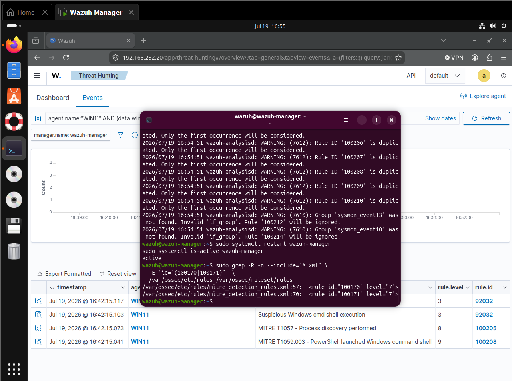

*Figure 8. Rule validation, manager restart, and confirmation that the T1007 rules loaded.*

## Positive validation

Fresh activity was generated after the manager restart because Wazuh does not retroactively process archived events through new rules.

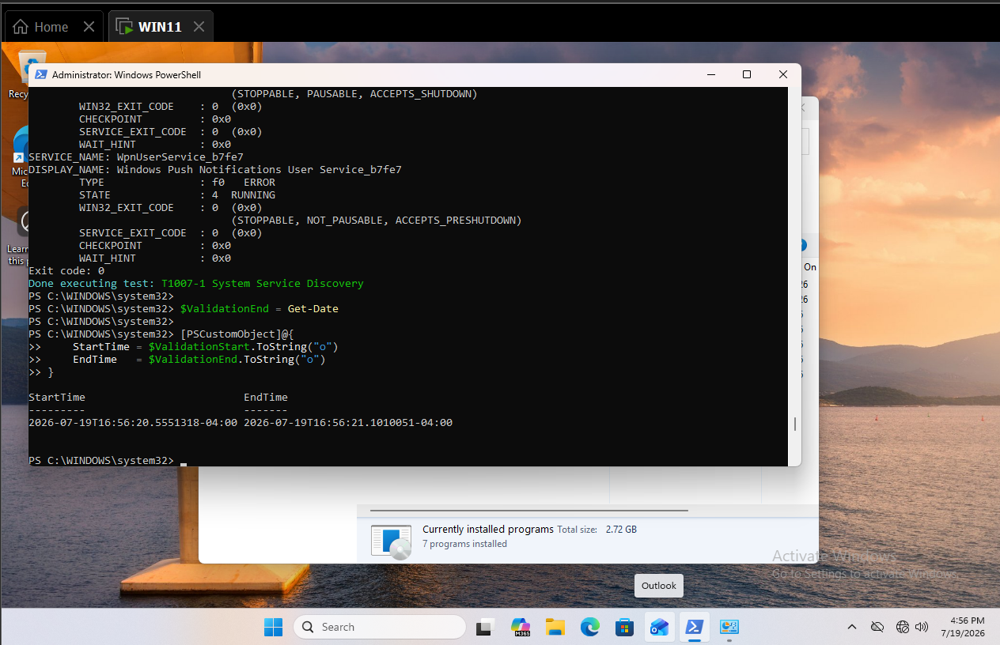

*Figure 9. Fresh Atomic Red Team execution used for post-change validation.*

The final search returned three alerts at approximately `16:56:36 EDT` on July 19, 2026.

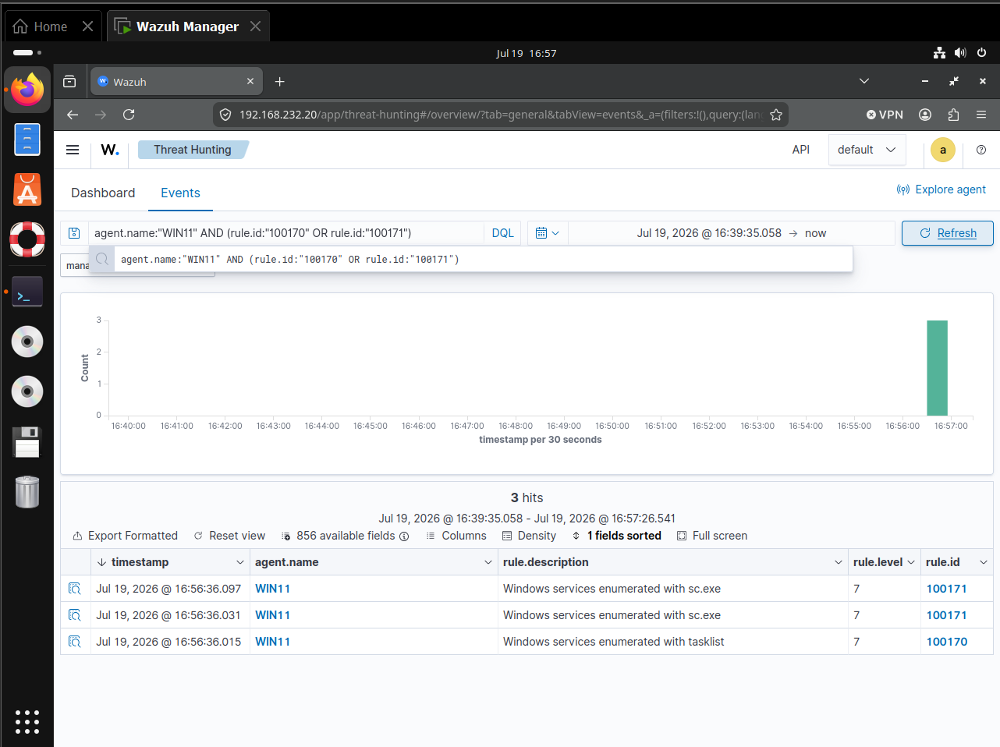

*Figure 10. One rule `100170` alert and two rule `100171` alerts from WIN11.*

### Tasklist detection

| Field | Observed value |
|---|---|
| Rule | `100170` |
| Level | `7` |
| Event record | `21690` |
| Image | `C:\Windows\System32\tasklist.exe` |
| Command line | `tasklist.exe /svc` |
| Parent | `C:\Windows\System32\cmd.exe` |
| User | `CORP\Administrator` |
| ATT&CK | `T1007`, Discovery |


*Figure 11. Rule `100170` details showing the service-aware tasklist command and T1007 mapping.*

### Service Control detection

| Field | Observed value |
|---|---|
| Rule | `100171` |
| Level | `7` |
| Event record | `21692` |
| Image | `C:\Windows\System32\sc.exe` |
| Command line | `sc query state= all` |
| Parent | `C:\Windows\System32\cmd.exe` |
| User | `CORP\Administrator` |
| ATT&CK | `T1007`, Discovery |

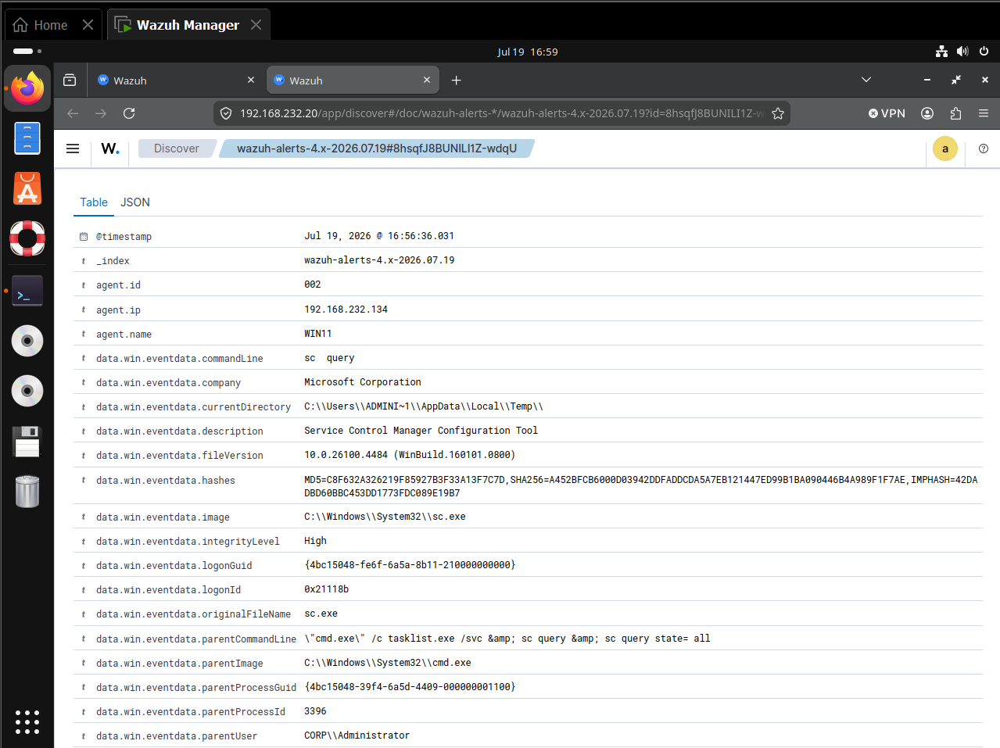

*Figure 12. Rule `100171` details showing `sc.exe` service enumeration and T1007 enrichment.*

## Negative control

The controls executed `tasklist.exe` without `/svc` and `sc.exe` without `query`. They used the same signed Windows binaries without performing the discovery behavior defined by the custom rules.

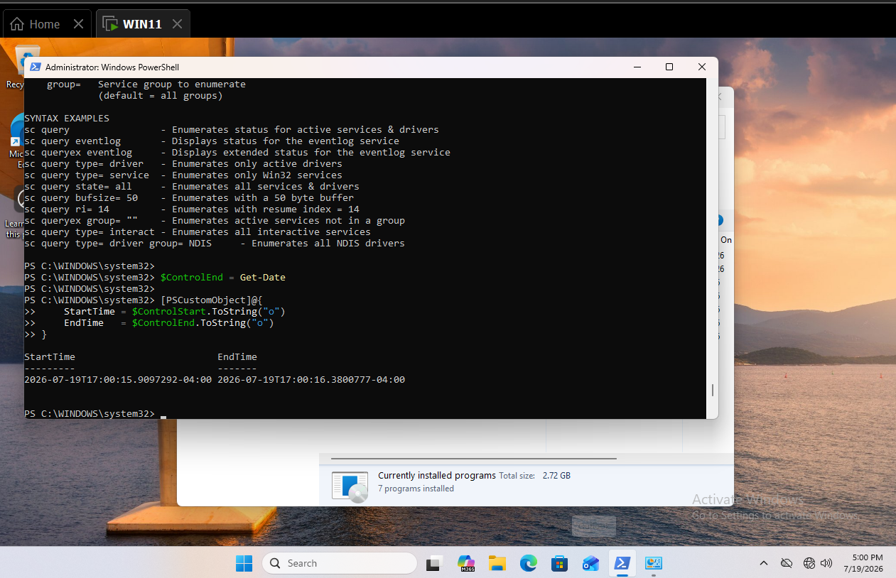

*Figure 13. Native utilities executed without the T1007-specific arguments.*

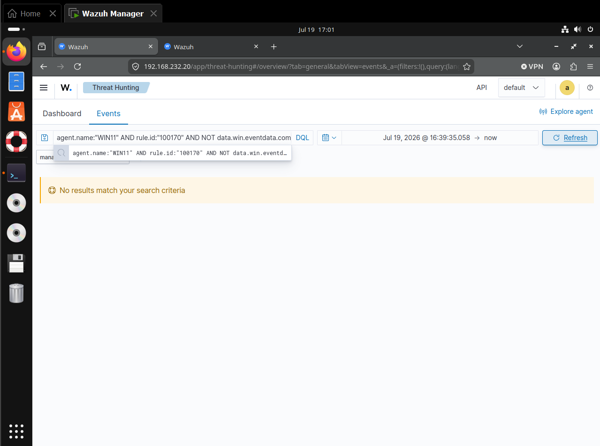

*Figure 14. No rule `100170` result for tasklist execution without `/svc`.*

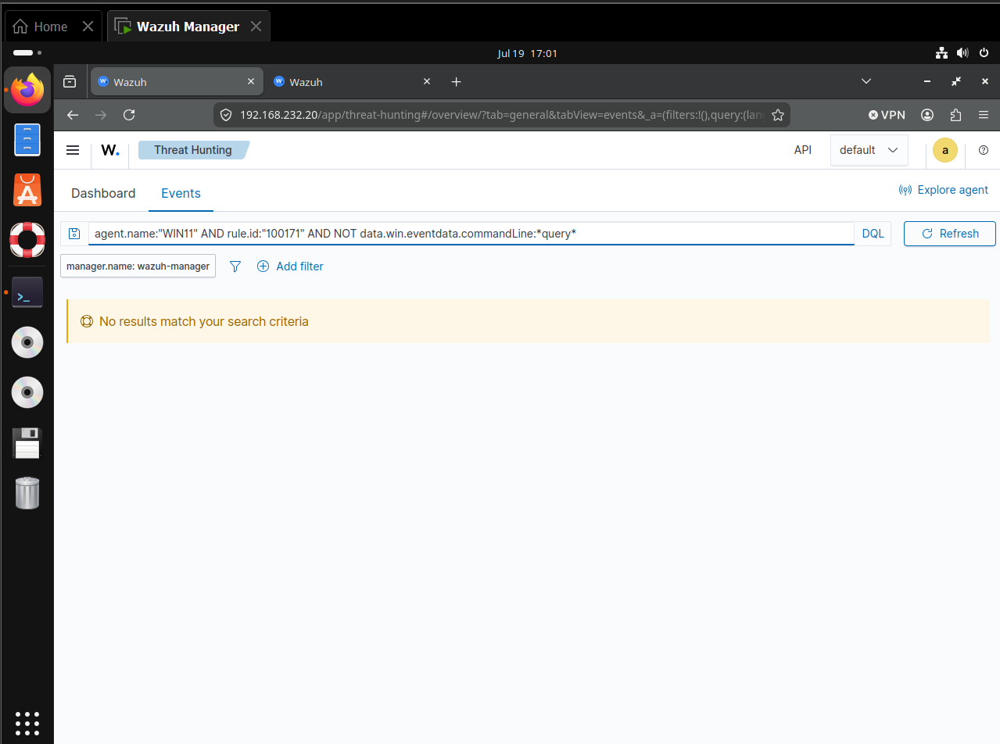

*Figure 15. No rule `100171` result for sc.exe execution without `query`.*

The controls demonstrate tested argument precision. They do not establish a production false-positive rate.

## False positives and triage

Legitimate service enumeration occurs during:

- administrator troubleshooting and health checks;
- software installation, patching, and upgrades;
- endpoint management and inventory collection;
- monitoring, backup, and security-agent workflows;
- incident response and authorized threat hunting;
- application support scripts;
- automated compliance and configuration audits.

Analysts should review the parent process, user, host role, execution frequency, remote context, and nearby activity. Higher-risk context includes unusual users, remote shells, user-writable parent processes, encoded PowerShell, recently downloaded tools, repeated security-product queries, and discovery followed by service tampering or lateral movement.

## Engineering considerations

- Match the discovery arguments, not only the executable name.
- Extend the active Wazuh parent rule so the event is evaluated in the correct branch.
- Preserve existing T1057 coverage for `tasklist.exe`; one command may support more than one ATT&CK interpretation.
- Generate fresh events after every ruleset change.
- Maintain unique rule IDs and correct file placement.
- Baseline administrative automation before production deployment.
- Correlate service discovery with service stop, service creation, remote execution, and security-software discovery.
- Test common variants including `sc.exe queryex`, remote `sc.exe \\host query`, `net start`, PowerShell `Get-Service`, and WMI service enumeration.
- Use narrow allowlists scoped to known tools, parents, users, hosts, and maintenance windows.

## Cleanup

Atomic cleanup completed without persistent artifacts. Process checks found no remaining `tasklist.exe` or `sc.exe` instances.

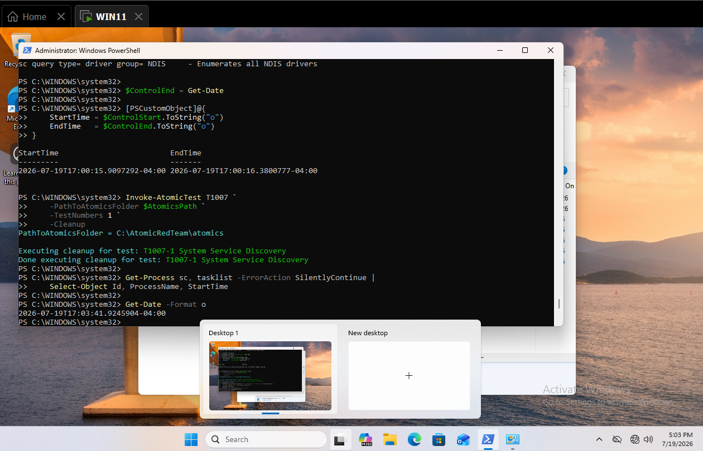

*Figure 16. Cleanup validation confirming the discovery utilities were no longer running.*

## Timeline

All observed events occurred on July 19, 2026 in Eastern Daylight Time.

| Time | Source | Event | Interpretation |
|---|---|---|---|
| 16:42:15 | WIN11/Sysmon | Initial `tasklist.exe /svc` and `sc.exe query` events | Endpoint telemetry confirmed |
| 16:42–16:50 | Wazuh | Initial hunts and rule-path inspection | T1007 classification gap identified |
| 16:56 | Wazuh manager | Rules validated and manager restarted | New detection logic activated |
| 16:56:36 | Wazuh | Rule `100170` and two `100171` alerts | Positive T1007 validation passed |
| 17:00 | WIN11 | Argument-negative controls executed | Precision test initiated |
| 17:01 | Wazuh | Targeted control queries returned no results | Custom rules rejected the controls |
| 17:04 | WIN11 | Atomic cleanup and process check | No persistent artifact observed |

## Findings

### 1. Telemetry existed before accurate ATT&CK classification

Sysmon and Wazuh collected all three discovery commands, but the initial rules described Process Discovery or generic shell execution. Collection and classification were separate engineering outcomes.

### 2. One simulation exercised two native discovery paths

Atomic test 1 used both `tasklist.exe /svc` and `sc.exe query`. Each followed a different Wazuh parent rule, so a single custom rule was not sufficient.

### 3. Existing coverage remained useful

The `tasklist.exe /svc` event legitimately supports T1057 Process Discovery as well as T1007 System Service Discovery. The child rule added context rather than treating the earlier mapping as wholly invalid.

### 4. Argument-aware rules improved precision

The same binaries executed without `/svc` or `query` did not trigger the T1007 rules. This reduced noise compared with binary-only matching.

## Limitations

- The lab tested one Windows endpoint and one Atomic Red Team test.
- The simulation covered `tasklist.exe` and `sc.exe`; it did not validate `net start`, PowerShell, WMI, remote service queries, or API-only enumeration.
- The negative controls covered only one benign invocation per binary.
- The missing screenshot `02-t1007-test-details-and-prerequisites.png` means prerequisite review is described but not visually evidenced.
- Production tuning requires baselining administrators, management tools, monitoring agents, and maintenance automation.

## Evidence inventory

| Artifact | Purpose |
|---|---|
| `01-service-discovery-readiness.png` | Endpoint readiness |
| `02-t1007-test-details-and-prerequisites.png` | Missing prerequisite-review screenshot |
| `03-t1007-service-discovery-execution.png` | Atomic test execution |
| `04-local-sysmon-service-discovery-event.png` | Local Sysmon process event |
| `05-wazuh-service-discovery-hunt.png` | Initial Wazuh hunt |
| `06-wazuh-event-discovery-fields.png` | Decoded Wazuh fields |
| `06-wazuh-service-discovery-archive-check.png` | Archive and alert validation |
| `07-service-discovery-rule-path-analysis.png` | Initial classification analysis |
| `08-t1007-rule-validation-and-restart.png` | Rule activation evidence |
| `09-fresh-t1007-positive-validation.png` | Fresh post-restart activity |
| `10-positive-t1007-alerts.png` | Three positive alerts |
| `11-tasklist-service-discovery-alert-details.png` | Rule `100170` details |
| `12-sc-service-discovery-alert-details.png` | Rule `100171` details |
| `13-t1007-negative-control-execution.png` | Control execution |
| `14-tasklist-negative-control-no-alert.png` | No `100170` control alert |
| `15-sc-negative-control-no-alert.png` | No `100171` control alert |
| `16-t1007-alert-json-verification.png` | Alert JSON verification |
| `16-positive-t1007-tasklist-rule-100170.json` | Raw tasklist alert |
| `17-positive-t1007-sc-rule-100171.json` | Raw sc.exe alert |
| `17-t1007-cleanup-validation.png` | Cleanup validation |

## Reproduction

The validated procedure is included in [`T1007-Service-Discovery-Lab-Runbook.md`](T1007-Service-Discovery-Lab-Runbook.md).

- [MITRE ATT&CK T1007 – System Service Discovery](https://attack.mitre.org/techniques/T1007/)
- [Atomic Red Team T1007 tests](https://github.com/redcanaryco/atomic-red-team/tree/master/atomics/T1007)
- [Microsoft Sysmon documentation](https://learn.microsoft.com/en-us/sysinternals/downloads/sysmon)
