# Detecting SMB Administrative Share Access with Sysmon and Wazuh

This case study validates detection of Windows administrative-share access and maps the resulting alert to MITRE ATT&CK `T1021.002 – SMB/Windows Admin Shares`.

## Result

A bounded localhost simulation listed `\\localhost\ADMIN$` through SMB without creating, changing, or deleting data. Sysmon recorded the parent PowerShell-to-`cmd.exe` process chain, Wazuh collected it, and custom rule `100190` generated a level 10 alert mapped to T1021.002. A local-directory negative control did not trigger the rule.

| Validation point | Observed result |
|---|---|
| Initial candidate | T1021.006 – Windows Remote Management |
| WinRM result | No listener; configuration left unchanged |
| Final sub-technique | `T1021.002 – SMB/Windows Admin Shares` |
| Simulation | Read-only listing of `\\localhost\ADMIN$` |
| Endpoint telemetry | Sysmon Event ID `1` |
| Detection | Rule `100190`, level `10` |
| ATT&CK tactic | Lateral Movement |
| Negative control | Local `C:\Windows` listing produced no `100190` alert |
| Cleanup | No persistent mapping or test process |

## Objective and hypothesis

The objective was to validate visibility into administrative-share access using an existing Windows remote service without enabling a new listener. The hypothesis was that Sysmon would retain the UNC path in the command line, Wazuh would collect the event, and a child of the active PowerShell-to-command-shell rule could distinguish administrative-share access from ordinary local directory listing.

## Lab environment

| Component | Observed value |
|---|---|
| Endpoint | `WIN11.corp.local` |
| Wazuh agent | `WIN11`, agent `002` |
| User | `CORP\Administrator` |
| Wazuh manager | `wazuh-manager` |
| Wazuh version | `4.14.6` |
| Primary event | Sysmon Event ID `1` – Process Create |
| SMB endpoint | `localhost:445` |
| Administrative share | `ADMIN$` |

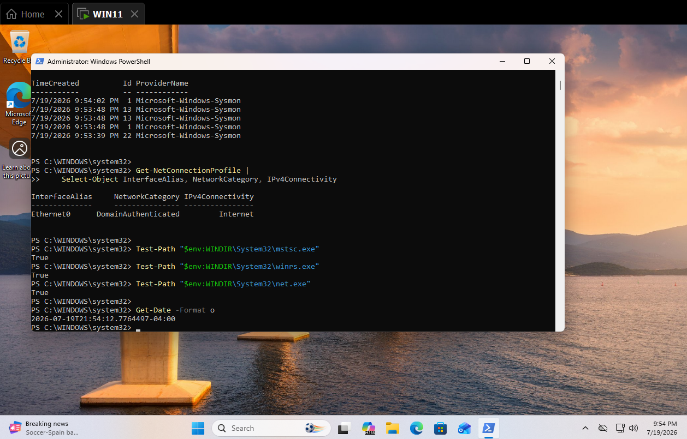

*Figure 1. Initial endpoint and remote-services readiness checks.*

## Safe simulation

The installed Atomic Red Team T1021 content was reviewed by sub-technique rather than invoking the nonexistent parent `T1021.yaml`.

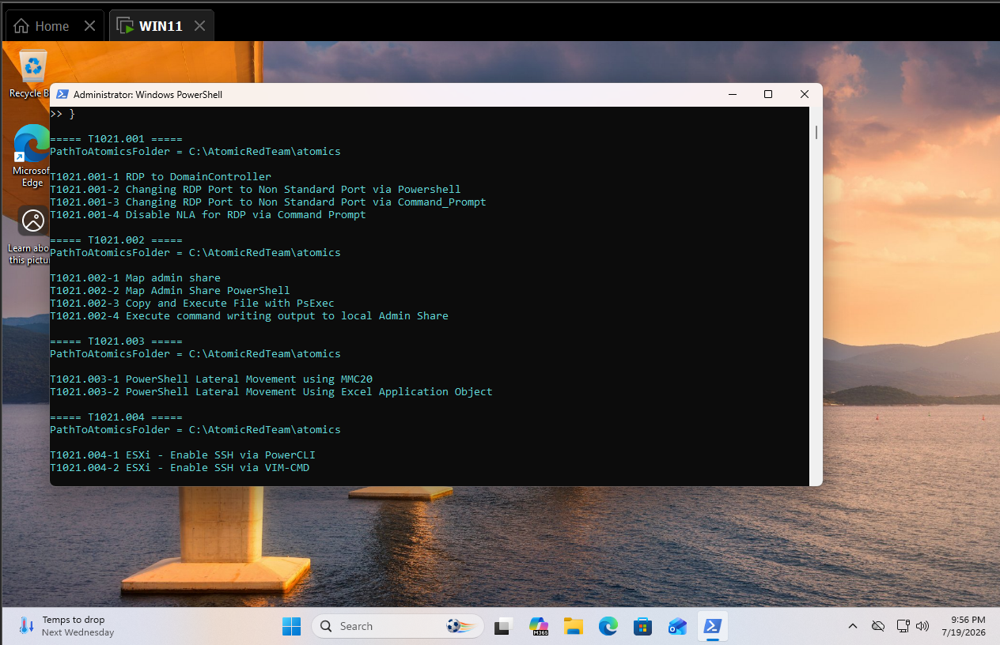

*Figure 2. Installed T1021 sub-technique tests reviewed before execution.*

WinRM was evaluated first, but no listener was active. The lab did not enable WinRM, create a listener, modify TrustedHosts, or change firewall policy.

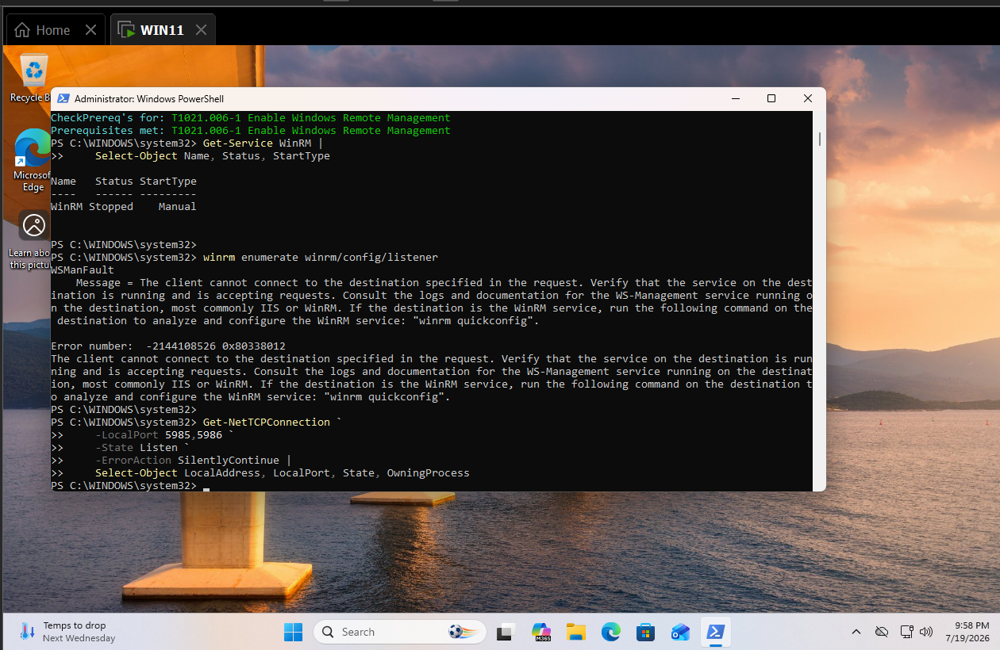

*Figure 3. T1021.006 test and prerequisite review.*

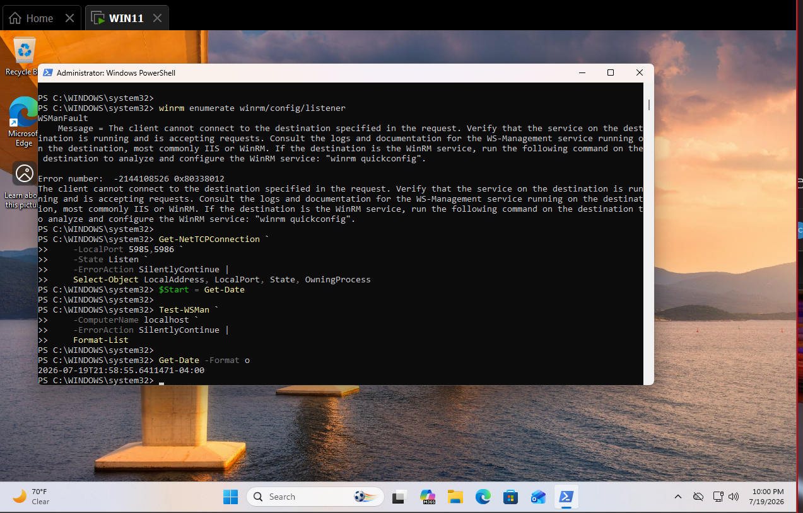

*Figure 4. Local WinRM connectivity test confirming the unavailable listener.*

The lab pivoted to the existing SMB service. Port 445 and `ADMIN$` were available without configuration changes.

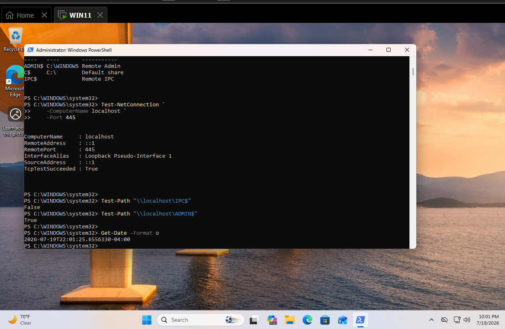

*Figure 5. SMB service, administrative shares, and localhost connectivity checks.*

The positive simulation was deliberately read-only:

```powershell
cmd.exe /c 'dir \\localhost\ADMIN$'
```

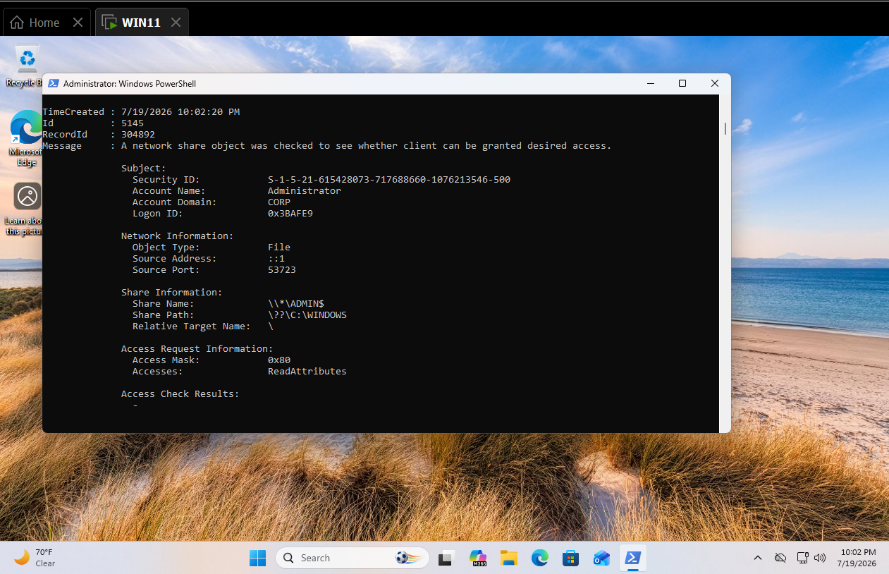

*Figure 6. Bounded localhost administrative-share listing.*

## Endpoint telemetry

Sysmon retained the complete UNC command, `cmd.exe` image, PowerShell parent, user, integrity level, process identifiers, hashes, and timestamp. Windows share-access telemetry was also inspected where available.

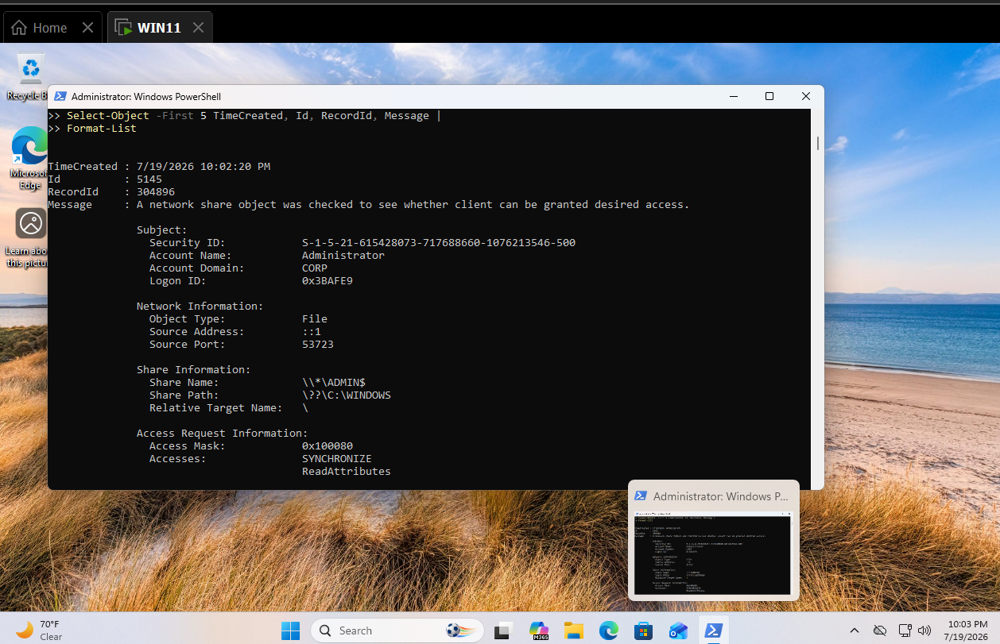

*Figure 7. Local telemetry generated by the administrative-share access.*

## Wazuh hunt and collection validation

The initial hunts checked Security Event IDs `5140` and `5145`, followed by the Sysmon process command:

```text
agent.name:"WIN11" AND data.win.system.eventID:"5140"
```

```text
agent.name:"WIN11" AND data.win.system.eventID:"5145"
```

```text
agent.name:"WIN11" AND data.win.system.eventID:"1" AND data.win.eventdata.commandLine:*localhost*
```

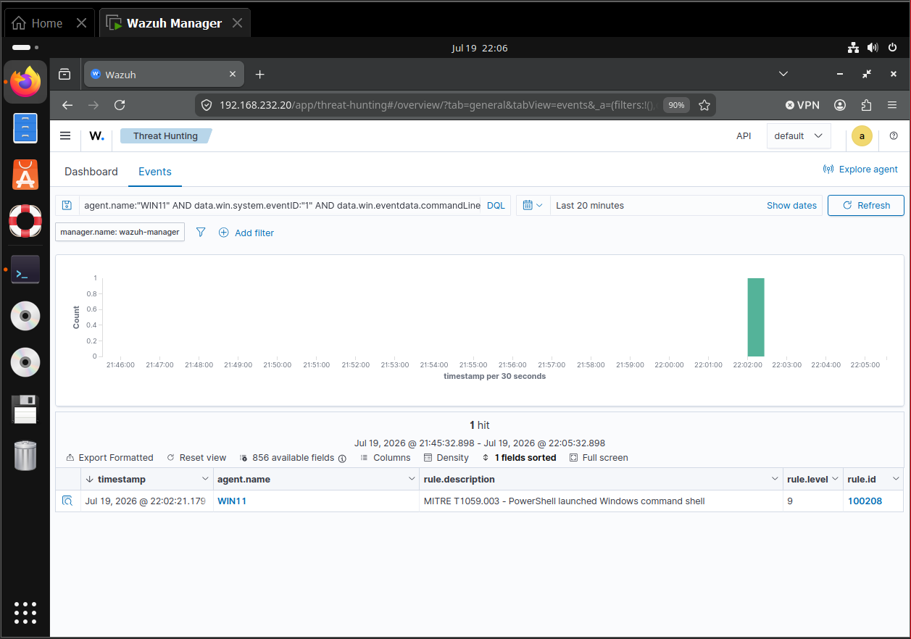

*Figure 8. Initial Wazuh hunt for administrative-share activity.*

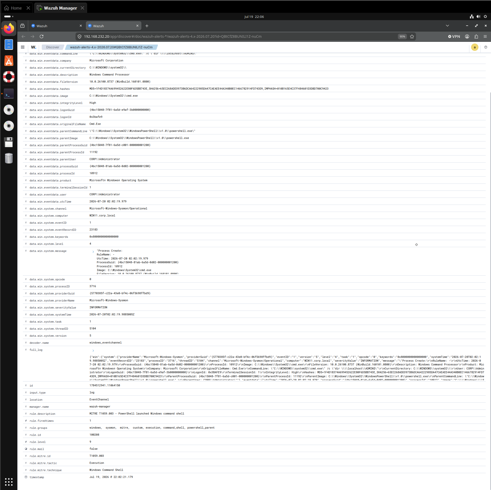

*Figure 9. Decoded event details examined during the initial hunt.*

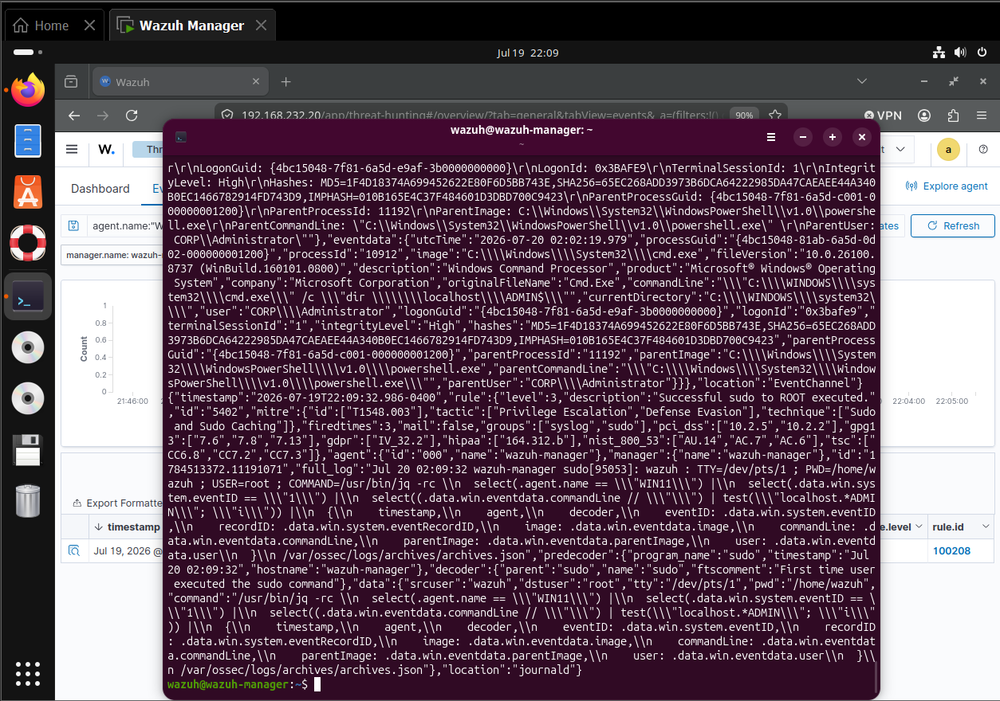

*Figure 10. Manager archive validation distinguishing collection from dedicated T1021.002 detection.*

## Troubleshooting and detection engineering

The first standalone rule did not fire because existing rule `100208` won the event. Converting `100190` into a child of `100208` established the correct hierarchy, but two more live tests still returned no result. Inspection isolated two additional issues: UNC escaping made the original regex unnecessarily brittle, and the custom child was separated from its active parent branch in the XML. The final correction matched the decisive `ADMIN` token and placed `100190` directly beside `100208` and its existing child `100180`.

| Step | Observation | Engineering action | Result |
|---|---|---|---|
| 1 | WinRM had no listener | Preserved the gap; made no configuration changes | Pivoted to existing SMB service |
| 2 | Sysmon event reached Wazuh | Compared archives and alerts | Collection confirmed |
| 3 | Event matched rule `100208` | Converted `100190` to a child of `100208` | Correct branch selected |
| 4 | UNC regex still produced no alert | Reduced the condition to `ADMIN` within the parent context | Escaping uncertainty removed |
| 5 | Child remained separated from parent branch | Moved `100190` next to `100208`/`100180` | Rule fired twice |
| 6 | Local directory control used the same process lineage | Queried for incorrect `100190` results | Negative control passed |

Pre-existing duplicate IDs `100201–100210` and invalid groups affecting rules `100212` and `100214` were observed. They remain separate ruleset-hygiene issues.

### Validated rule hierarchy

```text
Sysmon Event ID 1
└── 100208 — PowerShell launched Windows command shell
    ├── 100180 — netsh interface discovery
    └── 100190 — administrative-share access (T1021.002)
```

### Final rule

```xml
<rule id="100190" level="10">
  <if_sid>100208</if_sid>
  <field name="win.eventdata.commandLine"
         type="pcre2">(?i)ADMIN</field>
  <description>Windows administrative share accessed through a UNC path</description>
  <mitre>
    <id>T1021.002</id>
  </mitre>
  <group>lateral_movement,remote_services,smb_admin_share,</group>
</rule>
```

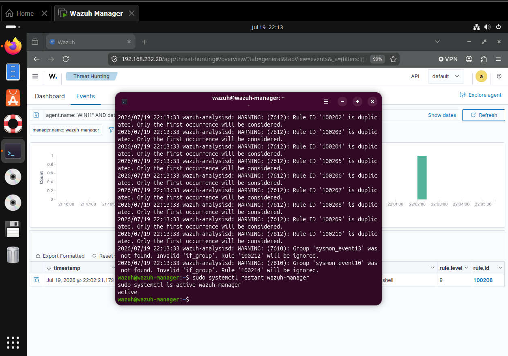

*Figure 11. Initial T1021.002 rule configuration and validation.*

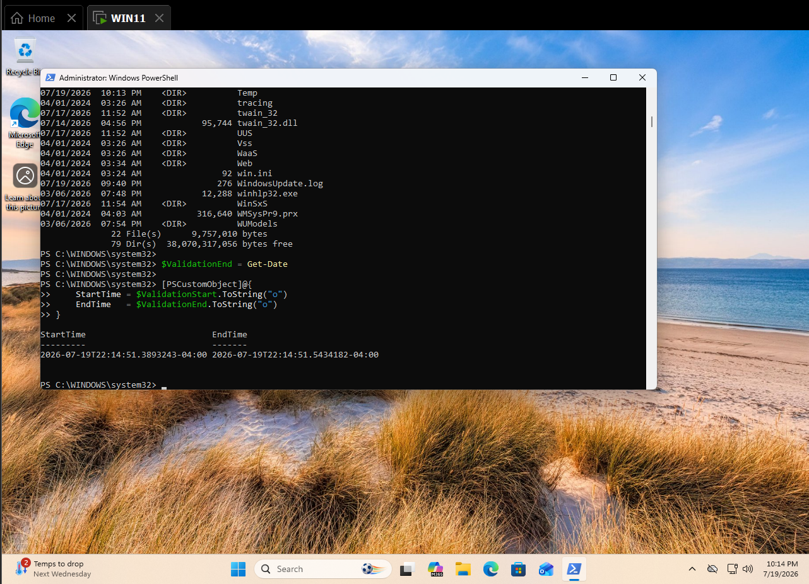

*Figure 12. Fresh event generated after the manager restart.*

The planned screenshot `12-positive-smb-admin-share-alert.png` was not produced because that validation still returned no result. It is preserved as part of the troubleshooting narrative rather than represented as successful evidence.

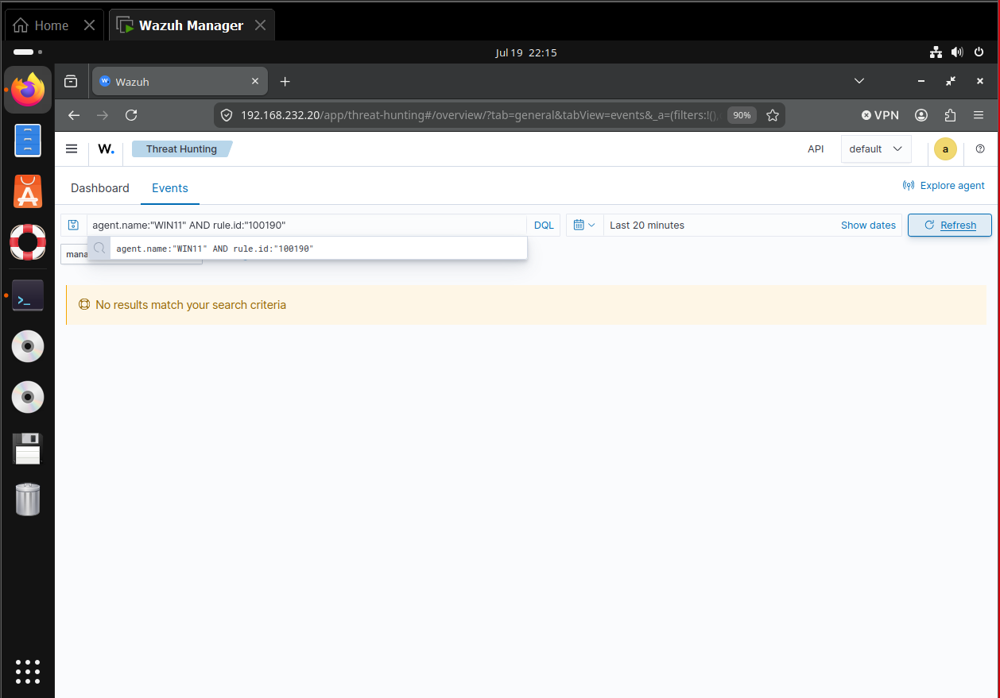

*Figure 13. Manager inspection showing rule `100208` as the winning path and motivating the child-rule correction.*

## Positive validation

Fresh post-correction activity produced two rule `100190` alerts.

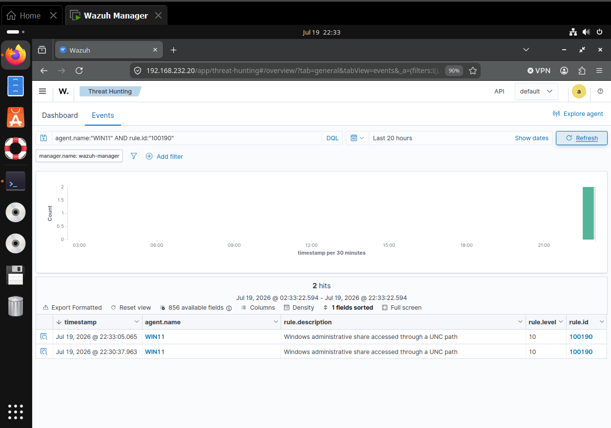

*Figure 14. Two level 10 alerts generated by rule `100190`.*

| Field | Observed value |
|---|---|
| Timestamp | `2026-07-19 22:33:05 EDT` |
| Rule | `100190` |
| Level | `10` |
| ATT&CK | `T1021.002 – SMB/Windows Admin Shares` |
| Tactic | Lateral Movement |
| Event | Sysmon Event ID `1`, record `23258` |
| Image | `C:\Windows\System32\cmd.exe` |
| Command | `cmd.exe /c "dir \\localhost\ADMIN$"` |
| Parent | `powershell.exe` |
| User | `CORP\Administrator` |
| Integrity | High |

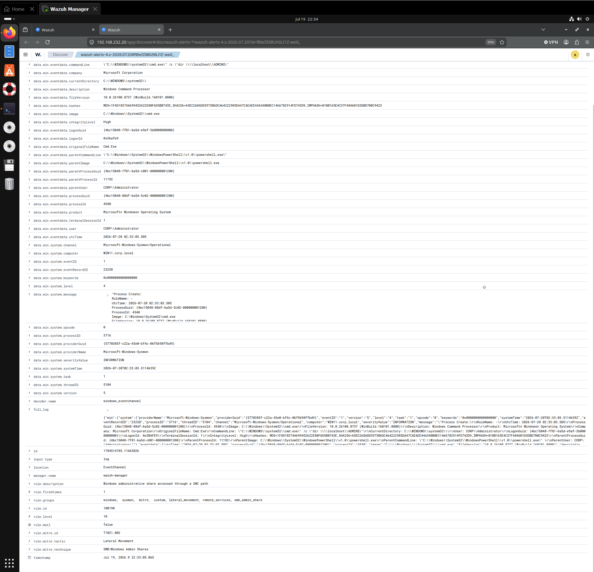

*Figure 15. Expanded alert showing process lineage, command line, and ATT&CK enrichment.*

## Negative control

The negative control used the same PowerShell-to-`cmd.exe` lineage but listed a local directory:

```powershell
cmd.exe /c 'dir C:\Windows'
```

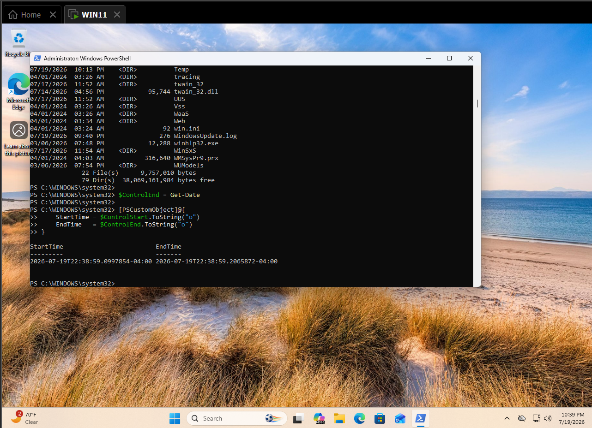

*Figure 16. Local-directory listing used as the negative control.*

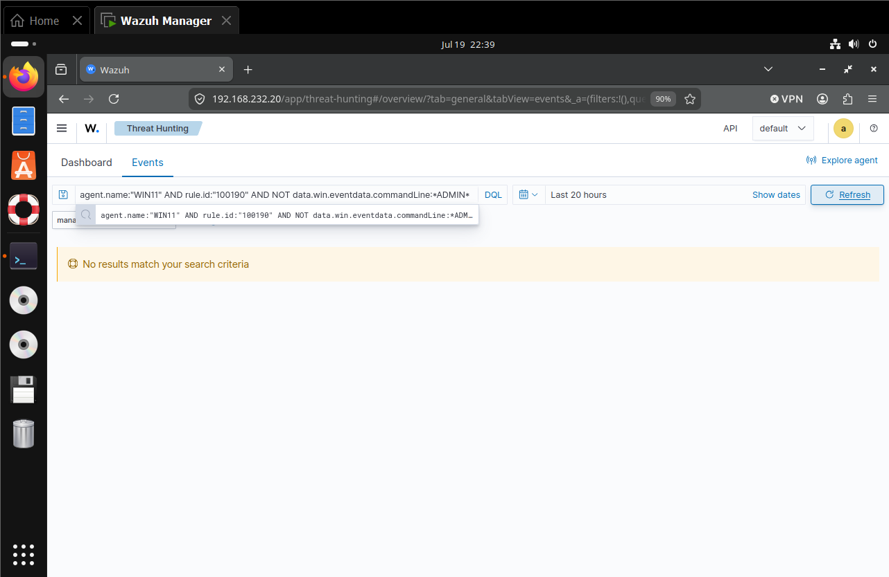

*Figure 17. No rule `100190` alert for the local-directory control.*

The result validates the tested administrative-share condition; it does not establish a production false-positive rate.

## False positives and triage

Legitimate administrative-share access may occur during:

- endpoint management and software deployment;
- backup and inventory operations;
- administrator troubleshooting;
- vulnerability scanning and compliance checks;
- incident response and authorized remote support;
- domain administration and maintenance automation.

Analysts should review the destination host, account, source system, parent process, authentication type, share accessed, files touched, execution frequency, and nearby remote-service activity. Higher-risk context includes unusual source hosts, new accounts, remote service creation, copied executables, PsExec artifacts, credential access, or rapid access across multiple systems.

## Engineering considerations

- Extend the rule that wins live evaluation rather than creating a competing standalone rule.
- Keep custom children with their active parent branch where rule order affects evaluation.
- Use Security Events `5140`/`5145` as supporting telemetry when enabled.
- Replace the broad `ADMIN` token with a fully validated UNC/admin-share expression before production deployment.
- Exclude known management systems only with narrow host, account, parent, and maintenance-window conditions.
- Test remote-host access, `C$`, `IPC$`, file copy, service execution, and alternate tools separately.
- Resolve duplicate custom rule IDs to make future parent-child behavior deterministic.

## Cleanup

The simulation created no files, services, shares, listeners, firewall rules, users, or persistent drive mappings. WinRM remained unchanged. The attempted removal of `\\localhost\ADMIN$` returned that no persistent network connection existed.

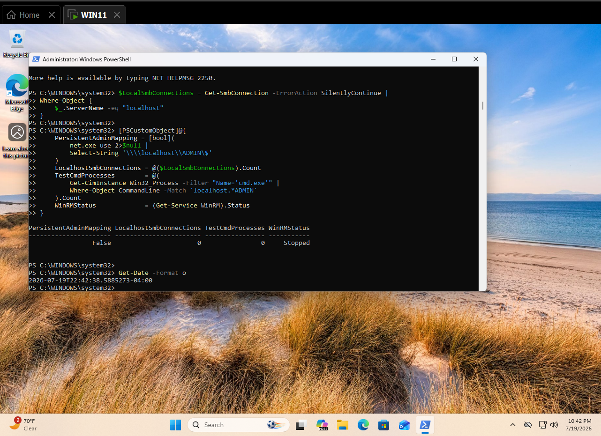

*Figure 19. Cleanup validation confirming no persistent administrative-share mapping or test process.*

## Timeline

All observed events occurred on July 19, 2026 in Eastern Daylight Time.

| Time | Source | Event | Interpretation |
|---|---|---|---|
| 21:54–21:59 | WIN11 | Readiness and WinRM checks | WinRM unavailable; no changes made |
| 22:01–22:02 | WIN11 | SMB readiness and initial ADMIN$ listing | Safe SMB path validated |
| 22:02 | Wazuh | Rule `100208` handled the command | T1021.002 detection gap identified |
| 22:13–22:29 | Manager | Parent, regex, and ordering corrections | Three troubleshooting iterations completed |
| 22:30:37 | Wazuh | First rule `100190` alert | Positive detection passed |
| 22:33:05 | Wazuh | Final rule `100190` alert, record `23258` | Portfolio evidence captured |
| 22:38:59 | WIN11 | Local-directory negative control | Precision test executed |
| 22:42 | WIN11 | Cleanup validation | No durable artifact observed |

## Findings

### 1. Existing services enabled a safer test

WinRM was unavailable, and the lab did not broaden the attack surface to enable it. The existing SMB service supported a bounded T1021.002 simulation.

### 2. Collection did not equal dedicated detection

The original event was present and promoted as command-shell execution under `100208`, but it lacked the SMB administrative-share classification.

### 3. Parent hierarchy and rule placement were decisive

The successful design extended the active `100208` branch and kept the child beside its parent.

### 4. Negative validation separated context from behavior

The same process lineage did not trigger `100190` when it listed a local path rather than an administrative share.

## Limitations

- The lab used `localhost`, not a second remote Windows host.
- It validated read-only directory listing, not file transfer or remote execution.
- The final regex intentionally matches `ADMIN` broadly inside the `100208` context and requires production hardening.
- Security Event IDs `5140` and `5145` were not the decisive detection source.
- Only one negative-control form was tested.
- Duplicate custom rule IDs remain elsewhere in the manager ruleset.

## Skills demonstrated

- safe remote-service test selection;
- Sysmon Event ID `1` investigation;
- Wazuh archive and alert comparison;
- process-lineage analysis;
- Wazuh parent-child rule engineering;
- PCRE2 troubleshooting;
- MITRE ATT&CK T1021.002 mapping;
- positive and negative validation;
- alert export and evidence-integrity verification;
- cleanup validation and technical documentation.

## Evidence inventory

| Artifact | Purpose |
|---|---|
| `01-remote-services-readiness.png` | Endpoint readiness |
| `02-t1021-available-subtechnique-tests.png` | Available Atomic sub-techniques |
| `03-winrm-test-and-prerequisites.png` | WinRM prerequisite review |
| `04-local-winrm-connectivity-test.png` | WinRM listener gap |
| `05-smb-admin-share-readiness.png` | SMB readiness |
| `06-benign-localhost-admin-share-access.png` | Initial positive simulation |
| `07-local-smb-and-sysmon-events.png` | Local telemetry |
| `08-wazuh-smb-admin-share-hunt.png` | Initial Wazuh hunt |
| `09-wazuh-smb-admin-share-hunt-details.png` | Decoded event details |
| `09-wazuh-smb-archive-validation.png` | Archive validation |
| `10-t1021-smb-rule-configuration.png` | Initial custom rule |
| `11-fresh-smb-admin-share-validation.png` | Fresh validation event |
| `12-positive-smb-admin-share-alert.png` | Not produced; intermediate test still failed |
| `13-smb-rule-troubleshooting.png` | Parent-rule diagnosis |
| `14-positive-smb-admin-share-alert.png` | Successful alerts |
| `15-smb-admin-share-alert-details.png` | Positive alert fields |
| `16-smb-negative-control-execution.png` | Negative-control execution |
| `17-smb-negative-control-no-alert.png` | No control alert |
| `18-positive-t1021-alert-json-verification.png` | Raw-alert verification |
| `18-positive-t1021-smb-rule-100190.json` | Machine-readable positive alert |
| `19-t1021-cleanup-validation.png` | Cleanup validation |

## Reproduction

The validated procedure is included in [`T1021.002-SMB-Admin-Shares-Lab-Runbook.md`](T1021.002-SMB-Admin-Shares-Lab-Runbook.md).

- [MITRE ATT&CK T1021.002 – SMB/Windows Admin Shares](https://attack.mitre.org/techniques/T1021/002/)
- [Atomic Red Team T1021.002 tests](https://github.com/redcanaryco/atomic-red-team/tree/master/atomics/T1021.002)
- [Microsoft Sysmon documentation](https://learn.microsoft.com/en-us/sysinternals/downloads/sysmon)
