# Detecting WMI-Spawned Command Execution with Sysmon and Wazuh

This lab confirmed that Wazuh can detect a command interpreter created through Windows Management Instrumentation (WMI), preserve the decisive `WmiPrvSE.exe` process lineage, and map the alert to MITRE ATT&CK `T1047 – Windows Management Instrumentation`.

## Result

The test produced a level 8 Wazuh alert under custom rule `100132`. The alert recorded `cmd.exe` as the child of `WmiPrvSE.exe`, retained the complete validation command, and included the T1047 mapping. A benign negative control launched `hostname.exe` through the same WMI method but did not trigger the elevated interpreter rule.

| Validation point | Observed result |
|---|---|
| Safe WMI process creation | Successful (`ReturnValue: 0`) |
| Marker file | Created and hashed |
| Endpoint telemetry | Sysmon Event ID `1` confirmed locally |
| Wazuh collection | Target telemetry found in `archives.json` |
| Initial dedicated alert | Not generated |
| Final custom detection | Rule `100132`, level `8` |
| ATT&CK mapping | `T1047`, Execution |
| Negative control | Collected, but no rule `100132` alert |

## Objective and hypothesis

The objective was to test whether Sysmon and Wazuh could identify a process created through WMI without relying on the deprecated `wmic.exe` utility. The hypothesis was that a local `Win32_Process.Create` request would cause `WmiPrvSE.exe` to create the requested process, producing Sysmon Process Create telemetry that could support a Wazuh detection.

The detection logic focused on behavior rather than a single utility name:

- source: Microsoft Sysmon;
- event: Process Create, Event ID `1`;
- parent: `WmiPrvSE.exe`;
- child: a command or script interpreter;
- result: an alert mapped to ATT&CK T1047.

## Lab environment

| Component | Observed value |
|---|---|
| Endpoint | `WIN11.corp.local` |
| Endpoint address | `192.168.232.134` |
| Wazuh agent | `WIN11`, agent `002` |
| Test account | `CORP\Administrator` |
| Wazuh manager | `wazuh-manager` |
| Wazuh version | `4.14.6` |
| Primary telemetry | `Microsoft-Windows-Sysmon/Operational` |
| Primary event | Sysmon Event ID `1` – Process Create |
| WMI method | `Win32_Process.Create` through `Invoke-CimMethod` |

Sysmon, the Wazuh agent, and Windows Management Instrumentation were running automatically before the test. Recent Sysmon events also confirmed that the local channel was active.

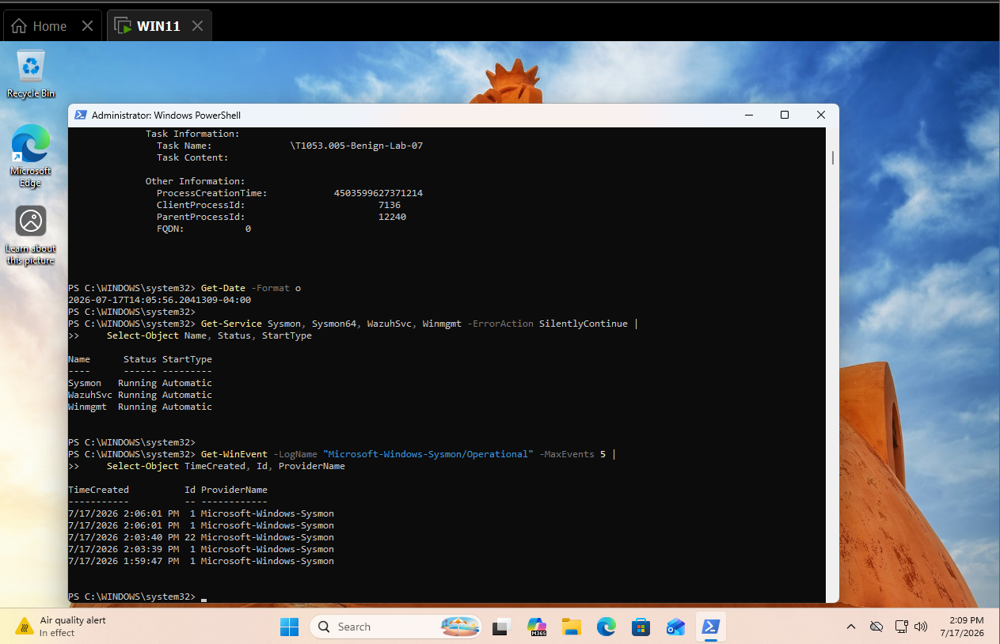

*Figure 1. Endpoint readiness verification, highlighting the running Sysmon, Wazuh, and Winmgmt services and recent Sysmon activity used to establish that the host was prepared for testing.*

## Safe simulation

The test was limited to the local Windows endpoint. It did not use remote credentials, create a remote CIM session, establish a permanent WMI subscription, download content, or change a security control. The positive simulation asked WMI to start `cmd.exe`, which wrote a benign text marker to `C:\ProgramData`.

```powershell
$Start = Get-Date
$Marker = "C:\ProgramData\T1047-WMI-marker.txt"
$Command = 'cmd.exe /c echo Benign T1047 WMI validation > C:\ProgramData\T1047-WMI-marker.txt'

$Result = Invoke-CimMethod `
    -Namespace root\cimv2 `
    -ClassName Win32_Process `
    -MethodName Create `
    -Arguments @{ CommandLine = $Command }

$Result | Format-List ReturnValue, ProcessId
```

The first attempt contained an input error because `$Start = Get-Date` was accidentally appended to the command string. PowerShell returned `Unexpected token '$Start'`. I corrected the command definition and reran it rather than treating the failed attempt as evidence. The corrected WMI request returned `ReturnValue: 0` and a process ID.

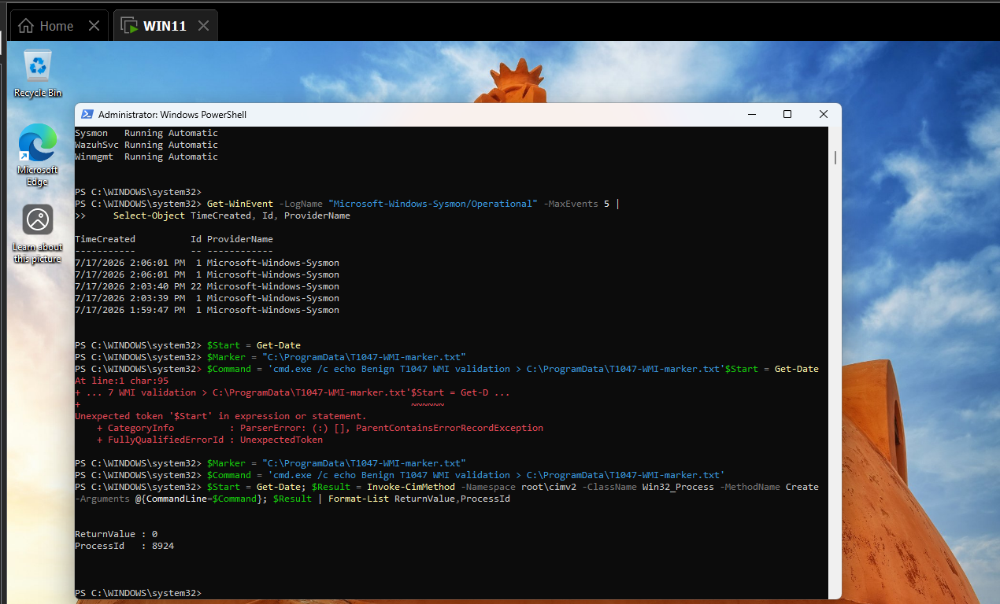

*Figure 2. Positive WMI simulation, showing the initial PowerShell parsing error followed by the corrected `Invoke-CimMethod` workflow and successful process creation response.*

The marker file contained `Benign T1047 WMI validation`. Its observed SHA-256 was:

```text
A33D0FDD48137EDD126DDB7461CC9434965187C8970241AEB924F1AADE813BD60
```

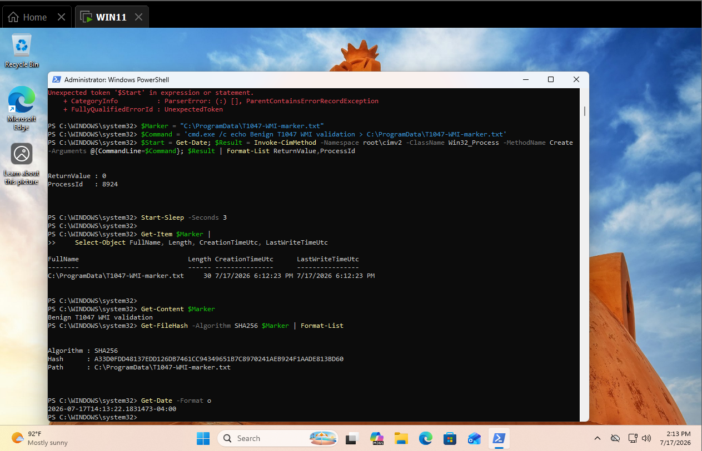

*Figure 3. Marker-file verification, highlighting the expected content, file metadata, and SHA-256 value that proved the WMI-spawned command completed its benign action.*

## Endpoint telemetry

Sysmon recorded the activity as Event ID `1`. The local event showed:

| Field | Observed value |
|---|---|
| Provider | `Microsoft-Windows-Sysmon` |
| Event ID | `1` |
| Image | `C:\Windows\System32\cmd.exe` |
| Command line | Contains `T1047-WMI-marker.txt` |
| Parent image | `C:\Windows\System32\wbem\WmiPrvSE.exe` |
| Parent command line | `wmiprvse.exe -secured -Embedding` |
| User | `CORP\Administrator` |
| Parent user | `NT AUTHORITY\NETWORK SERVICE` |
| Integrity level | `High` |

The decisive signal was the parent-child relationship. The event established that the WMI provider host created `cmd.exe`; the marker command then supplied the activity-specific context.

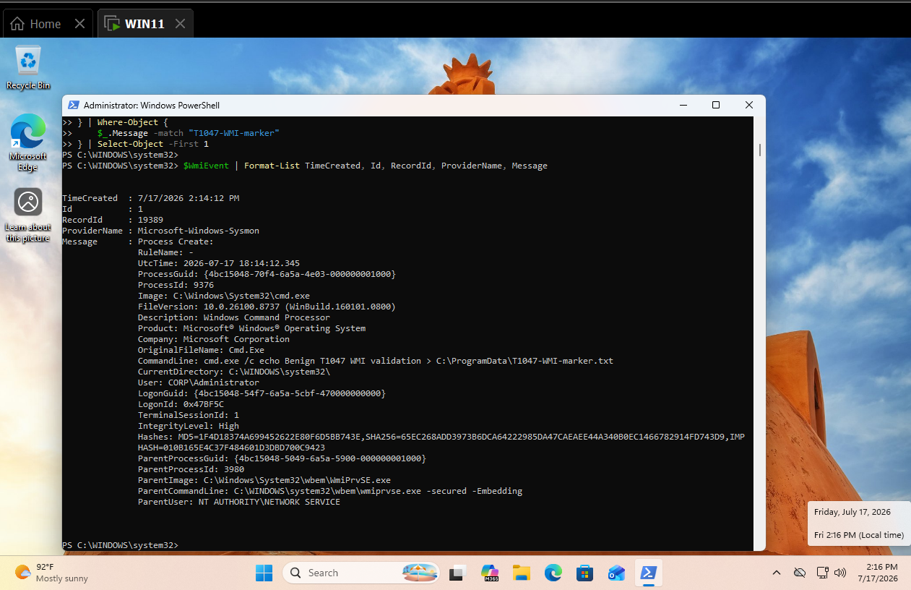

*Figure 4. Local Sysmon Process Create evidence, highlighting `cmd.exe`, the marker command, high-integrity user context, and `WmiPrvSE.exe` as the parent process.*

## Wazuh hunt and collection validation

The initial hunt used progressive DQL queries. Each query had a different purpose; none was treated as a dedicated detection merely because it returned telemetry.

| Query | Purpose | Observed result |
|---|---|---|
| `agent.name:"WIN11"` | Confirm recent endpoint alerts | Returned broad endpoint activity, including generic process events |
| `agent.name:"WIN11" AND data.win.system.eventID:"1"` | Narrow to Process Create alerts | Returned a visible Event ID 1 alert, but not the target WMI event |
| `agent.name:"WIN11" AND data.win.eventdata.parentImage:*WmiPrvSE.exe` | Find WMI-created processes | No target result in the alert view before custom detection |
| `agent.name:"WIN11" AND data.win.eventdata.commandLine:*T1047-WMI-marker*` | Find the distinctive command | No target result in the alert view before custom detection |
| `agent.name:"WIN11" AND data.win.eventdata.parentImage:*WmiPrvSE.exe AND data.win.eventdata.commandLine:*T1047-WMI-marker*` | Correlate lineage and command | No target result in the alert view before custom detection |

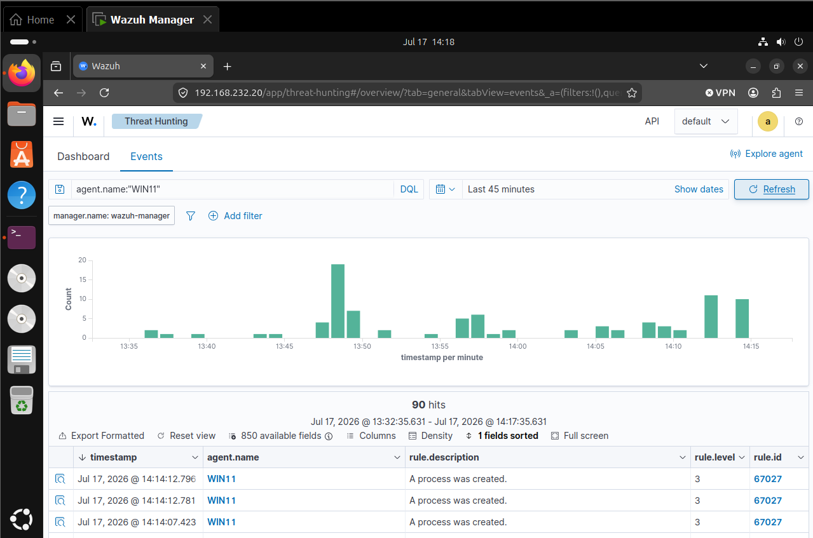

*Figure 5. Initial Wazuh hunt for `WIN11`, showing broad alert activity and demonstrating why the search needed to be narrowed by event type and process context.*

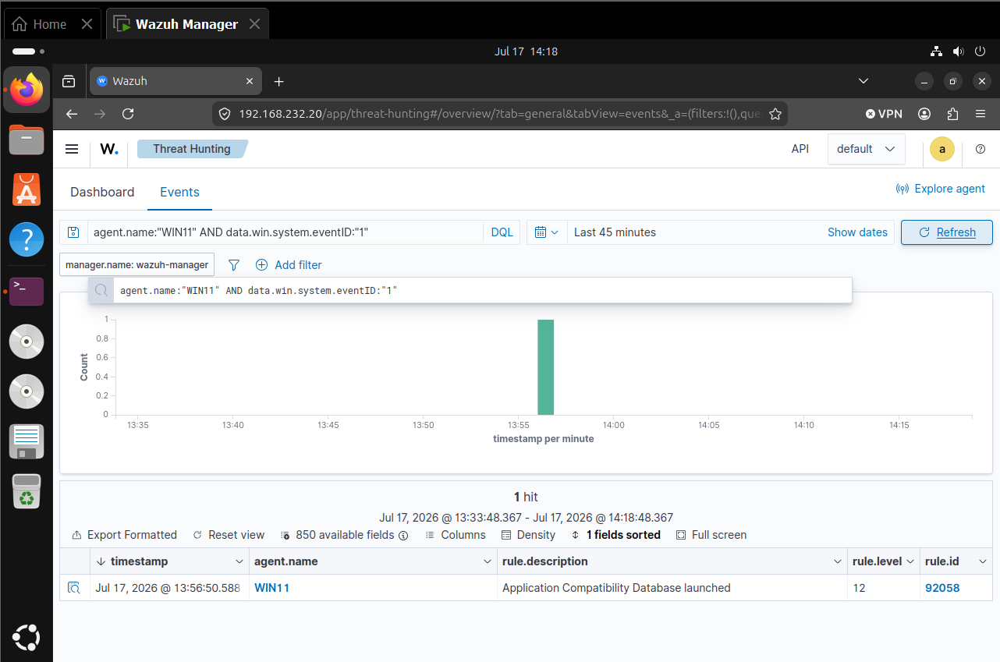

*Figure 6. Process Create alert query, showing that the alert-focused view did not expose the target WMI event at this stage even though other Event ID 1 activity was present.*

### Collection was not the same as detection

The Wazuh manager archive contained the target Sysmon event, but the alert file did not contain a corresponding dedicated WMI alert. This separated two different results:

- **collection succeeded:** the endpoint event reached the manager and was written to `archives.json`;
- **detection had not succeeded:** the existing rules did not elevate that event into the alert index with a T1047 analytic.

The archive search also revealed a useful troubleshooting trap. Searching only for the marker string could return PowerShell Script Block Logging events generated by the analyst's own hunt command. Those events contained the marker as search text, but they were not the WMI-spawned process. Adding provider, Event ID, and parent-image filters was necessary to isolate the real Sysmon event.

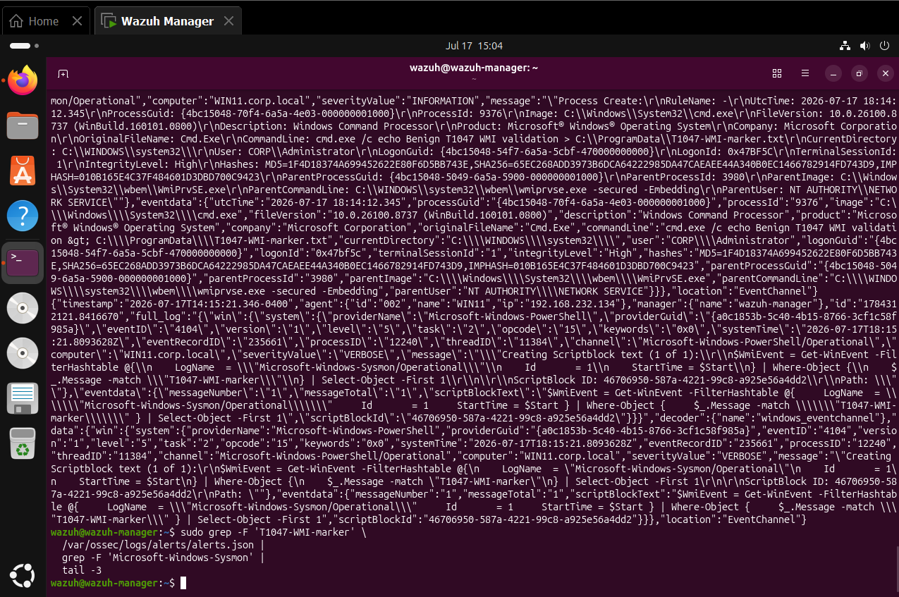

*Figure 7. Wazuh manager archive evidence, demonstrating that the target data was collected while the matching alert search remained empty and illustrating why collection and detection must be reported separately.*

## Troubleshooting and detection engineering

The final detection required several iterations. Preserving those steps is useful because the failure modes were part of the engineering work, not noise to remove from the case study.

| Step | Observation | Action | Result |
|---|---|---|---|
| 1 | The original PowerShell input produced a parser error | Re-entered the variable and command definitions separately | WMI request completed successfully |
| 2 | Local Sysmon contained the correct Event ID 1 | Searched Wazuh alerts for the same process context | Target was not visible as an alert |
| 3 | `archives.json` contained the target event | Compared archive and alert output | Confirmed an analytic gap rather than a collection failure |
| 4 | Marker-only searches also found PowerShell 4104 hunt activity | Filtered by Sysmon provider, Event ID `1`, and `WmiPrvSE.exe` parentage | Isolated the correct process event |
| 5 | Replaying extracted `full_log` through `wazuh-logtest` decoded it as generic `json` | Compared the replay path with the live `windows_eventchannel` decoder | Treated replay as non-authoritative for the live rule path |
| 6 | Initial chained and standalone rules did not fire | Inspected the built-in Sysmon rule tree and found WMI parent rule `92069` | Attached rule `100132` to the branch that already established `WmiPrvSE.exe` parentage |
| 7 | The ruleset test displayed duplicate IDs `100201`–`100210` and missing unrelated Sysmon groups | Recorded the warnings separately | No T1047 rule syntax error was shown; existing ruleset hygiene remained a separate issue |
| 8 | A positive interpreter alert needed a false-positive check | Launched `hostname.exe` through the same WMI method | Event was collected, but elevated rule `100132` did not fire |

The configuration test showed pre-existing warnings involving unrelated local rules. They were not presented as the cause of the T1047 issue because the evidence did not establish that relationship.

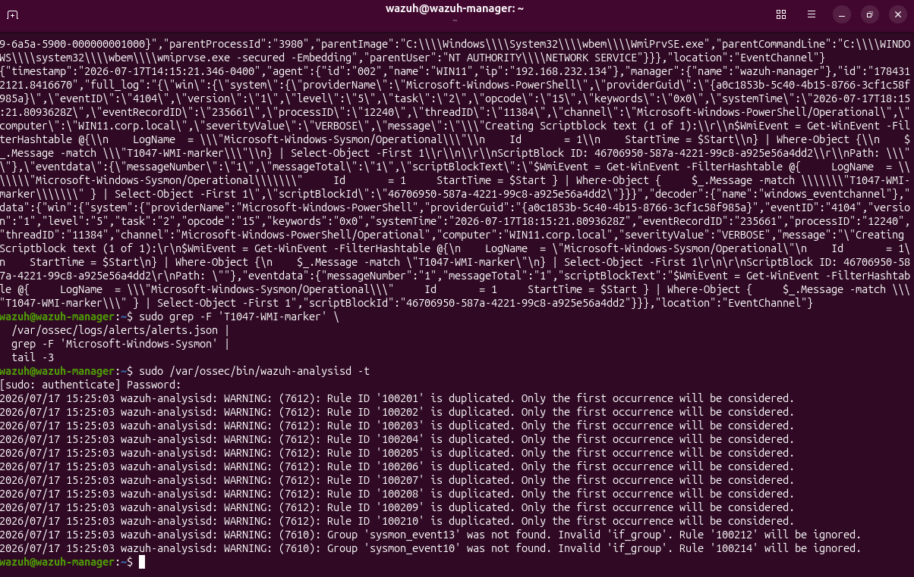

*Figure 8. Wazuh rule validation output, recording duplicate-ID and missing-group warnings in other local rules while showing no visible syntax error tied to the T1047 rule IDs.*

### Initial rule design

The first design separated baseline WMI lineage and interpreter execution into rules `100130` and `100131`. The child rule depended on the baseline rule through `if_sid`. Although this was logically readable, it did not generate the expected live alert in this environment.

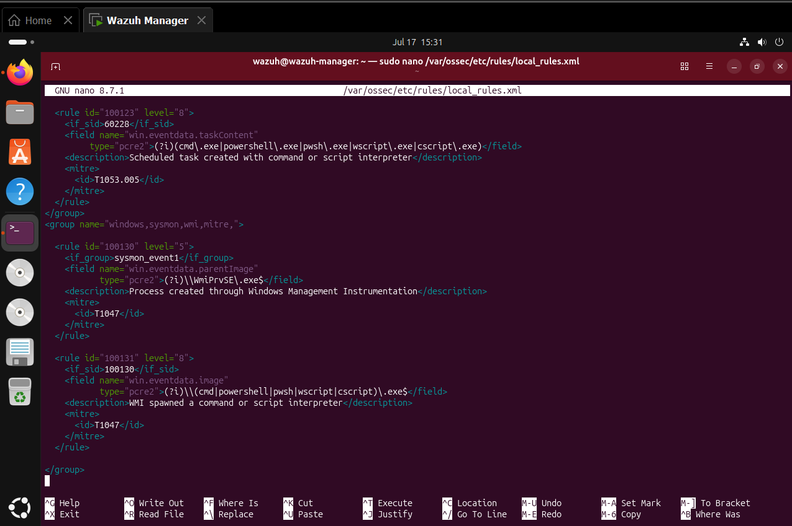

*Figure 9. Initial chained rule design using rules `100130` and `100131`, documenting the configuration that was tested but did not produce the final alert.*

### Final rule and winning rule branch

The decisive troubleshooting result was the built-in hierarchy:

```text
61603 — Sysmon Event ID 1
└── 92069 — WmiPrvSE.exe created a process (level 0)
    ├── 92070 — WMI created PowerShell
    └── 100132 — WMI created cmd.exe (custom level 8)
```

Rule `92069` already established the WMI parent-child relationship but remained silent at level 0. Its existing child covered PowerShell only. The final rule therefore extends `92069` and adds the missing `Cmd.Exe` case:

```xml
<group name="windows,sysmon,wmi,mitre,">

  <rule id="100132" level="8">
    <if_sid>92069</if_sid>
    <field name="win.eventdata.originalFileName"
           type="pcre2">(?i)^Cmd\.Exe$</field>
    <description>WMI spawned a command or script interpreter</description>
    <mitre>
      <id>T1047</id>
    </mitre>
  </rule>

</group>
```

This design avoids duplicating provider, event-ID, and parent-image conditions already proven by `92069`. It does not assert that every match is malicious; it elevates a WMI-created command interpreter for review while leaving native controls such as `hostname.exe` unalerted by `100132`.

## Positive validation

Fresh activity was generated after the rule change because Wazuh rules do not retroactively reprocess old events. The final search returned three rule `100132` alerts. The exported event used for the case study occurred at `2026-07-17 17:47:14 EDT` and contained the following decisive fields:

| Field | Observed value |
|---|---|
| Rule | `100132` |
| Level | `8` |
| Description | `WMI spawned a command or script interpreter` |
| Agent | `WIN11` (`002`) |
| Decoder | `windows_eventchannel` |
| Event ID | `1` |
| Event record ID | `20023` |
| Image | `C:\Windows\System32\cmd.exe` |
| Command line | `cmd.exe /c echo Benign T1047 validation 18 > C:\ProgramData\T1047-WMI-validation-18.txt` |
| Parent image | `C:\Windows\System32\wbem\WmiPrvSE.exe` |
| Parent command line | `wmiprvse.exe -secured -Embedding` |
| Process ID | `9900` |
| Parent process ID | `3980` |
| User | `CORP\Administrator` |
| Parent user | `NT AUTHORITY\NETWORK SERVICE` |
| Integrity level | `High` |
| SHA-256 | `65EC268ADD3973B6DCA64222985DA47CAEAEE44A340B0EC1466782914FD743D9` |

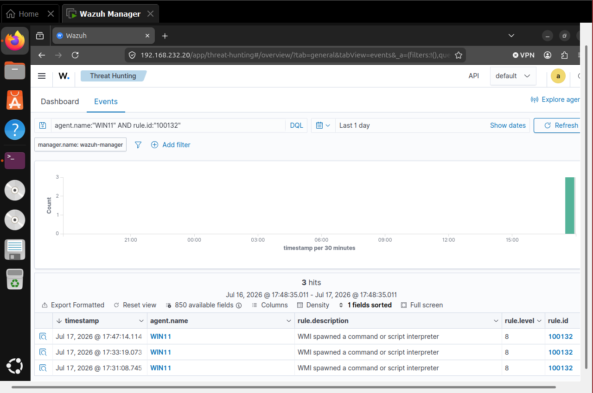

*Figure 10. Positive Wazuh detection validation, highlighting three level 8 alerts generated by rule `100132` after fresh WMI-spawned command activity.*

The complete exported alert is preserved as [`evidence/13-positive-wmi-alert-rule-100132.json`](evidence/13-positive-wmi-alert-rule-100132.json).

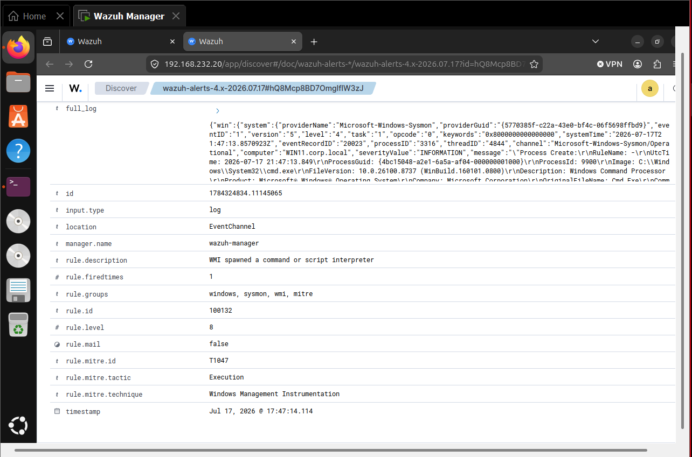

*Figure 11. Alert detail view, highlighting rule `100132`, level `8`, MITRE ATT&CK ID `T1047`, the Execution tactic, and the Windows Management Instrumentation technique name.*

## Negative control

The negative control used the same local `Win32_Process.Create` method to start `hostname.exe`. This preserved the WMI parentage while removing the command-interpreter condition.

The archive record showed:

| Field | Observed value |
|---|---|
| Timestamp | `2026-07-17 17:53:00.769 EDT` |
| Event ID | `1` |
| Image | `C:\Windows\System32\HOSTNAME.EXE` |
| Parent image | `C:\Windows\System32\wbem\WmiPrvSE.exe` |
| Process ID | `10784` |

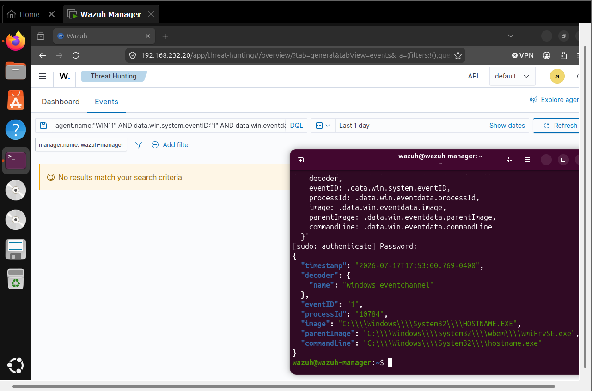

*Figure 12. Negative-control archive evidence, showing that WMI-created `hostname.exe` telemetry was collected with `WmiPrvSE.exe` parentage.*

The elevated-rule search was:

```text
agent.name:"WIN11" AND rule.id:"100132" AND data.win.eventdata.image:*hostname.exe
```

It returned no results. This demonstrates that the tested rule distinguished the non-interpreter control from the configured interpreter set. It does not establish a false-positive rate outside this controlled lab.

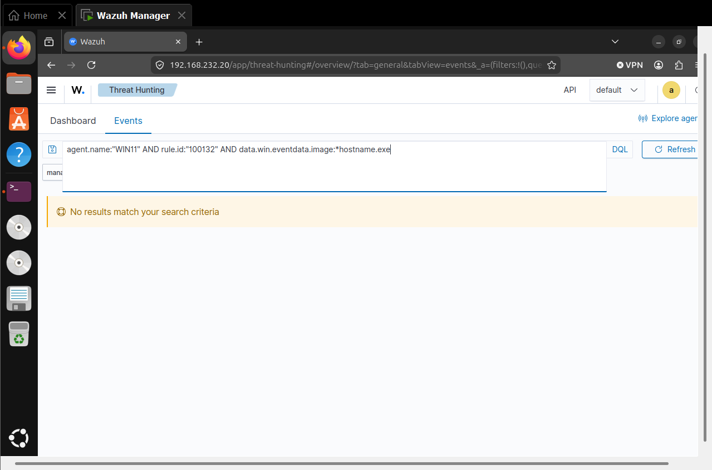

*Figure 13. Negative-control validation, showing no elevated rule `100132` result for `hostname.exe` and demonstrating the tested image filter worked as intended.*

## Timeline

All times below are normalized to Eastern Daylight Time (`UTC-04:00`) on July 17, 2026.

| Time | Source | Event | Evidence | Interpretation |
|---|---|---|---|---|
| 14:05:56 | WIN11 | Services and recent Sysmon events verified | Figure 1 | Endpoint was ready for testing |
| 14:13:22 | PowerShell/WMI | Marker content and SHA-256 verified | Figures 2–3 | Corrected WMI request executed successfully |
| 14:14:12 | Sysmon | Event ID 1 recorded for the marker command | Figure 4 | Local telemetry preserved WMI lineage |
| 15:04 | Wazuh manager | Target event located in `archives.json` | Figure 7 | Collection succeeded without a dedicated alert |
| 15:25 | Wazuh manager | Ruleset validation warnings reviewed | Figure 8 | Existing unrelated rule hygiene issues were documented |
| 15:31 | Wazuh manager | Initial chained rule design inspected | Figure 9 | First design did not produce the expected alert |
| 17:31:08 | Wazuh | Rule `100132` alert observed | Figure 10 | Direct rule began producing positive results |
| 17:33:19 | Wazuh | Second rule `100132` alert observed | Figure 10 | Positive result was repeatable |
| 17:47:14 | Wazuh | Exported positive rule `100132` alert | Figures 10–11 and JSON | Detection and ATT&CK mapping confirmed |
| 17:53:00 | Sysmon/Wazuh archive | `hostname.exe` negative control collected | Figure 12 | Same WMI path produced non-interpreter telemetry |
| 17:55 | Wazuh | No rule `100132` result for control | Figure 13 | Elevated image condition rejected the tested control |
| 17:57 | WIN11 | Listed test artifacts checked after cleanup | Figure 14 | The displayed marker paths were absent |

## MITRE ATT&CK mapping

| Field | Value |
|---|---|
| Technique | `T1047 – Windows Management Instrumentation` |
| Tactic | Execution |
| Observed behavior | `Win32_Process.Create` caused `WmiPrvSE.exe` to create `cmd.exe` |
| Primary evidence | Sysmon Event ID `1` with `WmiPrvSE.exe` as parent and `cmd.exe` as child |
| Supporting evidence | WMI return value, marker file, complete Wazuh alert, and negative control |
| Rationale | The event directly recorded process execution through the WMI provider host |

The mapping applies to the WMI execution behavior. `cmd.exe` supplied the benign payload but was not used to claim an additional technique in this case study.

## Findings

### 1. Telemetry collection succeeded before dedicated detection

The target Sysmon record existed locally and in the Wazuh archive. The alert view did not initially surface it as a T1047 result. This proved the collection path was working and narrowed the problem to rule evaluation and alert generation.

### 2. Parent-child lineage was the strongest analytic signal

The combination of `WmiPrvSE.exe` as parent and a command or script interpreter as child was more reliable for this test than looking for `wmic.exe`. The simulation used PowerShell CIM cmdlets, so a utility-name-only analytic would have missed the behavior.

### 3. Extending the winning built-in branch succeeded

Rule `100132` inherited from built-in rule `92069`, matched `Cmd.Exe`, and generated repeatable level 8 alerts. The exported JSON retained the process image, command line, parent image, user, integrity level, hashes, and ATT&CK fields needed for triage.

### 4. The tested negative control did not generate an elevated alert

`hostname.exe` was created through WMI and collected, but it did not match rule `100132`. This supported the configured child-image condition without implying that every non-interpreter WMI child is benign.

## False positives and triage

### Strengths

- detects WMI-created interpreters without depending on `wmic.exe`;
- uses Sysmon process lineage and live EventChannel fields;
- retains command line, user, integrity, process identifiers, and hashes;
- provides an ATT&CK-mapped alert suitable for triage and correlation.

### Expected false positives

Legitimate management platforms, software deployment systems, monitoring tools, security products, support utilities, and administrator scripts can create processes through WMI. A match is a review signal, not proof of malicious intent.

### Recommended improvements

- baseline known WMI-spawned child processes, accounts, and management servers;
- raise severity for encoded commands, user-writable execution paths, downloads, or unexpected privileged users;
- correlate with WMI Activity Operational events and remote-authentication telemetry;
- add time-bound allowlists for approved management tools instead of suppressing all WMI parentage;
- repair the unrelated duplicate local rule IDs and invalid Sysmon group references reported by `wazuh-analysisd`;
- add automated rule tests that replay representative positive and negative events through the same decoding path used in production.

## Limitations

- The lab tested local WMI execution only. It did not validate remote WMI, lateral movement, or network authentication.
- The negative control covered one child image, `hostname.exe`; broader environmental tuning still requires normal-activity baselining.
- Alert-view behavior reflects this Wazuh configuration, time range, and enabled indexes. Archive evidence was required to prove collection during troubleshooting.
- `wazuh-logtest` decoded the extracted replay as generic JSON, while the live event used `windows_eventchannel`; conclusions about the final rule are therefore based on fresh live alerts, not the replay alone.
- The cleanup screenshot confirms that the listed marker paths through `T1047-WMI-validation-04.txt` were absent. It does not independently demonstrate removal of `T1047-WMI-validation-18.txt`, the path referenced by the final exported alert.


*Figure 14. Cleanup validation, showing `False` for the displayed test-artifact paths and documenting exactly which local files were independently checked.*

## Evidence inventory

| Artifact | Purpose |
|---|---|
| `01-readiness-verification.png` | Endpoint and telemetry readiness |
| `02-wmi-positive-simulation.png` | Initial command correction and successful WMI request |
| `03-marker-file-and-hash.png` | Execution output and file integrity evidence |
| `04-sysmon-telemetry.png` | Local Process Create lineage |
| `05-wazuh-query-1.png` | Broad agent hunt |
| `06-wazuh-query-2.png` | Initial Event ID 1 alert hunt |
| `07-wazuh-archive-collection-confirmed.png` | Collection-versus-detection gap |
| `08-wmi-rule-validation.png` | Ruleset validation and unrelated warnings |
| `09-custom-wmi-rule-configuration.png` | Initial unsuccessful chained design |
| `10-positive-wmi-alert.png` | Positive rule `100132` results |
| `11-wmi-mitre-mapping.png` | ATT&CK fields in the alert |
| `12-negative-control-baseline.png` | Collected `hostname.exe` control event |
| `13-negative-control-no-elevated-alert.png` | No elevated alert for the control |
| `13-positive-wmi-alert-rule-100132.json` | Complete positive alert record |
| `14-cleanup-validation.png` | Displayed artifact-removal checks |

## Reproduction

The original lab procedure is included in [`T1047-WMI-Lab-Runbook.md`](T1047-WMI-Lab-Runbook.md). The runbook records the initial planned two-rule design; the final implemented rule and troubleshooting outcome are documented in this README.

- [MITRE ATT&CK T1047 – Windows Management Instrumentation](https://attack.mitre.org/techniques/T1047/)
- [Microsoft Win32_Process Create method](https://learn.microsoft.com/en-us/windows/win32/cimwin32prov/create-method-in-class-win32-process)

## Engineering considerations

Keep the analytic scoped to stable event fields and behavior-specific indicators. Revalidate after changes to Sysmon, Wazuh decoders, local rules, endpoint policy, or index mappings.

## Cleanup

No cleanup transcript was preserved for this earlier case study. Before rerunning, verify that test artifacts from the documented simulation are absent; remove only the explicitly named benign artifacts created by the test.
