# MITRE ATT&CK Detection Engineering Case Study

**Portfolio:** Security Engineering Portfolio  
**Project:** Active Directory Attack & Defense Lab  
**Case Study:** 04  
**Technique:** T1053.005  
**Technique Name:** Scheduled Task/Job: Scheduled Task  
**Tactics:** Execution, Persistence, Privilege Escalation  
**Status:** Completed  
**Date:** 2026-07-17  
**Author:** Josh Carroll

## 1. Executive Summary

This case study validates the ability of Windows Security auditing, Sysmon, and Wazuh to identify scheduled-task creation on the domain-joined WIN11 endpoint and distinguish a task containing a command interpreter from a direct native-executable task.

A controlled simulation created a one-time scheduled task that ran `cmd.exe` as `SYSTEM` and wrote a benign marker file. Windows recorded the creation as Security Event ID 4698, including the task name, author, run account, trigger, action, process identifiers, and complete task XML. Sysmon supplied supporting process-creation telemetry, and Wazuh collected the Windows event.

The initial Wazuh event used built-in rule `60228`, level 4, with the broader `T1053 – Scheduled Task/Job` mapping. Detection engineering refined that rule to level 5 and `T1053.005`, then added rule `100123` to raise the alert to level 8 when the task XML contained a command or script interpreter. A new positive test generated rule `100123` with the correct ATT&CK mapping. A negative-control task using `hostname.exe` generated only the level-5 baseline rule and did not trigger the elevated analytic.

**Final result:** Scheduled-task creation was collected, detected, mapped to T1053.005, and validated with both positive and negative controls.

## 2. MITRE ATT&CK Information

| Field | Value |
|---|---|
| Technique | `T1053.005 – Scheduled Task/Job: Scheduled Task` |
| Tactics | Execution, Persistence, Privilege Escalation |
| Platform | Windows |
| Observed behavior | An administrator created a scheduled task configured to run a command interpreter as `SYSTEM`. |
| Primary evidence | Windows Security Event ID 4698 and the decoded task XML in Wazuh |
| Mapping rationale | Windows Task Scheduler was used to define future command execution under a specified security context. |
| Reference | https://attack.mitre.org/techniques/T1053/005/ |

The mapping describes the mechanism demonstrated in the lab. The benign marker command did not establish malicious intent, compromise, or an adversary-controlled persistence channel.

## 3. Objective and Detection Hypothesis

The objective was to determine whether the lab could:

1. Audit scheduled-task creation on WIN11.
2. Preserve the task definition and creator context.
3. Collect the event in Wazuh.
4. Map the event to the specific Scheduled Task sub-technique.
5. Raise severity when the task action used a command or scripting interpreter.
6. Avoid raising the same severity for a direct native-executable control task.
7. Remove all test artifacts and verify task deletion locally.

**Hypothesis:** If an administrator creates a scheduled task while the **Audit Other Object Access Events** success policy is enabled, Windows should generate Event ID 4698. Wazuh should detect the creation, and the higher-severity rule should fire only when `taskContent` contains a configured interpreter.

## 4. Lab Environment

| Component | Observed value |
|---|---|
| Endpoint | WIN11 |
| Endpoint FQDN | WIN11.corp.local |
| Domain | CORP |
| Administrative user | CORP\Administrator |
| Scheduled-task run account | `S-1-5-18` (`SYSTEM`) |
| Operating system | Windows 11 |
| Windows event source | Microsoft-Windows-Security-Auditing |
| Sysmon event source | Microsoft-Windows-Sysmon |
| Wazuh agent | 002 / WIN11 |
| Wazuh manager | 192.168.232.20 |
| Wazuh version | 4.14.6 |
| Primary event | Security Event ID 4698 |
| Cleanup event | Security Event ID 4699 |

The initial check confirmed that Task Scheduler, Sysmon, and the Wazuh agent were running automatically and that recent Sysmon telemetry was available. It also found that **Other Object Access Events** was initially set to `No Auditing`, which would prevent Event IDs 4698 and 4699 from being generated.

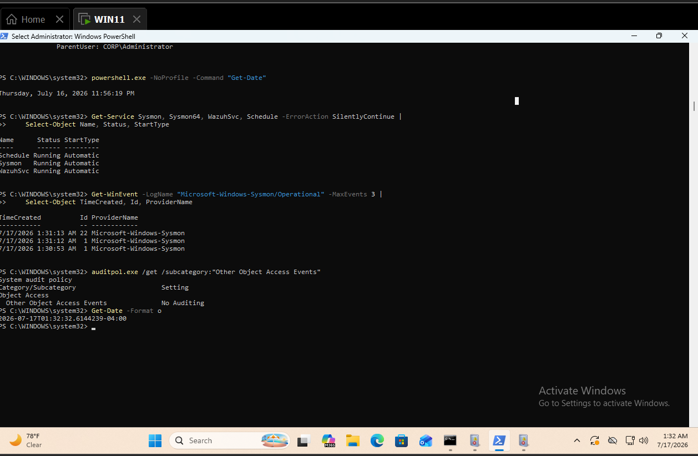

*Figure 1. Endpoint readiness checks, highlighting running Task Scheduler, Sysmon, and Wazuh services, recent Sysmon telemetry, and the initial `No Auditing` setting that had to be corrected before testing.*

## 5. Safe Simulation

Success auditing was enabled for the required subcategory:

```powershell
auditpol.exe /set /subcategory:"Other Object Access Events" /success:enable
```

The original test task used the following values:

```powershell
$TaskName = "T1053.005-Benign-Lab"
$Marker = "C:\ProgramData\T1053.005-scheduled-task-marker.txt"
$StartTime = (Get-Date).AddMinutes(5).ToString("HH:mm")
$TaskCommand = 'cmd.exe /c echo Benign T1053.005 validation %DATE% %TIME% > "C:\ProgramData\T1053.005-scheduled-task-marker.txt"'

schtasks.exe /Create `
  /TN $TaskName `
  /TR $TaskCommand `
  /SC ONCE `
  /ST $StartTime `
  /RU SYSTEM `
  /RL HIGHEST `
  /F
```

The action was local and benign. It did not download content, contact an external system, change privileges, or modify security controls.

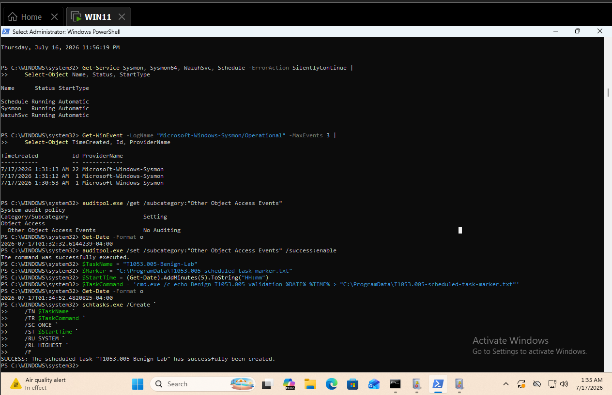

*Figure 2. Safe simulation setup, showing success auditing enabled and the `T1053.005-Benign-Lab` task created to execute a local marker-file command as `SYSTEM`.*

The task was run on demand. The marker file was created at `2026-07-17 01:36:20 EDT`, and its contents recorded the benign validation time. The observed SHA-256 was:

```text
64FD40388DC54A8AAE6CFEF2E6139C8B70CAEA6E5BB02A9DD98957FB9658F038
```

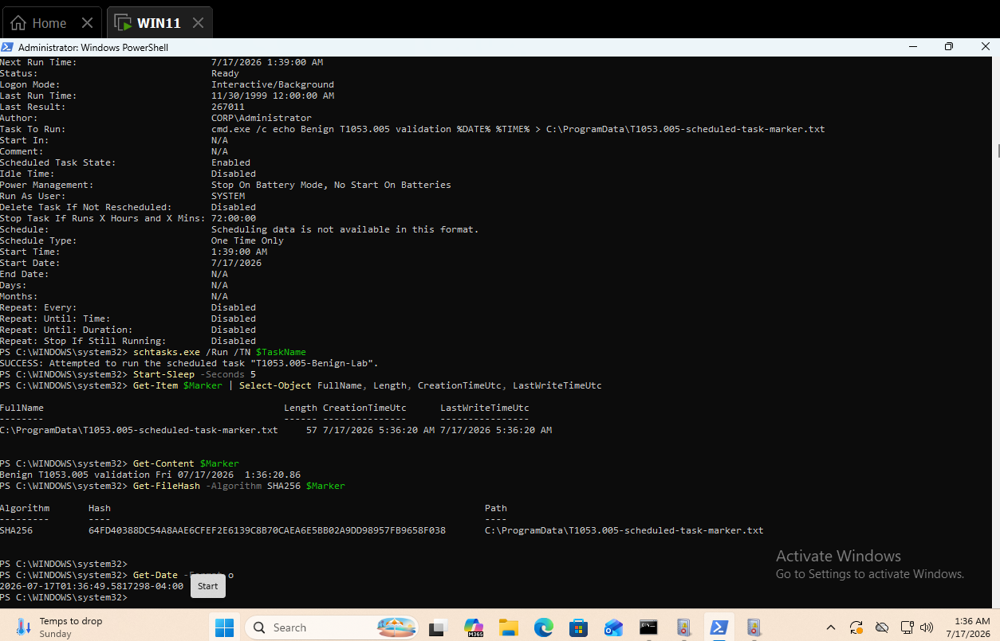

*Figure 3. Successful task execution, highlighting the task action, marker-file creation, validation text, and SHA-256 used to confirm that the scheduled action ran.*

## 6. Endpoint Evidence

Windows generated Event ID 4698 at `2026-07-17 01:35:14 EDT` for the original task. The event established:

| Field | Observed value |
|---|---|
| Provider | Microsoft-Windows-Security-Auditing |
| Event ID | 4698 |
| Event Record ID | 261971 |
| Task name | `\T1053.005-Benign-Lab` |
| Author | CORP\Administrator |
| Run level | HighestAvailable |
| Run account | `S-1-5-18` (`SYSTEM`) |
| Action | `cmd.exe` |
| Arguments | Marker-file validation command |
| Client process ID | 10340 |
| Parent process ID | 2640 |

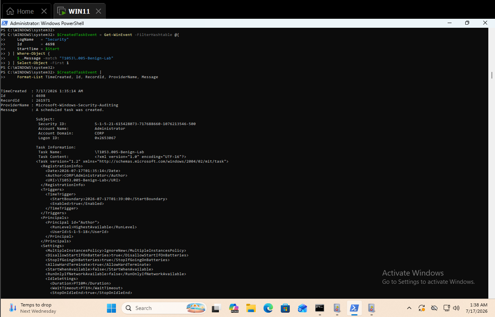

*Figure 4. Local Windows Security Event ID 4698, showing the task name, creator account, task XML, trigger, principal, and high-privilege run context.*

Sysmon also recorded supporting Event ID 1 activity around task creation and execution. This telemetry supported process-oriented hunting but did not replace Event ID 4698 as the decisive source for the registered task definition.

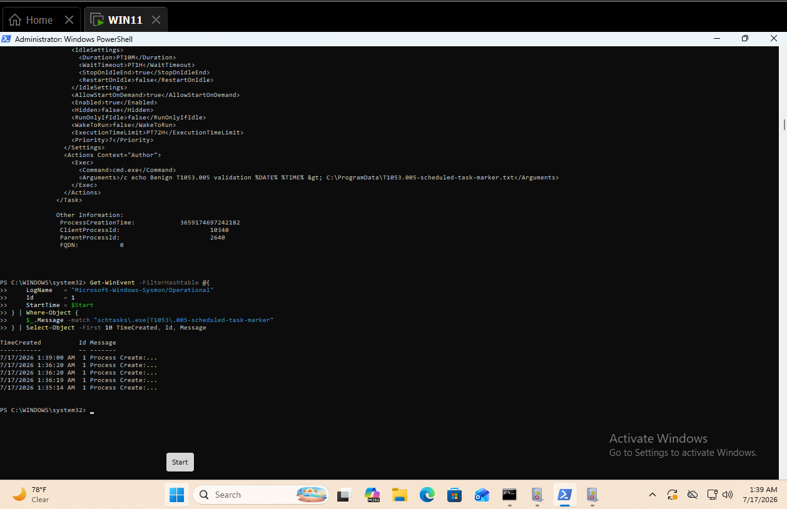

*Figure 5. Supporting endpoint telemetry, showing the `cmd.exe` action in the task XML and nearby Sysmon Process Create events available for process-level investigation.*

## 7. Threat-Hunting Methodology

The hunt narrowed from general endpoint activity to the decisive task and command fields.

| Query | Purpose | Observed result |
|---|---|---|
| `agent.name:"WIN11"` | Confirm active endpoint ingestion | 236 events during the displayed window. |
| `agent.name:"WIN11" AND data.win.system.eventID:"4698"` | Locate scheduled-task creation events | Three Event ID 4698 alerts in the initial window. |
| `agent.name:"WIN11" AND data.win.system.eventID:"4698" AND data.win.eventdata.taskName:*T1053.005-Benign-Lab*` | Isolate the exact original simulation | One matching scheduled-task event. |
| `agent.name:"WIN11" AND data.win.system.eventID:"1" AND data.win.eventdata.image:*schtasks.exe` | Look for the creation utility in Sysmon telemetry | No results in the captured query window. |
| `agent.name:"WIN11" AND data.win.eventdata.commandLine:*T1053.005-scheduled-task-marker*` | Locate command execution tied to the marker | Two `Windows Command Shell launched` alerts under rule `100101`. |
| `agent.name:"WIN11" AND rule.id:"100123"` | Validate the final elevated analytic | One level-8 scheduled-task alert. |
| `agent.name:"WIN11" AND rule.id:"60228" AND data.win.eventdata.taskName:*T1053.005-Benign-Control*` | Validate baseline handling of the control | One level-5 baseline alert. |
| `agent.name:"WIN11" AND rule.id:"100123" AND data.win.eventdata.taskName:*T1053.005-Benign-Control*` | Confirm the control did not receive elevated severity | No results. |

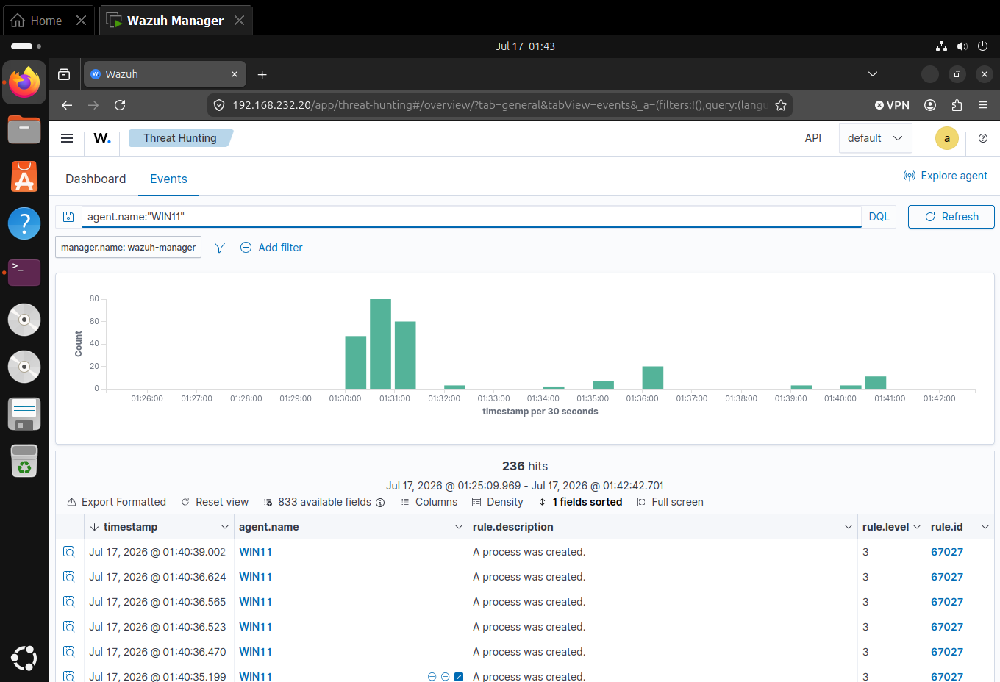

*Figure 6. Broad Wazuh endpoint query, demonstrating active telemetry ingestion before narrowing the hunt to scheduled-task activity.*

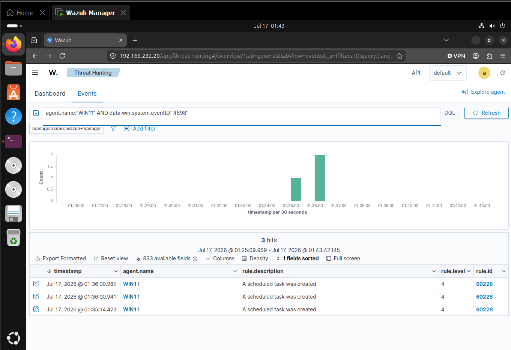

*Figure 7. Event ID 4698 hunt, showing that Wazuh collected scheduled-task creation telemetry and initially classified it with built-in rule `60228`.*

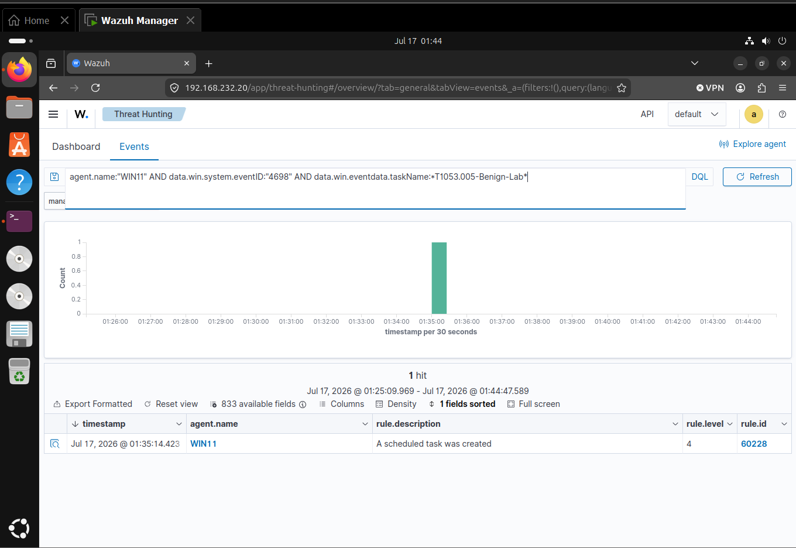

*Figure 8. Exact-task query, reducing the Event ID 4698 results to the original `T1053.005-Benign-Lab` creation event.*

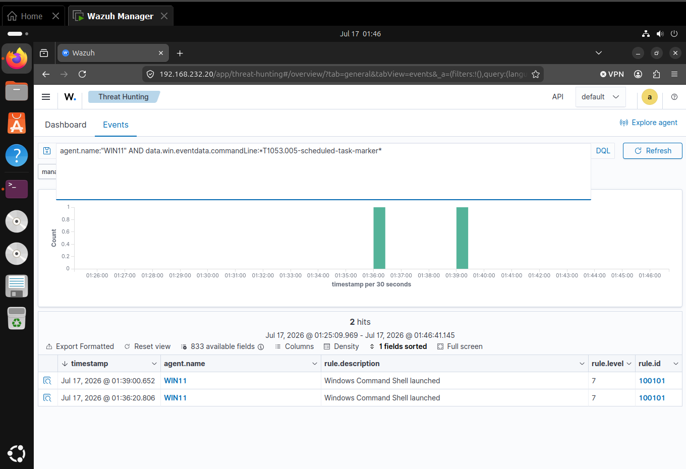

*Figure 9. Supporting command-line hunt, showing two rule `100101` alerts associated with execution of the distinctive marker command.*

The failed `schtasks.exe` image query was retained as a limitation rather than reported as proof that no such process existed. The available screenshot showed only that the specific Wazuh query returned no results in its selected time range.

## 8. Initial Detection Gap

The initial Event ID 4698 telemetry was collected successfully, but built-in rule `60228` produced a generic level-4 alert mapped to the broader parent technique `T1053 – Scheduled Task/Job`. This established collection and baseline alerting, but it did not provide the desired sub-technique specificity or interpreter-aware severity.

The detection objective therefore required two improvements:

1. Refine the baseline mapping to `T1053.005 – Scheduled Task`.
2. Raise severity when the task XML specified `cmd.exe`, PowerShell, or another configured script interpreter.

The initial Wazuh event is preserved in [`wazuh-event.json`](evidence/wazuh-event.json).

## 9. Detection Engineering

The built-in Event ID 4698 rule was overridden locally to retain its event relationship while applying the specific ATT&CK mapping. A child rule inspected the decoded `taskContent` field for command and script interpreters.

```xml
<group name="windows,security,scheduled_task,mitre,">

  <rule id="60228" level="5" overwrite="yes">
    <if_sid>60103</if_sid>
    <field name="win.system.eventID">^4698$</field>
    <description>Scheduled task created: $(win.eventdata.taskName)</description>
    <options>no_full_log</options>
    <mitre>
      <id>T1053.005</id>
    </mitre>
  </rule>

  <rule id="100123" level="8">
    <if_sid>60228</if_sid>
    <field name="win.eventdata.taskContent"
           type="pcre2">(?i)(cmd\.exe|powershell\.exe|pwsh\.exe|wscript\.exe|cscript\.exe)</field>
    <description>Scheduled task created with command or script interpreter</description>
    <mitre>
      <id>T1053.005</id>
    </mitre>
  </rule>

</group>
```

The deployable XML is included in [`detection-rules.xml`](detection-rules.xml).

The rule treats interpreter use as suspicious context, not proof of maliciousness. Scheduled tasks that invoke command or scripting engines are common in administration and software deployment, so environment-specific allowlisting and action review remain necessary.

## 10. Positive Detection Validation

After the rules were loaded, a fresh positive test created `\T1053.005-Benign-Lab-07`. Windows recorded Event ID 4698 at `2026-07-17 12:30:44 EDT`, and Wazuh generated the final alert at `12:30:45.354 EDT`.

| Field | Observed value |
|---|---|
| Agent | WIN11 |
| Agent ID | 002 |
| Rule ID | 100123 |
| Rule level | 8 |
| Description | Scheduled task created with command or script interpreter |
| Event ID | 4698 |
| Task name | `\T1053.005-Benign-Lab-07` |
| Task author | CORP\Administrator |
| Task action | `cmd.exe` |
| Arguments | `/c echo Benign T1053.005 validation > C:\ProgramData\T1053.005-marker-07.txt` |
| Run account | `S-1-5-18` (`SYSTEM`) |
| Run level | HighestAvailable |
| Client process ID | 4604 |
| Parent process ID | 12240 |
| MITRE technique | T1053.005 – Scheduled Task |
| MITRE tactics | Execution, Persistence, Privilege Escalation |

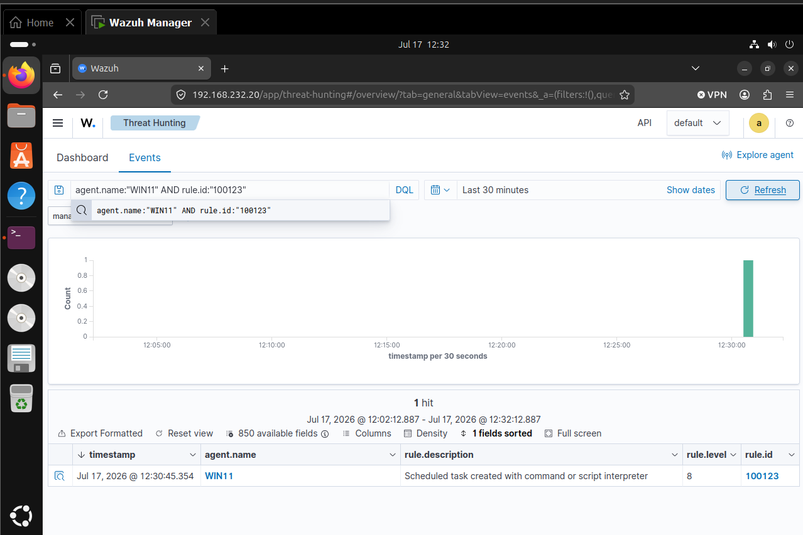

*Figure 10. Positive validation result, showing one level-8 rule `100123` alert for scheduled-task creation with a command or script interpreter.*

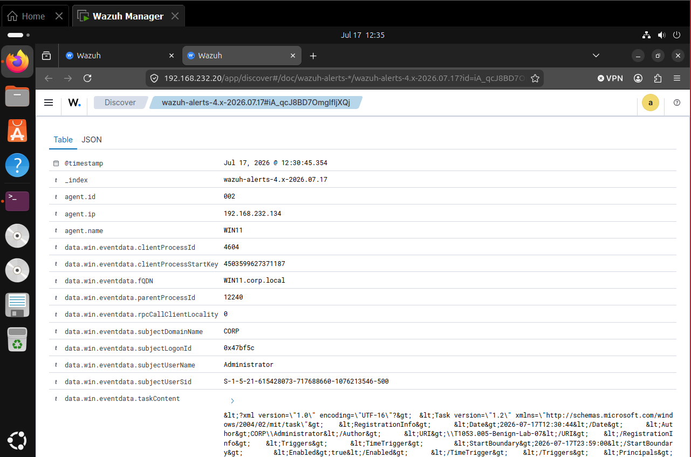

*Figure 11. Expanded positive alert, highlighting the creator account, process identifiers, decoded task XML, and the `T1053.005-Benign-Lab-07` task definition.*

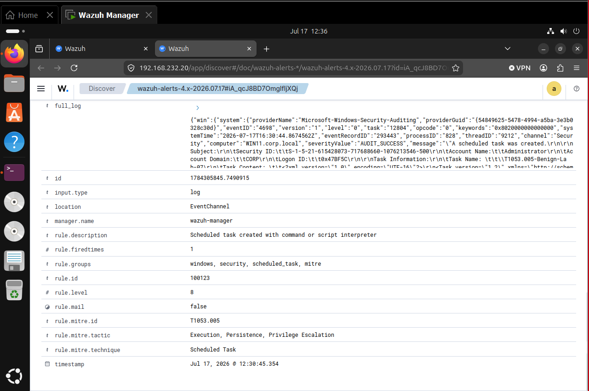

*Figure 12. Final detection metadata, showing rule `100123`, level 8, the T1053.005 mapping, and the Execution, Persistence, and Privilege Escalation tactics.*

The complete positive alert is preserved in [`12-positive-alert-rule-100123.json`](evidence/12-positive-alert-rule-100123.json).

## 11. Negative-Control Validation

The negative control created `\T1053.005-Benign-Control` with a direct action of `C:\Windows\System32\hostname.exe`. The task retained the same scheduled-task mechanism and `SYSTEM` run context but did not invoke a configured command or scripting interpreter.

Wazuh generated the overridden baseline rule `60228` at level 5 and mapped it to T1053.005. The elevated rule `100123` returned no results for the same task.

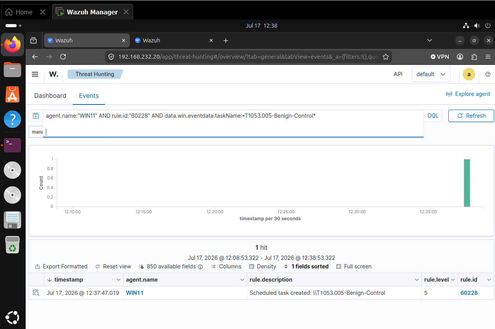

*Figure 13. Negative-control baseline result, showing rule `60228` at level 5 for `T1053.005-Benign-Control` and confirming that ordinary task creation remained visible.*

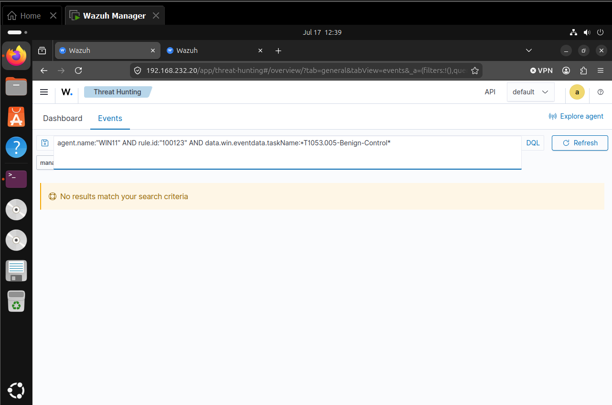

*Figure 14. Negative-control elevated-rule query, showing no results and demonstrating that the interpreter condition did not match the direct `hostname.exe` action.*

The baseline control alert is preserved in [`wazuh-alert.json`](evidence/wazuh-alert.json).

## 12. Investigation Timeline

All times below are Eastern Daylight Time (UTC-04:00).

| Time | Source | Event | Evidence | Analyst interpretation |
|---|---|---|---|---|
| 2026-07-17 01:32 | WIN11 | Readiness check found `No Auditing` | Figure 1 | Required Security events would not be generated until the policy was enabled. |
| 2026-07-17 01:34 | WIN11 | Success auditing enabled | Figure 2 | Endpoint became ready to record scheduled-task creation and deletion. |
| 2026-07-17 01:35:14 | Windows Security | Event ID 4698 recorded for the original lab task | Figure 4 | Windows preserved the creator, task definition, run context, and process identifiers. |
| 2026-07-17 01:36:20 | WIN11 | Scheduled task created the marker file | Figure 3 | The benign scheduled action executed successfully. |
| 2026-07-17 01:39:00 | Sysmon | Supporting Process Create activity recorded | Figure 5 | Process telemetry was available for correlation. |
| 2026-07-17 12:30:44 | Windows Security | Event ID 4698 recorded for `Benign-Lab-07` | Positive alert JSON | Fresh post-deployment event supplied the final validation input. |
| 2026-07-17 12:30:45 | Wazuh | Rule `100123` fired at level 8 | Figures 10–12 | Interpreter-aware detection and ATT&CK mapping succeeded. |
| 2026-07-17 12:37:46 | Windows Security | Negative-control task created | Baseline alert JSON | Direct `hostname.exe` execution supplied the comparison case. |
| 2026-07-17 12:37:47 | Wazuh | Rule `60228` fired at level 5 | Figure 13 | Baseline visibility remained while elevated severity was withheld. |
| 2026-07-17 12:39 | Wazuh | Rule `100123` control query returned no results | Figure 14 | The higher-severity analytic distinguished the direct executable from interpreter use. |
| 2026-07-17 12:42:28 | Windows Security | Event ID 4699 recorded for both test tasks | Figure 16 | Local cleanup was confirmed. |

## 13. Findings

### Finding 1: Scheduled-task creation was fully observable

Windows Event ID 4698 retained the task name, creator, run account, action, arguments, trigger, and task XML. Wazuh decoded those fields into searchable values, including `taskName`, `taskContent`, `subjectUserName`, `clientProcessId`, and `parentProcessId`.

### Finding 2: The default alert lacked sub-technique specificity

The original built-in alert used T1053 and level 4. The local override refined the mapping to T1053.005 and retained a level-5 baseline for all Event ID 4698 activity.

### Finding 3: Interpreter-aware severity worked

Rule `100123` matched `cmd.exe` inside the task XML and generated a level-8 alert. The direct `hostname.exe` control remained at the baseline level and did not match the higher-severity rule.

### Finding 4: Supporting telemetry added context but was not the decisive signal

Sysmon process events and Wazuh command-line alerts supported execution analysis. Event ID 4698 remained the strongest evidence because it preserved the registered task definition before execution.

### Finding 5: Cleanup was confirmed locally

Both tasks were deleted successfully, subsequent `schtasks.exe /Query` commands returned `The system cannot find the file specified`, and Windows generated Event ID 4699 for each deletion.

## 14. Cleanup

The lab and control tasks were deleted, and follow-up queries confirmed that neither remained registered:

```powershell
schtasks.exe /Delete /TN "T1053.005-Benign-Lab-07" /F
schtasks.exe /Delete /TN "T1053.005-Benign-Control" /F

Remove-Item "C:\ProgramData\T1053.005-marker-07.txt" -ErrorAction SilentlyContinue

schtasks.exe /Query /TN "T1053.005-Benign-Lab-07"
schtasks.exe /Query /TN "T1053.005-Benign-Control"
```

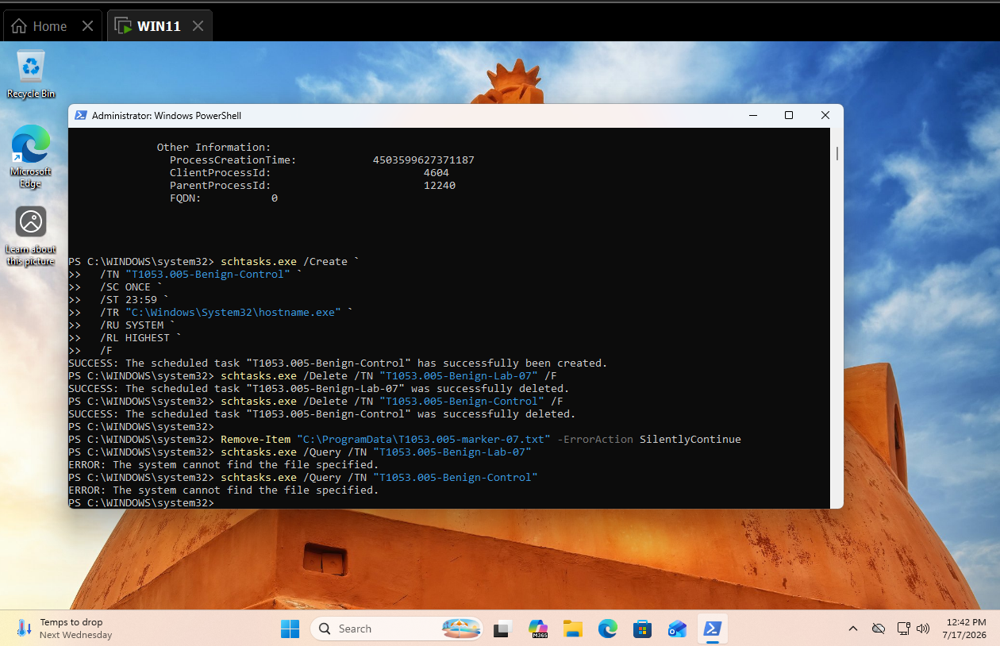

*Figure 15. Cleanup validation, showing both tasks deleted and subsequent queries confirming that the task definitions were no longer present.*

Windows generated Event ID 4699 at `12:42:28 EDT` for both `\T1053.005-Benign-Control` and `\T1053.005-Benign-Lab-07`.

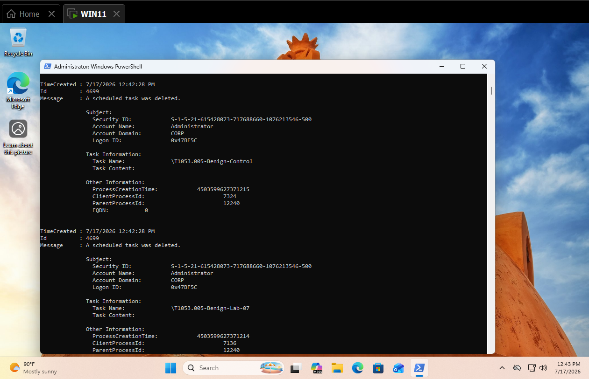

*Figure 16. Local task-deletion evidence, showing Event ID 4699 for both the positive test and negative-control task.*

## 15. Detection Analysis

### Detection value

Event ID 4698 exposes the full task definition at creation time, allowing an analyst to review the task path, author, principal, action, arguments, and execution settings before the task runs. Searching the task XML provides stronger context than alerting on `schtasks.exe` alone because tasks can be created through PowerShell, COM, RPC, administrative tools, installers, or other APIs.

### Likely false positives

Legitimate sources include:

- software installers and update agents;
- endpoint-management platforms;
- backup and maintenance tools;
- administrative automation;
- enterprise logon or remediation scripts;
- security software and vendor support utilities.

The negative control demonstrated why a two-level analytic is useful: all task creations remain visible, while interpreter-based actions receive additional scrutiny.

### Recommended triage fields

An analyst should review:

- task name and folder;
- author and subject account;
- run account and run level;
- command and arguments;
- trigger type and frequency;
- hidden and enabled settings;
- client and parent process identifiers;
- nearby Sysmon process activity;
- whether the task action points to a user-writable or temporary directory;
- whether the task was later changed, disabled, or deleted.

### Production improvements

1. Add allowlists for known task paths, actions, authors, and management tools.
2. Increase severity for encoded PowerShell, user-writable paths, hidden tasks, remote content, or unexpected privileged principals.
3. Correlate Event IDs 4698, 4702, 4699, Sysmon Event ID 1, and task execution telemetry.
4. Add process-creation detections for `schtasks.exe` and Task Scheduler RPC clients without treating their absence as proof that no task was created.
5. Baseline recurring vendor and operating-system tasks before deploying the analytic broadly.

## 16. Limitations

- The simulation was intentionally benign and did not demonstrate compromise, payload delivery, credential access, lateral movement, or command-and-control activity.
- The elevated rule identifies configured interpreter names anywhere in `taskContent`; legitimate administrative tasks can therefore match.
- The negative control tested one direct executable and does not represent every legitimate task pattern.
- The captured `schtasks.exe` image query returned no Wazuh results in its selected window, so the case study does not claim complete process visibility for the creation utility.
- Windows Event ID 4699 confirmed deletion locally, but no Wazuh 4699 result was supplied; SIEM-side deletion collection is therefore not claimed.
- Several validation attempts occurred while troubleshooting audit policy and rule inheritance. Only the evidence-backed final positive and negative results are treated as detection validation.

## 18. Final Assessment

The lab met its detection-engineering objective. Windows generated detailed scheduled-task audit telemetry, Wazuh collected and decoded the events, and the final rules produced an ATT&CK-mapped level-8 alert when the task action contained `cmd.exe`. The direct `hostname.exe` control remained visible at level 5 without triggering the elevated analytic.

The result demonstrates more than telemetry collection: it shows a complete workflow from audit-policy readiness and safe simulation through hunt refinement, rule development, positive validation, negative control, ATT&CK mapping, and cleanup.
