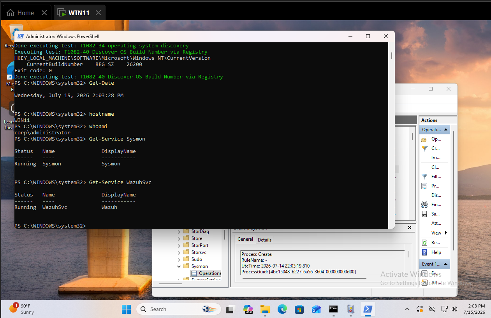
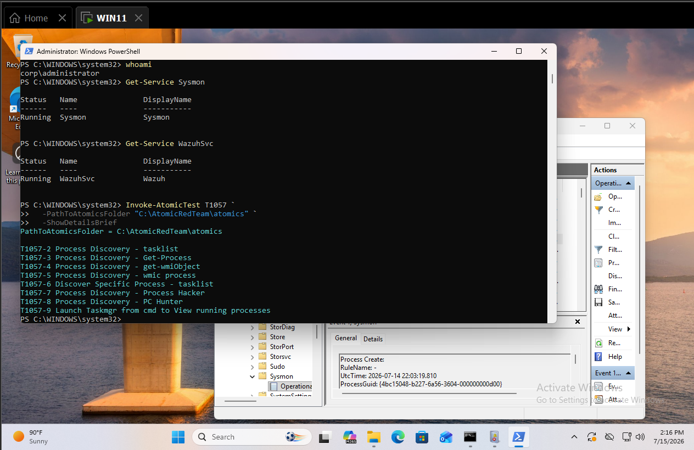
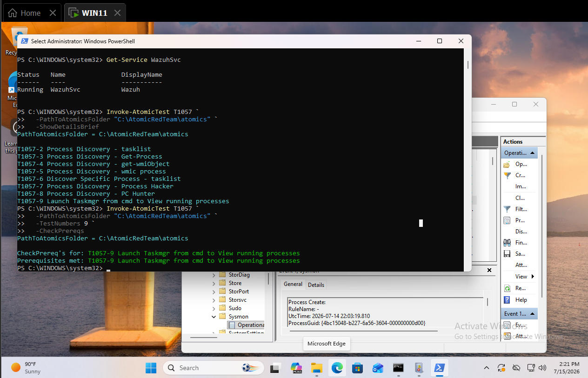
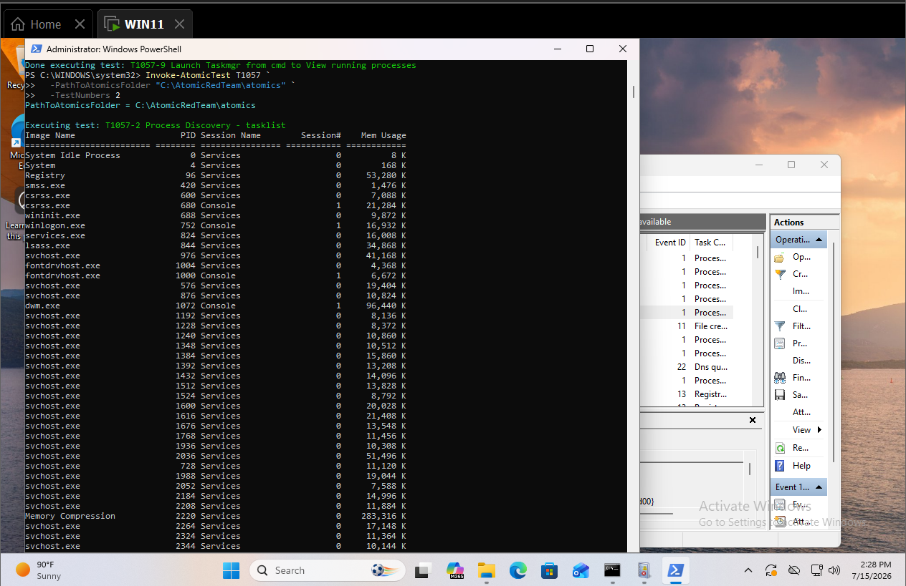
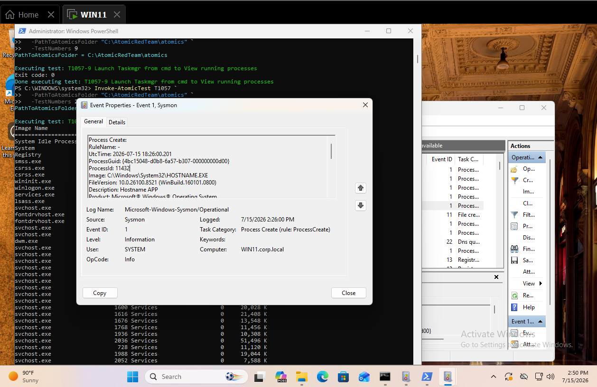
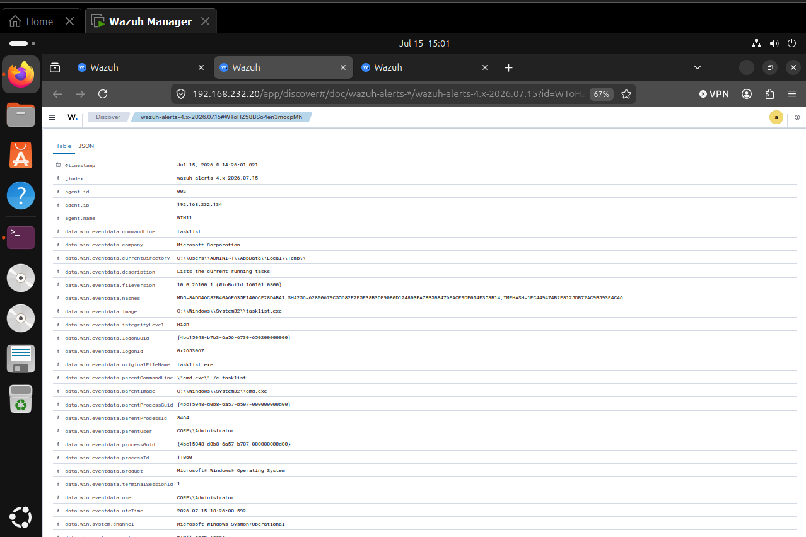
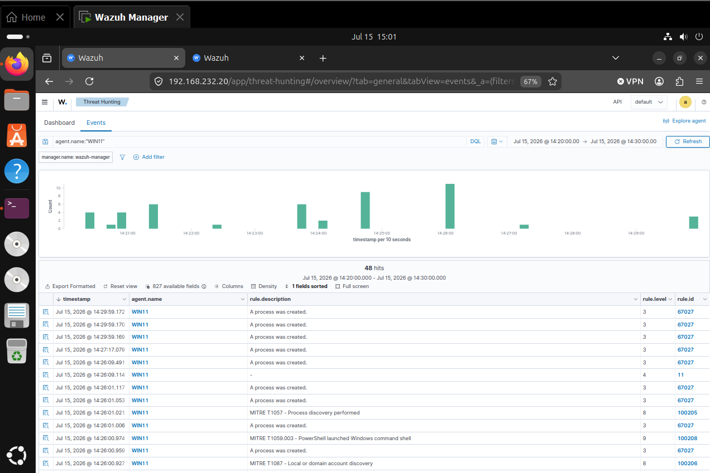
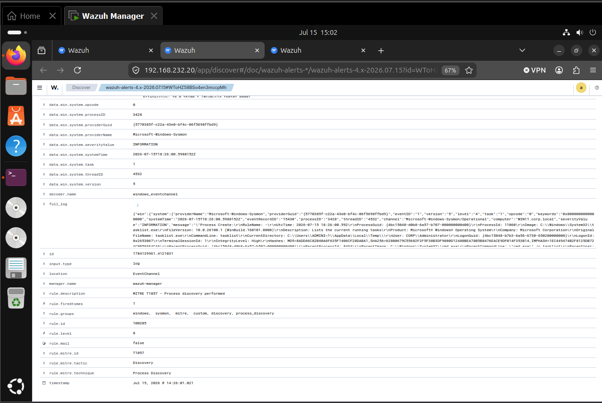

# MITRE ATT&CK Detection Engineering Case Study

**Portfolio:** Security Engineering Portfolio
**Project:** Active Directory Attack & Defense Lab
**Case Study:** 02
**Technique:** T1057
**Technique Name:** Process Discovery
**Tactic:** Discovery
**Status:** Completed
**Date Started:** 2026-07-15
**Author:** Josh Carroll

## 1. MITRE ATT&CK Information

- **Technique ID:** T1057
- **Technique Name:** Process Discovery
- **Tactic:** Discovery
- **Reference:** https://attack.mitre.org/techniques/T1057/

Process Discovery involves identifying processes currently running on a system. An adversary may use this information to identify security products, administrative utilities, privileged applications, backup software, or other targets that influence follow-on activity.

## Result

This case study validates the ability of Microsoft Sysmon and Wazuh to capture process-enumeration activity on the domain-joined WIN11 endpoint.

A controlled Atomic Red Team simulation was used to execute a Windows process-discovery utility. The resulting process creation telemetry was reviewed locally in the Sysmon Operational event log and centrally through Wazuh Threat Hunting.

The exercise evaluates endpoint visibility, detection latency, threat-hunting capability, and the operational context required to distinguish legitimate administration from suspicious reconnaissance.

**Final Result:**

## 3. Attack Scenario

Assume a threat actor has gained interactive access to WIN11 using a valid domain account. Before attempting credential access, defense evasion, or privilege escalation, the actor enumerates running processes to identify security software, administrative tools, backup applications, and other processes of interest.

## Objective and hypothesis

Detect process-enumeration activity executed on WIN11 and verify that:

1. Sysmon records the process-creation event.
2. The Wazuh agent forwards the event.
3. Wazuh makes the event available for threat hunting.
4. The analyst can identify the user, parent process, command line, host, and execution time.

## Lab environment

| Component | Value |
|---|---|
| Test endpoint | WIN11 |
| Domain | corp.local |
| Logged-on user | Alice Johnson |
| Sysmon status | Running |
| Wazuh agent status | Running |
| Wazuh manager | 192.168.232.20 |
| Test date | 2026-07-15 |

**Evidence**


**Figure 1.** Pre-test validation confirming the WIN11 endpoint, logged-on user, system time, and operational status of Sysmon and the Wazuh agent prior to executing the Process Discovery simulation.

## Safe simulation

- **Tool:** Atomic Red Team
- **Technique:** T1057
- **Selected Test Number:** 9
- **Test Name:** Launch Taskmgr from cmd to view running processes
- **Supported Platform:** Windows
- **Executor:** T1057-9
- **Reason Selected:** The test uses a native Windows process-enumeration utility and is suitable for validating process-creation telemetry.

**Evidence**
-  — Shows the selected Windows-compatible Atomic Red Team procedure.

**Figure 2.** Atomic Red Team test details for MITRE ATT&CK Technique T1057 – Process Discovery. The selected Windows-compatible test demonstrates how the simulation generates process-enumeration activity for detection validation.

## 7. Lab Prerequisites

| Requirement | Result |
|---|---|
| WIN11 powered on | Passed |
| Sysmon running | Passed |
| Wazuh agent running | Passed |
| Atomic Red Team module available | Passed |
| T1057 definition available | Passed |
| Selected test prerequisites | PASSED |
**Evidence**
-  - Shows Atomic Red Team test prerequisites needed to execute the simulation

**Figure 3.** Verification that all prerequisites required for the Process Discovery simulation were satisfied, including endpoint availability, Sysmon operation, Wazuh agent connectivity, and Atomic Red Team test readiness.

## 8. Commands Executed

```powershell
Invoke-AtomicTest T1057 `
  -PathToAtomicsFolder "C:\AtomicRedTeam\atomics" `
  -TestNumbers 2
  ```
**Execution Time:** 14:26
**Endpoint:** WIN11
**User:** WIN11/Administrator
**Execution Result:** Success
**Observed Command:** "executing test: T1057-2 Process Discovery - tasklist.."
**Evidence**
 - Shows test execution and command output

**Figure 4.** Successful execution of the Atomic Red Team Process Discovery simulation. The PowerShell session shows the Invoke-AtomicTest command, execution status, and generated command output used to validate telemetry collection.

## Endpoint telemetry

| Field | Observed Value |
|---|---|
| Event ID | 1 |
| Event type | Process Create |
| UTC time | 2026-07-15 18:26:00.201 |
| Image | C:\Windows\System32\HOSTNAME.EXE |
| Command line | "C:\WINDOWS\system32\HOSTNAME.EXE" |
| Parent image | C:\Windows\System32\WindowsPowerShell\v1.0\powershell.exe |
| Parent command line | "C:\Windows\System32\WindowsPowerShell\v1.0\powershell.exe" |
| User | SYSTEM |
| Computer | WIN11.corp.local |
| Process ID | 11432 |
| Process GUID | {4bc15048-d0b8-6a57-b307-000000000d00} |
**Evidence**
 - Shows the telemetry given from Sysmon event logs

**Figure 5.** Sysmon Event ID 1 (Process Create) generated during the Process Discovery simulation. The event captures the executable path, command line, parent process, user context, process identifiers, and execution timestamp used during forensic analysis.

## Positive validation

| Field | Observed Value |
|---|---|
| Detection Successful | Yes |
| Agent | WIN11 |
| Agent ID | 002 |
| Rule ID | 100205 |
| Rule Name | MITRE T1057 - Process discovery performed |
| Rule Level | 8 |
| MITRE Technique | T1057 |
| MITRE Tactic | Discovery |
| Event Source | Microsoft-Windows-Sysmon |
| Event ID | 1 |
| Process Image | C:\Windows\System32\tasklist.exe |
| Command Line | tasklist |
| Parent Process | C:\Windows\System32\cmd.exe |
| Parent Command Line | "cmd.exe" /c tasklist |
| User | CORP\Administrator |
| Host | WIN11.corp.local |
| Process ID | 11060 |
| Detection Status | Successfully Detected |
**Evidence**
 - 

 **Figure 6.** Expanded Wazuh alert generated from Sysmon telemetry. Custom Rule **100205** identified the execution of **tasklist.exe** as **MITRE ATT&CK T1057 – Process Discovery**, assigning the event a severity level of **8**.

## Wazuh hunt and collection validation

| Query | Purpose | Result |
|---|---|---|
| `agent.name:"WIN11"` | Confirm current telemetry from the endpoint | Returned current WIN11 events during the test window, confirming the Wazuh agent was actively reporting. |
| `agent.name:"WIN11" AND data.win.eventdata.image:*tasklist.exe` | Locate the T1057 process-discovery event | Returned a Sysmon Process Create event for `C:\Windows\System32\tasklist.exe` on WIN11. |
| `agent.name:"WIN11" AND data.win.eventdata.commandLine:*tasklist*` | Confirm the command line | Confirmed the command line associated with the Atomic Red Team process-discovery test. |
| `agent.name:"WIN11" AND data.win.eventdata.parentImage:*powershell.exe` | Identify the parent process | Showed that PowerShell launched the discovery process. |
| `agent.name:"WIN11" AND data.win.system.eventID:"1"` | Review Sysmon process creation | Returned Event ID 1 records, including the `tasklist.exe` event generated by the simulation. |
**Evidence**


**Figure 7.** Wazuh Threat Hunting results showing successful retrieval of Process Discovery events from the WIN11 endpoint. Analyst queries confirmed Sysmon Event ID 1 telemetry, command-line execution, parent process, and ATT&CK-aligned detection.

## Findings

### Summary

The threat hunt successfully identified the Process Discovery activity generated during the Atomic Red Team T1057 simulation. Endpoint telemetry was collected by Sysmon, forwarded by the Wazuh agent, processed by the Wazuh Manager, and matched against a custom detection rule that mapped the activity to MITRE ATT&CK Technique T1057.

### Observed Evidence

| Finding | Observation |
|---------|-------------|
| Endpoint | WIN11 |
| Agent ID | 002 |
| User | CORP\Administrator |
| Process Image | C:\Windows\System32\tasklist.exe |
| Command Line | tasklist |
| Parent Process | C:\Windows\System32\cmd.exe |
| Parent Command | "cmd.exe" /c tasklist |
| Process ID | 11060 |
| Parent Process ID | 8464 |
| Event Source | Microsoft-Windows-Sysmon |
| Event ID | 1 (Process Create) |
| Detection Rule | 100205 |
| Rule Name | MITRE T1057 - Process discovery performed |
| Rule Level | 8 |
| MITRE Technique | T1057 |
| MITRE Tactic | Discovery |
| Detection Time (UTC) | 2026-07-15 18:26:00.592 |
| Wazuh Alert Time | Jul 15, 2026 @ 14:26:01.021 |

### Analysis

The Process Discovery activity was successfully detected using the query:

agent.name:"WIN11" AND data.win.eventdata.image:*tasklist.exe

The event confirmed that the native Windows utility `tasklist.exe` executed under the `CORP\Administrator` account.

Sysmon recorded complete process creation telemetry including:

- Executable path
- Command line
- Parent process
- Parent command line
- Process ID
- Process GUID
- User context
- Hash values
- Integrity level
- Execution timestamp

## 13. MITRE Mapping

| Field | Value |
|---|---|
| Tactic | Discovery |
| Technique | T1057 |
| Name | Process Discovery |
| Primary data source | Process Creation |
| Validation status | Validated |

Unlike the previous T1082 exercise, this event was automatically classified by a custom Wazuh detection rule.

Rule ID **100205** mapped the activity directly to:

- MITRE ATT&CK T1057
- Discovery

demonstrating successful ATT&CK-based Detection Engineering.

No additional suspicious discovery commands or post-exploitation activity were observed during the investigation window.
**Evidence**


**Figure 8.** MITRE ATT&CK mapping for the Process Discovery simulation. Wazuh Rule **100205** successfully classified the activity as **T1057 – Process Discovery** under the **Discovery** tactic, validating the custom ATT&CK-based detection rule.

## Troubleshooting and detection engineering

The Atomic Red Team T1057 Process Discovery simulation successfully validated end-to-end detection capabilities within the Enterprise Active Directory Attack & Defense Laboratory.

The simulated execution of `tasklist.exe` generated a Sysmon Event ID 1 (Process Create), which was collected by the Wazuh agent and forwarded to the Wazuh Manager. The event was evaluated against a custom detection rule and generated Wazuh Rule **100205**, automatically classifying the activity as **MITRE ATT&CK Technique T1057 – Process Discovery** with a severity level of **8**.

The captured telemetry included the executing user (`CORP\Administrator`), executable path, command line, parent process (`cmd.exe`), process identifiers, integrity level, cryptographic hashes, and execution timestamp. These artifacts provide sufficient context for analysts to reconstruct the activity and determine whether the execution was part of an authorized administrative task or potential adversary reconnaissance.

This exercise demonstrates successful implementation of Detection Engineering controls by validating:

- Endpoint telemetry collection with Sysmon
- Log forwarding through the Wazuh Agent
- Centralized event processing by the Wazuh Manager
- Custom ATT&CK-aligned rule matching
- Analyst visibility through Wazuh Threat Hunting
- End-to-end validation of Process Discovery detection

## False positives and triage

Execution of `tasklist.exe` is not inherently malicious and is commonly associated with legitimate administrative, troubleshooting, monitoring, and support activity.

Potential false-positive sources include:

- Help Desk personnel reviewing running applications
- System administrators troubleshooting performance issues
- Incident responders collecting host information
- Endpoint management or inventory tools
- Software deployment and patch-management workflows
- Monitoring scripts that enumerate running processes
- Security engineers validating endpoint telemetry
- Authorized Atomic Red Team or purple-team exercises

During this case study, the activity was determined to be legitimate because it was executed by `CORP\Administrator` as part of an authorized T1057 Atomic Red Team simulation.

### False-Positive Review Criteria

Before escalating a similar event, analysts should review:

- **User account:** Is the account authorized to perform administrative activity?
- **Parent process:** Was `tasklist.exe` launched by an expected process such as `cmd.exe` or PowerShell?
- **Command line:** Does the command match a known administrative or troubleshooting task?
- **Host role:** Is the system an administrative workstation, server, or standard user endpoint?
- **Execution time:** Did the activity occur during a maintenance window or approved exercise?
- **Related activity:** Were additional discovery, credential-access, or lateral-movement commands executed nearby?
- **Authentication context:** Was there a suspicious or remote logon immediately before execution?
- **Change or ticket reference:** Is the activity associated with an approved task, incident, or test?

### Tuning Considerations

To reduce unnecessary alerts while preserving detection value, the rule could be tuned to:

- Lower severity for approved administrative accounts
- Increase severity for standard-user accounts
- Increase severity when `tasklist.exe` is launched by an unusual parent process
- Correlate process discovery with other ATT&CK Discovery techniques within a short time window
- Exclude known management tools or automation accounts
- Prioritize execution on high-value systems such as domain controllers
- Correlate with remote logons, PowerShell execution, or credential-access activity

### Assessment

No unexpected false positives were observed during the controlled test window. The alert was correctly attributed to the authorized Atomic Red Team simulation.

In a production environment, `tasklist.exe` execution alone should generally be treated as low to moderate confidence. The event becomes more significant when combined with suspicious user context, unusual parent processes, multiple discovery commands, or follow-on malicious activity.

## Engineering considerations

The current detection successfully identifies execution of `tasklist.exe`; however, adversaries frequently perform process discovery using multiple native utilities and scripting environments. Detection coverage can be expanded by correlating additional process enumeration commands such as `Get-Process`, `wmic process`, `taskmgr.exe`, and PowerShell-based enumeration.

### Future improvements include:

- Correlate multiple Discovery techniques executed within a five-minute window.
- Increase alert severity when Process Discovery is performed by non-administrative accounts.
- Correlate Process Discovery with remote logon events, PowerShell execution, or credential-access techniques.
- Develop Sigma rules equivalent to Wazuh Rule 100205 for cross-platform portability.
- Measure Mean Time to Detect (MTTD) for all Discovery techniques.
- Expand ATT&CK coverage metrics to track validation status across the Discovery tactic.

## Negative control

A separate negative-control result was not preserved for this earlier case study. This is an evidence limitation, not a claimed pass; future reruns should execute a similar benign command that omits the detection-specific indicator.

## Cleanup

No cleanup transcript was preserved for this earlier case study. Before rerunning, verify that test artifacts from the documented simulation are absent; remove only the explicitly named benign artifacts created by the test.

## Timeline

Use the timestamps and record identifiers in the endpoint and Wazuh evidence as the authoritative validation timeline.

## Evidence inventory

Evidence is stored in this case-study directory and referenced inline where available. The screenshots and exported records shown in this README are the authoritative artifacts for the completed validation.

## Reproduction

Repeat the documented safe simulation, confirm the endpoint event first, then run the documented Wazuh hunt and verify the expected rule identifier. Execute the negative control separately and clean up only the named test artifacts.
