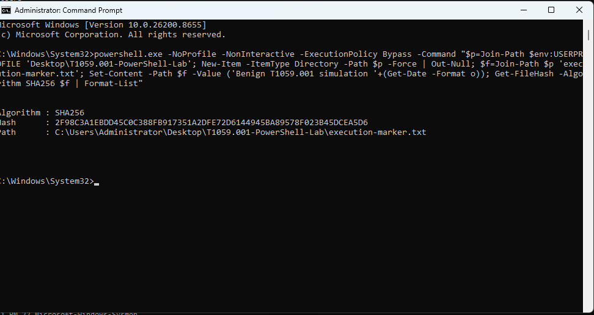
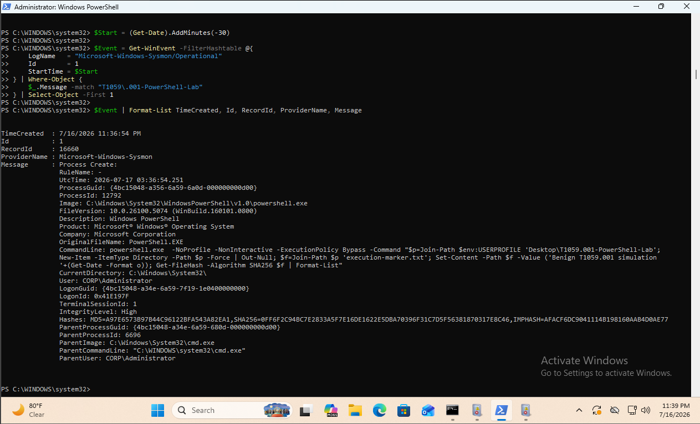
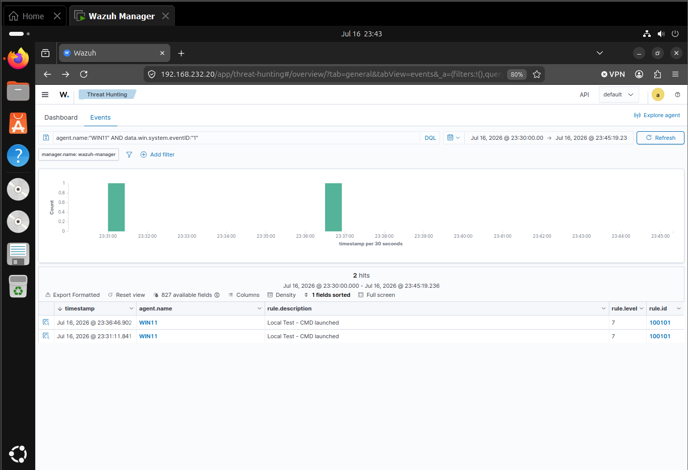
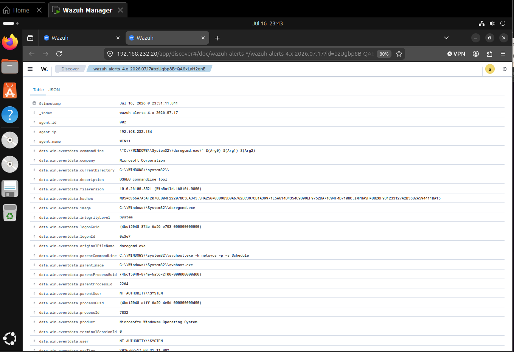
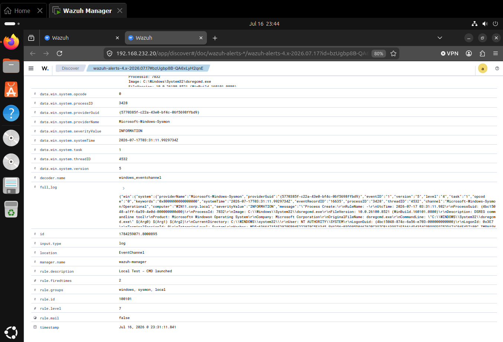
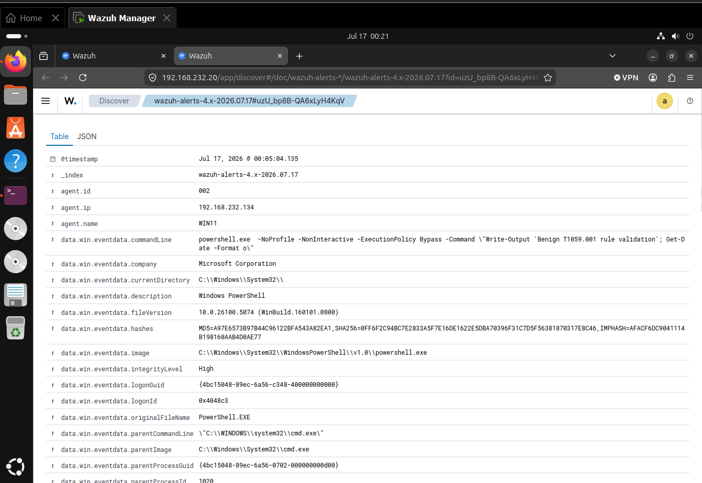
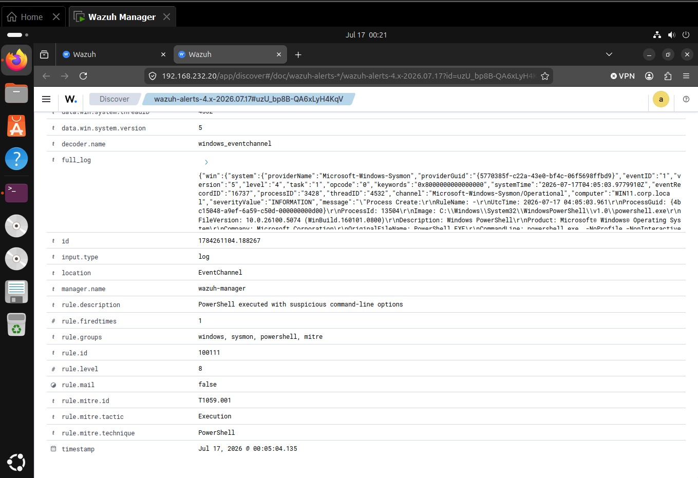
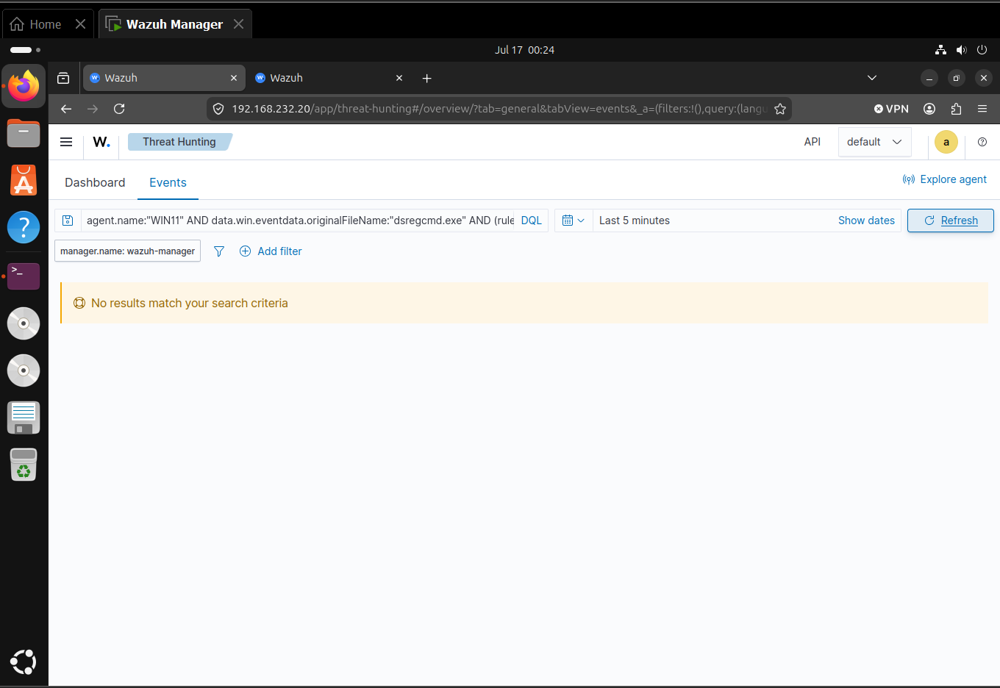

# Detecting Suspicious PowerShell Execution with Sysmon and Wazuh

## Result

A benign PowerShell simulation was captured by Sysmon but initially produced no dedicated Wazuh alert. I built and validated a two-stage Wazuh detection mapped to MITRE ATT&CK `T1059.001`, then corrected two unrelated rules that misclassified `dsregcmd.exe` as Windows Command Shell execution. The final positive test generated the intended level 8 alert, while the negative control remained available as raw telemetry without triggering either false-positive rule.

## Executive summary

This lab focused on the difference between collecting telemetry and generating a useful detection. Sysmon successfully recorded the original PowerShell execution as Event ID 1, and Wazuh archived the event. PowerShell Script Block Logging was also available. However, the original behavior did not generate a dedicated PowerShell alert or ATT&CK mapping.

I added a baseline PowerShell process rule and a higher-severity child rule for suspicious command-line options. Both rules map the observed behavior to `T1059.001 – PowerShell`. During validation, I also found that a custom CMD rule matched `dsregcmd.exe` because its regular expression only anchored the end of `cmd.exe`. A separate Wazuh rule, `92052`, produced the same type of false positive. I corrected the custom match and added a narrow child-rule suppression for the exact `dsregcmd.exe` filename.

The final test generated rule `100111` at level 8 with the correct ATT&CK technique and tactic. A subsequent `dsregcmd.exe` event remained visible in the Wazuh archive and Windows Security telemetry, but it did not trigger rules `100101` or `92052`.

## Objective and hypothesis

The objective was to demonstrate a complete detection-engineering workflow:

1. Generate benign PowerShell activity with suspicious-looking options.
2. Confirm the endpoint recorded the activity.
3. Determine whether Wazuh collected and alerted on it.
4. Add an evidence-based detection and ATT&CK mapping.
5. Test the detection with a positive case.
6. Identify and correct false positives without suppressing the underlying telemetry.

The detection hypothesis was that Sysmon Event ID 1 would expose the executable, full command line, user, integrity level, hashes, and parent process. A Wazuh rule could then identify PowerShell execution and raise severity when the command line contained uncommon options such as `-NonInteractive` or `-ExecutionPolicy Bypass`.

## Lab environment

| Component | Role |
|---|---|
| Windows 11 endpoint | Generated the simulation and endpoint telemetry |
| Sysmon | Recorded Process Create events, including process lineage and hashes |
| PowerShell Operational log | Provided Script Block Logging visibility through Event ID 4104 |
| Wazuh agent | Forwarded Windows telemetry from the endpoint |
| Wazuh manager 4.14.6 | Decoded events, evaluated rules, and generated alerts |
| Wazuh dashboard | Supported event hunting, alert review, and ATT&CK validation |

The lab used a private network and a dedicated administrative test account. No external payload, remote connection, persistence mechanism, or privilege change was used.

## Safe simulation

The original simulation launched Windows PowerShell from Command Prompt with conspicuous options, created one text marker, and returned its SHA-256 hash:

```cmd
powershell.exe -NoProfile -NonInteractive -ExecutionPolicy Bypass -Command "$p=Join-Path $env:USERPROFILE 'Desktop\T1059.001-PowerShell-Lab'; New-Item -ItemType Directory -Path $p -Force | Out-Null; $f=Join-Path $p 'execution-marker.txt'; Set-Content -Path $f -Value ('Benign T1059.001 simulation '+(Get-Date -Format o)); Get-FileHash -Algorithm SHA256 $f | Format-List"
```

Observed marker-file SHA-256:

```text
2F98C3A1EBDD45C0C388FB917351A2DFE72D6144945BA89578F023B45DCEA5D6
```



*Figure 1. Benign PowerShell simulation launched from Command Prompt, showing successful marker-file creation and the returned SHA-256 hash.*

## Endpoint evidence

Sysmon recorded the simulation as Event ID 1 at `2026-07-17 03:36:54.251 UTC` (`2026-07-16 23:36:54 EDT`). The event established:

| Field | Observed value |
|---|---|
| Image | `C:\Windows\System32\WindowsPowerShell\v1.0\powershell.exe` |
| Original filename | `PowerShell.EXE` |
| Process ID | `12792` |
| Parent image | `C:\Windows\System32\cmd.exe` |
| Parent process ID | `6696` |
| User | `CORP\Administrator` |
| Integrity level | `High` |
| Executable SHA-256 | `0FF6F2C94BC7E2833A5F7E16DE1622E5DBA70396F31C7D5F56381870317E8C46` |



*Figure 2. Local Sysmon Process Create event showing `powershell.exe`, the complete simulation command, high-integrity user context, executable hashes, and `cmd.exe` as the parent process.*

This proved the endpoint generated the required telemetry. It did not prove Wazuh had indexed the event or generated an alert.

## Initial Wazuh hunt

The hunt began with progressively narrower dashboard queries:

```text
agent.name:"WIN11"
```

```text
agent.name:"WIN11" AND data.win.system.eventID:"1"
```

```text
agent.name:"WIN11" AND data.win.system.eventID:"1" AND data.win.eventdata.image:*powershell.exe
```

```text
agent.name:"WIN11" AND data.win.eventdata.commandLine:*T1059.001-PowerShell-Lab*
```

The broad Event ID 1 query returned two alerts, but neither represented the PowerShell simulation. Both were associated with custom rule `100101`, described as `Local Test - CMD launched`.



*Figure 3. Initial Wazuh Event ID 1 results showing two rule `100101` alerts, which required field-level review before they could be treated as relevant detections.*

Direct review of `/var/ossec/logs/archives/archives.json` established that Wazuh had received the original Sysmon Event ID 1 and later PowerShell Event ID 4104 telemetry. The original PowerShell command was therefore collected, but it was absent from `alerts.json`. This was a rule-coverage gap rather than a collection failure.

## False-positive discovery

Expanding the first custom CMD alert showed that the process was actually `dsregcmd.exe`, launched by `svchost.exe` as `NT AUTHORITY\SYSTEM`. It was unrelated to the PowerShell simulation.



*Figure 4. Expanded Wazuh alert showing `dsregcmd.exe`, a `svchost.exe` parent, and SYSTEM execution context—evidence that the event was not Windows Command Shell execution.*

The alert was generated by rule `100101` at level 7 with the description `Local Test - CMD launched`.



*Figure 5. Rule metadata for the misclassified event, showing custom rule `100101` and its inaccurate CMD-launch description.*

The original match was:

```xml
<field name="win.eventdata.image"
       type="pcre2">(?i)cmd\.exe$</field>
```

Because the expression only anchored the end of the filename, it matched both `cmd.exe` and `dsregcmd.exe`.

## Detection engineering changes

### PowerShell detection

I added two custom rules. Rule `100110` provides baseline visibility for Windows PowerShell process execution. Rule `100111` raises the severity when the PowerShell command line contains suspicious options. The options add context; they are not proof of malicious activity by themselves.

```xml
<group name="windows,sysmon,powershell,mitre,">

  <rule id="100110" level="5">
    <if_sid>61603</if_sid>
    <field name="win.eventdata.originalFileName"
           type="pcre2">(?i)^powershell\.exe$</field>
    <description>PowerShell process execution observed</description>
    <mitre>
      <id>T1059.001</id>
    </mitre>
  </rule>

  <rule id="100111" level="8">
    <if_sid>100110</if_sid>
    <field name="win.eventdata.commandLine"
           type="pcre2">(?i)(-executionpolicy\s+bypass|-noninteractive|-encodedcommand|-enc\b|-windowstyle\s+hidden)</field>
    <description>PowerShell executed with suspicious command-line options</description>
    <mitre>
      <id>T1059.001</id>
    </mitre>
  </rule>

</group>
```

### CMD rule correction

I changed rule `100101` to evaluate the exact `OriginalFileName` value instead of using a suffix match against the full image path:

```xml
<rule id="100101" level="7">
  <if_group>sysmon_event1</if_group>
  <field name="win.eventdata.originalFileName"
         type="pcre2">(?i)^cmd\.exe$</field>
  <description>Windows Command Shell launched</description>
  <mitre>
    <id>T1059.003</id>
  </mitre>
</rule>
```

The anchored expression prevents `dsregcmd.exe` from satisfying the CMD rule while retaining detection for the actual Windows command shell.

### Built-in false-positive suppression

After correcting rule `100101`, Wazuh rule `92052` also classified a scheduled `dsregcmd.exe /RunSystemTests` event as `T1059.003`. I preserved the built-in rule and added a narrow level 0 child rule for the exact known executable:

```xml
<rule id="100102" level="0">
  <if_sid>92052</if_sid>
  <field name="win.eventdata.originalFileName"
         type="pcre2">(?i)^dsregcmd\.exe$</field>
  <description>Suppress dsregcmd.exe false positive from rule 92052</description>
</rule>
```

This avoided editing Wazuh's packaged rules and limited the suppression to one verified false-positive condition.

## Positive validation

The final positive test used a harmless command with the suspicious options expected by rule `100111`:

```cmd
powershell.exe -NoProfile -NonInteractive -ExecutionPolicy Bypass -Command "Write-Output 'Benign T1059.001 rule validation'; Get-Date -Format o"
```

The resulting alert contained the full command line, `PowerShell.EXE`, high-integrity user context, executable hashes, and `cmd.exe` process lineage.



*Figure 6. Expanded Wazuh alert for the positive validation, showing the complete PowerShell command line, executable identity, high-integrity context, hashes, and `cmd.exe` parent process.*

Rule `100111` fired once at level 8 and added the intended ATT&CK enrichment:

| Alert field | Observed value |
|---|---|
| Rule ID | `100111` |
| Rule level | `8` |
| Description | `PowerShell executed with suspicious command-line options` |
| ATT&CK ID | `T1059.001` |
| Technique | `PowerShell` |
| Tactic | `Execution` |
| Alert timestamp | `2026-07-17 00:05:04.135 EDT` |



*Figure 7. Custom Wazuh rule `100111` firing at level 8 and mapping the observed activity to MITRE ATT&CK `T1059.001 – PowerShell` under the Execution tactic.*

## Negative-control validation

The negative control executed `dsregcmd.exe` after both false-positive corrections. Wazuh continued to preserve Sysmon and Windows Security process-creation telemetry. A generic Windows Event ID 4688 rule remained available, but neither the custom CMD rule nor the built-in abnormal-CMD rule generated a new alert.

The final dashboard query was:

```text
agent.name:"WIN11" AND data.win.eventdata.originalFileName:"dsregcmd.exe" AND (rule.id:"100101" OR rule.id:"92052")
```



*Figure 8. Negative-control query after the rule corrections, showing no `100101` or `92052` alerts for `dsregcmd.exe` while the underlying process telemetry remained available in the archive.*

This result confirmed that the tuning reduced false positives without creating a telemetry blind spot.

## Timeline

All times are Eastern Daylight Time (`UTC-04:00`) unless otherwise noted.

| Time | Source | Event | Evidence | Analyst interpretation |
|---|---|---|---|---|
| 2026-07-16 23:31:11 | Wazuh | Rule `100101` alerted on `dsregcmd.exe` | Expanded alert and rule fields | Custom CMD expression produced a false positive |
| 2026-07-16 23:36:54 | Command Prompt / Sysmon | Original benign PowerShell simulation executed | Marker hash and Sysmon Event ID 1 | Endpoint activity and process lineage confirmed |
| 2026-07-16 23:36:54 | Wazuh archive | Original Sysmon event received | `archives.json` | Collection succeeded even though no PowerShell alert fired |
| 2026-07-16 23:39:04 | PowerShell Operational log | Event ID 4104 archived | Script Block Logging entry | Script-content telemetry was available during follow-up verification |
| 2026-07-17 00:05:04 | Wazuh | Rule `100111` generated a level 8 alert | Positive validation alert | Detection and ATT&CK enrichment succeeded |
| 2026-07-17 00:07:49 | Wazuh | Rule `92052` alerted on scheduled `dsregcmd.exe` | Alert JSON | A second false-positive path required narrow suppression |
| 2026-07-17 00:15:59 | Wazuh archive | `dsregcmd.exe` telemetry recorded after tuning | Raw Sysmon and Event ID 4688 evidence | Collection remained intact after suppression |
| 2026-07-17 00:24 | Wazuh dashboard | Negative query returned no `100101` or `92052` results | Figure 8 | False-positive controls passed |

## MITRE ATT&CK mapping

| Field | Value |
|---|---|
| Technique | `T1059.001 – Command and Scripting Interpreter: PowerShell` |
| Tactic | Execution |
| Observed behavior | `powershell.exe` executed an inline command with `-NonInteractive` and `-ExecutionPolicy Bypass` |
| Primary evidence | Sysmon Event ID 1, complete command line, original filename, parent image, user, integrity, and hashes |
| Detection evidence | Wazuh rule `100111`, level 8, with `rule.mitre.id: T1059.001` |
| Rationale | The event directly demonstrated PowerShell command execution; no additional tactic was claimed |

The CMD rule maps actual `cmd.exe` execution to `T1059.003 – Windows Command Shell`. That mapping was explicitly excluded from `dsregcmd.exe` because the executable is the Device Registration command-line tool, not the Windows command shell.

References:

- [MITRE ATT&CK T1059.001 – PowerShell](https://attack.mitre.org/techniques/T1059/001/)
- [MITRE ATT&CK T1059.003 – Windows Command Shell](https://attack.mitre.org/techniques/T1059/003/)
- [Wazuh custom rules](https://documentation.wazuh.com/current/user-manual/ruleset/rules/custom.html)
- [Wazuh MITRE ATT&CK integration](https://documentation.wazuh.com/current/user-manual/ruleset/mitre.html)

## Findings

### 1. Collection did not equal detection

Sysmon and Wazuh successfully preserved the original PowerShell event, but no dedicated PowerShell alert appeared until a matching Wazuh rule was added. The archive established collection; rule `100111` established detection.

### 2. Exact filename matching materially improved fidelity

The expression `cmd\.exe$` was too broad because `dsregcmd.exe` shared the same suffix. Matching the anchored `OriginalFileName` value separated actual Command Prompt execution from an unrelated signed Windows utility.

### 3. Positive and negative tests were both necessary

The positive test proved the new PowerShell rule could fire. The negative test proved the tuning did not simply remove telemetry or indiscriminately suppress process events.

### 4. ATT&CK enrichment reflected observed behavior

The final alert mapped only the demonstrated PowerShell execution to `T1059.001`. The lab did not claim payload delivery, persistence, privilege escalation, command and control, or malicious impact.

## Detection limitations and next improvements

- PowerShell flags such as `-NonInteractive` and `-ExecutionPolicy Bypass` can appear in legitimate administrative workflows.
- The rule was validated against Windows PowerShell; PowerShell 7 (`pwsh.exe`) was not tested.
- Script Block Logging was available, but this case study used Sysmon process creation as the decisive detection source.
- The test used one endpoint and one administrative user context.
- A production rule should be baselined against normal administrative activity and may benefit from parent-process, user, time-of-day, script-content, network, and child-process context.
- Before public publication, screenshots should be reviewed for lab account names, private IP addresses, and other environment-specific identifiers.

## Skills demonstrated

- Safe adversary-behavior simulation
- Sysmon Process Create analysis
- PowerShell Script Block Logging validation
- Wazuh archive and alert differentiation
- Progressive SIEM query development
- Custom Wazuh XML rule engineering
- PCRE2 boundary and anchoring analysis
- MITRE ATT&CK mapping
- Positive and negative detection testing
- False-positive investigation and tuning
- Evidence-based technical documentation

## Conclusion

The lab started with complete endpoint telemetry but no dedicated PowerShell detection. The final implementation produced a level 8 Wazuh alert mapped to `T1059.001`, preserved the full process context needed for investigation, and removed two false-positive paths for `dsregcmd.exe` without discarding the underlying events. The result is a detection that is more visible, more accurately classified, and easier to defend during review.
