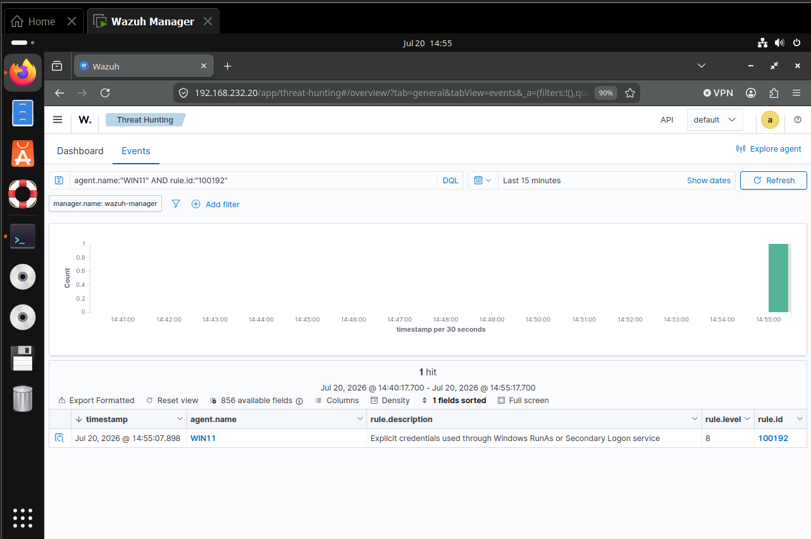
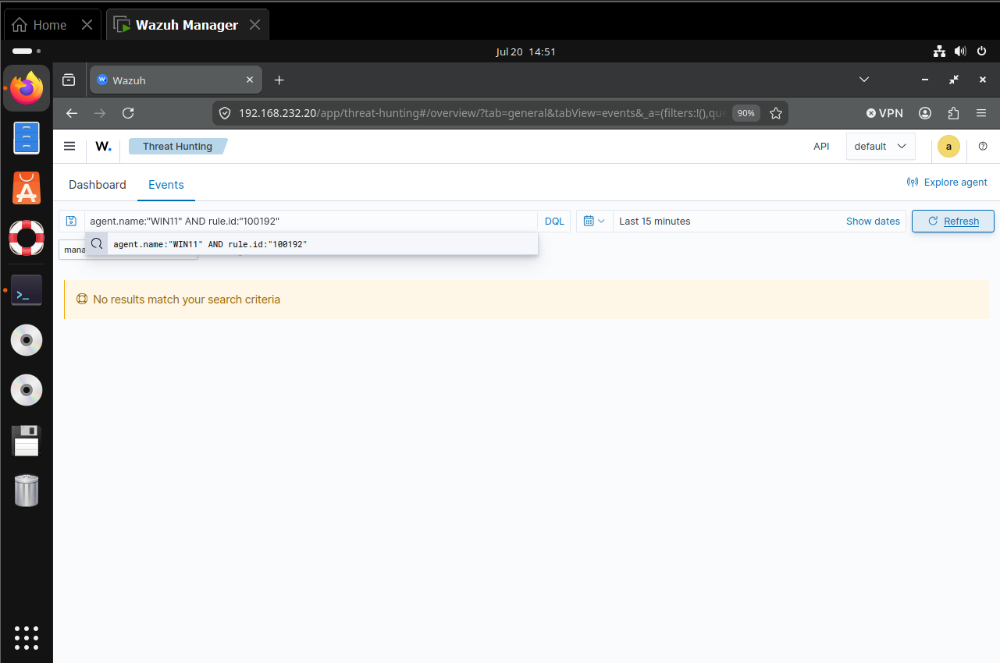
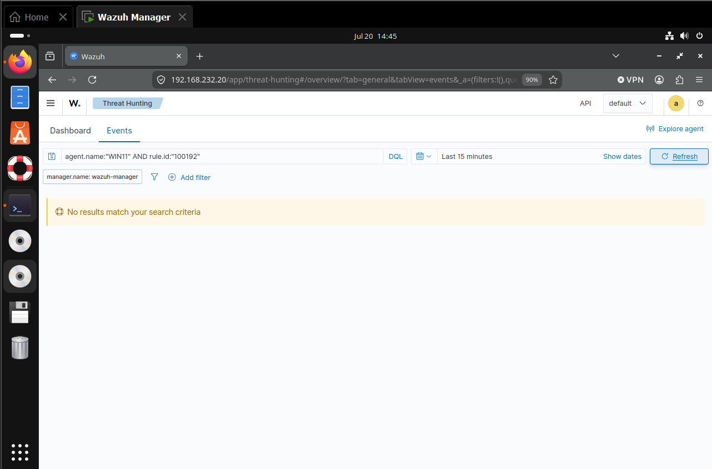
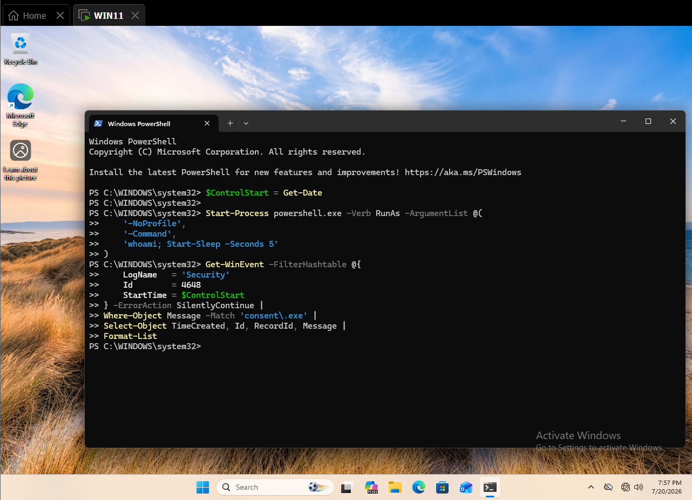

# Detecting Explicit Credential Use with Windows Security Events and Wazuh

This case study validates a behavioral signal associated with MITRE ATT&CK `T1078 — Valid Accounts`: explicit credential use through Windows RunAs and the Secondary Logon service.

## Result

A bounded `runas` test using an existing authorized domain account generated Windows Security Event `4648`. Wazuh collected the event, and custom rule `100192` produced a level `8` alert mapped to T1078. A fresh `lsass.exe` Event `4648` served as the negative control and produced no alert.

| Validation point | Observed result |
|---|---|
| Endpoint | `WIN11.corp.local` |
| Source account | `CORP\Administrator` |
| Target account | `CORP\alice.johnson` |
| Primary telemetry | Security Event ID `4648` |
| Positive process | `C:\Windows\System32\svchost.exe` |
| Detection | Rule `100192`, level `8` |
| ATT&CK mapping | `T1078 — Valid Accounts` |
| Positive time | July 20, 2026 at `14:55:07` EDT |
| Positive record | `306280` |
| Negative control | Event `4648`, `lsass.exe`, record `306538` |
| Control alert count | `0` |



*Figure 1. One level 8 rule `100192` alert generated by the bounded RunAs test.*

## Objective and hypothesis

The objective was to detect explicit use of credentials without treating every successful logon as suspicious. The hypothesis was that Windows would record Event `4648`, Wazuh would preserve the decoded account and process fields, and a child of the active audit-success hierarchy could elevate Secondary Logon behavior while excluding routine session authentication.

This rule is a behavioral review signal. It does not prove credential theft, account compromise, or malicious intent.

## Endpoint telemetry
WIN11 had Security Log collection enabled and Logon auditing configured for success and failure. Local review found Events `4624` and `4648`. Manager archives contained 36 Event `4624` records and three Event `4648` records during readiness checks, but Threat Hunting initially returned no result because the `4648` events had no alerting rule.


*Figure 2. Event `4648` absent from the alert index despite confirmed archive collection.*

The decoded event retained the target account, target domain, target server, process, and network address. This separated telemetry collection from alert generation and justified a custom analytic.

## Troubleshooting and detection engineering
Several live iterations were required because Wazuh evaluates Windows events through an existing hierarchy:

| Iteration | Observation | Correction |
|---|---|---|
| 1 | T1078 rules were inserted before T1105 closed | Restored valid XML structure and moved T1078 outside T1105 |
| 2 | Rule matched only `runas.exe` | Added `svchost.exe`, the observed Secondary Logon process |
| 3 | Standalone decoder rule did not fire | Attached the rule to the Windows Security hierarchy |
| 4 | Parent `60001` still did not win | Identified `60103` as the active audit-success classifier |
| 5 | Fresh activity after parent correction | Rule `100192` generated the expected alert |



*Figure 3. No alert while the custom rule was attached above the active audit-success classifier.*



*Figure 4. A final pre-correction test retained as troubleshooting evidence.*

### Validated hierarchy

```text
60000 — Windows event channel
└── 60001 — Windows Security channel
    └── 60103 — Windows audit success event
        └── 100192 — explicit credentials through RunAs/Secondary Logon
```

### Final rule

```xml
<rule id="100192" level="8">
  <if_sid>60103</if_sid>
  <field name="win.system.eventID">^4648$</field>
  <field name="win.eventdata.processName"
         type="pcre2">(?i)(runas|svchost)\.exe$</field>
  <description>Explicit credentials used through Windows RunAs or Secondary Logon service</description>
  <mitre>
    <id>T1078</id>
  </mitre>
  <group>defense_evasion,persistence,privilege_escalation,initial_access,valid_accounts,explicit_credentials,</group>
</rule>
```

## Positive validation

The final test used:

```powershell
runas /user:CORP\alice.johnson "cmd.exe /c whoami"
```

Windows attributed the credential operation to `svchost.exe`, consistent with the Secondary Logon service. Wazuh generated one alert with rule `100192`, level `8`, and T1078 enrichment. The raw alert is preserved in [t1078-positive-alert.json](evidence/t1078-positive-alert.json).

## Negative control

An attempted `consent.exe` control did not generate a new Event `4648` on this host and was not represented as a successful test.



*Figure 5. Local query confirming that the attempted consent path produced no qualifying event.*

The validated control instead used a fresh Event `4648` generated during routine session authentication and attributed to `lsass.exe`. Archive record `306538` arrived after rule activation. A direct search of `alerts.json` for the same record returned a count of `0`. The raw control is preserved in [t1078-negative-lsass-archive.json](evidence/t1078-negative-lsass-archive.json).

This proves discrimination for the tested LSASS path; it does not establish a production false-positive rate.

## False positives and triage

Legitimate explicit-credential use includes administrator RunAs activity, help-desk support, software installation, scheduled tasks, service configuration, deployment automation, and incident response.

Analysts should review:

- the source and target accounts and whether cross-account use was expected;
- the initiating endpoint, target server, source address, and logon time;
- the process using the credentials and its parent process;
- whether the target account is privileged, dormant, new, or unusual for the host;
- nearby successful logons, remote service access, process creation, and privilege assignment;
- repetition across hosts or multiple target accounts;
- approved maintenance windows and administrator workflows.

## Engineering considerations

- Event `4648` indicates explicit credentials, not credential compromise.
- Extend the active `60103` audit-success branch instead of competing with the Windows decoder hierarchy.
- `svchost.exe` is broad; production deployment should add service/process lineage, source-account, target-account, host-role, and frequency context.
- Do not alert on routine `lsass.exe` or `consent.exe` paths without additional suspicious context.
- Generate fresh activity after every rule change because archived events are not reevaluated.
- Resolve the manager's pre-existing duplicate rule IDs `100201–100210` and invalid parents for `100212` and `100214` separately.

## Cleanup

The simulation created no users, password changes, files, services, scheduled tasks, listeners, mappings, or persistent processes. The transient `whoami` child exited immediately.

## Evidence inventory

| Evidence | Purpose |
|---|---|
| `01-initial-4648-no-alert.png` | Initial alert gap |
| `02-parent-60001-no-alert.png` | First parent-rule attempt |
| `03-parent-60103-prevalidation-no-alert.png` | Final troubleshooting iteration |
| `04-positive-t1078-rule-100192.png` | Successful level 8 alert |
| `05-negative-control-consent-no-alert.png` | Dashboard exclusion query retained as context |
| `06-consent-control-not-generated.png` | Proof the attempted consent path generated no local event |
| `t1078-positive-alert.json` | Raw positive alert |
| `t1078-negative-lsass-archive.json` | Raw negative-control archive event |

## Reproduction

See [T1078-Valid-Accounts-Lab-Runbook.md](T1078-Valid-Accounts-Lab-Runbook.md) and [detection-rules.xml](detection-rules.xml).

## Lab environment

The validated environment, hosts, and telemetry sources are documented in the surrounding simulation and telemetry sections. No additional infrastructure was introduced for this case study.

## Safe simulation

The positive test used only the benign commands and markers documented elsewhere in this README. No destructive payload, persistence beyond the test window, or real credential material was used.

## Wazuh hunt and collection validation

Collection and alert validation used the agent, event fields, rule identifiers, and dashboard evidence documented in the positive-validation and telemetry sections.

## Timeline

Use the timestamps and record identifiers in the endpoint and Wazuh evidence as the authoritative validation timeline.

## Findings

The case study demonstrates the result stated above within the documented lab conditions. Conclusions should not be extended to telemetry sources or execution variants that were not tested.
