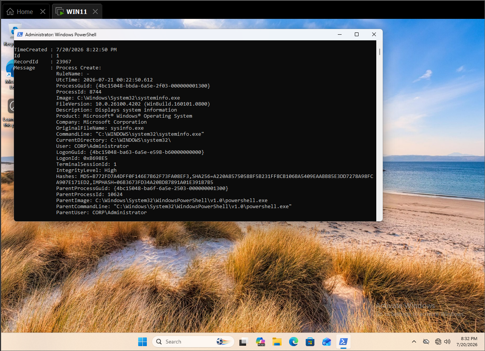
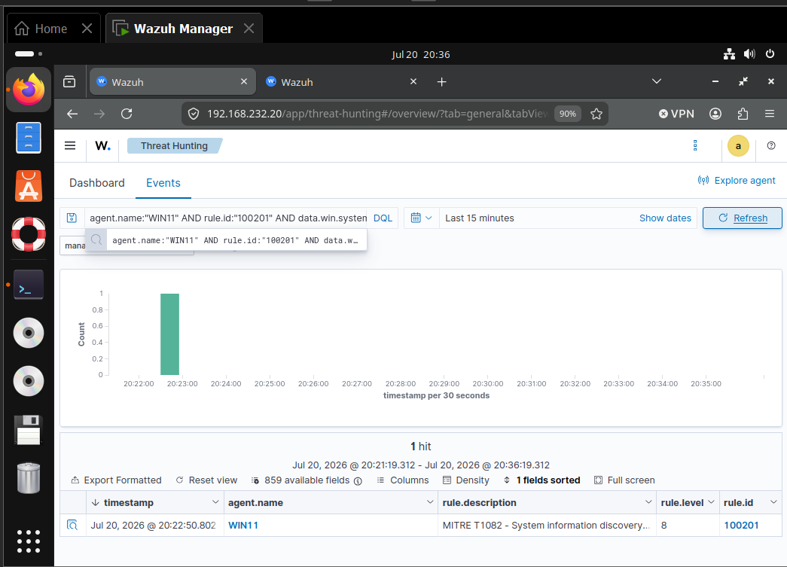
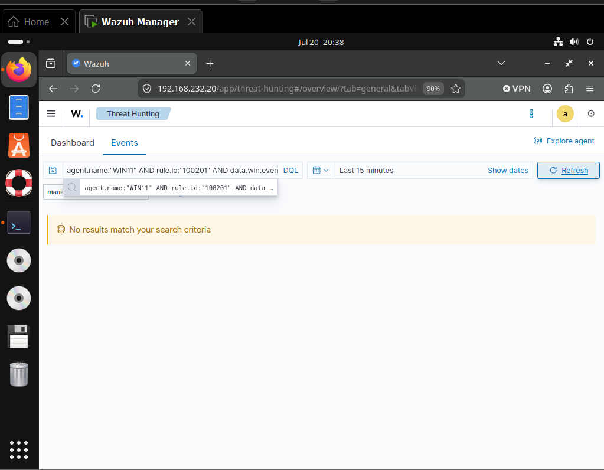

# Detecting System Information Discovery with Sysmon and Wazuh

This case study validates detection of Windows system-information discovery and maps the resulting Wazuh alert to MITRE ATT&CK `T1082 — System Information Discovery`.

## Result

A read-only `systeminfo.exe` simulation generated Sysmon Event ID `1`. Wazuh collected the process metadata and produced a level `8` alert under rule `100201`, mapped to T1082. A `whoami.exe` control did not trigger the T1082 rule; Wazuh correctly routed it to T1087 Account Discovery rule `100206` instead.

| Validation point | Observed result |
|---|---|
| Endpoint | `WIN11.corp.local` |
| Positive command | `systeminfo.exe` |
| Primary telemetry | Sysmon Event ID `1` |
| Positive record | `23967` |
| Positive user | `CORP\Administrator` |
| Positive parent | `powershell.exe` |
| Detection | Rule `100201`, level `8` |
| ATT&CK mapping | `T1082 — System Information Discovery` |
| Positive time | July 20, 2026 at `20:22:50` EDT |
| Negative control | `whoami.exe`, record `23978` |
| Control disposition | Rule `100206`, T1087; no rule `100201` alert |



*Figure 1. Local Sysmon Event 1 for `systeminfo.exe`, including command line, user, integrity, hashes, and PowerShell parent.*



*Figure 2. One level 8 T1082 alert generated by rule `100201`.*



*Figure 3. No T1082 rule `100201` result for the `whoami.exe` control.*

## Objective and hypothesis
Sysmon should retain execution of a built-in system-information utility. Wazuh should collect the process event, classify `systeminfo.exe` as T1082, and avoid classifying a nearby account-discovery utility as the same technique.

The analytic identifies discovery behavior for review. It does not establish malicious intent because administrators, inventory systems, support tooling, installers, and diagnostic workflows legitimately query system information.

## Endpoint telemetry
The positive event retained:

- image `C:\Windows\System32\systeminfo.exe`;
- command line `"C:\WINDOWS\system32\systeminfo.exe"`;
- user `CORP\Administrator`;
- high integrity;
- PowerShell parent process;
- process and parent identifiers;
- MD5, SHA-256, and IMPHASH values;
- Sysmon record ID `23967`.

The raw positive alert is preserved in [t1082-positive-alert-23967.json](evidence/t1082-positive-alert-23967.json).

## Troubleshooting and detection engineering
```xml
<rule id="100201" level="8">
  <if_group>sysmon_event1</if_group>
  <field name="win.eventdata.image"
         type="pcre2">(?i)\(systeminfo|hostname)\.exe$</field>
  <description>MITRE T1082 - System information discovery tool executed</description>
  <mitre>
    <id>T1082</id>
  </mitre>
  <group>discovery,system_information_discovery,</group>
</rule>
```

## Positive validation

The bounded simulation ran:

```powershell
systeminfo.exe
```

Wazuh produced rule `100201`, level `8`, with ATT&CK tactic Discovery and technique System Information Discovery. The matching alert timestamp was `2026-07-20T20:22:50.802-0400`.

## Negative control
The control ran:

```powershell
whoami.exe
```

Sysmon recorded the process as Event `1`, record `23978`. Wazuh generated rule `100206`, level `8`, mapped to T1087 Account Discovery. A targeted query for rule `100201` combined with `whoami.exe` returned no result.

The raw control record is preserved in [t1082-negative-whoami-23978.json](evidence/t1082-negative-whoami-23978.json). This is stronger than an absent event: it proves the control reached the detection pipeline and was assigned to a different, appropriate analytic.

## False positives and triage

Legitimate sources include:

- asset inventory and configuration management;
- administrator troubleshooting;
- support scripts and diagnostic collections;
- installers and compatibility checks;
- vulnerability scanners and compliance tooling;
- incident-response evidence collection.

Analysts should review the user, parent and grandparent process, command line, host role, execution frequency, remote origin, nearby discovery commands, subsequent credential access, and whether the activity matches approved tooling.

## Engineering considerations
- Matching the full image name gives the rule clear behavioral scope.
- The control demonstrated useful separation between T1082 and T1087.
- The manager contains duplicate ID `100201` in `mitre_detection_rules.xml` and `mitre_sysmon_rules.xml`. Only the first occurrence is considered; remove or renumber the duplicate before production deployment.
- Similar duplicate IDs `100201–100210` remain a broader ruleset-hygiene issue.
- Generate fresh activity after every rule change because Wazuh does not retroactively reevaluate archived events.
- Production tuning should consider host role, parent process, user context, frequency, and approved inventory tools.

## Cleanup

Both commands were read-only and exited immediately. No files, services, users, registry values, listeners, scheduled tasks, or persistent processes were created.

## Evidence inventory

| Artifact | Purpose |
|---|---|
| `screenshots/007-fresh-systeminfo-sysmon-event.png` | Local positive telemetry |
| `screenshots/008-positive-t1082-rule-100201.png` | Positive Wazuh alert |
| `screenshots/009-negative-whoami-no-t1082-alert.png` | T1082 exclusion query |
| `evidence/t1082-positive-alert-23967.json` | Raw positive alert |
| `evidence/t1082-negative-whoami-23978.json` | Raw control alert routed to T1087 |

## Reproduction

See [T1082-System-Information-Discovery-Lab-Runbook.md](T1082-System-Information-Discovery-Lab-Runbook.md) and [detection-rules.xml](detection-rules.xml).

## Lab environment

The validated environment, hosts, and telemetry sources are documented in the surrounding simulation and telemetry sections. No additional infrastructure was introduced for this case study.

## Safe simulation

The positive test used only the benign commands and markers documented elsewhere in this README. No destructive payload, persistence beyond the test window, or real credential material was used.

## Wazuh hunt and collection validation

Collection and alert validation used the agent, event fields, rule identifiers, and dashboard evidence documented in the positive-validation and telemetry sections.

## Timeline

Use the timestamps and record identifiers in the endpoint and Wazuh evidence as the authoritative validation timeline.

## Findings

The case study demonstrates the result stated above within the documented lab conditions. Conclusions should not be extended to telemetry sources or execution variants that were not tested.
