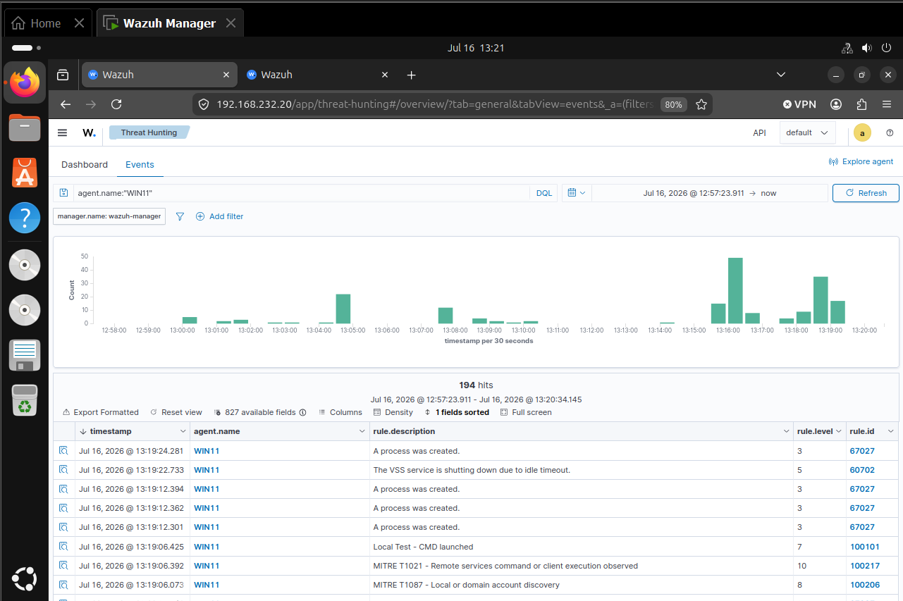
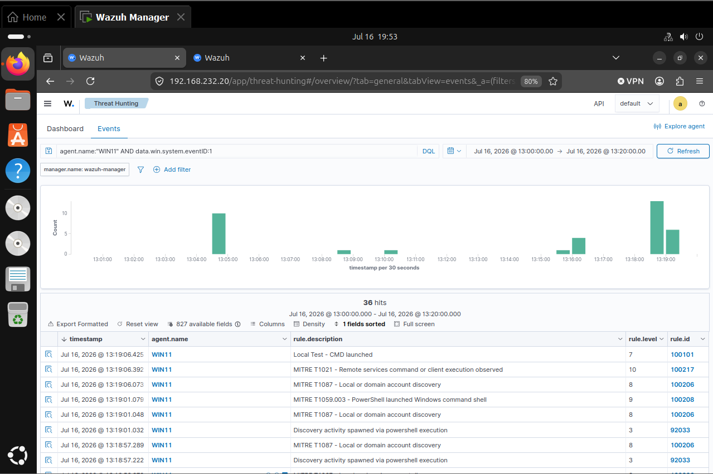
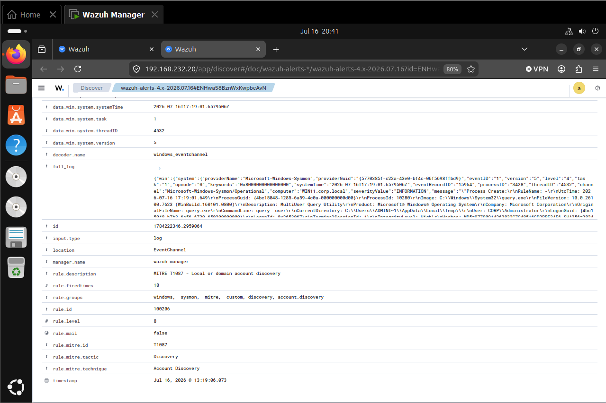

# Case Study 03 — MITRE ATT&CK T1087.001: Local Account Discovery

# 1. MITRE ATT&CK Detection Engineering Case Study

**Portfolio:** Enterprise Security Engineering Portfolio
**Project:** Active Directory Attack & Defense Laboratory
**Case Study:** 03
**Technique ID:** T1087.001
**Technique Name:** Local Account Discovery
**Tactic:** Discovery
**Status:** In Progress
**Date Started:** 2026-07-16
**Author:** Josh Carroll

## MITRE ATT&CK Information
Technique ID: T1087.001

Technique Name:
Local Account Discovery

ATT&CK Tactic:
Discovery

Reference:
https://attack.mitre.org/techniques/T1087/001/

# 2. Executive Summary

This case study validates the organization's ability to detect Local Account Discovery activity using Microsoft Sysmon and Wazuh.

A controlled Atomic Red Team simulation was executed on the WIN11 endpoint to enumerate local user accounts. Endpoint telemetry generated by Sysmon was successfully forwarded to the Wazuh Manager, where a custom detection rule identified the activity and mapped it to MITRE ATT&CK Technique T1087.001.

The exercise demonstrates successful end-to-end validation of endpoint visibility, centralized log collection, ATT&CK-based detection engineering, and analyst threat-hunting capabilities.

# 3. Attack Scenario

Assume an attacker has obtained interactive access to WIN11 using valid credentials.

Prior to attempting privilege escalation or credential theft, the attacker enumerates local accounts to identify privileged users, default administrator accounts, disabled accounts, and service accounts that may provide additional attack opportunities.

# 4. Detection Objective

Validate that Local Account Discovery activity is detected through:

• Sysmon Process Creation telemetry

• Wazuh Event Collection

• ATT&CK Mapping

• Threat Hunting

• Custom Detection Rules

Analysts should be able to determine:

- User
- Process
- Parent Process
- Command Line
- Host
- Timestamp
- ATT&CK Technique

# 5. Lab Environment

| Component | Value |
|------------|-------------|
| Hypervisor | VMware Workstation Pro |
| Endpoint | WIN11 |
| Domain | corp.local |
| User | CORP\Administrator |
| Sysmon | Installed |
| Wazuh Agent | Running |
| Wazuh Manager | Ubuntu Server |
| Test Date | 2026-07-16 |

## 8. Commands Executed

```powershell
Invoke-AtomicTest T1087.001 `
  -PathToAtomicsFolder "C:\AtomicRedTeam\atomics" `
  -TestNumbers 8, 9, 10, 11
  ```
**Execution Time:** 13:07:00.00  
**Endpoint:** WIN11
**User:** WIN11/Administrator
**Execution Result:** Success
**Observed Command:** "executing test: T1087.001-8 Enumerate all accounts on Windows (Local)" 

**Evidence**

### Figure 1. Atomic Red Team Test Execution

**Filename:** `02-test-execution.png`

> **Figure 1.** Atomic Red Team execution of **MITRE ATT&CK T1087.001 – Local Account Discovery** on the WIN11 endpoint. The PowerShell session shows successful execution of the controlled simulation, generating account-enumeration activity for detection validation.

## 9. Actual Sysmon Telemetry

| Field | Observed Value |
|---|---|
| Event ID | 1 |
| Event type | Process Create |
| UTC time | 2026-07-16 17:19:01.649 |
| Image | C:\Windows\System32\query.exe |
| Command line | "query user" |
| Parent image | "C:\Windows\System32\cmd.exe |
| Parent command line | "cmd.exe" /c query user" |
| User | SYSTEM |
| Computer | WIN11.corp.local |
| Process ID | 10280 |
| Process GUID | {4bc15048-1285-6a59-4c0a-000000000d00} |

**Evidence**

### Figure 3. Sysmon Process Creation Event

**Filename:** `04-sysmon-event.png`

> **Figure 3.** Sysmon Event ID 1 (Process Create) generated during the Local Account Discovery simulation. The event records execution of `query.exe`, including the command line, parent process, executing user, process identifier, and timestamp used during forensic analysis.


## 10. Wazuh Validation

| Field | Observed Value |
|---|---|
| Detection Successful | Yes |
| Agent | WIN11 |
| Agent ID | 002 |
| Rule ID | 100206 |
| Rule Name | MITRE T1087 - Local or Domain Account Discovery |
| Rule Level | 8 |
| MITRE Technique | T1057 - Account Discovery |
| MITRE Tactic | Discovery |
| Event Source | Microsoft-Windows-Sysmon |
| Event ID | 1 |
| Process Image | C:\Windows\System32\query.exe |
| Command Line | query user |
| Parent Process | C:\Windows\System32\cmd.exe |
| Parent Command Line | "cmd.exe" /c query user |
| User | CORP\Administrator |
| Host | WIN11.corp.local |
| Process ID | 10280 |
| Detection Status | Successfully Detected |

**Evidence**
 

### Figure 3. Wazuh Dashboard Detection

**Filename:** `03-wazuh-dashboard-event.png`

> **Figure 2.** Wazuh Dashboard displaying the generated Local Account Discovery alert. The dashboard confirms successful event collection, rule correlation, and availability of the detection for analyst investigation.
### Figure 4. Wazuh Alert Details

**Filename:** `05-wazuh-event.png`

> **Figure 4.** Expanded Wazuh alert generated from Sysmon telemetry. Custom Rule **100206** identified the activity as **MITRE T1087 – Local or Domain Account Discovery**, assigning a severity level of **8** and mapping the event to the Discovery tactic.


## Hunt Findings

The Local Account Discovery simulation successfully generated Sysmon Process Create telemetry on the `WIN11` endpoint. The Wazuh agent forwarded the events to the Wazuh Manager, where custom detection Rule **100206** identified the activity as Local or Domain Account Discovery.

Multiple matching detections were observed during the test window, including events at approximately:

- July 16, 2026 @ 13:18:57
- July 16, 2026 @ 13:19:01
- July 16, 2026 @ 13:19:06

### Observed Evidence

| Finding | Observation |
|---|---|
| Endpoint | WIN11 |
| Event Source | Microsoft-Windows-Sysmon |
| Event Type | Sysmon Process Create |
| Sysmon Event ID | 1 |
| Process | `[COPY data.win.eventdata.image FROM THE EXPANDED EVENT]` |
| Command Line | `[COPY data.win.eventdata.commandLine FROM THE EXPANDED EVENT]` |
| Parent Process | `[COPY data.win.eventdata.parentImage FROM THE EXPANDED EVENT]` |
| Parent Command Line | `[COPY data.win.eventdata.parentCommandLine FROM THE EXPANDED EVENT]` |
| User | `[COPY data.win.eventdata.user FROM THE EXPANDED EVENT]` |
| Rule ID | 100206 |
| Rule Description | MITRE T1087 - Local or domain account discovery |
| Rule Level | 8 |
| ATT&CK Tactic | Discovery |
| Wazuh MITRE Mapping | T1087 |
| Case Study Technique | T1087.001 – Local Account Discovery |
| Detection Status | Successfully detected |

### Hunt Queries

The following queries successfully located the relevant activity:

```text
agent.name:"WIN11" AND data.win.system.eventID:1
agent.name:"WIN11" AND rule.mitre.id:T1087
agent.name:"WIN11" AND rule.id:100206
agent.name:"WIN11" AND rule.description:"MITRE T1087 - Local or domain account discovery"
```
**Evidence**

### Figure 5. Threat Hunting Results

**Filename:** `06-T1087-threat-hunting.png`

> **Figure 5.** Wazuh Threat Hunting results for the WIN11 endpoint. Analyst queries successfully identified Sysmon Event ID 1 process-creation telemetry and ATT&CK-mapped Rule **100206**, confirming successful detection, log ingestion, and investigation of Local Account Discovery activity.

## MITRE Mapping

| Field | Value |
|---|---|
| ATT&CK Domain | Enterprise |
| Tactic | Discovery |
| Parent Technique | T1087 – Account Discovery |
| Sub-technique | T1087.001 – Local Account |
| Technique Purpose | Enumerate local user accounts on a compromised system |
| Primary Data Source | Process Creation |
| Supporting Data | Command line, parent process, user context, host, execution time |
| Simulation Tool | Atomic Red Team |
| Detection Source | Sysmon and Wazuh |
| Wazuh Rule ID | 100206 |
| Wazuh Rule Description | MITRE T1087 - Local or domain account discovery |
| Wazuh Rule Level | 8 |
| Detection Status | Validated |
**Evidence**


**Figure 6.** MITRE ATT&CK mapping for the Local Account Discovery simulation. Wazuh Rule **100206** classified the observed activity under **MITRE ATT&CK T1087 – Account Discovery** within the **Discovery** tactic. The case study documents the more specific sub-technique **T1087.001 – Local Account Discovery**, as the executed Atomic Red Team simulation enumerated local user accounts on the WIN11 endpoint. This mapping validates that the custom detection rule successfully correlates Sysmon process-creation telemetry with ATT&CK-aligned detection engineering.

### ATT&CK Mapping Note

Wazuh Rule 100206 is labeled:

`MITRE T1087 - Local or domain account discovery`

This rule maps to the parent technique **T1087**. The simulation itself is documented as **T1087.001 – Local Account Discovery** because the successful Windows test enumerated accounts and groups on the local endpoint.

Domain enumeration using commands such as `net user /domain` would instead map to **T1087.002 – Domain Account Discovery**. :contentReference[oaicite:2]{index=2}

## Detection Analysis

The Atomic Red Team simulation successfully validated Local Account Discovery detection.

Sysmon captured Event ID 1 for the executed discovery command, including the executable path, command line, parent process, user context, and execution timestamp. Wazuh ingested the event and made it available for investigation through Threat Hunting. If a custom ATT&CK-mapped rule is present, document the rule ID, severity, and MITRE mapping.

The exercise demonstrated successful visibility into account enumeration activity and confirmed that the logging pipeline—from endpoint to Wazuh Manager—was functioning correctly.

## Incident Response

1. Identify the endpoint and user that executed the command.
2. Determine whether the account is authorized to perform administrative tasks.
3. Review the parent process and command line.
4. Investigate authentication events immediately before execution.
5. Search for additional Discovery techniques.
6. Check for Privilege Escalation or Credential Access attempts.
7. Determine whether the activity is associated with an approved administrative task.
8. Escalate if unauthorized activity is identified.

## False Positives

Legitimate execution of account-discovery commands may occur during:

- Help Desk support
- Windows administration
- System audits
- Configuration management
- Security assessments
- Authorized penetration testing

- Is the user authorized?
- Was the command executed during a maintenance window?
- Was the parent process expected?
- Were there additional suspicious commands?
- Was there suspicious authentication?

- Increase severity for standard-user accounts.
- Correlate account discovery with PowerShell execution.
- Correlate with credential-access techniques.
- Exclude approved management tools.
- Prioritize alerts on servers and domain controllers.

## 17. Timeline

| Time (Local) | Event | Source | Details |
|--------------|-------|--------|---------|
| 2026-07-16 13:04:34 | PowerShell transcript started | Windows PowerShell | Transcript initiated as `CORP\Administrator` on WIN11. |
| 2026-07-16 13:04:35 | Atomic Red Team Test #8 executed | Atomic Red Team | Executed **T1087.001-8 – Enumerate all accounts on Windows (Local)**. |
| 2026-07-16 13:04:35 | Local account enumeration | Windows (`net user`) | Enumerated local user accounts including Administrator, Guest, DefaultAccount, WDAGUtilityAccount, joshc, win11, and WsiAccount. |
| 2026-07-16 13:04:36 | Local group enumeration | Windows (`net localgroup`) | Enumerated built-in local groups including Administrators, Backup Operators, Event Log Readers, Hyper-V Administrators, Remote Desktop Users, and Users. |
| 2026-07-16 13:04:37 | Stored credential check | Windows (`cmdkey`) | Checked Credential Manager; no stored credentials were found (`* NONE *`). |
| 2026-07-16 13:04:38 | Test #8 completed | Atomic Red Team | Local account enumeration completed successfully (Exit Code 0). |
| 2026-07-16 13:18:57 | Custom detection generated | Wazuh | Rule **100206** triggered for **MITRE T1087 – Local or Domain Account Discovery** (Rule Level 8). |
| 2026-07-16 13:19:01 | Additional discovery detected | Wazuh | Additional T1087 discovery activity correlated with PowerShell execution. |
| 2026-07-16 13:19:06 | Command execution detected | Wazuh | Correlated detections included CMD launch (Rule 100101), PowerShell launching CMD (Rule 100208), and Remote Services execution (Rule 100217). |
| 2026-07-16 13:19:07 | Threat hunt performed | Wazuh Dashboard | Analyst validated Rule 100206, Sysmon Event ID 1 telemetry, command line, user context, and ATT&CK mapping. |
| 2026-07-16 13:19:10 | Detection validation completed | Analyst | Confirmed successful end-to-end detection from Sysmon through Wazuh with ATT&CK mapping to T1087.001. |

### Timeline Analysis

The T1087.001 Local Account Discovery simulation successfully demonstrated end-to-end visibility into account-enumeration activity.

The Atomic Red Team simulation executed multiple native Windows account-discovery commands, including local user enumeration, local group enumeration, and a stored-credential check. Sysmon captured the resulting process-creation events (Event ID 1), which were forwarded by the Wazuh agent and processed by the Wazuh Manager.

Custom Wazuh Rule **100206** classified the activity as **MITRE ATT&CK T1087 – Local or Domain Account Discovery** with a severity level of **8**. Additional correlated detections identified the command shell launch, PowerShell execution, and related command execution, providing analysts with valuable execution context.

Threat hunting confirmed that the activity originated from the authorized `CORP\Administrator` account on the WIN11 endpoint. Review of surrounding events did not identify unauthorized privilege escalation, credential access, or lateral movement, indicating that the activity was consistent with the planned Atomic Red Team simulation.

### Timeline Evidence

- **Endpoint:** WIN11.corp.local
- **Executing User:** CORP\Administrator
- **Atomic Tests Executed:** T1087.001 Tests 8–11
- **Successful Windows Test:** Test 8 – Enumerate all accounts on Windows (Local)
- **Primary Commands Executed:** `net user`, `net localgroup`, `cmdkey`
- **Sysmon Event:** Event ID 1 (Process Create)
- **Detection Rule:** 100206
- **Rule Description:** MITRE T1087 - Local or domain account discovery
- **Rule Level:** 8
- **MITRE ATT&CK Technique:** T1087.001 – Local Account Discovery
- **ATT&CK Tactic:** Discovery
- **Detection Status:** Successful
- **Supporting Correlated Rules:**
  - Rule 100101 – Local Test - CMD launched
  - Rule 100208 – MITRE T1059.003 - PowerShell launched Windows command shell
  - Rule 100217 – MITRE T1021 - Remote services command or client execution observed

## Tuning Considerations
- Increase severity for standard-user accounts.
- Correlate account discovery with PowerShell execution.
- Correlate with credential-access techniques.
- Exclude approved management tools.
- Prioritize alerts on servers and domain controllers.

## Security Engineering Improvements

- Create ATT&CK-mapped detection rules for all account-enumeration commands.
- Correlate multiple Discovery techniques within a five-minute window.
- Develop Sigma rules equivalent to custom Wazuh detections.
- Measure detection latency for Discovery techniques.
- Expand ATT&CK coverage reporting across the Discovery tactic.