# Detecting PowerShell Ingress Tool Transfer with Sysmon and Wazuh

This lab validated a benign HTTP file transfer from a temporary server to a Windows endpoint, confirmed the available Sysmon and PowerShell telemetry, and implemented an alert mapped to MITRE ATT&CK `T1105 – Ingress Tool Transfer`.

## Result

The positive test produced a level 8 Wazuh alert under custom rule `100161`. PowerShell Event ID `4104` retained `Invoke-WebRequest` and `-OutFile`. A request that retrieved the same content without writing a file exercised the baseline condition without producing the elevated transfer alert.

| Validation point | Observed result |
|---|---|
| Network path | WIN11 reached `192.168.232.20:8000` |
| Transfer | Benign text file downloaded successfully |
| Integrity | Endpoint SHA-256 recorded for comparison with the source |
| Network telemetry | Sysmon Event ID `3` present in Wazuh archives |
| PowerShell telemetry | Event ID `4104` present in Wazuh archives |
| File-creation telemetry | No matching Sysmon Event ID `11` |
| Initial dedicated alert | Not generated |
| Final detection | Rule `100161`, level `8` |
| ATT&CK mapping | `T1105`, Command and Control |
| Negative control | No elevated file-transfer alert |
| Cleanup | Endpoint artifacts and temporary server removed |

## Objective and hypothesis

The objective was to distinguish transfer execution, telemetry collection, and dedicated alert generation. The hypothesis was that a benign PowerShell download would produce network and script-block telemetry; Wazuh would preserve those records; and a custom rule could elevate script blocks containing both a transfer utility and a local file-output operation.

The final analytic focused on:

- PowerShell Operational Event ID `4104`;
- a recognized transfer utility such as `Invoke-WebRequest`;
- a file-writing indicator such as `-OutFile`;
- ATT&CK enrichment for T1105.

## Lab environment

| Component | Observed value |
|---|---|
| Endpoint | `WIN11.corp.local` |
| Wazuh agent | `WIN11`, agent `002` |
| Wazuh manager | `wazuh-manager` |
| Wazuh version | `4.14.6` |
| Transfer server | `192.168.232.20:8000` |
| Protocol | HTTP on an isolated lab network |
| Source file | `benign-transfer.txt` |
| Destination | `C:\ProgramData\T1105-benign-transfer.txt` |
| Primary detection source | PowerShell Event ID `4104` |
| Supporting source | Sysmon Event ID `3` |

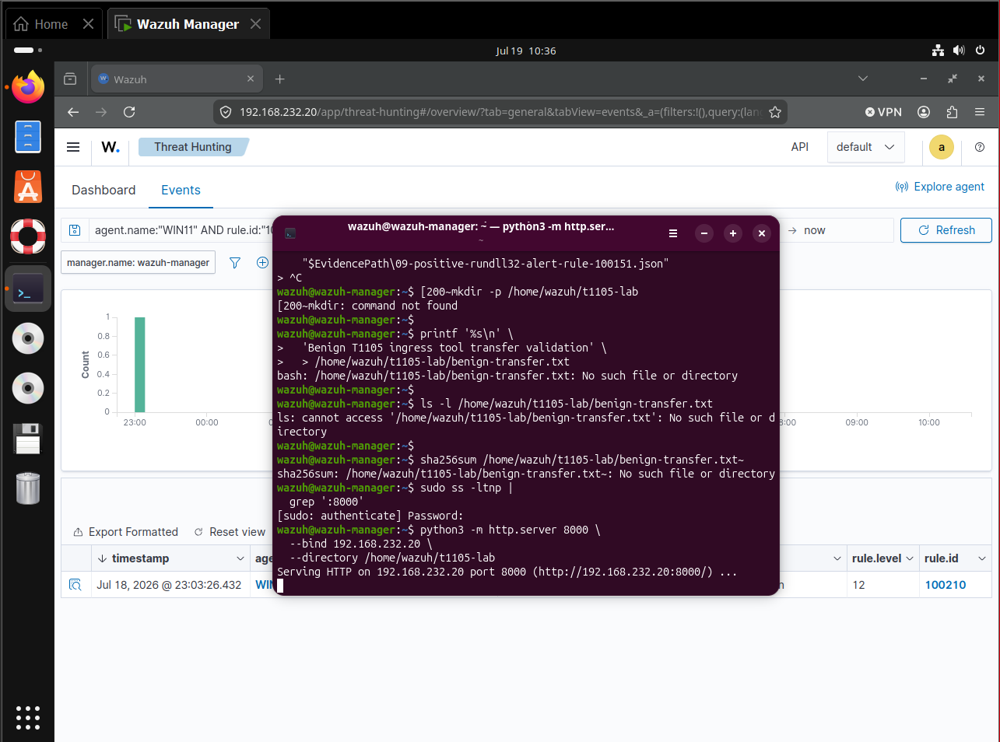

*Figure 1. Temporary server and benign source-file preparation on the Wazuh manager.*

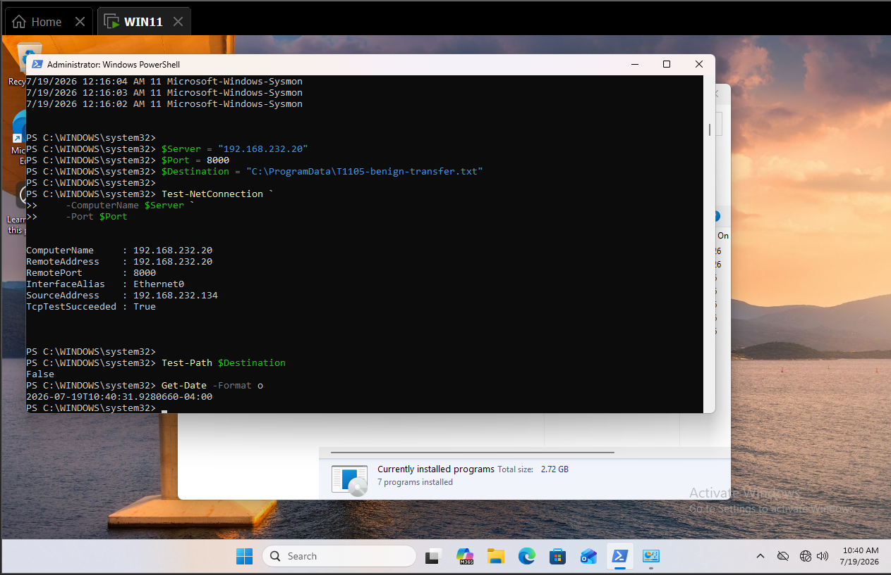

*Figure 2. WIN11 service readiness, telemetry availability, TCP connectivity, and destination baseline.*

## Safe simulation

The manager hosted a text file containing only a benign validation message. WIN11 downloaded it with `Invoke-WebRequest` to `C:\ProgramData`. No executable, script, credential, persistence mechanism, or external infrastructure was introduced.

The first request returned HTTP `404 File not found`. The network path worked, but the configured server directory did not exist. This attempt was retained as troubleshooting evidence and was not treated as a successful transfer.

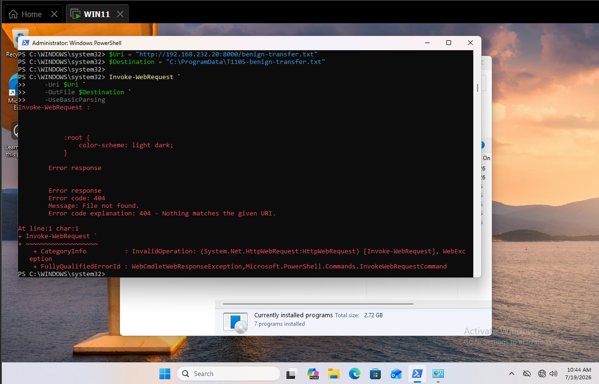

*Figure 3. Initial request reaching the server but receiving HTTP 404 because the hosted directory was absent.*

The directory and source file were recreated, permissions were verified, and the server returned HTTP `200 OK` before the transfer was repeated.

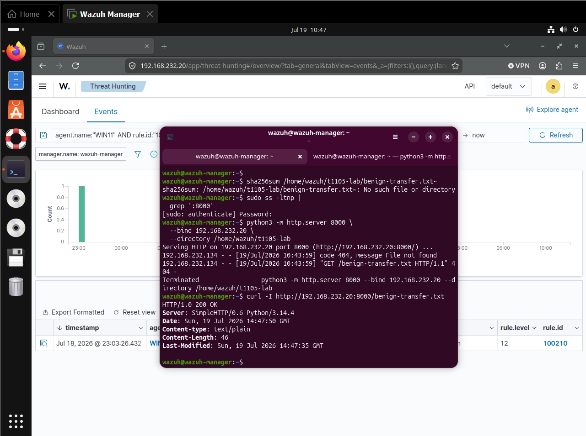

*Figure 4. Corrected server path and successful HTTP availability check.*

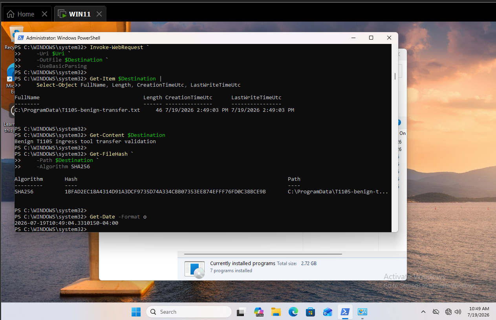

*Figure 5. Successful endpoint transfer showing the destination, benign content, timestamps, and SHA-256.*

## Endpoint telemetry

Sysmon Event ID `3` recorded the connection to `192.168.232.20:8000` and retained the initiating process and network context.

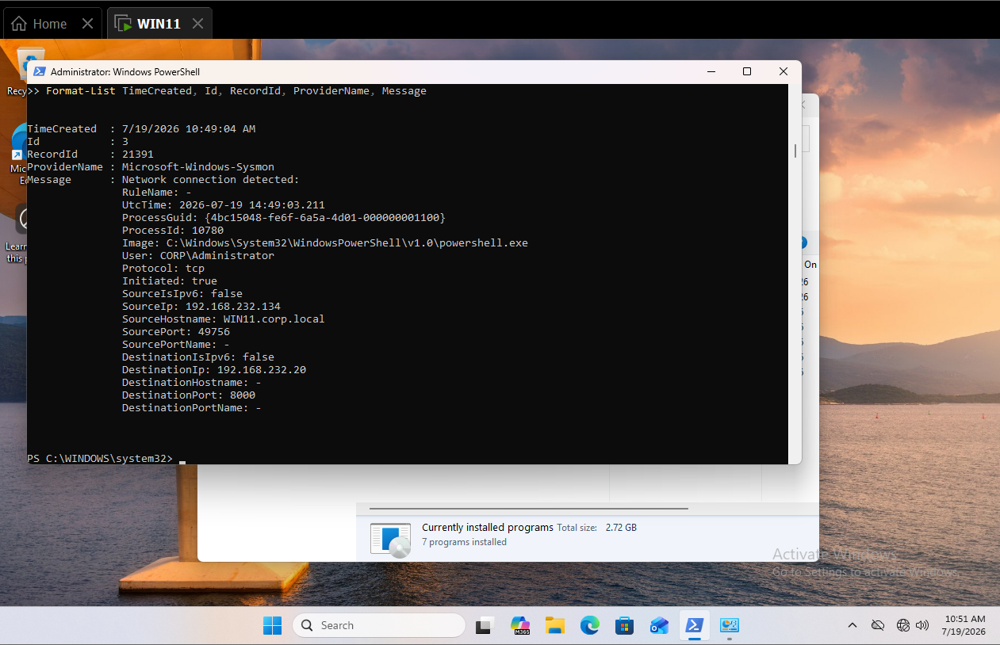

*Figure 6. Local Sysmon network telemetry associated with the HTTP transfer.*

A targeted Event ID `11` search did not return a matching file-creation record. This is preserved as a Sysmon configuration or collection gap, not interpreted as proof that the transfer failed.

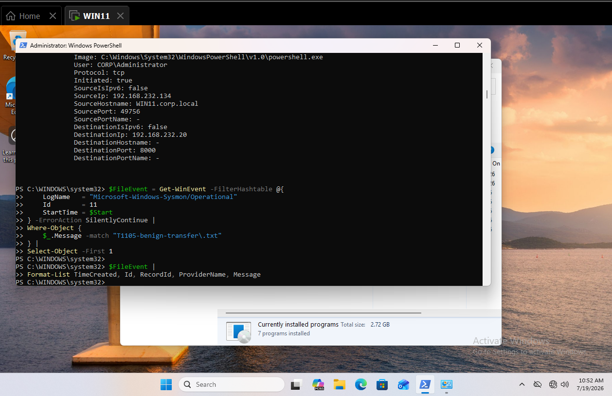

*Figure 7. Targeted Event ID `11` search used to evaluate file-creation coverage.*

The first exact PowerShell query also returned no match because Script Block Logging retained variable names rather than resolving each variable to its value. A broader search identified the relevant Event ID `4104` records.

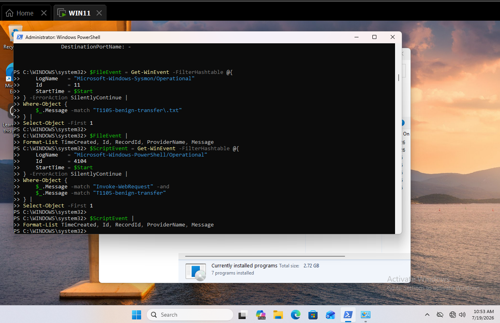

*Figure 8. Initial Event ID `11` and exact Event ID `4104` searches returning no matching output.*


*Figure 9. Broader Script Block search identifying the PowerShell transfer command.*

## Wazuh hunt and collection validation

Threat Hunting initially returned no matching transfer alert. Manager archive inspection established that this was not a collection failure.

```text
agent.name:"WIN11" AND data.win.system.eventID:"3"
```

Archive counts showed three matching Event ID `3` records, six Event ID `4104` records, and zero Event ID `11` records.

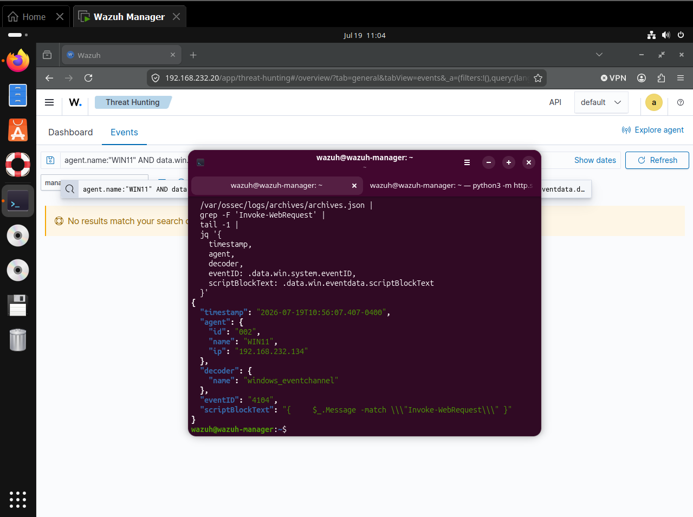

*Figure 10. Manager archive inspection distinguishing collection from alert generation.*

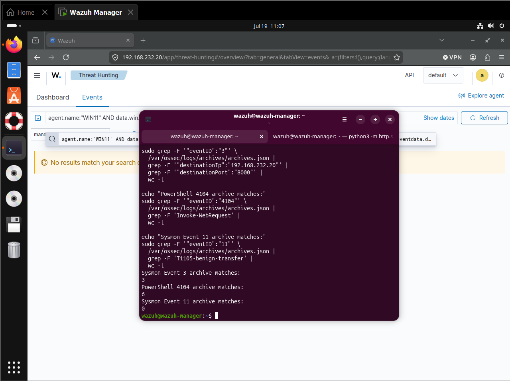

*Figure 11. Counts confirming network and PowerShell telemetry while documenting the Event ID `11` gap.*

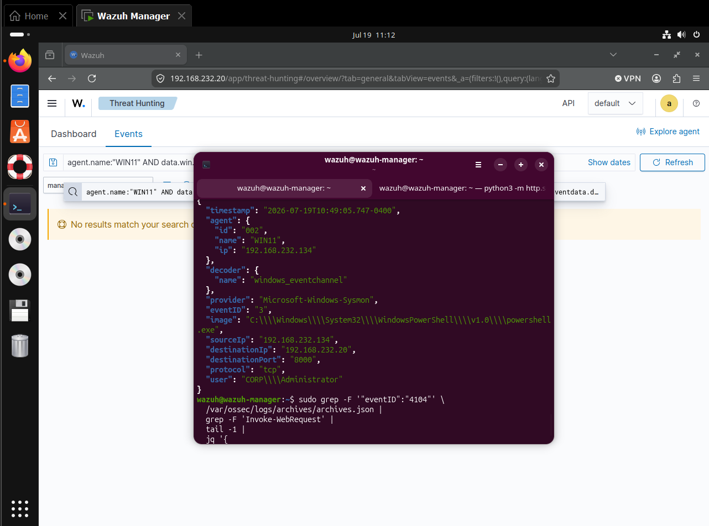

*Figure 12. Decoded fields used to develop the analytic against telemetry that actually arrived.*

## Troubleshooting and detection engineering

| Step | Observation | Action | Result |
|---|---|---|---|
| 1 | Initial request returned HTTP 404 | Checked server process, directory, file, permissions, and response | Missing directory identified and corrected |
| 2 | Dashboard returned no Event ID `3` result | Queried `archives.json` | Network collection confirmed |
| 3 | Exact local 4104 marker query returned nothing | Searched broadly for `Invoke-WebRequest` | Variable-based script block identified |
| 4 | Event ID `11` remained absent | Counted each archive source independently | File-creation gap documented |
| 5 | Standalone rules `100160` and `100161` loaded but did not alert | Compared the archived event with built-in PowerShell rules | Event was outside the active rule hierarchy |
| 6 | Built-in rule `91802` grouped Script Block events | Made `100160` a child of `91802` | Fresh validation generated rule `100161` |
| 7 | Positive result needed precision testing | Requested content without `-OutFile` | Elevated condition did not fire |

Pre-existing warnings for duplicated IDs `100201`–`100210` and invalid group references in rules `100212` and `100214` were observed. They were unrelated to the validated T1105 path and should be remediated separately.

### Validated rule hierarchy

```text
91801 — PowerShell Operational channel (level 0)
└── 91802 — PowerShell Script Block event (level 0)
    └── 100160 — transfer utility observed (custom level 5)
        └── 100161 — file-output indicator observed (custom level 8, T1105)
```

### Final rule

```xml
<group name="windows,powershell,file_transfer,network,mitre,">
  <rule id="100160" level="5">
    <if_sid>91802</if_sid>
    <field name="win.eventdata.scriptBlockText"
           type="pcre2">(?i)(Invoke-WebRequest|Start-BitsTransfer|DownloadFile|curl(?:\.exe)?|wget(?:\.exe)?)</field>
    <description>Command-line file-transfer utility observed</description>
  </rule>

  <rule id="100161" level="8">
    <if_sid>100160</if_sid>
    <field name="win.eventdata.scriptBlockText"
           type="pcre2">(?i)(-OutFile|DownloadFile|T1105-benign-transfer)</field>
    <description>PowerShell used to transfer a file onto the endpoint</description>
    <mitre>
      <id>T1105</id>
    </mitre>
  </rule>
</group>
```

Rule `100160` establishes transfer-utility context. Rule `100161` raises severity when the same script block contains a file-output indicator. This is a behavioral review signal, not proof that the transferred content is malicious.

## Positive validation

Fresh activity was generated after the corrected hierarchy was activated because Wazuh does not retroactively evaluate archived events through new rules.

| Field | Observed value |
|---|---|
| Agent | `WIN11` |
| Alert time | July 19, 2026 at `11:28:05` EDT |
| Rule | `100161` |
| Level | `8` |
| Description | `PowerShell used to transfer a file onto the endpoint` |
| Source event | PowerShell Event ID `4104` |
| ATT&CK ID | `T1105` |
| Technique | Ingress Tool Transfer |
| Tactic | Command and Control |

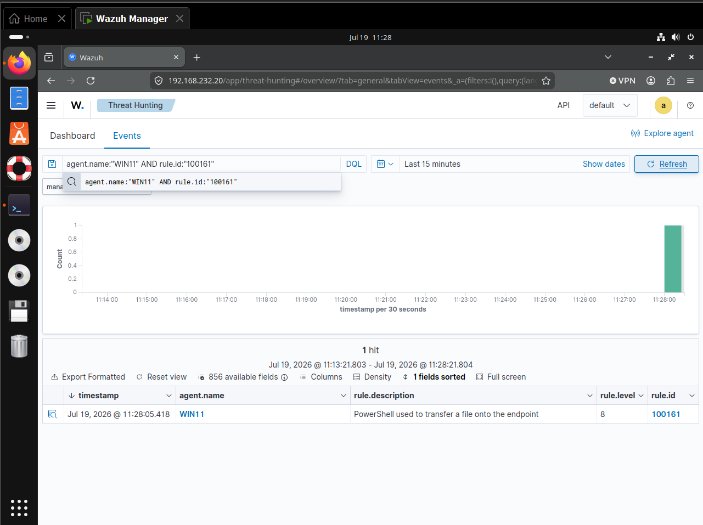

*Figure 13. Successful level 8 rule `100161` alert from WIN11 after the hierarchy correction.*

## Negative control

The control used `Invoke-WebRequest` without `-OutFile`. It retrieved the benign content but did not write a destination file. This exercised the baseline utility condition while remaining outside the elevated file-transfer condition.

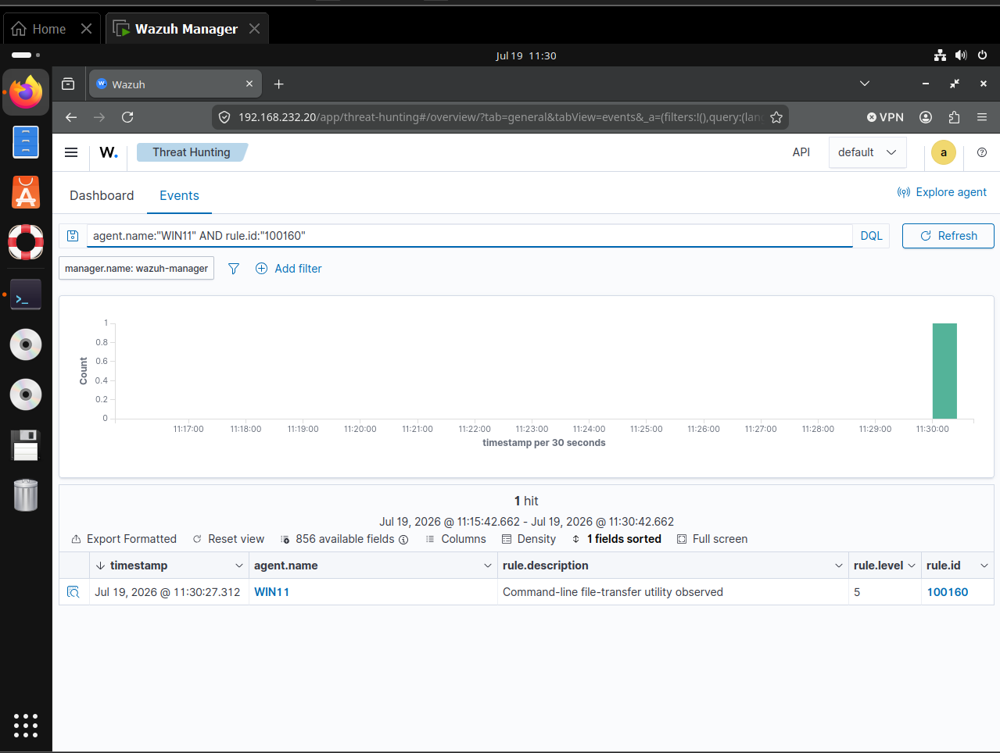

*Figure 14. Baseline transfer-utility evidence for the no-output-file control.*

```text
agent.name:"WIN11" AND rule.id:"100161" AND NOT data.win.eventdata.scriptBlockText:*-OutFile*
```

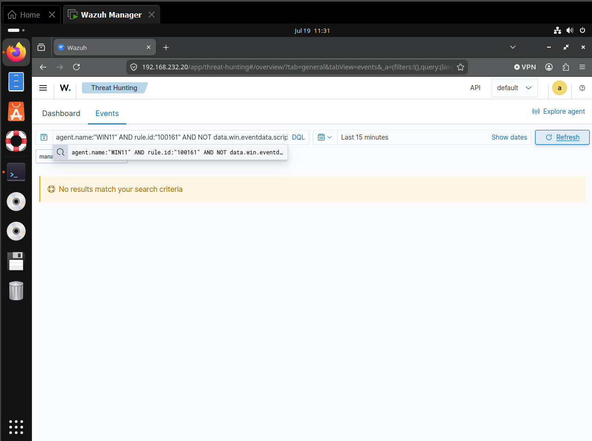

*Figure 15. Targeted search showing no elevated file-transfer alert for the tested control.*

This demonstrates precision for one control and does not establish a production false-positive rate.

## False positives and triage

Legitimate PowerShell transfers include software deployment, patching, administrator downloads, configuration management, security tooling, build workflows, and scripts that retrieve approved reports or configuration.

Analysts should determine:

- which user, host, and parent process initiated PowerShell;
- whether the source was approved and expected for the host role;
- whether the destination was temporary, user-writable, startup-related, or otherwise high risk;
- the file type, size, hash, signature, and reputation;
- whether the file subsequently executed or established persistence;
- whether PowerShell used encoding, hidden-window flags, noninteractive mode, or execution-policy bypass;
- whether similar activity occurred across other endpoints.

## Engineering considerations

- Extend Wazuh's built-in PowerShell Script Block hierarchy instead of creating a competing standalone branch.
- Separate transfer-utility observation from file-output context so severity reflects behavior.
- Treat `archives.json` as collection evidence and `alerts.json` as alert evidence.
- Generate fresh activity after every rule change.
- Account for variables, aliases, .NET download methods, BITS, `curl.exe`, and `wget.exe`.
- Add destination, user, signer, hash, and source reputation context before production escalation.
- Use narrow allowlists for approved deployment systems.
- Restore or explicitly accept the missing Sysmon Event ID `11` coverage.
- Maintain unique rule IDs and repair unrelated invalid group references.
- Test positive and negative cases against the production decoder path.

## Cleanup

Endpoint cleanup checked the original destination and validation paths; each returned `False`. The temporary server was stopped, port `8000` was checked, and the hosted directory and source file were removed.

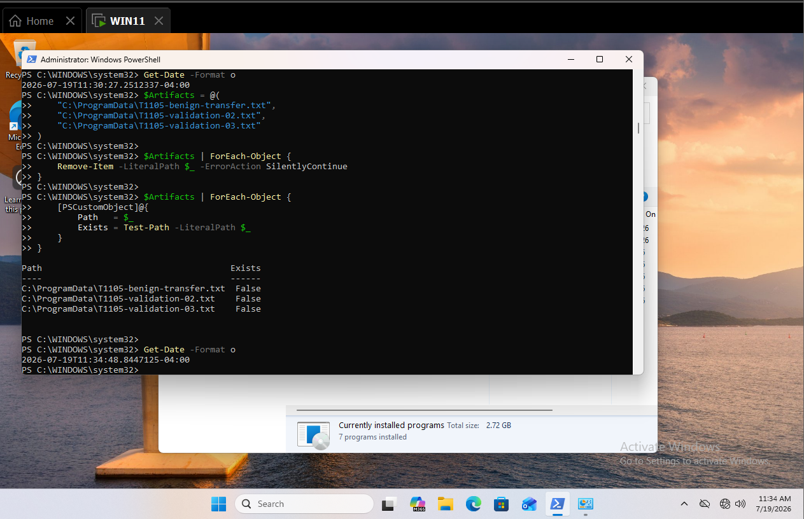

*Figure 16. Endpoint validation showing the named transfer artifacts were absent.*

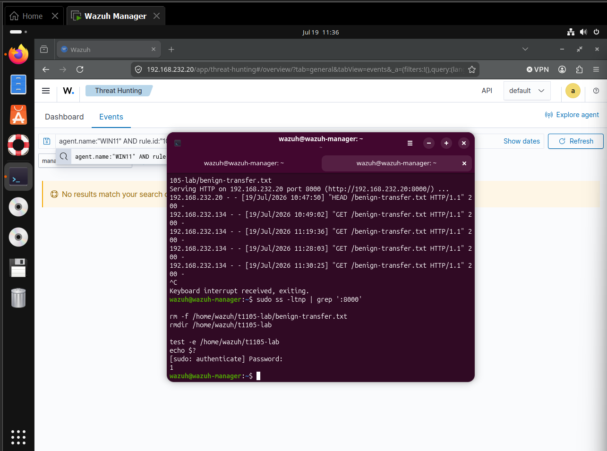

*Figure 17. Manager-side cleanup confirming removal of temporary server content and the listener.*

## Timeline

All activity occurred in the isolated lab on July 19, 2026.

| Order | Source | Event | Interpretation |
|---:|---|---|---|
| 1 | Wazuh manager | Temporary server prepared | Benign source established |
| 2 | WIN11 | Service and network checks completed | Endpoint ready |
| 3 | WIN11/server | Initial request returned HTTP 404 | Network path worked; server path was incorrect |
| 4 | Wazuh manager | Directory recreated and HTTP 200 verified | Server issue corrected |
| 5 | WIN11 | File downloaded and hashed | Benign transfer confirmed |
| 6 | Sysmon/PowerShell | Event IDs `3` and `4104` observed | Network and command telemetry confirmed |
| 7 | Wazuh archive | Source counts reviewed | Collection confirmed; Event ID `11` gap documented |
| 8 | Wazuh manager | Standalone custom rules tested | No alert despite matching archived strings |
| 9 | Wazuh manager | Rule `100160` attached to `91802` | Script Block hierarchy corrected |
| 10 | Wazuh | Rule `100161` fired at 11:28:05 EDT | Positive detection confirmed |
| 11 | WIN11/Wazuh | No-output-file control executed | Elevated condition rejected the control |
| 12 | WIN11/manager | Files and temporary server removed | Cleanup completed |

## Findings

### 1. Collection worked before dedicated detection

Manager archives contained network and PowerShell records while the dashboard initially showed no dedicated alert. Archive inspection prevented unnecessary changes to the functioning agent and logging sources.

### 2. Decoded script text differed from the expected command

Script Block Logging retained `$Uri` and `$Destination`. Hunts and rules needed to consider command behavior and variable use rather than requiring only resolved values.

### 3. Rule hierarchy determined the outcome

The initial standalone rules were syntactically valid, but the event followed built-in parent `91802`. Extending that hierarchy produced the intended alert.

### 4. Multiple sources improved confidence

The HTTP request, successful file content and hash, Sysmon network event, and PowerShell Script Block event collectively established the behavior.

### 5. The file-creation gap remains actionable

No matching Sysmon Event ID `11` was observed. The detection remains functional through Event ID `4104`, but the gap reduces independent confirmation.

## Limitations

- The source used plain HTTP on an isolated network; HTTPS, proxies, redirects, and external infrastructure were not tested.
- The lab transferred only a benign text file and did not execute it.
- The negative control covered one request without `-OutFile`.
- No matching Sysmon Event ID `11` was available.
- Threat Hunting displayed alerts rather than every archived event.
- The evidence folder contains a screenshot verifying the exported alert JSON, but the raw JSON file itself was not present when this document was created.

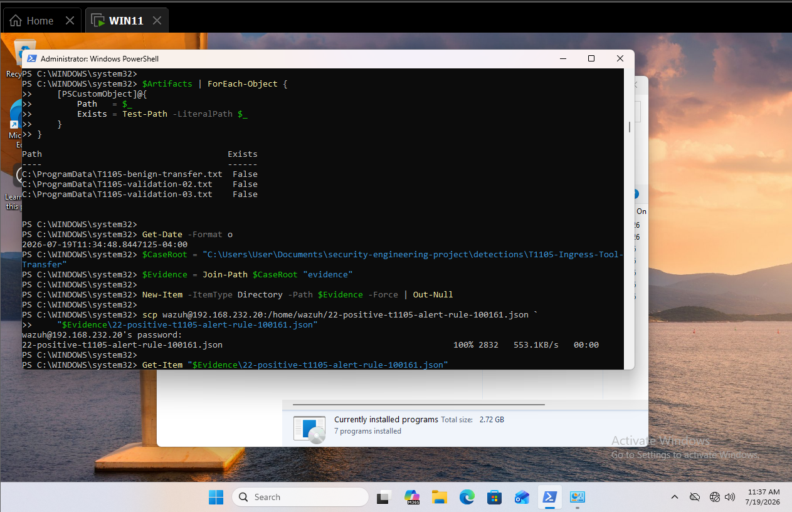

*Figure 18. Manager-side verification of the exported positive rule `100161` alert.*

## Skills demonstrated

- safe adversary emulation in an isolated lab;
- PowerShell and Sysmon telemetry validation;
- Wazuh archive and alert-index analysis;
- collection-versus-detection troubleshooting;
- Wazuh rule hierarchy analysis and PCRE2 matching;
- MITRE ATT&CK mapping;
- positive and negative detection validation;
- evidence handling, cleanup, and technical documentation.

## Evidence inventory

| Artifact | Purpose |
|---|---|
| `01-benign-transfer-server-setup.png` | Temporary source server setup |
| `02-endpoint-and-network-readiness.png` | Endpoint and network readiness |
| `03-initial-transfer-404-troubleshooting.png` | Initial HTTP 404 |
| `04-http-server-path-verification.png` | Server-path correction |
| `05-successful-ingress-transfer-and-hash.png` | Successful transfer and hash |
| `06-local-sysmon-network-connection.png` | Local Sysmon Event ID `3` |
| `07-local-sysmon-file-creation.png` | Event ID `11` evaluation |
| `08-local-file-and-script-telemetry-gaps.png` | Initial local telemetry gaps |
| `09-local-powershell-transfer-command.png` | Broader Event ID `4104` result |
| `11-wazuh-archive-telemetry-validation.png` | Archive collection validation |
| `12-transfer-telemetry-source-counts.png` | Telemetry source counts |
| `13-decoded-network-and-powershell-fields.png` | Decoded fields used for development |
| `16-positive-t1105-alert.png` | Positive rule `100161` alert |
| `18-negative-control-baseline-alert.png` | Baseline control behavior |
| `19-negative-control-no-file-transfer-alert.png.png` | No elevated control alert |
| `20-endpoint-cleanup-validation.png` | Endpoint cleanup |
| `21-server-cleanup-validation.png` | Server cleanup |
| `22-positive-t1105-alert-json-verification.png` | Positive-alert JSON verification |

## Reproduction and references

The complete validated procedure is included in [`T1105-Ingress-Tool-Transfer-Lab-Runbook.md`](T1105-Ingress-Tool-Transfer-Lab-Runbook.md).

- [MITRE ATT&CK T1105 – Ingress Tool Transfer](https://attack.mitre.org/techniques/T1105/)
- [Microsoft Invoke-WebRequest documentation](https://learn.microsoft.com/en-us/powershell/module/microsoft.powershell.utility/invoke-webrequest)
- [Microsoft Sysmon documentation](https://learn.microsoft.com/en-us/sysinternals/downloads/sysmon)
