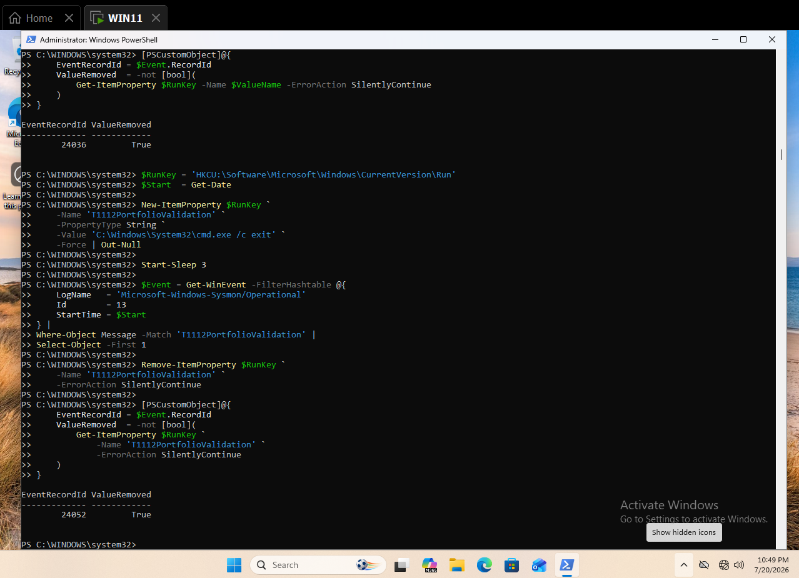
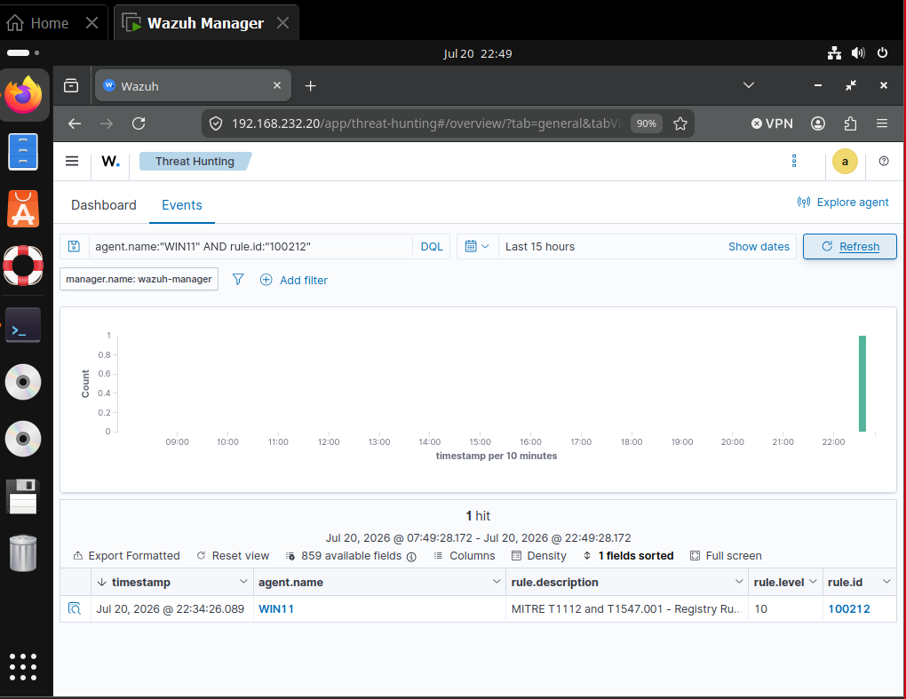
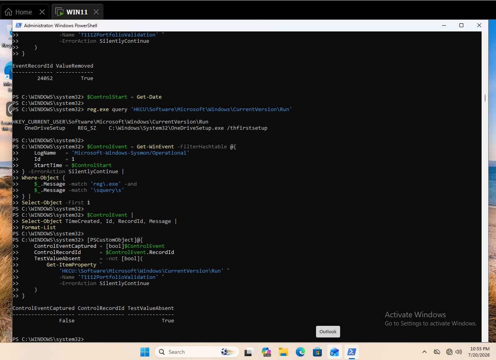
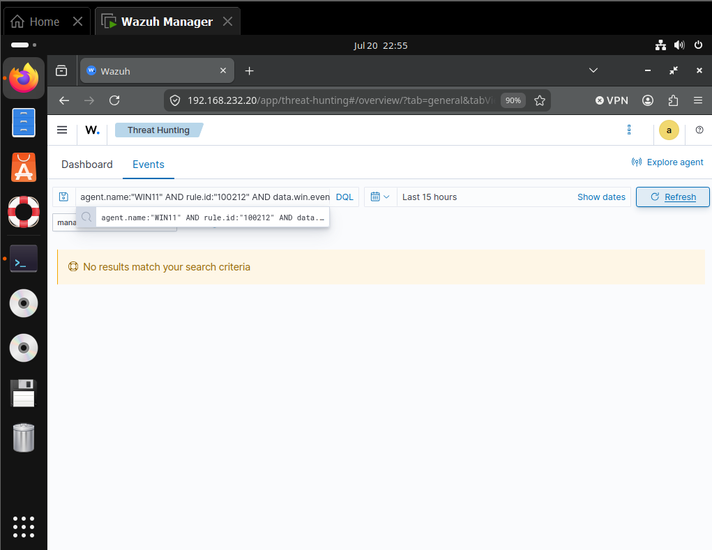
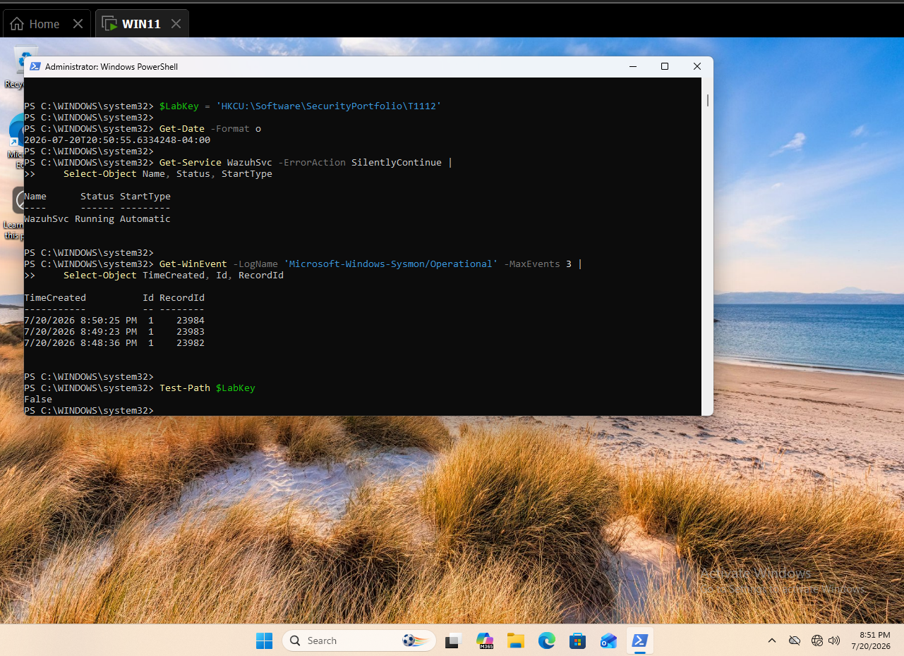
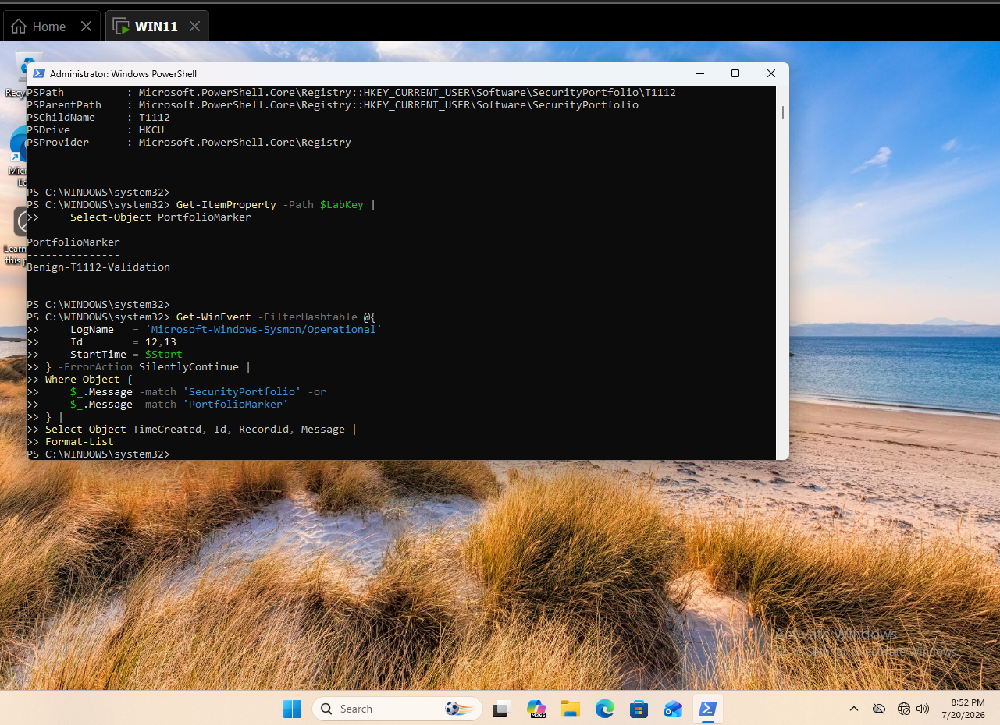
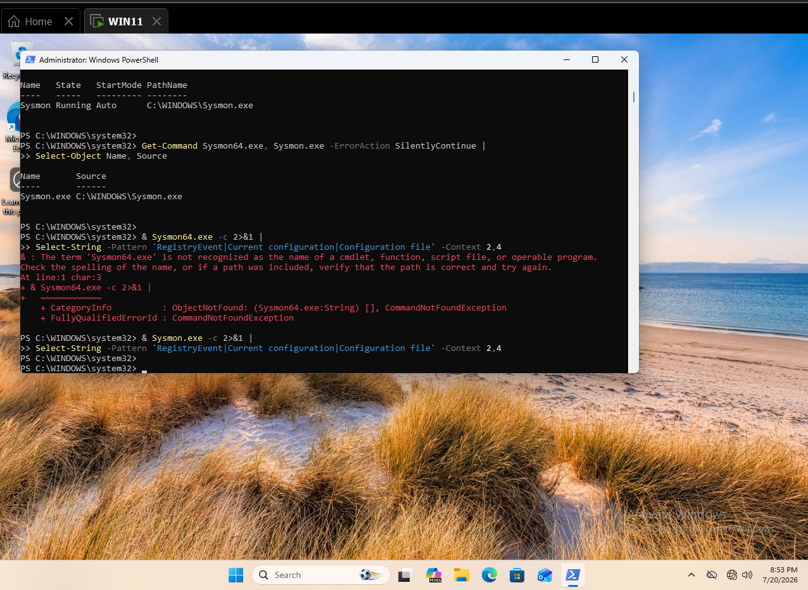
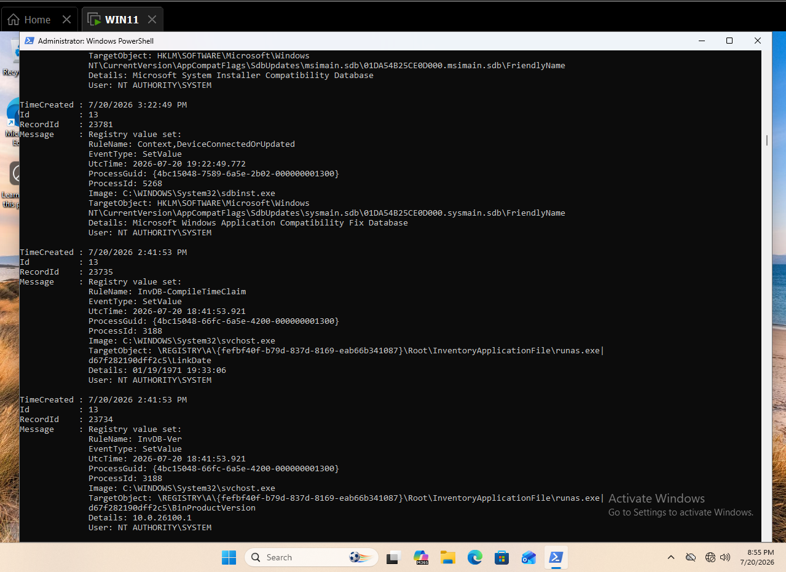
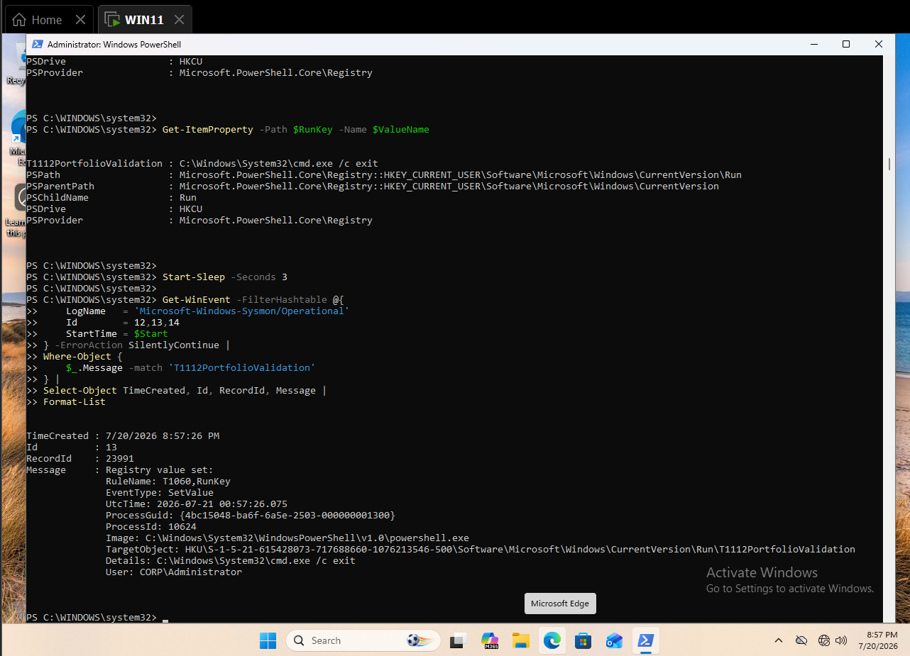
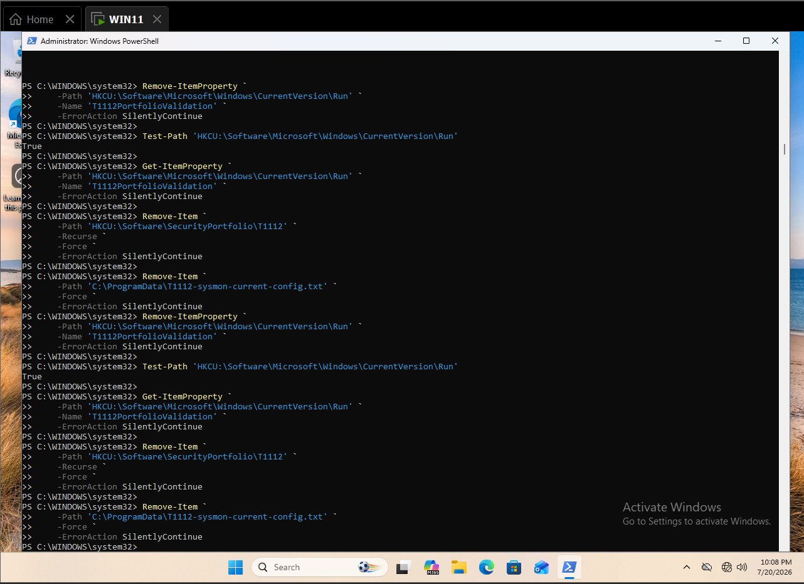

# Detecting Registry Modification with Sysmon and Wazuh

This case study validates a monitored Windows registry modification and maps the resulting alert to MITRE ATT&CK `T1112 — Modify Registry`, while retaining the related `T1547.001 — Registry Run Keys / Startup Folder` context.

## Result

A temporary HKCU Run-key value generated Sysmon Event ID `13`. After repairing the active Wazuh hierarchy, rule `100212` produced a level `10` alert mapped to both T1112 and T1547.001. The value was removed immediately after event capture. A read-only `reg.exe query` control did not generate a registry-modification event or T1112 alert.

| Validation point | Observed result |
|---|---|
| Endpoint | `WIN11.corp.local` |
| User | `CORP\Administrator` |
| Positive target | `HKCU\...\CurrentVersion\Run\T1112PortfolioValidation` |
| Benign data | `C:\Windows\System32\cmd.exe /c exit` |
| Primary telemetry | Sysmon Event ID `13` |
| Positive record | `24052` |
| Parent rule | `100141`, level `8` |
| Final rule | `100212`, level `10` |
| ATT&CK mapping | `T1112`, `T1547.001` |
| Positive time | July 20, 2026 at `22:34:26` EDT |
| Cleanup | `ValueRemoved = True` |
| Negative control | Read-only `reg.exe query`; no `100212` alert |



*Figure 1. Sysmon record `24052` captured and the temporary Run value removed immediately.*



*Figure 2. One level 10 Wazuh alert generated by final rule `100212`.*



*Figure 3. Read-only Run-key query with the portfolio value absent.*



*Figure 4. No rule `100212` result for the read-only registry query.*

## Objective and hypothesis

The objective was to distinguish registry modification, telemetry coverage, and ATT&CK enrichment while keeping the endpoint test reversible. The hypothesis was that a monitored Run-key write would generate Sysmon Event `13`, Wazuh would preserve the target and data, and a child of the active persistence rule could add T1112 context.

The alert is a behavioral review signal. Registry modification and Run-key use can be legitimate; the result does not prove malicious persistence.

## Endpoint telemetry
The first test wrote a benign marker beneath `HKCU\Software\SecurityPortfolio\T1112`. The write succeeded, but no Events `12–14` matched. Existing Event `13` records proved RegistryEvent monitoring was enabled but selectively filtered.



*Figure 5. Wazuh and Sysmon readiness with the portfolio test key absent.*



*Figure 6. Successful portfolio-key write with no matching RegistryEvent.*



*Figure 7. Sysmon service and executable identification during troubleshooting.*



*Figure 8. Existing Event `13` records confirming selective registry monitoring.*

The lab did not replace the Sysmon configuration. Instead, it used the existing monitored HKCU Run-key path for a short-lived validation.

## Safe simulation
The temporary value was:

```text
Name: T1112PortfolioValidation
Data: C:\Windows\System32\cmd.exe /c exit
```

No sign-out or restart occurred while the value existed. Every final validation removed it immediately after retrieving the local event.



*Figure 9. Sysmon Event `13`, record `23991`, proving the monitored path before rule engineering.*

## Troubleshooting and detection engineering
| Iteration | Observation | Correction |
|---|---|---|
| 1 | Portfolio-only key produced no Event `13` | Documented the selective Sysmon coverage boundary |
| 2 | Run-key event reached Wazuh as rule `100141` | Identified the winning persistence branch |
| 3 | Rule `100212` referenced missing group `sysmon_event13` | Replaced the invalid dependency with parent `100141` |
| 4 | Cross-file child still did not promote the event | Moved `100212` beside `100141` in `local_rules.xml` |
| 5 | Additional child regex prevented promotion | Removed the redundant field; inherited the parent's proven scope |
| 6 | Fresh record `24052` | Rule `100212` generated a level `10` alert |

### Validated hierarchy

```text
92300 — Sysmon registry value event
└── 100141 — Run key configured to launch an interpreter
    └── 100212 — T1112 and T1547.001 registry modification
```

### Final rule

```xml
<rule id="100212" level="10">
  <if_sid>100141</if_sid>
  <description>MITRE T1112 and T1547.001 - Registry Run key or StartupApproved value modified</description>
  <mitre>
    <id>T1112</id>
    <id>T1547.001</id>
  </mitre>
  <group>modify_registry,registry_run_keys,</group>
</rule>
```

The raw positive alert is preserved in [t1112-positive-alert-24052.json](evidence/t1112-positive-alert-24052.json).

## Negative control

The control used `reg.exe query` against the same Run key. It displayed the existing legitimate value, did not create `T1112PortfolioValidation`, and produced no registry-modification Event `13`. Wazuh returned no rule `100212` result for `reg.exe`.

Because the control is read-only, absence of Event `13` is the expected telemetry outcome. The local command output proves execution; the dashboard query proves no modification alert was generated.

## False positives and triage

Legitimate Run-key modifications include software installation, user-session agents, cloud-storage clients, update mechanisms, endpoint management, accessibility software, and authorized administrator configuration.

Analysts should review:

- the target hive, key, and value name;
- the written command, file path, signature, and hash;
- the modifying image, parent process, user, and integrity level;
- whether the path is user-writable or references a script interpreter;
- whether the value is new, modified, or restored repeatedly;
- nearby process execution, account activity, downloads, and defense-evasion behavior;
- whether the change matches an approved installer or management workflow.

## Engineering considerations

- This validated rule is deliberately scoped to the existing `100141` Run-key/interpreter behavior; it is not universal coverage for all registry modification.
- Add separate analytics for other high-risk registry paths rather than broadening this alert without testing.
- Preserve the active parent-child placement on this manager.
- Generate fresh activity after every rule change.
- The manager still reports duplicate IDs `100201–100210` and invalid group `sysmon_event10` for rule `100214`; remediate these separately.
- Maintain immediate cleanup for persistence-path testing.

## Cleanup

The Run value, portfolio-only key, and temporary configuration dump were removed. The existing Run key and legitimate values were preserved. No sign-out, restart, service change, or Sysmon configuration replacement occurred.



*Figure 10. Test value absent while the legitimate Run key remained.*

## Evidence inventory

| Artifact | Purpose |
|---|---|
| `001-t1112-readiness-and-clean-baseline.png` | Readiness and clean baseline |
| `002-t1112-registry-modification-and-sysmon-events.png` | Initial unmonitored write |
| `003-t1112-sysmon-registry-telemetry-diagnostic.png` | Sysmon diagnostic |
| `004-t1112-active-sysmon-configuration.png` | Existing RegistryEvent evidence |
| `005-t1112-sysmon-config-export-gap.png` | Configuration-extraction limitation |
| `006-t1112-run-key-modification-sysmon-event.png` | First monitored positive event |
| `007-t1112-interim-cleanup-validation.png` | Interim cleanup |
| `008-t1112-final-positive-event-and-immediate-cleanup.png` | First post-repair test |
| `009-t1112-post-hierarchy-test-and-cleanup.png` | Child-placement test |
| `010-t1112-child-condition-no-alert.png` | Redundant-condition failure |
| `011-t1112-simplified-child-test-and-cleanup.png` | Final endpoint positive and cleanup |
| `012-positive-t1112-rule-100212.png` | Final Wazuh alert |
| `013-t1112-read-only-registry-query-control.png` | Read-only control |
| `014-t1112-negative-control-no-modification-alert.png` | No control alert |
| `t1112-positive-alert-24052.json` | Raw positive alert |

## Reproduction

See [T1112-Modify-Registry-Lab-Runbook.md](T1112-Modify-Registry-Lab-Runbook.md) and [detection-rules.xml](detection-rules.xml).

## Lab environment

The validated environment, hosts, and telemetry sources are documented in the surrounding simulation and telemetry sections. No additional infrastructure was introduced for this case study.

## Wazuh hunt and collection validation

Collection and alert validation used the agent, event fields, rule identifiers, and dashboard evidence documented in the positive-validation and telemetry sections.

## Positive validation

The positive-path result and supporting evidence are documented in the Result, endpoint telemetry, and evidence inventory sections.

## Timeline

Use the timestamps and record identifiers in the endpoint and Wazuh evidence as the authoritative validation timeline.

## Findings

The case study demonstrates the result stated above within the documented lab conditions. Conclusions should not be extended to telemetry sources or execution variants that were not tested.
