# Detecting Rundll32 Proxy Execution with Sysmon and Wazuh

This case study demonstrates how Sysmon and Wazuh can identify `rundll32.exe` proxy execution and enrich the resulting alert with MITRE ATT&CK `T1218.011 – Rundll32`.

## Result

The positive validation launched the signed Windows binary `rundll32.exe` with `shell32.dll,Control_RunDLL appwiz.cpl`. Sysmon recorded the process as Event ID `1`, Wazuh retained the command line and process lineage, and custom rule `100152` generated a level 12 alert mapped to `T1218.011`.

| Validation point | Observed result |
|---|---|
| Endpoint telemetry | Sysmon Event ID `1` confirmed |
| Wazuh collection | Event confirmed in `archives.json` |
| Generic detection | Rule `100210`, level `12`, mapped to `T1218` |
| Specific detection | Rule `100152`, level `12`, mapped to `T1218.011` |
| Positive command | `rundll32.exe shell32.dll,Control_RunDLL appwiz.cpl` |
| Negative control | Generic rule `100210` fired for bare Rundll32 execution |
| Specific negative query | Screenshot used retired rule `100151`; retest against `100152` remains recommended |
| Cleanup | Rundll32 test process and Control Panel window closed |

## Objective and hypothesis

The objective was to distinguish normal process telemetry, generic signed-binary detection, and a precise Rundll32 sub-technique alert. The hypothesis was that a `rundll32.exe` process containing a DLL entry point or Control Panel invocation would produce Sysmon Event ID `1`, reach Wazuh, and match a child rule mapped to `T1218.011`.

The detection focused on:

- `rundll32.exe` as the process image;
- Sysmon Process Create telemetry;
- command-line patterns such as `Control_RunDLL`, exported functions, ordinals, `javascript:`, or `.cpl` files;
- preservation of the parent process, user, integrity level, hashes, and command line.

## Lab environment

| Component | Observed value |
|---|---|
| Endpoint | `WIN11.corp.local` |
| Wazuh agent | `WIN11`, agent `002` |
| Test user | `CORP\Administrator` |
| Wazuh manager | `wazuh-manager` |
| Wazuh version | `4.14.6` |
| Primary channel | `Microsoft-Windows-Sysmon/Operational` |
| Primary event | Sysmon Event ID `1` – Process Create |
| Signed binary | `C:\Windows\System32\rundll32.exe` |

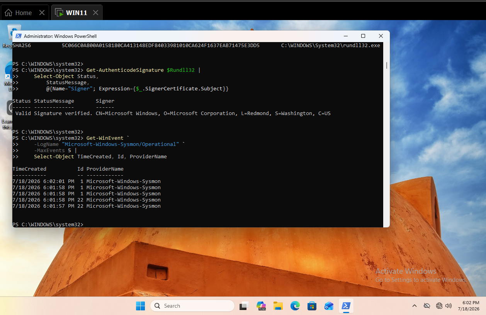

*Figure 1. Readiness verification showing the Rundll32 binary, cryptographic hash, signature status, and active endpoint telemetry.*

## Safe simulation

The simulation used a Windows-supplied Control Panel entry point:

```powershell
$Start = Get-Date
$Rundll32 = "$env:WINDIR\System32\rundll32.exe"
$Arguments = "shell32.dll,Control_RunDLL appwiz.cpl"

Start-Process -FilePath $Rundll32 -ArgumentList $Arguments -PassThru
```

This opened Programs and Features. No software was installed, removed, or modified.

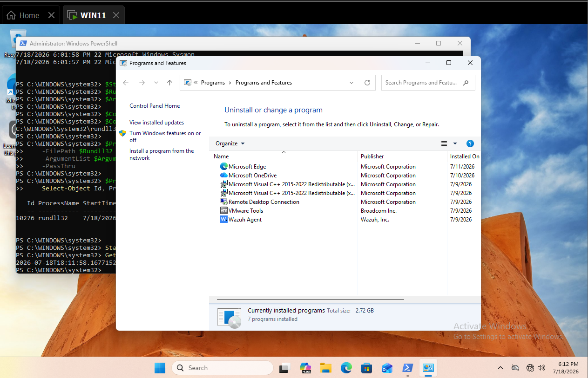

*Figure 2. Benign proxy-execution simulation using `Control_RunDLL` and `appwiz.cpl`.*

## Endpoint telemetry

Sysmon Event ID `1` retained the image, complete command line, parent PowerShell process, user, integrity level, process identifiers, timestamp, and hashes.

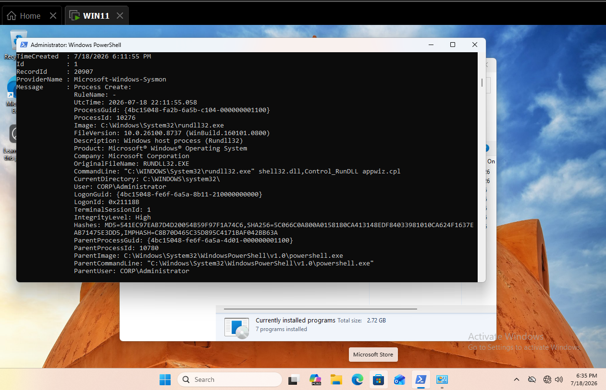

*Figure 3. Local Sysmon Process Create event for the Rundll32 simulation.*

## Wazuh hunt and collection validation

The investigation progressed from a broad Rundll32 hunt to the exact command:

```text
agent.name:"WIN11" AND data.win.system.eventID:"1" AND data.win.eventdata.image:*rundll32.exe
```

```text
agent.name:"WIN11" AND data.win.eventdata.image:*rundll32.exe AND data.win.eventdata.commandLine:*Control_RunDLL*
```

```text
agent.name:"WIN11" AND data.win.eventdata.image:*rundll32.exe AND data.win.eventdata.commandLine:*appwiz.cpl*
```

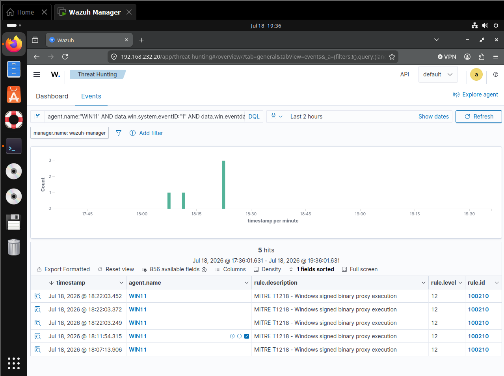

*Figure 4. Initial Wazuh hunt for Rundll32 process telemetry.*

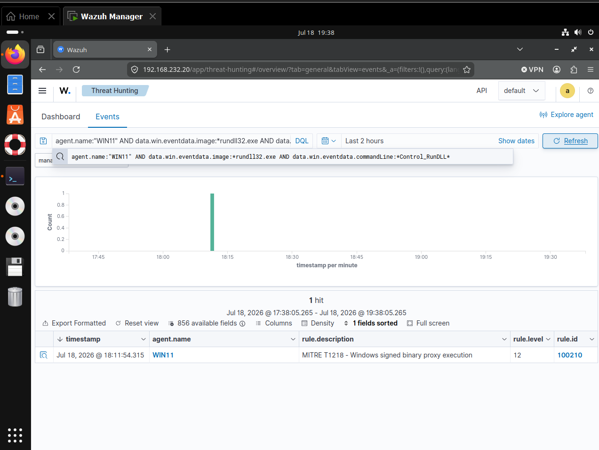

*Figure 5. Narrowed hunt using the distinctive Control Panel invocation.*

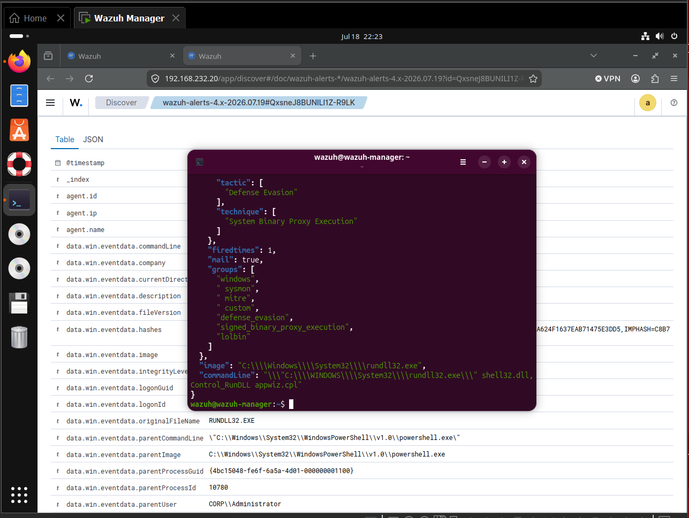

*Figure 6. Manager archive evidence confirming collection of the exact Sysmon event.*

## Troubleshooting and detection engineering

The final alert required more than adding a standalone rule. The troubleshooting path established which rule actually won during live evaluation.

| Step | Observation | Action | Result |
|---|---|---|---|
| 1 | Dashboard searches did not initially show the exact event | Queried `archives.json` directly | Collection was confirmed independently of alert generation |
| 2 | Standalone rules `100150` and `100151` did not become the final alert | Generated a fresh post-restart event and compared archives with alerts | Existing rule `100210` was identified as the winning rule |
| 3 | A standalone replacement `100152` still did not win | Used `jq` to exclude manager `sudo` events and select the exact WIN11 command | Rule `100210`, level 12, was confirmed as the live generic analytic |
| 4 | `100152` could not reference `100210` from `local_rules.xml` | Ran `wazuh-analysisd -t` | Validation showed `100210` loaded after `local_rules.xml`, so the child was ignored |
| 5 | Two copies of `100210` existed | Located both XML definitions | The first active copy was found in `mitre_detection_rules.xml` |
| 6 | The sub-technique rule needed the active parent in scope | Moved `100152` immediately after active rule `100210` | Validation passed and Wazuh restarted successfully |
| 7 | Fresh activity was required | Repeated the benign simulation | Rule `100152` generated one level 12 alert |

Pre-existing duplicate warnings for rules `100201–100210` remain a ruleset-hygiene issue. Wazuh considers only the first occurrence, which makes file ordering operationally important and should be corrected in a separate controlled change.

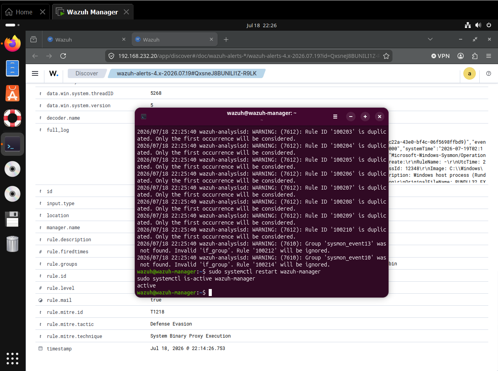

*Figure 7. Initial Rundll32 rule configuration and validation work.*

### Validated rule hierarchy

```text
Sysmon Event ID 1
└── existing signed-binary analytic 100210 — generic T1218, level 12
    └── custom 100152 — Rundll32 T1218.011, level 12
```

### Final rule

```xml
<!-- Placed immediately after the active rule 100210 -->
<rule id="100152" level="12">
  <if_sid>100210</if_sid>
  <field name="win.eventdata.image"
         type="pcre2">(?i)rundll32\.exe$</field>
  <field name="win.eventdata.commandLine"
         type="pcre2">(?i)(Control_RunDLL|,[A-Za-z_][A-Za-z0-9_]*|,#[0-9]+|javascript:|\.cpl(?:\s|$))</field>
  <description>Rundll32 invoked for DLL entry-point or Control Panel proxy execution</description>
  <mitre>
    <id>T1218.011</id>
  </mitre>
  <group>defense_evasion,signed_binary_proxy_execution,rundll32,</group>
</rule>
```

## Positive validation

A fresh event after the final manager restart produced one rule `100152` alert at `22:58:11` EDT on July 18, 2026.

| Field | Observed value |
|---|---|
| Agent | `WIN11` |
| Rule | `100152` |
| Level | `12` |
| Description | `Rundll32 invoked for DLL entry-point or Control Panel proxy execution` |
| Image | `C:\Windows\System32\rundll32.exe` |
| Command | `shell32.dll,Control_RunDLL appwiz.cpl` |
| Parent | `powershell.exe` |
| User | `CORP\Administrator` |
| Integrity | High |
| ATT&CK | `T1218.011` |

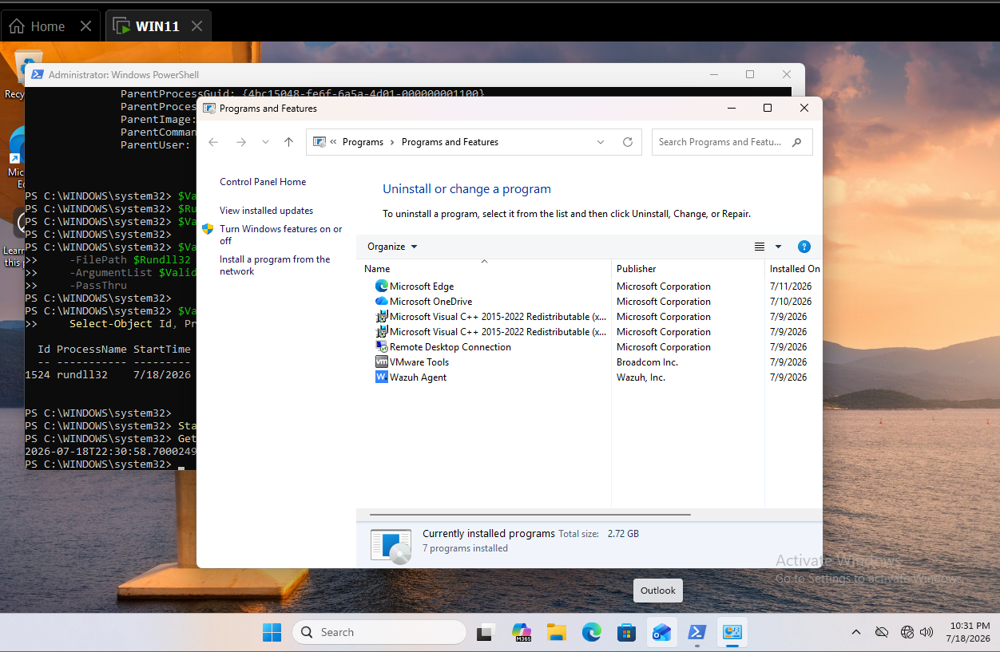

*Figure 8. Fresh endpoint activity generated after the final ruleset restart.*

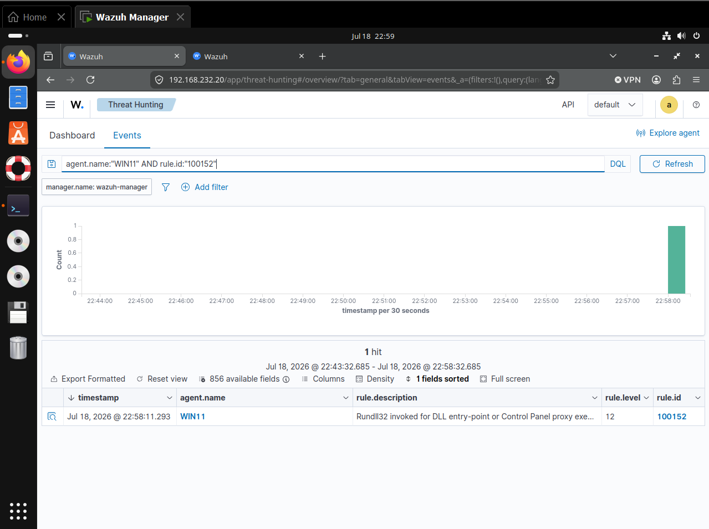

*Figure 9. One level 12 rule `100152` alert from WIN11.*

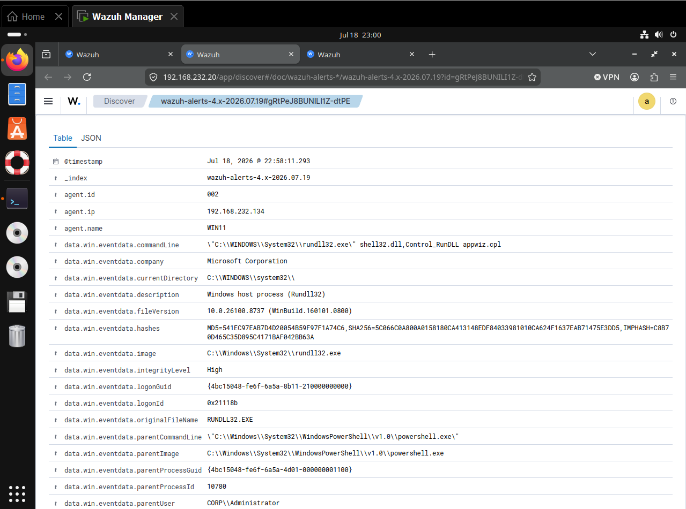

*Figure 10. Alert fields retaining the complete command line, signed image, parent process, hashes, user, and integrity level.*

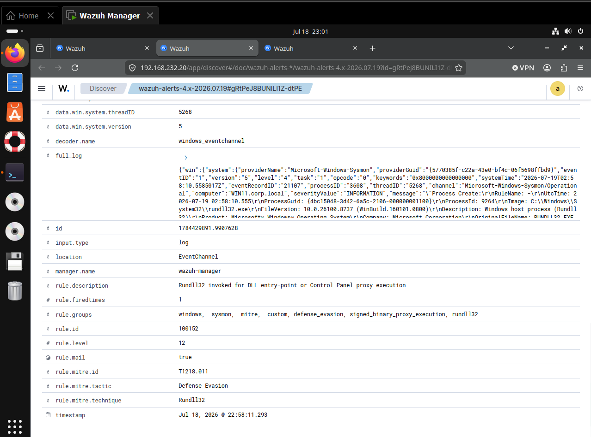

*Figure 11. Detection metadata for the Rundll32 sub-technique mapping.*

## Negative control

The control used bare or non-proxy Rundll32 execution without `Control_RunDLL`, a DLL entry-point pattern, ordinal, `javascript:`, or `.cpl` argument.

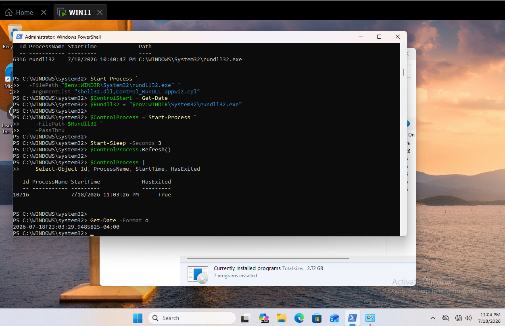

*Figure 12. Endpoint execution used to test separation between generic Rundll32 observation and the specific proxy-execution condition.*

The generic rule `100210` generated a level 12 `T1218` alert, demonstrating that the control remained observable.

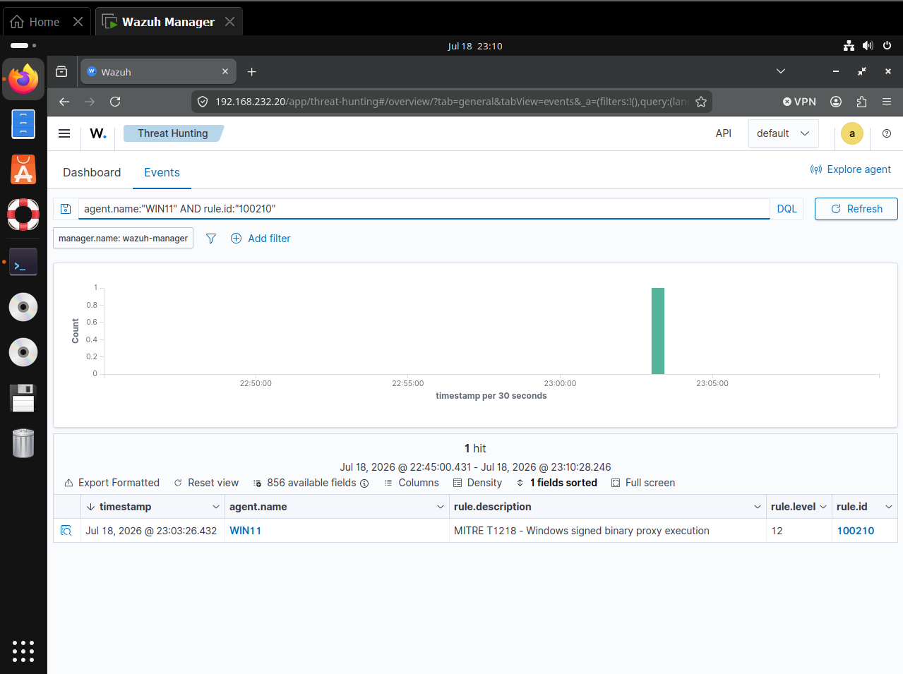

*Figure 13. Generic signed-binary alert for the negative-control execution.*

The supplied no-result screenshot queries retired rule `100151`, not final rule `100152`. It is retained as troubleshooting evidence but does not independently prove that `100152` rejected the control.

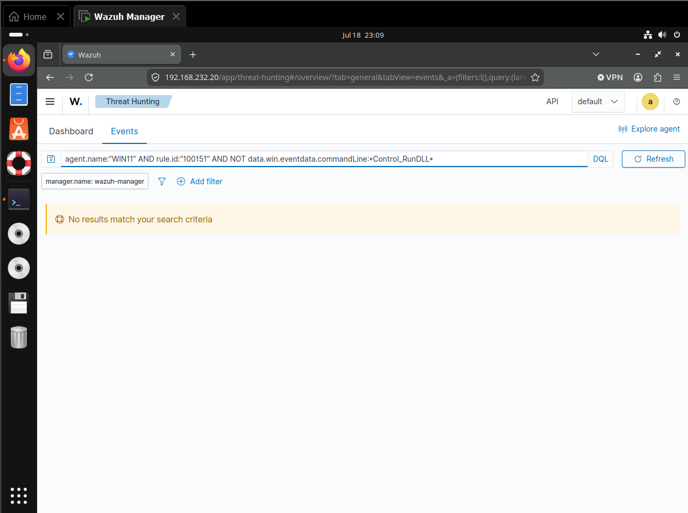

*Figure 14. No-result query against retired rule `100151`; a final `100152` control query is recommended before claiming complete negative validation.*

Recommended final query:

```text
agent.name:"WIN11" AND rule.id:"100152" AND NOT data.win.eventdata.commandLine:*Control_RunDLL*
```

Expected result: zero hits during the negative-control window.

## False positives and triage

Rundll32 is a legitimate Windows utility, so image-only detection is too broad. Common benign sources include:

- Control Panel applets and Windows settings;
- vendor installers, uninstallers, and update agents;
- printer, graphics, audio, and hardware-management software;
- enterprise management, inventory, and support tooling;
- signed applications invoking documented DLL entry points.

Analysts should review:

1. the DLL or CPL path and whether it is user-writable;
2. whether the entry point is expected for the referenced module;
3. parent process and parent command line;
4. signer, hash, and file location of both Rundll32 and the loaded module;
5. user, integrity level, and logon context;
6. adjacent file creation, download, registry, network, or persistence events;
7. prevalence of the command across the environment.

High-risk signals include remote or user-writable DLL paths, script protocols, unusual parents, renamed binaries, network retrieval, encoded content, and correlation with persistence or credential access.

## Engineering considerations

- Keep the generic T1218 rule separate from the specific T1218.011 child so analysts can distinguish broad LOLBin visibility from actionable Rundll32 syntax.
- Resolve duplicate custom IDs; relying on “first occurrence wins” creates order-dependent behavior and makes future tuning unsafe.
- Test every rule change with fresh activity because Wazuh does not reprocess archived events retroactively.
- Preserve `archives.json` during development so collection can be verified when no alert is generated.
- Use exact decoded field names and live rule hierarchy rather than assuming a standalone sibling will win.
- Consider separate severity tiers for signed system CPLs, unsigned modules, user-writable paths, remote paths, and script-protocol execution.
- Add allowlists only for stable combinations of parent, module path, signer, entry point, and managed software—not for `rundll32.exe` globally.
- Correlate Sysmon Event ID `1` with image-load telemetry when available to identify the actual loaded DLL.

## Cleanup

The Programs and Features window and spawned Rundll32 processes were closed. The lab did not install software, create persistence, change firewall rules, or deploy a payload.

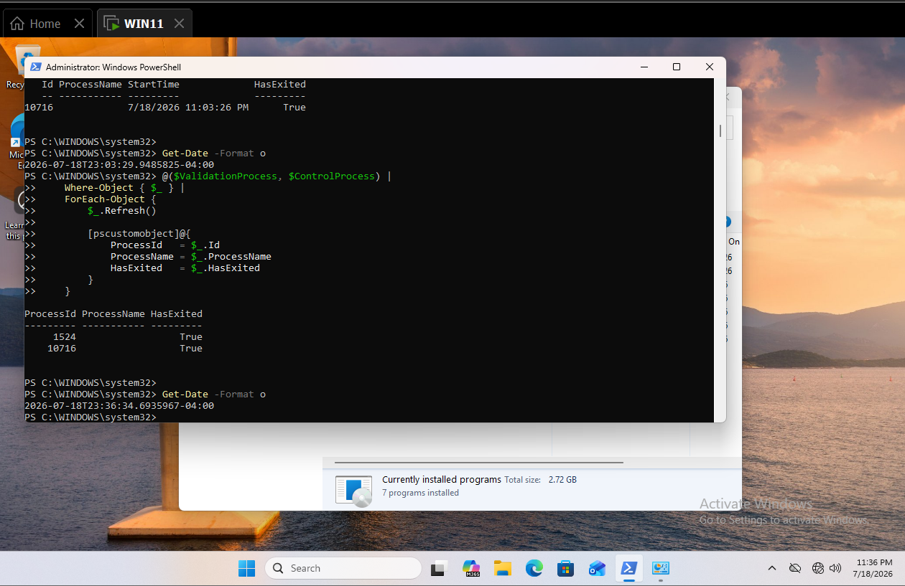

*Figure 15. Final cleanup validation after the positive and negative tests.*

## Timeline

All observed times are Eastern Daylight Time (`UTC-04:00`) on July 18, 2026.

| Time | Source | Event | Interpretation |
|---|---|---|---|
| 22:30:53 | Wazuh archive | Initial `Control_RunDLL` Event ID `1` retained | Collection confirmed |
| 22:40:48 | Wazuh | Generic rule `100210` fired | Existing T1218 analytic won rule evaluation |
| 22:52 | Wazuh manager | Child dependency validation failed in `local_rules.xml` | Parent load-order problem identified |
| 22:53 | Wazuh manager | Rule `100152` moved after active `100210` | Validation passed; manager restarted active |
| 22:58:11 | Wazuh | Rule `100152` fired | Positive T1218.011 detection confirmed |
| 23:03:26 | Wazuh | Generic rule `100210` fired for control | Baseline observability confirmed |
| 23:09 | Wazuh | Retired-rule negative query returned no result | Final `100152` negative retest still recommended |

## Findings

### 1. Collection and alerting were separate outcomes

The exact event existed in `archives.json` before the desired specific rule appeared in the dashboard. Archive verification prevented unnecessary changes to Sysmon or agent collection.

### 2. An existing generic analytic already detected the activity

Rule `100210` correctly identified signed-binary proxy execution at the parent technique level. The engineering task became sub-technique refinement rather than building visibility from scratch.

### 3. Rule hierarchy and file order changed the outcome

Placing a child in `local_rules.xml` failed because its parent loaded later. Moving the child immediately after the active parent produced a valid rule chain and the intended alert.

### 4. The positive detection is proven; final negative precision needs one corrected query

The evidence conclusively proves rule `100152` detects the test command. The generic baseline for the control is also proven. Because the supplied no-result screenshot uses retired ID `100151`, the final `100152` negative query remains an explicit evidence gap.

## Limitations

- The simulation used a Microsoft Control Panel applet, not a malicious DLL.
- The test covered one endpoint and one primary positive command.
- No production false-positive rate was measured.
- No remote DLL, ordinal export, JavaScript protocol, renamed binary, or user-writable module test was performed.
- The negative-control screenshot must be repeated with rule `100152` for complete precision evidence.
- Duplicate custom IDs `100201–100210` remain unresolved.

## Skills demonstrated

- Sysmon Process Create analysis
- Wazuh archive and alert comparison
- DQL threat hunting
- Wazuh XML rule development and validation
- Rule hierarchy and load-order troubleshooting
- MITRE ATT&CK sub-technique mapping
- Positive and negative detection testing
- False-positive analysis and tuning design

## Evidence inventory

All supporting screenshots are stored in [`evidence/`](evidence/). The evidence set includes readiness, simulation, local Sysmon telemetry, Wazuh hunts, archive checks, rule configuration, positive alert details, negative-control evidence, and cleanup validation.
