# Detecting Registry Run-Key Persistence with Sysmon and Wazuh

This lab confirmed that Sysmon and Wazuh can detect a Windows Registry Run-key modification, retain the configured command and modifying process, and map an elevated alert to MITRE ATT&CK `T1547.001 – Registry Run Keys / Startup Folder`.

## Result

The positive test produced a level 8 Wazuh alert under custom rule `100141`. The event recorded a value beneath the current user's Run key that referenced `cmd.exe`, retained the modifying `powershell.exe` image, and included the T1547.001 mapping. A benign `notepad.exe` control generated Sysmon Event ID `13` telemetry but did not trigger rule `100141`.

| Validation point | Observed result |
|---|---|
| Endpoint registry telemetry | Sysmon Event ID `13` confirmed |
| Wazuh collection | Target event found in `archives.json` |
| Initial dedicated alert | Not generated |
| Final custom detection | Rule `100141`, level `8` |
| ATT&CK mapping | `T1547.001` |
| Tactics | Persistence, Privilege Escalation |
| Negative control | Collected, no rule `100141` alert |
| Cleanup | Five Run values and four marker paths absent |

## Objective and hypothesis

The objective was to determine whether the lab could distinguish three separate outcomes: endpoint telemetry generation, Wazuh collection, and dedicated alert generation. The hypothesis was that setting a value beneath `HKCU\Software\Microsoft\Windows\CurrentVersion\Run` would produce Sysmon Event ID `13`; Wazuh would collect it; and a child of Wazuh's built-in Run-key analytic could elevate values that launch command or script interpreters.

The final detection focused on:

- Sysmon Registry Value Set telemetry;
- a target beneath a Windows Run or RunOnce path;
- value data referencing an interpreter such as `cmd.exe` or `powershell.exe`;
- ATT&CK enrichment for T1547.001.

## Lab environment

| Component | Observed value |
|---|---|
| Endpoint | `WIN11.corp.local` |
| Wazuh agent | `WIN11`, agent `002` |
| Test user | `CORP\Administrator` |
| Wazuh manager | `wazuh-manager` |
| Wazuh version | `4.14.6` |
| Primary channel | `Microsoft-Windows-Sysmon/Operational` |
| Primary event | Sysmon Event ID `13` – Registry value set |
| Registry location | `HKCU\Software\Microsoft\Windows\CurrentVersion\Run` |

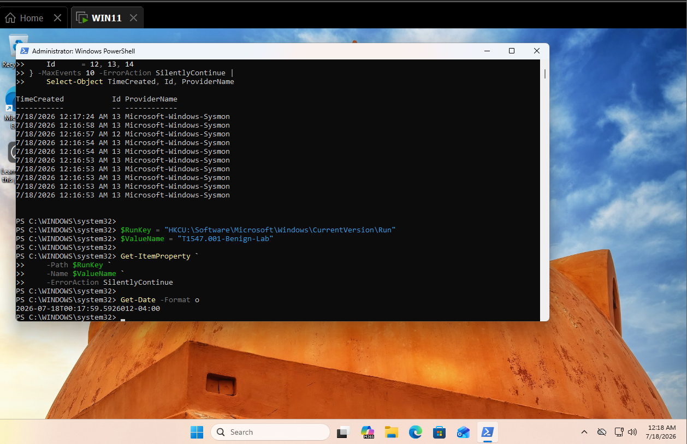

*Figure 1. Endpoint readiness and registry baseline, showing active telemetry and confirming the initial benign Run value was absent.*

## Safe simulation

The lab created a value only beneath the current lab user's Run key. The configured command wrote a benign text marker if executed. The endpoint was not logged off or rebooted while any test value existed, and `Test-Path` remained `False`, proving the persistence configuration was observed without intentionally executing it.

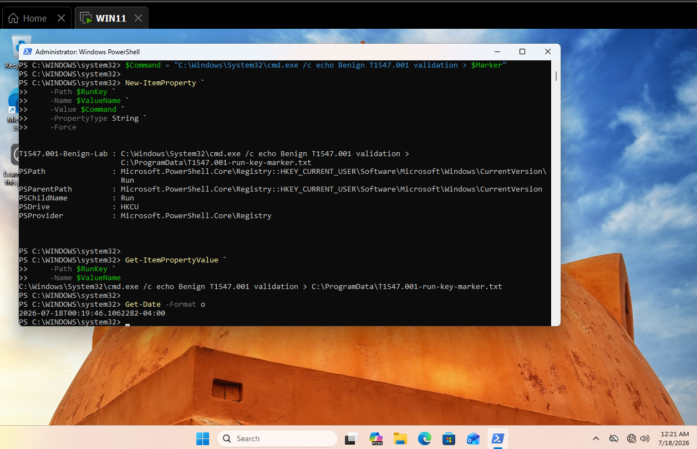

*Figure 2. Benign Run-key value creation, showing the stored `cmd.exe` marker command and the test timestamp.*

## Endpoint telemetry

Sysmon recorded the change as Event ID `13` with event type `SetValue`. The local record retained the target object, configured details, modifying image, user, and process context. The visible Sysmon `RuleName` used the deprecated label `T1060`; the final case study uses the current ATT&CK mapping `T1547.001`.

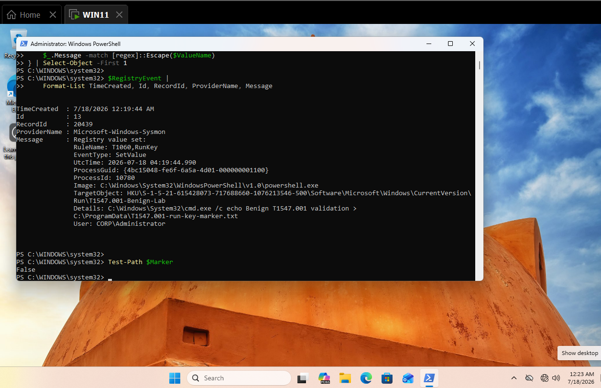

*Figure 3. Local Sysmon Event ID `13`, highlighting the Run-key target, complete marker command, modifying PowerShell process, and user context.*

## Wazuh hunt and initial detection gap

The first Wazuh search returned broad Event ID `13` activity, including unrelated registry events. Narrow searches for the exact value and marker returned no alert result.

```text
agent.name:"WIN11" AND data.win.system.eventID:"13"
```

```text
agent.name:"WIN11" AND data.win.system.eventID:"13" AND data.win.eventdata.targetObject:*T1547.001-Benign-Lab*
```

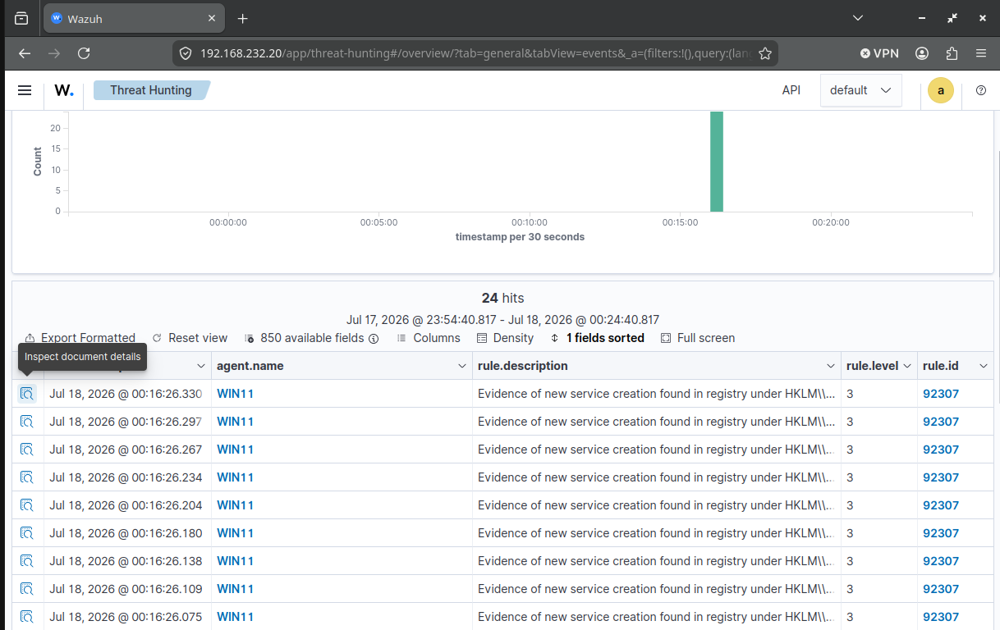

*Figure 4. Broad Wazuh hunt for Sysmon Event ID `13`, showing why the search needed to be narrowed to the tested value.*

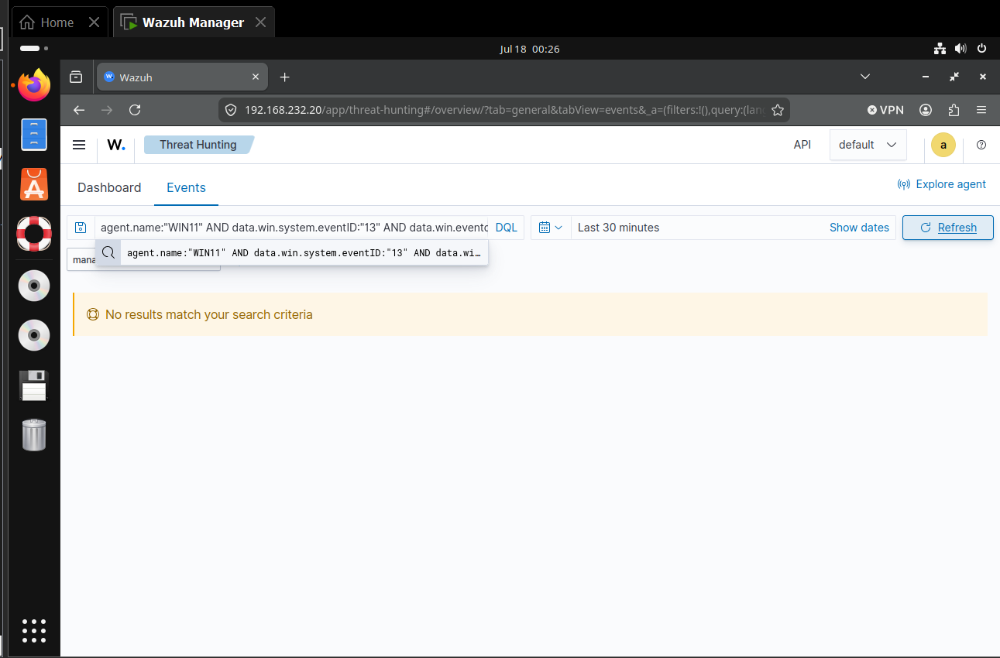

*Figure 5. Narrow alert search returning no result for the initial benign Run-key value.*

The manager archive contained the exact event while `alerts.json` did not contain a corresponding dedicated alert. This proved collection succeeded and isolated the gap to detection logic.

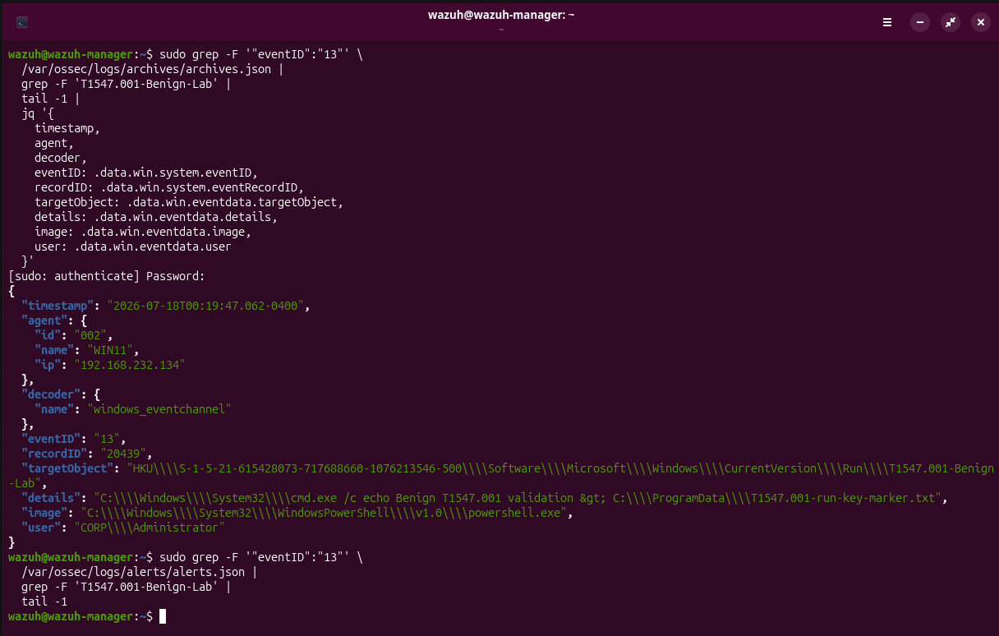

*Figure 6. Manager archive evidence confirming collection while the corresponding alert search remained empty.*

## Troubleshooting and detection engineering

The final detection required several iterations. These steps are included because they demonstrate the difference between writing plausible XML and validating the actual Wazuh rule path.

| Step | Observation | Action | Result |
|---|---|---|---|
| 1 | Sysmon Event ID `13` existed locally | Searched the Wazuh alert view | Broad registry alerts were visible, but not the tested Run value |
| 2 | Narrow alert queries returned nothing | Compared `archives.json` and `alerts.json` | Confirmed collection without dedicated detection |
| 3 | Standalone rule `100140` did not match | Inspected decoded archive fields and adjusted path escaping | Fresh events still did not produce the intended chain |
| 4 | Ruleset warnings referenced `sysmon_event13` | Inspected the built-in Event ID `13` rule | Found the correct group name `sysmon_event_13` and separated unrelated invalid rules from this analytic |
| 5 | Built-in rule `92300` already identified Run/RunOnce paths at level 0 | Replaced the duplicate baseline with a child rule | Reused the rule branch that had already established Run-key context |
| 6 | The details regex needed to match the decoded executable text | Used `\.exe` in PCRE2 rather than matching a literal backslash | Fresh validation generated rule `100141` |
| 7 | A positive result needed precision testing | Created a Run value containing only `notepad.exe` | Event was archived but no elevated alert fired |

Pre-existing warnings for duplicate rule IDs `100201`–`100210` and invalid groups used by rules `100212` and `100214` were recorded separately. They were not presented as the cause of this detection gap.

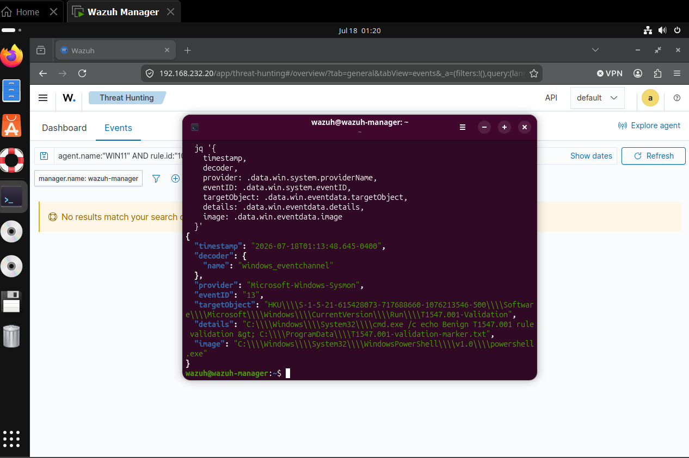

*Figure 7. Troubleshooting output confirming the decoded Event ID `13`, Run-key target, configured command, and modifying image.*

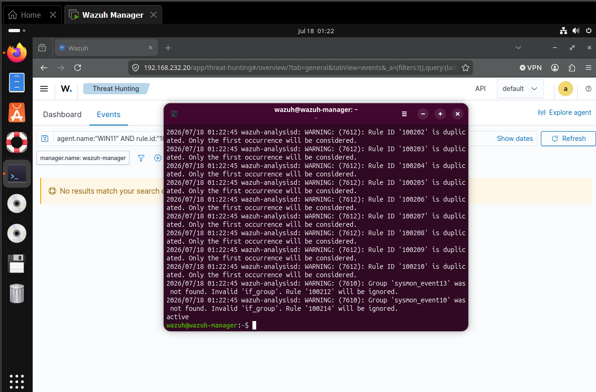

*Figure 8. Wazuh rule correction performed after comparing the custom logic with the decoded registry fields and built-in rule hierarchy.*

### Validated rule hierarchy

```text
61615 — Sysmon Event ID 13
└── group sysmon_event_13
    └── 92300 — Registry Run/RunOnce path (level 0)
        └── 100141 — interpreter stored in value data (custom level 8)
```

### Final rule

```xml
<group name="windows,sysmon,registry,persistence,mitre,">
  <rule id="100141" level="8">
    <if_sid>92300</if_sid>
    <field name="win.eventdata.details"
           type="pcre2">(?i)(cmd|powershell|pwsh|wscript|cscript|mshta|rundll32|regsvr32)\.exe</field>
    <description>Registry Run key configured to launch a command or script interpreter</description>
    <mitre>
      <id>T1547.001</id>
    </mitre>
  </rule>
</group>
```

The rule does not claim every matching value is malicious. It raises review priority for interpreter-based persistence while leaving a direct native-executable control outside the elevated condition.

## Positive validation

Fresh activity was generated after the manager restart because Wazuh does not retroactively process older events through a newly loaded rule. The final validation used the value `T1547.001-Validation-03` and produced one level 8 alert.

| Field | Observed value |
|---|---|
| Agent | `WIN11` |
| Rule | `100141` |
| Level | `8` |
| Description | `Registry Run key configured to launch a command or script interpreter` |
| Sysmon event | `13` |
| Event record | `20679` |
| Modifying image | `powershell.exe` |
| Configured executable | `cmd.exe` |
| ATT&CK ID | `T1547.001` |
| Tactics | Persistence, Privilege Escalation |

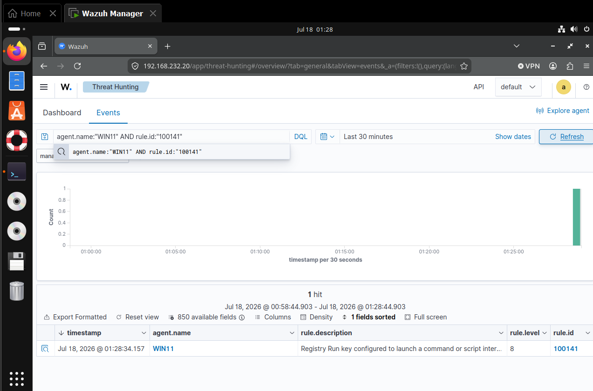

*Figure 9. Positive detection result, showing one level 8 rule `100141` alert from `WIN11`.*

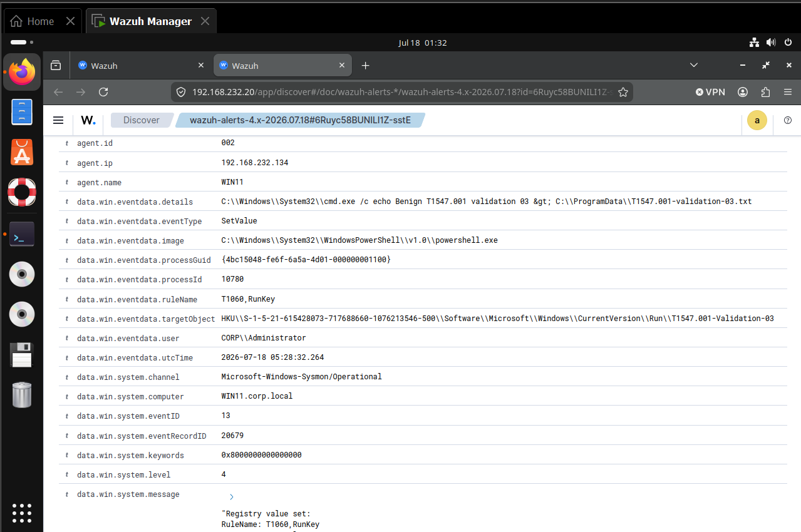

*Figure 10. Positive alert details, highlighting the Registry Run-key target and interpreter command retained from Sysmon Event ID `13`.*

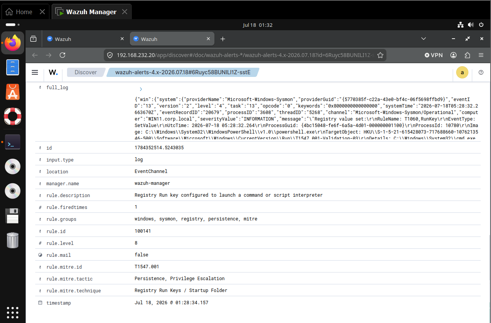

*Figure 11. Rule metadata confirming level `8`, MITRE ID `T1547.001`, and the Persistence and Privilege Escalation tactics.*

## Negative control

The control stored `C:\Windows\System32\notepad.exe` in `T1547.001-Benign-Control`. The manager archive confirmed Sysmon Event ID `13`, the exact Run-key target, the `notepad.exe` details, `powershell.exe` as the modifying image, and `CORP\Administrator` as the user.

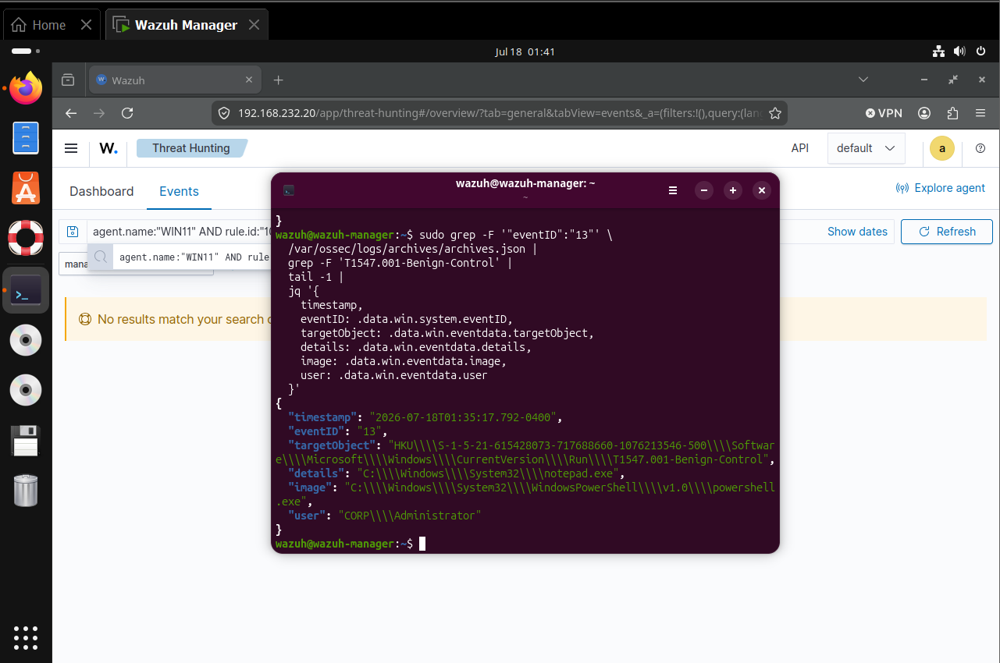

*Figure 12. Archive evidence proving the benign `notepad.exe` control was collected through the same Event ID `13` telemetry path.*

The targeted elevated-rule query returned no results:

```text
agent.name:"WIN11" AND rule.id:"100141" AND data.win.eventdata.targetObject:*T1547.001-Benign-Control*
```

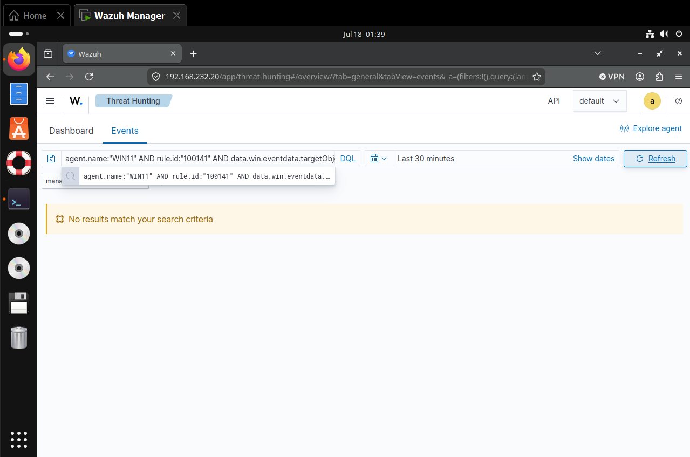

*Figure 13. Negative-control validation showing no rule `100141` result for the collected `notepad.exe` value.*

This demonstrates the tested interpreter filter worked as intended. It does not establish a production false-positive rate.

## Cleanup

Cleanup checks confirmed that all five named test values were absent:

- `T1547.001-Benign-Lab`
- `T1547.001-Validation`
- `T1547.001-Validation-02`
- `T1547.001-Validation-03`
- `T1547.001-Benign-Control`

Four marker paths were also checked and returned `False`.


*Figure 14. Final cleanup validation showing that the exact test registry values were absent; the companion marker check also returned `False` for each listed path.*

## Timeline

All observed timestamps below are Eastern Daylight Time (`UTC-04:00`) on July 18, 2026.

| Time | Source | Event | Interpretation |
|---|---|---|---|
| 00:19 | WIN11 | Initial benign Run value created | Safe persistence configuration established |
| 00:19 | Sysmon | Event ID `13`, record `20439` | Endpoint telemetry confirmed |
| 00:37 | Wazuh manager | Archive/alert comparison | Collection succeeded; dedicated alert absent |
| 01:13 | WIN11/Wazuh archive | Validation event collected | Initial custom chain still did not alert |
| 01:17 | Wazuh manager | Rule configuration and archive fields reviewed | Failure narrowed to rule hierarchy and matching |
| 01:28:34 | Wazuh | Rule `100141` fired | Positive detection and ATT&CK mapping confirmed |
| 01:35:17 | Wazuh archive | `notepad.exe` control collected | Negative-control telemetry confirmed |
| 01:39 | Wazuh | Targeted rule `100141` control query returned no results | Elevated condition rejected the tested control |
| 01:44 | WIN11 | Registry cleanup verification | All named test values absent |

## MITRE ATT&CK mapping

| Field | Value |
|---|---|
| Technique | `T1547.001 – Registry Run Keys / Startup Folder` |
| Tactics | Persistence, Privilege Escalation |
| Observed behavior | A value was added beneath the current user's Run key |
| Primary evidence | Sysmon Event ID `13` with target object and configured details |
| Detection evidence | Wazuh rule `100141`, level `8`, with T1547.001 enrichment |
| Precision evidence | Collected `notepad.exe` control produced no elevated alert |

## Findings

### 1. Collection worked before dedicated detection

The initial event existed locally and in `archives.json`, even though it was absent from the alert index. This prevented unnecessary changes to Sysmon or agent collection and focused troubleshooting on the detection layer.

### 2. Extending the built-in Run-key branch succeeded

The effective design reused built-in rule `92300`, which had already established the Run/RunOnce path. Custom rule `100141` added only the interpreter condition and ATT&CK-enriched alert severity.

### 3. Decoded field representation mattered

The initial custom conditions were plausible but did not match the live rule path. Inspecting the decoded `targetObject`, `details`, and built-in group names was necessary to produce a validated result.

### 4. The negative control preserved observability

The `notepad.exe` value remained visible in the archive but did not trigger the elevated analytic. The rule therefore reduced noise without discarding the underlying telemetry.

## Detection value and tuning

### Strengths

- uses Sysmon registry telemetry and existing Wazuh context;
- retains target object, configured details, modifying image, user, and timestamp;
- distinguishes interpreter-based values from the tested native-executable control;
- provides direct T1547.001 enrichment for investigation and reporting.

### Expected false positives

Run keys are widely used by legitimate software, so the registry location alone is not sufficient to classify an event as malicious. Expected false-positive sources include:

- software installers and automatic updaters registering per-user startup components;
- endpoint-management, inventory, monitoring, VPN, and security agents;
- collaboration, cloud-storage, audio, graphics, and peripheral utilities configured to start at logon;
- accessibility software and user-approved productivity tools;
- enterprise logon scripts and administrator-created maintenance commands;
- development tools that start local helpers through `cmd.exe` or PowerShell;
- approved applications whose Run values contain wrapper scripts, environment-variable expansion, or command interpreters.

The positive lab command intentionally matched rule `100141`, but the presence of `cmd.exe` or PowerShell in a Run value is a review signal rather than proof of malicious persistence.

### Triage considerations

Analysts should evaluate the alert with its surrounding context:

- Is the value name known and expected for the organization?
- Does the configured path point to `Program Files` or another controlled location, or to a user-writable or temporary directory?
- Is the referenced binary signed by an expected publisher?
- Does the command include encoded content, hidden-window flags, downloads, network locations, or chained shell operators?
- Which user and modifying process created the value?
- Was the change associated with an approved installation, update, logon script, or management action?
- Did a corresponding process start after logon, and what child processes or network connections followed?
- Was a pre-existing value modified to reference a different executable?
- Is the same value appearing across many endpoints, or is it isolated to one host or user?

Higher-risk context includes unsigned binaries, unexpected privileged users, interpreters launched from user-writable paths, recently downloaded content, obfuscated commands, and persistence created immediately after suspicious execution.

### Detection-engineering considerations

- **Reuse the established rule path.** Built-in rule `92300` already establishes the Run/RunOnce registry context. Making `100141` its child avoids duplicating provider, event-ID, and path logic.
- **Validate decoded fields, not displayed JSON escaping.** Backslashes shown by `jq` or the dashboard may be serialization escapes. Rules must be tested against the live EventChannel decoder and fresh events.
- **Do not rely on the Sysmon `RuleName` label for ATT&CK mapping.** The lab displayed the deprecated `T1060` label; the current mapping is `T1547.001`.
- **Separate collection from alerting.** An event in `archives.json` proves ingestion, while an event in `alerts.json` proves a rule promoted it. Dashboard searches alone cannot establish a collection failure.
- **Generate fresh events after rule changes.** Wazuh does not retroactively evaluate previously collected telemetry through newly loaded rules.
- **Preserve low-level telemetry.** Suppressing a noisy elevated alert should not discard the underlying Event ID `13` record needed for hunting and retrospective analysis.
- **Tune with multiple attributes.** Value name, target hive, configured executable, publisher, path, modifying image, user, host role, and command-line characteristics provide safer tuning than a broad path-only exclusion.
- **Prefer narrow allowlists.** Scope exclusions to a known value, signer, path, management account, or deployment process. Avoid excluding all Run-key changes or all interpreter references.
- **Account for path variations.** Monitor HKCU and HKLM, 32-bit and 64-bit registry views, Run and RunOnce keys, and user SID paths represented beneath `HKU`.
- **Test positive and negative cases.** This lab used `cmd.exe` as the positive condition and `notepad.exe` as the negative control. Production tests should include approved interpreters, renamed binaries, environment variables, quoted paths, and modified existing values.
- **Correlate configuration with execution.** Event ID `13` proves a value was set; process-creation telemetry after logon is needed to prove the configured command executed.
- **Maintain rule hygiene.** Duplicate custom IDs and invalid `if_group` references can obscure troubleshooting. Local rules should have unique IDs, source control, peer review, and repeatable validation tests.

### Severity and tuning strategy

Rule `100141` uses level `8` because an interpreter stored in an automatic-start location warrants investigation in this lab. Production severity should reflect environmental context. A practical strategy is:

| Context | Suggested treatment |
|---|---|
| Known signed application, approved value and path | Baseline or narrowly allowlist |
| New or modified Run value with a native signed executable | Low-to-medium review signal |
| Run value referencing `cmd.exe`, PowerShell, script hosts, or LOLBins | Elevated alert |
| Interpreter plus encoded, hidden, downloaded, or user-writable content | High-priority alert |
| Persistence followed by suspicious process or network activity | Escalate and correlate as an incident |

Any allowlist should be documented with an owner, business justification, scope, and expiration or review date.

### Recommended improvements

- baseline approved Run-key value names, publishers, paths, and management accounts;
- raise severity for encoded commands, downloads, user-writable paths, or unsigned binaries;
- correlate the registry change with subsequent process creation after logon;
- monitor both HKCU and HKLM Run/RunOnce locations;
- create narrow allowlists for known software rather than suppressing all Run-key activity;
- repair unrelated duplicate custom IDs and invalid Sysmon group references reported by `wazuh-analysisd`;
- add automated positive and negative rule tests using the production decoder path.

## Limitations

- The lab tested an HKCU Run value on one Windows endpoint; it did not test HKLM, Startup folders, remote registry changes, or multiple users.
- The entry was deliberately not executed at logon. The case study proves persistence configuration detection, not subsequent payload execution.
- The negative control covered one direct native executable, `notepad.exe`; broader environmental tuning requires production baselining.
- Threat Hunting displays indexed alerts, so manager archives were required to prove collection for unmatched events.
- The complete positive alert JSON was exported on the manager but was not present in the local evidence directory when this document was finalized. Screenshots prove the rule, severity, ATT&CK mapping, positive result, and control outcome; the raw JSON remains a pending evidence artifact.

## Evidence inventory

| Artifact | Purpose |
|---|---|
| `01-readiness-and-registry-baseline.png` | Service, telemetry, and registry baseline |
| `02-benign-run-key-created.png` | Initial benign Run value |
| `03-local-sysmon-registry-event.png` | Local Sysmon Event ID `13` |
| `04-wazuh-event13-hunt.png` | Broad Event ID `13` hunt |
| `05-wazuh-run-key-alert-gap.png` | Initial narrow alert gap |
| `06-wazuh-archive-collection-check.png` | Collection-versus-detection proof |
| `08-positive-run-key-validation.png` | Fresh validation value and non-execution check |
| `09-positive-run-key-alert-gap.png` | Initial custom-rule failure |
| `10-rule-troubleshooting-archive-confirmed.png` | Decoded archive fields used for troubleshooting |
| `11-run-key-regex-correction.png` | Detection-engineering correction |
| `12-positive-run-key-alert.png` | Positive rule `100141` result |
| `12-positive-run-key-alert-a.png` | Positive event fields |
| `12-positive-run-key-alert-b.png` | Rule and ATT&CK fields |
| `15-negative-control-archive-evidence.png` | Collected `notepad.exe` control |
| `16-negative-control-no-elevated-alert.png` | No rule `100141` control alert |
| `17-cleanup-validation (2).png` | Final registry cleanup verification |
| `14-positive-run-key-alert-rule-100141.json` | Pending local copy of complete positive alert |

## Reproduction and references

The complete validated procedure is included in [`T1547.001-Registry-Run-Keys-Lab-Runbook.md`](T1547.001-Registry-Run-Keys-Lab-Runbook.md). The deployed rule is preserved in [`detection-rules.xml`](detection-rules.xml).

- [MITRE ATT&CK T1547.001 – Registry Run Keys / Startup Folder](https://attack.mitre.org/techniques/T1547/001/)
- [Microsoft Sysmon documentation](https://learn.microsoft.com/en-us/sysinternals/downloads/sysmon)
