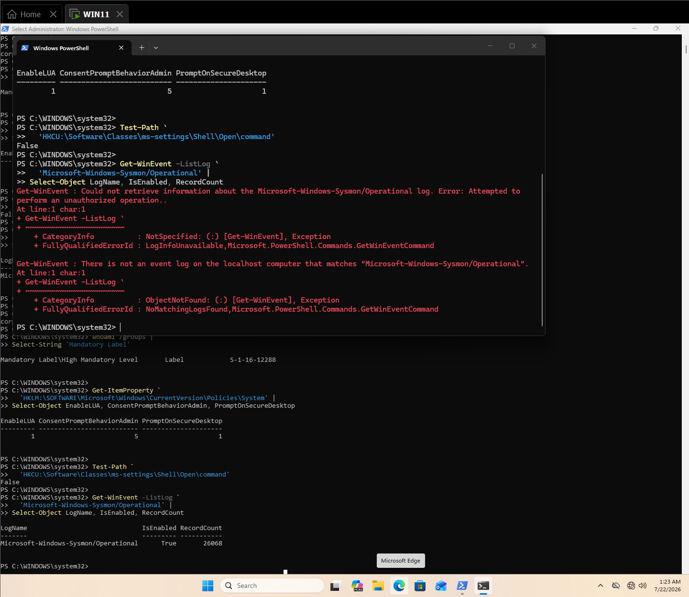
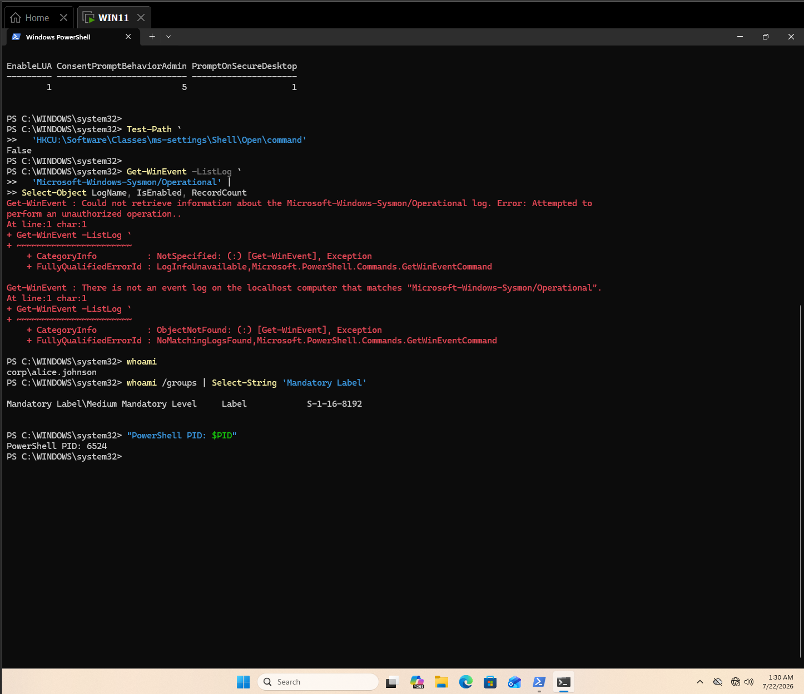

# Detecting UAC Bypass with Sysmon and Wazuh

This case study validates detection of MITRE ATT&CK `T1548.002 - Bypass User Account Control` by correlating a per-user registry override, an auto-elevated Windows broker, and a high-integrity command interpreter created through a full administrator token.

## Result

The detection was validated on July 22, 2026 after switching from `CORP\alice.c.johnson`, which failed the local-administrator prerequisite and produced a UAC credential prompt, to the local split-token administrator `WIN11\win11`. The final CMD-based simulation created the temporary `ms-settings` handler, launched `fodhelper.exe`, removed the handler key, and generated Wazuh custom alerts `100226`, `100227`, and `100228`.

| Validation point | Observed result |
|---|---|
| Endpoint | `WIN11` |
| User | `WIN11\win11` |
| Starting integrity | `Medium Mandatory Level` |
| Local-administrator prerequisite | Passed; `BUILTIN\Administrators` present as deny-only in filtered token |
| UAC | Enabled; `EnableLUA=1` |
| Admin consent behavior | `ConsentPromptBehaviorAdmin=5` |
| Secure desktop | `PromptOnSecureDesktop=1` |
| Test registry key | Absent before execution |
| Sysmon | Enabled; 26,068 records during preflight |
| Detection | Rules `100226`-`100228` |
| ATT&CK mapping | `T1548.002`; registry rule also maps `T1112` |
| Positive alert | Rules `100226`, `100227`, and `100228` observed |
| Negative control | Passed; no `100226` or `100228` in the control window |
| Status | Validated |



*Figure 1. Initial preflight recording the UAC policy, absent test key, and Sysmon availability. The image contains mixed elevated and non-elevated shells and is retained only as supporting evidence.*



*Figure 2. Clean non-elevated context showing `CORP\alice.c.johnson` at Medium integrity before any bypass simulation.*

## Objective and hypothesis

The objective is to distinguish a normal auto-elevated Windows process from a registry-assisted UAC bypass. The hypothesis is that:

- Sysmon Event `13` will preserve the per-user `ms-settings` handler override;
- Sysmon Event `1` will retain the broker and child-process lineage;
- Wazuh will identify the registry precondition under rule `100226`;
- Wazuh will retain broker execution as lower-severity context under rule `100227`;
- Wazuh will elevate a High- or System-integrity interpreter spawned by the broker under rule `100228`;
- launching the broker without the registry override will not trigger the two high-signal rules.

The analytic identifies behavior consistent with UAC bypass. It does not by itself prove attacker intent, successful follow-on activity, or compromise of another identity.

## Lab environment

| Component | Observed value |
|---|---|
| Endpoint | `WIN11` |
| Domain | `corp.local` |
| Test account | `WIN11\win11` |
| Starting token | Medium integrity; split local-administrator token |
| Wazuh agent | `WIN11` |
| Wazuh manager | `wazuh-manager` |
| Wazuh version | `4.14.6` |
| Primary telemetry | Microsoft Sysmon Operational log |
| Required events | Sysmon Event `1`; Sysmon Event `13`; Windows Security Event `4688` |
| Registry path | `HKCU\Software\Classes\ms-settings\Shell\Open\command` |
| Broker | `C:\Windows\System32\fodhelper.exe` |
| Benign payload | `cmd.exe /c start notepad.exe` |

## Safe simulation

The final procedure creates a temporary per-user handler override from a Medium-integrity `cmd.exe` session and launches `fodhelper.exe`. The benign payload starts Notepad through `cmd.exe` so the shell stays open and the test remains visually bounded. It does not create an account, contact a network service, access credentials, disable a control, download content, or establish persistence.

The registry key is removed immediately after the broker launch, and the final `reg query` confirms the handler path is absent.

The exact simulation, guardrails, expected output, and cleanup commands are documented in [`T1548.002-UAC-Bypass-Lab-Runbook.md`](T1548.002-UAC-Bypass-Lab-Runbook.md).

## Endpoint telemetry

Positive validation used the following fresh events:

| Event | Required evidence | Status |
|---:|---|---|
| Sysmon 13 | Target beneath `HKU\<sid>_Classes\ms-settings\Shell\Open\command` | Observed |
| Sysmon 13 | `DelegateExecute` value and handler command | Observed |
| Sysmon 1 | `fodhelper.exe` execution | Observed |
| Sysmon 1 | High-integrity `fodhelper.exe` context | Observed |
| Security 4688 | Full-token `cmd.exe` created by `fodhelper.exe` | Observed |
| Security 4688 | `Mandatory Label` `S-1-16-12288` and `TokenElevationTypeFull` | Observed |

The required process chain is:

```text
Medium cmd.exe
  -> HKCU ms-settings handler override
  -> fodhelper.exe
  -> full-token cmd.exe
  -> benign notepad.exe launch
```

Wazuh normalizes `HKCU\Software\Classes` into `HKU\<sid>_Classes` in alert data, so the final registry rule matches both forms.

## Wazuh hunt and collection validation

Use separate searches for the registry precondition, broker process, and elevated child:

```text
agent.name:"WIN11" AND data.win.eventdata.targetObject:*ms-settings*Shell*Open*command*
```

```text
agent.name:"WIN11" AND data.win.eventdata.image:*fodhelper.exe
```

```text
agent.name:"WIN11" AND data.win.eventdata.parentImage:*fodhelper.exe AND data.win.eventdata.integrityLevel:"High"
```

After deploying the rules, validate alert generation with:

```text
agent.name:"WIN11" AND rule.id:("100226" OR "100227" OR "100228")
```

If the dashboard returns no result, check `archives.json` before diagnosing a collection failure. Finding a raw event proves collection, not a dedicated T1548.002 detection. Only `alerts.json` or the alert index can confirm rule generation.

## Detection engineering

The rule set separates context from high-signal behavior instead of mapping every `fodhelper.exe` execution to UAC bypass.

| Rule | Level | Signal | ATT&CK mapping |
|---:|---:|---|---|
| `100226` | 12 | Per-user `ms-settings` handler override | `T1548.002`, `T1112` |
| `100227` | 6 | Selected auto-elevated broker executed | None; context only |
| `100228` | 12 | Broker spawned High/System interpreter | `T1548.002` |

The validated Wazuh hierarchy is:

```text
Sysmon Event 13 group sysmon_event_13
└── 100226 — ms-settings handler override

Built-in Wazuh UAC broker rule 92055
└── 100227 — auto-elevated broker execution context

Windows Security process creation rule 67027
└── 100228 — full-token interpreter child of broker
```

These parent relationships reflect the active lab telemetry: Sysmon produced the registry and broker process events, while Windows Security Event `4688` preserved the full-token `cmd.exe` child with `Mandatory Label` `S-1-16-12288`.

### Final rules

```xml
<group name="windows,sysmon,uac_bypass,privilege_escalation,mitre,">
  <rule id="100226" level="12">
    <if_group>sysmon_event_13</if_group>
    <field name="win.eventdata.targetObject"
           type="pcre2">(?i)(SOFTWARE\\\\CLASSES|_CLASSES)\\\\MS-SETTINGS\\\\SHELL\\\\OPEN\\\\COMMAND</field>
    <description>UAC bypass registry precondition created for the ms-settings handler</description>
    <mitre>
      <id>T1548.002</id>
      <id>T1112</id>
    </mitre>
    <group>registry,uac_bypass_precondition,modify_registry,</group>
  </rule>

  <rule id="100227" level="6">
    <if_sid>92055</if_sid>
    <description>Windows auto-elevated broker process executed</description>
    <group>uac_auto_elevated_binary,</group>
  </rule>

  <rule id="100228" level="12">
    <if_sid>67027</if_sid>
    <field name="win.eventdata.parentProcessName"
           type="pcre2">(?i)(fodhelper|computerdefaults|eventvwr|sdclt)\.exe$</field>
    <field name="win.eventdata.newProcessName"
           type="pcre2">(?i)(cmd|powershell|pwsh|wscript|cscript|mshta|rundll32|regsvr32)\.exe$</field>
    <field name="win.eventdata.mandatoryLabel"
           type="pcre2">S-1-16-12288</field>
    <field name="win.eventdata.tokenElevationType"
           type="pcre2">%%1937</field>
    <description>Auto-elevated Windows broker spawned a high-integrity interpreter</description>
    <mitre>
      <id>T1548.002</id>
    </mitre>
    <group>uac_bypass_execution,elevated_interpreter,</group>
  </rule>
</group>
```

The deployable copy and parent-placement notes are preserved in [`detection-rules.xml`](detection-rules.xml).

## Positive validation

Positive validation passed with fresh post-deployment activity. The final run demonstrated:

1. a Medium-integrity split-token administrator session as `WIN11\win11`;
2. a temporary `HKCU\Software\Classes\ms-settings\Shell\Open\command` override;
3. `DelegateExecute` creation;
4. `fodhelper.exe` execution without entering credentials;
5. a full-token `cmd.exe` child recorded by Windows Security `4688`;
6. Wazuh rule `100226` for registry preconditions;
7. Wazuh rule `100227` for broker execution context;
8. Wazuh rule `100228` for high-integrity interpreter execution;
9. registry cleanup immediately after execution.

The first attempt under `CORP\alice.c.johnson` remains useful negative prerequisite evidence only: it produced a credential prompt and is not claimed as a bypass.

## Negative control

The control launches `fodhelper.exe` after confirming the test registry key is absent. Rule `100227` may produce low-severity broker context. Rules `100226` and `100228` must not fire.

The control query is:

```text
agent.name:"WIN11" AND rule.id:("100226" OR "100228") AND @timestamp >= "CONTROL_START_UTC"
```

A zero-result dashboard query becomes valid control evidence only after the broker's Sysmon Event `1` is confirmed in manager archives for the same test window.

## False positives and triage

Potential legitimate sources include:

- Windows settings and Control Panel workflows;
- enterprise configuration and endpoint-management tooling;
- software installers and repair utilities;
- accessibility or support tooling;
- approved administrative and security validation scripts.

Analysts should review:

- the exact per-user Classes registry path, value data, creator process, and lifetime;
- the starting process's user, integrity level, parent, command line, and remote origin;
- whether the broker spawned an interpreter or other unexpected child;
- whether the elevated child used encoding, hidden execution, downloads, or user-writable paths;
- nearby credential access, persistence, defense evasion, and lateral movement;
- whether the sequence matches an approved test or managed installation window.

Higher-risk context includes a registry override immediately followed by broker execution, a Medium-to-High integrity transition, an interpreter child, an unfamiliar payload path, or subsequent credential access and remote authentication.

## Analyst response workflow

When rule `100226` or `100228` fires, the analyst should:

1. Confirm the host, user, timestamp, source integrity, registry target, and complete value data.
2. Reconstruct the broker and child-process tree using ProcessGuid and parent fields.
3. Identify the elevated payload, hash, signature, path, and follow-on activity.
4. Determine whether the behavior belongs to an approved validation or software workflow.
5. Preserve alerts, raw events, registry data, process artifacts, and screenshots.
6. Isolate the endpoint when the sequence is unauthorized or the payload is suspicious.
7. Hunt for the same registry paths, brokers, payloads, hashes, and identities across other endpoints.
8. Remove unauthorized handler overrides only after evidence preservation.
9. Reset exposed credentials if credential access followed the bypass.

## Engineering considerations

- Broker execution alone is insufficient for a high-confidence UAC-bypass claim.
- Rule `100227` is intentionally contextual and carries no ATT&CK mapping.
- Rule `100226` may also identify incomplete or blocked bypass preparation.
- Rule `100228` depends on Windows Security `4688` preserving `parentProcessName`, `newProcessName`, `mandatoryLabel`, and `tokenElevationType`.
- The rules cover selected registry-based auto-elevation patterns, not all T1548.002 variants.
- Rule IDs `100226`–`100228` must be checked for collisions on the active manager.
- The manager must validate parent rule or group references `sysmon_event_13`, `92055`, and `67027` in its loaded ruleset.
- Fresh events are required after deployment because archived records are not reevaluated.
- Exceptions should be scoped to known tools, users, hosts, paths, and maintenance windows; do not globally allowlist an auto-elevated broker.
- Existing duplicate and invalid-rule warnings documented elsewhere in the portfolio remain separate ruleset-hygiene findings.

## Cleanup

The CMD-based positive procedure removes `HKCU\Software\Classes\ms-settings` after execution. The final `reg query HKCU\Software\Classes\ms-settings\Shell\Open\command` returned `ERROR: The system was unable to find the specified registry key or value.`

The earlier PowerShell marker approach was abandoned because the shell closed during validation. No marker artifact is required for the final CMD-based evidence set.

## Timeline

All recorded evidence occurred on July 22, 2026 in Eastern Daylight Time.

| Time | Source | Event | Interpretation |
|---|---|---|---|
| 01:23–01:24 | WIN11 | UAC policy, registry baseline, and Sysmon checks | UAC enabled; test key absent; Sysmon enabled |
| 01:30 | WIN11 | `whoami` and token-group inspection | `CORP\alice.c.johnson` confirmed at Medium integrity |
| Approximately 02:00 | WIN11 | First controlled positive attempt | Credential prompt blocked the test; no bypass claimed |
| 02:44 | WIN11 | Retest preflight with `WIN11\win11` | Split-token local administrator confirmed |
| 02:47–03:26 | Wazuh manager | Rule deployment, parent correction, validation, and restart | `ValidationExit=0`; manager active |
| 03:23 | Wazuh | Rule `100226` fired | Registry precondition observed |
| 03:27 | Wazuh | Rules `100226`, `100227`, and `100228` fired | Positive validation complete |
| 03:29 | WIN11 | CMD rerun and cleanup screenshot | Handler key removed after execution |
| 03:38 | WIN11/Wazuh | Negative control | Handler key absent; broker context only; high-signal rules quiet |

## Findings

### 1. The account prerequisite matters

UAC was enabled, the user began at Medium integrity, and the per-user handler path was absent. The credential prompt under `CORP\alice.c.johnson` demonstrated that Medium integrity alone was insufficient: the test identity also needed a split local-administrator token. The successful run used `WIN11\win11`.

### 2. Non-elevated event-log access is a collection boundary, not a Sysmon failure

The filtered user could not enumerate the Sysmon log through `Get-WinEvent`, while the elevated check showed that the log was enabled and populated. Endpoint telemetry review should occur from an authorized elevated context after the simulation.

### 3. Detection confidence comes from the chain

A registry override or broker launch alone can be incomplete or legitimate. The combination of the override, broker lineage, and elevated interpreter provides substantially stronger evidence.

### 4. The final rule parents had to match the active telemetry

The original draft assumed Sysmon parent rule `92069`, but that rule is WMI-specific in this manager. The validated rules use `sysmon_event_13`, built-in rule `92055`, and Windows Security process rule `67027`, matching the events observed in this lab.

### 5. Positive and negative validation are complete

Rules `100226`, `100227`, and `100228` fired from fresh post-deployment activity. The negative control then launched `fodhelper.exe` after confirming the registry override was absent; the high-signal rules `100226` and `100228` stayed quiet.

## Evidence inventory

| Artifact | Purpose | Status |
|---|---|---|
| `001-uac-and-sysmon-preflight.png` | Initial UAC, key, and Sysmon readiness | Complete; mixed shell contexts |
| `002-medium-integrity-preflight.png` | Clean Medium-integrity prerequisite | Complete |
| `003-positive-attempt-blocked-uac-credential-prompt.png` | Blocked attempt proving the account prerequisite failed | Complete |
| `003b-account-prerequisite-membership-check.png` | Local group and token evidence confirming Alice is not a local administrator | Complete |
| `003c-valid-split-token-admin-preflight.png` | Valid `WIN11\win11` split-token administrator preflight | Complete |
| `003d-manager-rules-and-parents-present.png` | Manager-side custom and parent rule presence check | Complete |
| `003e-manager-ruleset-validation-pass.png` | `wazuh-analysisd -t` validation evidence | Complete |
| `004-manager-restart-active.png` | Wazuh manager restart and active status | Complete |
| `004b-manager-rule-id-presence-after-restart.png` | Post-restart rule ID presence evidence | Complete |
| `005-positive-cmd-fodhelper-run.png` | CMD-based positive simulation | Complete |
| `006-positive-cmd-rerun-cleanup.png` | Final CMD rerun and registry cleanup evidence | Complete |
| Wazuh alert log | Rules `100226`, `100227`, and `100228` observed after deployment | Complete |
| `009-negative-control-no-high-signal-alert.png` | Negative-control result | Complete |
| `010-manager-authenticated-session.png` | Authenticated manager session and failed WIN11-to-manager `scp` attempt | Complete |
| `011-final-cleanup.png` | Additional artifact removal screenshot | Not required for final CMD path |

## Reproduction

See [T1548.002-UAC-Bypass-Lab-Runbook.md](T1548.002-UAC-Bypass-Lab-Runbook.md) and [detection-rules.xml](detection-rules.xml).
