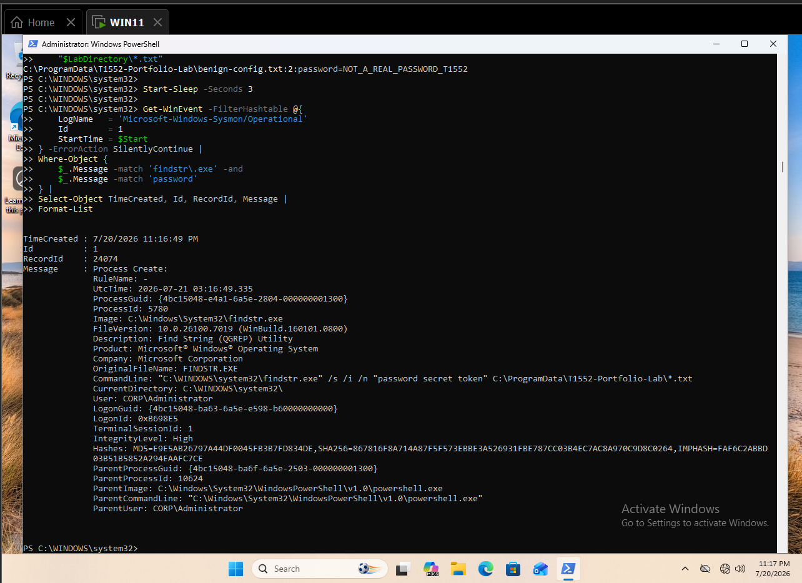
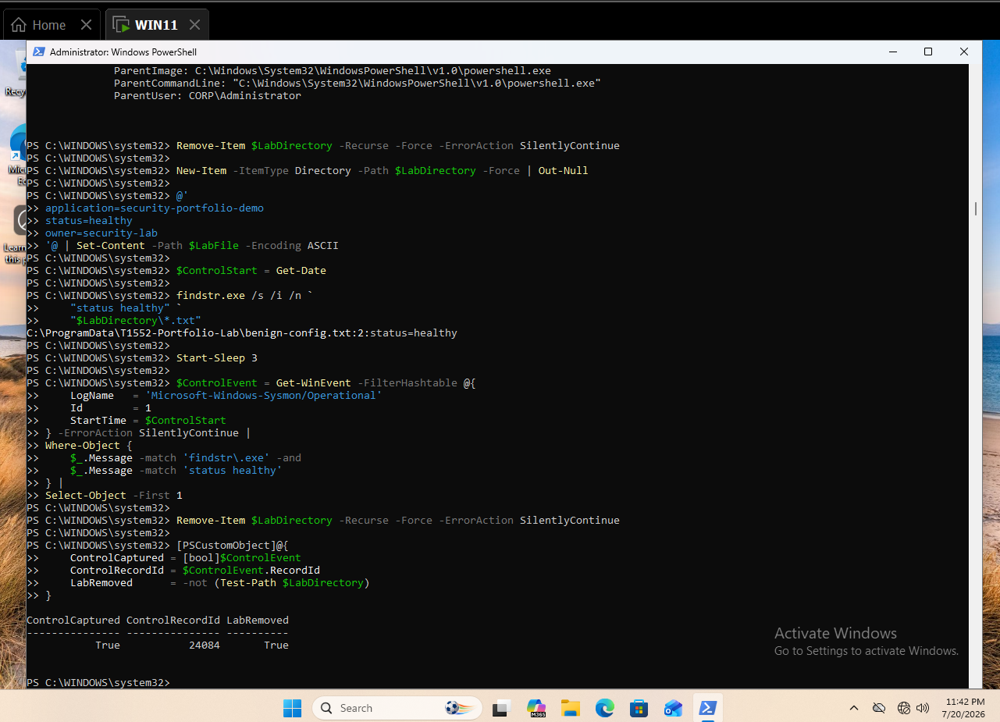
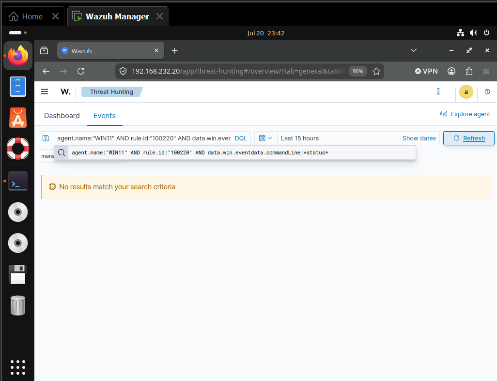
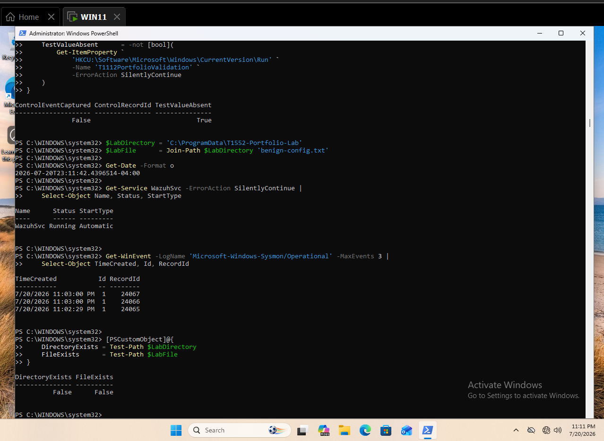

# Detecting Credential-Oriented File Searches with Sysmon and Wazuh

This case study validates detection of behavior associated with MITRE ATT&CK `T1552 — Unsecured Credentials`: searching files or command output for credential-related material.

## Result

A bounded `findstr.exe` search located one explicitly fake password marker in a temporary lab file. Sysmon recorded the process as Event ID `1`, and Wazuh produced a level `11` alert under rule `100220`, mapped to T1552. A second search used the same executable, parent, directory, file type, and flags but searched only for `status healthy`; Wazuh archived that event without generating an alert. All temporary files were removed.

| Validation point | Observed result |
|---|---|
| Endpoint | `WIN11.corp.local` |
| Agent | `WIN11`, agent `002` |
| User | `CORP\Administrator` |
| Positive process | `C:\Windows\System32\findstr.exe` |
| Positive terms | `password secret token` |
| Fake marker | `NOT_A_REAL_PASSWORD_T1552` |
| Primary telemetry | Sysmon Event ID `1` |
| Positive record | `24074` |
| Detection | Rule `100220`, level `11` |
| ATT&CK mapping | `T1552 — Unsecured Credentials` |
| Positive time | July 20, 2026 at `23:16:51` EDT |
| Control terms | `status healthy` |
| Control record | `24084` |
| Control alert count | `0` |
| Cleanup | Temporary directory removed |



*Figure 1. Fake marker output and Sysmon Event `1`, record `24074`, for the credential-oriented search.*



*Figure 2. The same `findstr.exe` lineage using non-credential terms, record `24084`, followed by cleanup.*



*Figure 3. No rule `100220` result for the `status healthy` control.*

## Objective and hypothesis

The objective was to detect credential-oriented file-search behavior without creating, exposing, or searching for real secrets. The hypothesis was that:

- Sysmon would retain the search utility and terms in process-creation telemetry;
- Wazuh would alert when the command line combined a supported search method with credential-related keywords;
- a non-credential search using the same process lineage would remain outside the analytic;
- both activities would be distinguishable in manager archives.

The alert identifies search behavior for investigation. It does not prove that credentials existed, were valid, were read successfully, or were used afterward.

## Lab environment

| Component | Observed value |
|---|---|
| Endpoint | `WIN11.corp.local` |
| Domain | `corp.local` |
| Test account | `CORP\Administrator` |
| Wazuh agent | `WIN11`, agent `002` |
| Wazuh manager | `wazuh-manager` at `192.168.232.20` |
| Wazuh version | `4.14.6` |
| Endpoint telemetry | Microsoft Sysmon Operational log |
| Primary event | Event ID `1` — Process Create |
| Parent process | Windows PowerShell |
| Test directory | `C:\ProgramData\T1552-Portfolio-Lab` |



*Figure 4. Wazuh and Sysmon readiness with the test directory and file absent.*

## Safe simulation

The lab created one text file containing only a deliberately invalid marker:

```text
application=security-portfolio-demo
password=NOT_A_REAL_PASSWORD_T1552
owner=security-lab
```

The search was restricted to:

```text
C:\ProgramData\T1552-Portfolio-Lab\*.txt
```

The positive command was:

```powershell
findstr.exe /s /i /n "password secret token" `
    "C:\ProgramData\T1552-Portfolio-Lab\*.txt"
```

No production directory, user profile, browser store, repository, backup, configuration tree, or real credential file was searched.

## Endpoint telemetry

Sysmon Event `1`, record `24074`, retained the evidence required to reconstruct the positive activity:

| Field | Observed value |
|---|---|
| Image | `C:\Windows\System32\findstr.exe` |
| Command line | `findstr.exe /s /i /n "password secret token" C:\ProgramData\T1552-Portfolio-Lab*.txt` |
| Parent image | `C:\Windows\System32\WindowsPowerShell\v1.0\powershell.exe` |
| User | `CORP\Administrator` |
| Integrity level | High |
| Process ID | `5780` |
| Parent process ID | `10624` |
| MD5 | `E9E5AB26797A44DF0045FB3B7FD834DE` |
| SHA-256 | `867816F8A714A87F5F573EBBE3A526931FBE787CC03B4EC7AC8A970C9D8C0264` |
| IMPHASH | `FAF6C2ABBD03B51B5852A294EAAFC7CE` |

This telemetry demonstrates process execution and search intent. It does not show which files were opened internally by `findstr.exe` or whether any discovered value was later used.

## Wazuh hunt and collection validation

The primary positive query was:

```text
agent.name:"WIN11" AND rule.id:"100220" AND data.win.system.eventRecordID:"24074"
```

Manager verification against `alerts.json` confirmed:

| Field | Observed value |
|---|---|
| Rule ID | `100220` |
| Rule level | `11` |
| Description | `MITRE T1552 - Credential material searched from files or command output` |
| ATT&CK tactic | Credential Access |
| ATT&CK technique | Unsecured Credentials |
| Source event | Sysmon Event ID `1` |
| Event record | `24074` |
| Timestamp | `2026-07-20T23:16:51.281-0400` |

The raw positive alert is preserved in [t1552-positive-alert-24074.json](evidence/t1552-positive-alert-24074.json).

## Troubleshooting and detection engineering

The case study did not require a new rule or manager restart because rule `100220` already matched the live decoder path. Troubleshooting focused on separating test execution, telemetry collection, alert generation, and precision.

| Step | Observation | Validation action | Result |
|---|---|---|---|
| 1 | Prior case-study commands remained visible in the console | Created dedicated variables and checked both T1552 paths | Clean baseline confirmed |
| 2 | A test credential was required without introducing sensitive data | Used `NOT_A_REAL_PASSWORD_T1552` in an isolated file | No real secret created |
| 3 | Search output alone could not prove telemetry | Queried Sysmon Event `1` from the positive start time | Record `24074` confirmed |
| 4 | Local telemetry did not prove alert generation | Queried Wazuh archives and alerts for record `24074` | Rule `100220`, level `11`, confirmed |
| 5 | A control needed the same process lineage | Reused `findstr.exe`, PowerShell parent, flags, path, and file type | Only search terms changed |
| 6 | Dashboard returned no control alert | Queried manager archives for record `24084` | Collection confirmed with `rule: null` |
| 7 | Archive collection still did not prove alert exclusion | Counted record `24084` in `alerts.json` | Alert count `0` |
| 8 | Temporary content could remain after testing | Removed the positive file before the control and the control directory afterward | `LabRemoved = True` |

This workflow avoided two common interpretation errors:

- treating command output as proof that Wazuh collected the event;
- treating an empty dashboard result as proof of precision without confirming the control reached archives.

### Validated rule path

```text
Sysmon Event ID 1
└── sysmon_event1 group
    └── 100220 — credential-oriented search command (T1552)
```

### Final rule

```xml
<rule id="100220" level="11">
  <if_group>sysmon_event1</if_group>
  <field name="win.eventdata.commandLine"
         type="pcre2">(?i)(findstr(\.exe)?.*(password|passwd|pwd|secret|token|apikey)|Select-String.*(password|passwd|pwd|secret|token|apikey)|dir.*(passwords?|credentials?|secrets?))</field>
  <description>MITRE T1552 - Credential material searched from files or command output</description>
  <mitre>
    <id>T1552</id>
  </mitre>
  <group>credential_access,credentials_in_files,</group>
</rule>
```

The rule combines a supported search approach with credential-oriented terms. It is a command-intent analytic, not content inspection.

## Positive validation

The positive test passed end to end:

1. The isolated fake file was created.
2. `findstr.exe` displayed only the fake password line.
3. Sysmon recorded Event `1`, record `24074`.
4. Wazuh generated rule `100220`, level `11`.
5. Wazuh enriched the event with T1552 and Credential Access.
6. The raw alert was exported before cleanup.

No rule modification was needed. This result validates the existing analytic against the live Windows/Sysmon decoder path.

## Negative control

The positive file was removed and replaced with:

```text
application=security-portfolio-demo
status=healthy
owner=security-lab
```

The control command was:

```powershell
findstr.exe /s /i /n "status healthy" `
    "C:\ProgramData\T1552-Portfolio-Lab\*.txt"
```

The control preserved the following variables:

- `findstr.exe` image;
- PowerShell parent;
- `CORP\Administrator` user;
- recursive, case-insensitive, and line-number flags;
- test directory and `.txt` file type.

Only the search terms and file contents changed. Sysmon record `24084` reached `archives.json` with the expected command line and `rule: null`. A direct lookup in `alerts.json` returned `0` records.

The raw control is preserved in [t1552-negative-control-24084.json](evidence/t1552-negative-control-24084.json). This validates keyword discrimination for one controlled comparison; it does not establish a production false-positive rate.

## False positives and triage

Legitimate sources include:

- source-code and configuration audits;
- secret-scanning and compliance tools;
- administrator troubleshooting;
- incident-response collections;
- deployment scripts and CI/CD checks;
- developers searching documentation or test fixtures;
- data-loss prevention and security validation tools.

Analysts should review:

- the searched directory, recursion scope, and file types;
- whether the path contains production configuration, profiles, backups, or repositories;
- the user, parent process, integrity level, and remote origin;
- whether the search was broad or targeted to a known application;
- command obfuscation, encoding, aliases, or indirect execution;
- subsequent file reads, archive creation, network transfer, or credential use;
- whether the activity matches approved security scanning or development workflows.

Higher-risk context includes execution by a newly observed account, searches across user profiles or backups, encoded PowerShell, staging into an archive, outbound transfer, or authentication with a value shortly after discovery.

## Analyst response workflow

When rule `100220` fires, the analyst should:

1. Confirm the host, user, timestamp, process image, parent, and complete command line.
2. Identify the searched path, file patterns, recursion scope, and credential terms.
3. Determine whether the user and parent process are expected for the endpoint role.
4. Review adjacent Sysmon and PowerShell events for related discovery commands.
5. Check for file staging, compression, clipboard access, network transfer, or cloud uploads.
6. Review subsequent logons or explicit-credential events involving accounts named in nearby activity.
7. Validate whether an approved scanner, developer workflow, support action, or incident-response collection explains the search.
8. Escalate when search scope, account context, obfuscation, or follow-on behavior indicates possible credential theft.

## Engineering considerations

- Command-line keyword detection cannot confirm file contents or successful access.
- Add path and file-extension context for higher-confidence production severity.
- Consider PowerShell Script Block, file-read, EDR, and data-loss telemetry for enrichment.
- Test `Select-String`, `find`, recursive PowerShell, aliases, alternate encodings, and renamed utilities separately.
- Evaluate false positives from approved secret scanners before production escalation.
- Avoid global allowlists; scope exceptions to approved tools, paths, hosts, users, and schedules.
- Generate fresh activity after rule changes because archived events are not reevaluated.
- The manager's duplicate IDs `100201–100210` and invalid rule `100214` remain separate ruleset-hygiene findings.

## Cleanup

The positive file was removed before the control. The control directory was then removed, and `LabRemoved = True` was recorded. No real secrets, users, services, registry values, scheduled tasks, listeners, or persistent processes were created.

## Timeline

All events occurred on July 20, 2026 in Eastern Daylight Time.

| Time | Source | Event | Interpretation |
|---|---|---|---|
| 23:11 | WIN11 | Readiness and clean-path checks | Agent and telemetry ready; lab paths absent |
| 23:16:49 | WIN11 | `findstr.exe` credential-oriented search | Sysmon record `24074` generated |
| 23:16:51 | Wazuh | Rule `100220`, level `11` | Positive T1552 detection passed |
| 23:41:13 | WIN11/Wazuh archives | `status healthy` control | Sysmon record `24084` collected |
| 23:41–23:42 | Wazuh alerts and dashboard | No rule `100220` result | Negative control passed |
| 23:41 | WIN11 | Temporary directory removal | Cleanup confirmed |

## Findings

### 1. Existing coverage worked on the live decoder path

Rule `100220` detected the positive event without modification, demonstrating that its `sysmon_event1` dependency and command-line field matched live telemetry.

### 2. Search intent is visible, but file access is not proven

The command line showed credential-oriented intent and the test output demonstrated a match. Sysmon Process Create alone does not enumerate every file opened or prove that a discovered value was usable.

### 3. The matched-keyword condition provided tested precision

The control preserved process lineage and execution flags while replacing credential terms with operational terms. It reached archives and did not alert.

### 4. Archive inspection was essential to validate the control

The empty dashboard result became meaningful only after record `24084` was confirmed in `archives.json` and absent from `alerts.json`.

### 5. Production confidence requires additional context

Path sensitivity, user context, search breadth, follow-on file staging, outbound transfer, and subsequent authentication should influence severity and escalation.

## Evidence inventory

| Artifact | Purpose |
|---|---|
| `001-t1552-readiness-and-clean-baseline.png` | Readiness and clean baseline |
| `002-t1552-fake-credential-search-and-sysmon-event.png` | Positive output and Sysmon event |
| `004-t1552-noncredential-control-and-cleanup.png` | Control event and cleanup |
| `005-t1552-negative-control-no-credential-alert.png` | No control alert |
| `t1552-positive-alert-24074.json` | Raw positive alert |
| `t1552-negative-control-24084.json` | Raw control archive event |

## Reproduction

See [T1552-Credentials-in-Files-Lab-Runbook.md](T1552-Credentials-in-Files-Lab-Runbook.md) and [detection-rules.xml](detection-rules.xml).
