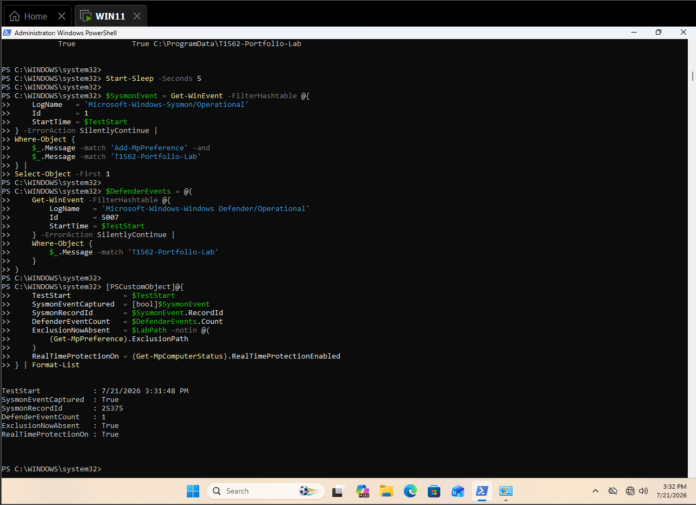
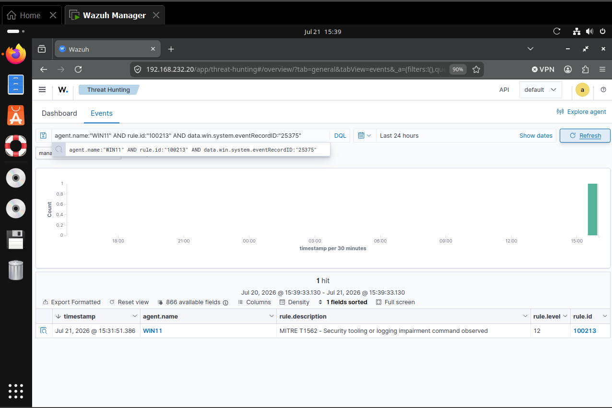
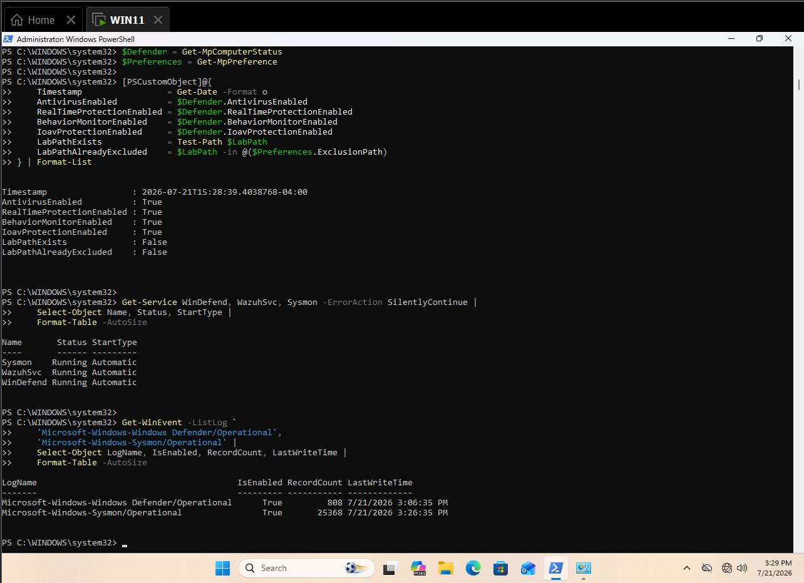
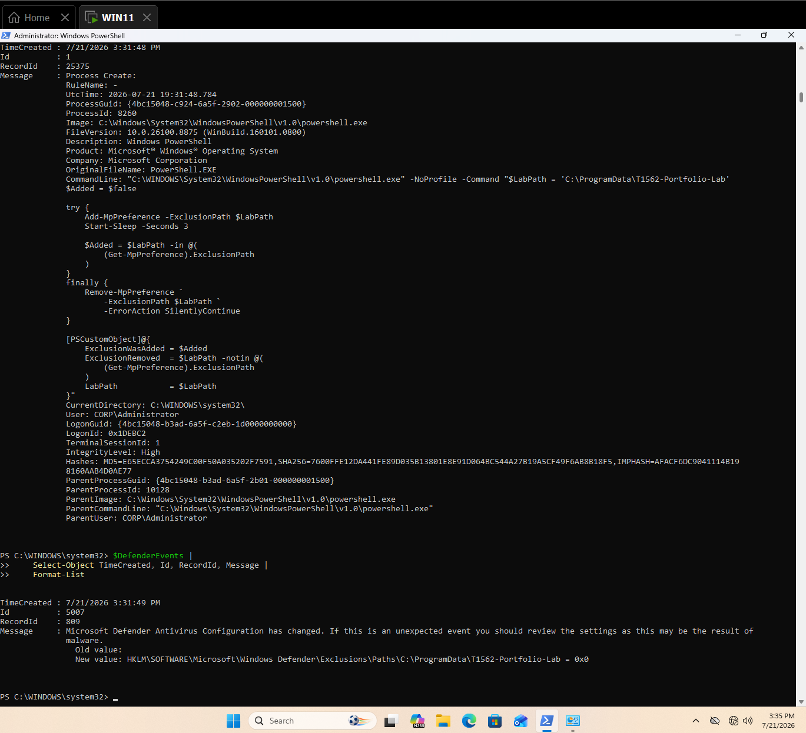
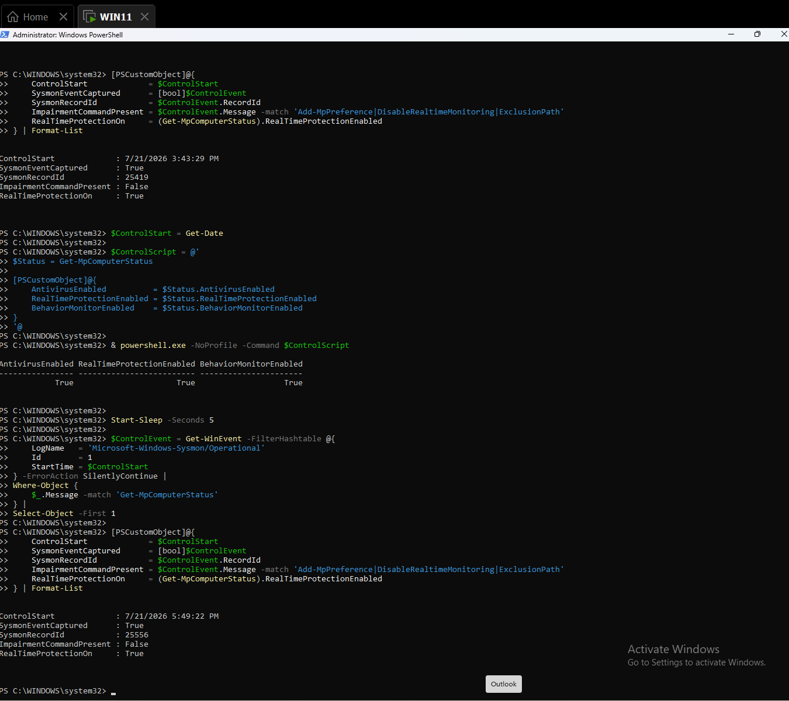
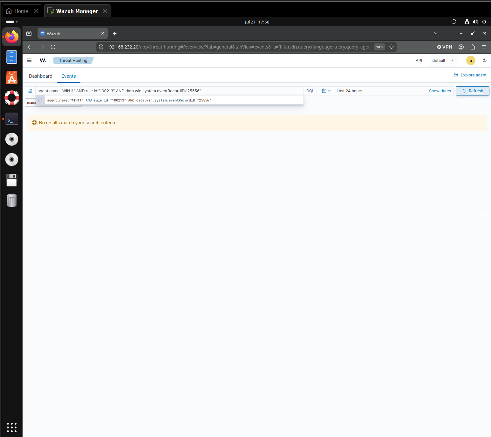
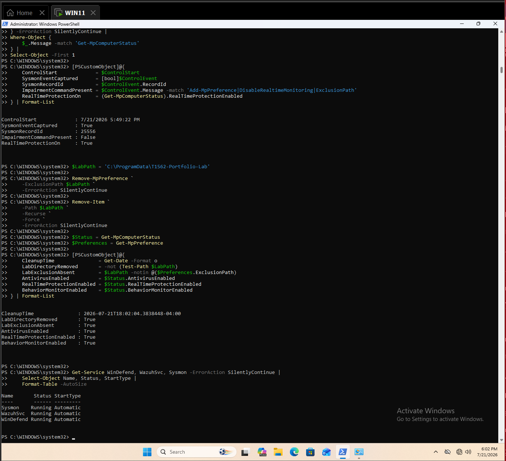

# Detecting Security-Control Impairment with Sysmon and Wazuh

This case study validates detection of behavior associated with MITRE ATT&CK `T1562.001 — Impair Defenses` through a bounded, reversible Microsoft Defender exclusion change.

## Result

A child PowerShell process briefly added an exclusion for an empty portfolio-only directory and removed it automatically. Sysmon recorded Event ID `1`, record `25375`; Microsoft Defender recorded configuration-change Event `5007`, record `809`; and Wazuh produced level `12` rule `100213`, mapped to T1562. A read-only `Get-MpComputerStatus` control generated Sysmon record `25556` and Wazuh rule `100221`, but did not trigger `100213`. Cleanup confirmed the directory and exclusion were absent and all security services remained healthy.

| Validation point | Observed result |
|---|---|
| Endpoint | `WIN11.corp.local` |
| Agent | `WIN11`, agent `002`, `192.168.232.134` |
| User | `CORP\\Administrator` |
| Positive process | `powershell.exe` |
| Positive command | `Add-MpPreference -ExclusionPath` |
| Isolated path | `C:\\ProgramData\\T1562-Portfolio-Lab` |
| Sysmon positive | Event `1`, record `25375` |
| Defender positive | Event `5007`, record `809` |
| Detection | Rule `100213`, level `12` |
| ATT&CK | `T1562.001 — Impair Defenses` |
| Control | `Get-MpComputerStatus`, record `25556` |
| Control classification | Rule `100221`, T1059.001 |
| Cleanup | Passed |



*Figure 1. The exclusion was added, endpoint telemetry was captured, and protection was restored immediately.*



*Figure 2. Wazuh rule `100213`, level `12`, classifies the positive event as security-control impairment.*

## Objective and hypothesis

The objective was to detect an attempted weakening of endpoint protection without disabling Defender globally or leaving a persistent gap. The hypothesis was that a child PowerShell command would preserve intent in Sysmon process telemetry, Defender would record its configuration change, Wazuh would classify the exclusion command as T1562, and a read-only Defender query would remain outside the analytic.

The alert proves security-control modification intent. It does not by itself establish malicious intent, successful malware execution, or exploitation of the excluded path.

## Lab environment

| Component | Observed value |
|---|---|
| Workstation | Windows 11, `WIN11.corp.local` |
| Domain account | `CORP\\Administrator` |
| Wazuh manager | `wazuh-manager`, `192.168.232.20` |
| Wazuh version | `4.14.6` |
| Primary telemetry | Sysmon Operational Event `1` |
| Corroborating telemetry | Defender Operational Event `5007` |
| Test directory | `C:\\ProgramData\\T1562-Portfolio-Lab` |



*Figure 3. Defender protections, Sysmon, and Wazuh Agent were active; the lab directory and exclusion were absent.*

## Safe simulation

The test created only an empty directory, added that exact path as a Defender exclusion, verified it, and removed it in a `finally` block after three seconds. It did not disable real-time protection, stop a security service, modify firewall state, disable logging, place an executable in the excluded path, or introduce malware.

## Endpoint telemetry

Sysmon Event `1`, record `25375`, retained the child PowerShell image, full `Add-MpPreference -ExclusionPath` command, lab path, user, integrity, and parent. Defender Event `5007`, record `809`, independently recorded the exclusion-path configuration change.

| Field | Observed value |
|---|---|
| Sysmon image | `C:\\Windows\\System32\\WindowsPowerShell\\v1.0\\powershell.exe` |
| Original filename | `PowerShell.EXE` |
| Command indicator | `Add-MpPreference -ExclusionPath` |
| Changed preference | Defender exclusion path |
| Target | `C:\\ProgramData\\T1562-Portfolio-Lab` |
| User | `CORP\\Administrator` |
| Integrity | High |



*Figure 4. Sysmon process creation and Defender Event `5007` corroborate the bounded change.*

## Wazuh hunt and collection validation

The positive query was:

```text
agent.name:"WIN11" AND rule.id:"100213" AND data.win.system.eventRecordID:"25375"
```

It returned one level `12` alert with description `MITRE T1562 - Security tooling or logging impairment command observed`.

## Troubleshooting and detection engineering

| Observation | Validation action | Outcome |
|---|---|---|
| Interactive commands do not create a new process event | Executed the bounded test in a child PowerShell process | Full command captured in Event `1` |
| One sensor alone could be ambiguous | Correlated Sysmon Event `1` with Defender Event `5007` | Intent and state change both preserved |
| The test briefly changed protection scope | Used an empty dedicated path and `finally` restoration | Exclusion removed automatically |
| Dashboard positive needed exact attribution | Filtered by agent, rule, and record `25375` | Rule `100213` confirmed |
| Empty negative result alone was insufficient | Verified record `25556` under rule `100221` first | Collection separated from classification |

### Validated rule path

```text
Sysmon Event ID 1
└── sysmon_event1 group
    ├── 100221 — ordinary PowerShell execution (control)
    └── 100213 — security-control impairment command (T1562.001)
```

### Final rule

```xml
<rule id="100213" level="12">
  <if_group>sysmon_event1</if_group>
  <field name="win.eventdata.commandLine" type="pcre2">(?i)(Set-MpPreference.*Disable|Add-MpPreference.*Exclusion|netsh(\.exe)?\s+advfirewall\s+set.*state\s+off|sc(\.exe)?\s+(stop|config)\s+(WinDefend|Sense|wscsvc)|wevtutil(\.exe)?\s+sl\s+Security\s+/e:false)</field>
  <description>MITRE T1562 - Security tooling or logging impairment command observed</description>
  <mitre><id>T1562.001</id></mitre>
  <group>defense_evasion,impair_defenses,</group>
</rule>
```

The versioned rule pack carries equivalent logic as portable rule `110109`.

## Positive validation

The positive path passed end to end: the bounded exclusion was confirmed, both endpoint sources recorded the activity, Wazuh ingested record `25375`, and rule `100213` produced a T1562 alert. Automatic restoration completed before the command returned.

## Negative control

The control used the same endpoint, user, parent class, child PowerShell image, and Sysmon source but ran only `Get-MpComputerStatus`. Sysmon record `25556` reached Wazuh and matched ordinary PowerShell rule `100221`; a targeted query for `100213` and the same record returned no results.



*Figure 5. The control remains observable, contains no impairment terms, and leaves real-time protection enabled.*



*Figure 6. Wazuh correctly withholds rule `100213` from control record `25556`.*

## False positives and triage

Expected legitimate sources include endpoint-management platforms, security engineering, incident response, software deployment, troubleshooting, approved exclusions, firewall maintenance, and logging-policy changes. Triage the exact setting, target path or service, user, parent, remote origin, change ticket, duration, host role, and follow-on execution. An exclusion covering user-writable, download, temporary, profile, or application-staging paths carries greater risk than a tightly governed vendor path.

## Analyst response workflow

1. Confirm the host, user, timestamp, process image, parent, integrity, and full command line.
2. Determine which control changed: Defender preference, exclusion, firewall, logging, or security service.
3. Verify the current state directly; do not assume the change was automatically reversed.
4. Identify any files created or executed inside a newly excluded path.
5. Review adjacent PowerShell, service, registry, firewall, Defender, and authentication telemetry.
6. Validate change-management, endpoint-management, troubleshooting, or incident-response context.
7. Restore protection, remove unauthorized exclusions, and restart affected controls when safe.
8. Isolate and escalate if impairment coincides with payload execution, credential access, lateral movement, or log deletion.

## Engineering considerations

- Detection yield: `1/1` bounded positive tests triggered rule `100213`.
- Tested control result: `0/1` read-only controls triggered `100213`; this is not a production false-positive rate.
- Expected blind spots include direct registry/API changes, tamper-protected failures, renamed utilities, remote policy changes, sensor loss, alternate firewalls, and obfuscated commands.
- Tuning decision: retain action-specific verbs and security-control targets; do not alert on all PowerShell or all Defender queries.
- Correlate command intent with Defender Event `5007`, service-state changes, registry changes, and subsequent execution from excluded paths.
- Generate fresh activity after rule changes because Wazuh does not reevaluate archived events.

## Cleanup

The exclusion was removed, the lab directory was deleted, and Defender antivirus, real-time protection, and behavior monitoring remained enabled. `WinDefend`, `Sysmon`, and `WazuhSvc` remained running and automatic.



*Figure 7. Final state confirms no remaining exclusion or directory and healthy security services.*

## Timeline

All timestamps are July 21, 2026 Eastern Daylight Time.

| Time | Source | Event |
|---|---|---|
| 15:28:39 | WIN11 | Clean baseline and service readiness |
| 15:31:48 | Sysmon | Positive Event `1`, record `25375` |
| 15:31:49 | Defender | Configuration Event `5007`, record `809` |
| 15:31:51 | Wazuh | Rule `100213`, level `12` |
| 17:49:22 | Sysmon | Read-only control record `25556` |
| 17:49:23 | Wazuh | Control classified as rule `100221` |
| 18:02:04 | WIN11 | Cleanup and protection health confirmed |

## Findings

### 1. Multi-source evidence increased confidence

Sysmon preserved command intent while Defender Event `5007` confirmed a real configuration change.

### 2. Immediate restoration reduced test risk

The exclusion applied only to an empty dedicated directory and was removed in a `finally` block before the test returned.

### 3. The existing analytic worked on the live decoder path

Rule `100213` required no manager modification and matched the decoded Event `1` command line.

### 4. The control demonstrated action-level discrimination

Read-only Defender inspection remained visible as ordinary PowerShell activity without receiving a T1562 classification.

### 5. Command intent does not prove downstream abuse

Production triage must determine whether the control change succeeded, persisted, or enabled subsequent malicious execution.

## Evidence inventory

| Artifact | Purpose |
|---|---|
| [001-t1562-readiness-and-clean-baseline.png](evidence/001-t1562-readiness-and-clean-baseline.png) | Clean baseline and healthy controls |
| [002-t1562-bounded-exclusion-test-and-immediate-restoration.png](evidence/002-t1562-bounded-exclusion-test-and-immediate-restoration.png) | Positive execution and restoration summary |
| [003-t1562-sysmon-add-mppreference-process-event.png](evidence/003-t1562-sysmon-add-mppreference-process-event.png) | Sysmon positive detail |
| [004-t1562-defender-event-5007-exclusion-change.png](evidence/004-t1562-defender-event-5007-exclusion-change.png) | Defender configuration corroboration |
| [005-t1562-wazuh-rule-100213-positive-alert.png](evidence/005-t1562-wazuh-rule-100213-positive-alert.png) | Positive Wazuh alert |
| [006-t1562-read-only-defender-control-sysmon-event.png](evidence/006-t1562-read-only-defender-control-sysmon-event.png) | Read-only negative control |
| [007-t1562-negative-control-wazuh-telemetry.png](evidence/007-t1562-negative-control-wazuh-telemetry.png) | Control ingestion under ordinary PowerShell rule |
| [008-t1562-negative-control-no-impairment-alert.png](evidence/008-t1562-negative-control-no-impairment-alert.png) | Control excluded from impairment rule |
| [009-t1562-cleanup-and-security-control-health.png](evidence/009-t1562-cleanup-and-security-control-health.png) | Cleanup and service health |

## Reproduction

See [T1562.001-Impair-Defenses-Lab-Runbook.md](T1562.001-Impair-Defenses-Lab-Runbook.md) and [detection-rules.xml](detection-rules.xml).
