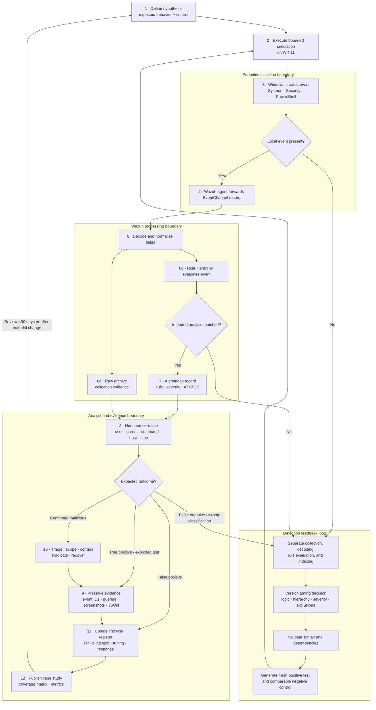

# Detection Engineering Data-Flow Diagram

## Telemetry, detection, and feedback flow

## Evidence states

| State | What it proves | What it does not prove |
|---|---|---|
| Local event | The endpoint sensor observed the activity | Successful forwarding or detection |
| Manager archive record | Collection and decoding reached the manager | That an alerting rule matched |
| Alert/index record | A rule evaluated and promoted the event | That the activity was malicious |
| Analyst disposition | Contextual assessment of the alert | Complete environment-wide scope unless a hunt was performed |
| Positive validation | The intended analytic recognized the tested behavior | Production precision or coverage of untested variants |
| Negative control | The analytic rejected one nearby benign behavior | Absence of every possible false positive |

## Failure-routing guide

| Failure point | First check | Engineering owner |
|---|---|---|
| No local event | Audit policy, Sysmon configuration, channel state, test timing | Endpoint engineering |
| Local event but no archive | Wazuh agent health, EventChannel subscription, connectivity, time range | Collection engineering |
| Archive but no intended alert | Decoded field names, winning parent rule, file order, dependencies, regex | Detection engineering |
| Alert exists but dashboard hunt misses it | Index pattern, time zone, query syntax, refresh window | SIEM operations |
| Excess benign alerts | Dispositions, stable context, narrow exclusions, severity split | Detection engineering + SOC |
| Confirmed alert lacks response | Ownership, runbook, access, containment authority | SOC / incident response |

Related documents: [detection methodology](../documentation/Detection-Engineering-Methodology.md), [lifecycle metrics](../metrics/detection-lifecycle-metrics.md), and [security architecture](lab-security-architecture.md).
