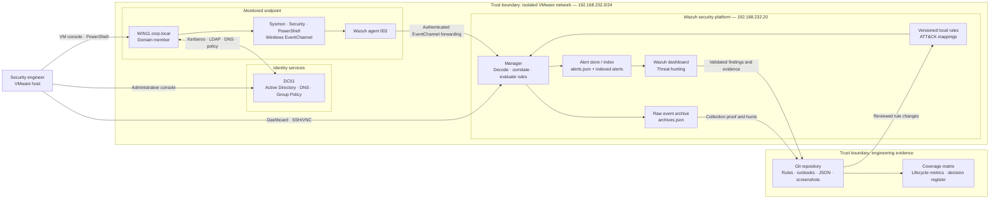

# Lab Security Architecture Diagram

## Logical architecture and trust boundaries

## Boundary controls

| Boundary | Principal risk | Required control |
|---|---|---|
| Engineer → endpoint | Unsafe or ambiguous simulation | Bounded commands, synthetic markers, recorded start time, explicit cleanup |
| Endpoint → domain services | Identity misuse or unintended policy impact | Isolated domain, lab-only accounts, least privilege, documented group membership |
| Endpoint → Wazuh | Telemetry loss, spoofing, or clock mismatch | Enrolled agent, service-health checks, time synchronization, archive verification |
| Archive → alert index | Collection incorrectly reported as detection | Validate raw archive and intended alert independently |
| Engineer → manager | Invalid or unauthorized rule changes | Backup, syntax test, unique IDs, controlled restart, fresh post-change events |
| SIEM → repository | Exposure of secrets or misleading evidence | Redaction review, synthetic data, preserved failures, verified relative links |

## Design constraints

- The manager, index, and dashboard are represented as logical services but may share one lab VM.
- The environment is intentionally single-site and non-high-availability.
- Private addressing provides lab isolation; it is not equivalent to production network segmentation.
- Evidence publication is a separate trust boundary because logs and screenshots may contain identities, IP addresses, hashes, GUIDs, and commands.

Related documents: [lab architecture](../architecture/lab-architecture.md), [detection engineering architecture](../architecture/detection-engineering-lab-architecture.md), and [detection data flow](detection-data-flow.md).
