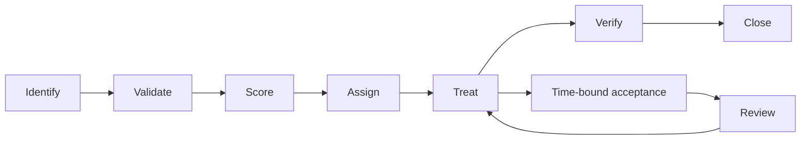

# Risk Register Operating Guide

The authoritative structured register is [`../risk-management/enterprise-risk-register.csv`](../risk-management/enterprise-risk-register.csv). This document defines how risks enter, move through, and leave that register.

## Required Fields

| Field | Requirement |
|---|---|
| Risk ID | Stable identifier, never reused |
| Source | Repository, assessment, incident, scan, audit, or threat model |
| Title | Concise statement of exposure |
| Program area | Detection, identity, vulnerability, cloud, DevSecOps, compliance, or operations |
| Severity | Critical, High, Medium, or Low using likelihood and impact |
| Owner | Person or role accountable for treatment |
| Status | Open, In Progress, Accepted, Mitigated, Closed, or Monitoring |
| SLA due | Date derived from the remediation policy |
| Management action | Next decision or treatment step |

## Workflow

## Severity Guidance

| Severity | Example condition | Default response |
|---|---|---|
| Critical | Active exploitation, privileged compromise, or material business interruption | Immediate escalation and containment |
| High | Credible path to sensitive access or major control failure | Assigned owner and expedited remediation |
| Medium | Meaningful weakness with prerequisites or compensating controls | Planned remediation and monthly tracking |
| Low | Limited impact or hard-to-exploit weakness | Backlog, monitor, or accept with rationale |

## Review Cadence

- Critical risks: daily until contained, then weekly until closed.
- High risks: weekly.
- Medium risks: monthly.
- Low risks: quarterly or during the relevant control review.
- Accepted risks: review at least quarterly and before expiration.

## Closure Criteria

A risk may be closed only when the treatment is implemented, evidence is attached, the control is independently revalidated, residual risk is recorded, and the accountable owner approves closure. A ticket marked complete without validation is not sufficient.

## Escalation

Overdue Critical or High risks are escalated to the Security Lead and Executive Sponsor. Missing ownership, repeated SLA breaches, or expired acceptance also require escalation and inclusion in executive reporting.
